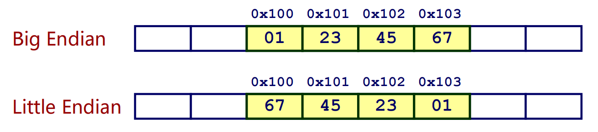
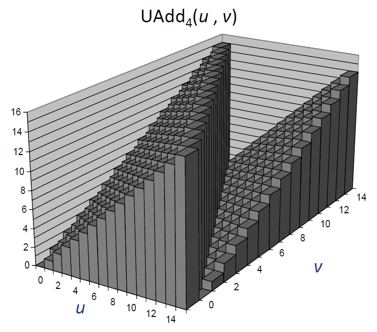
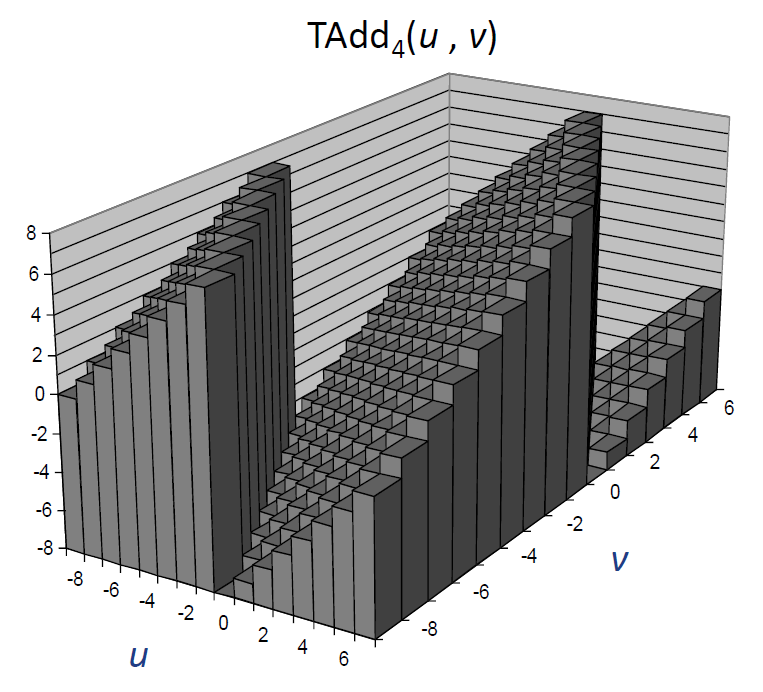
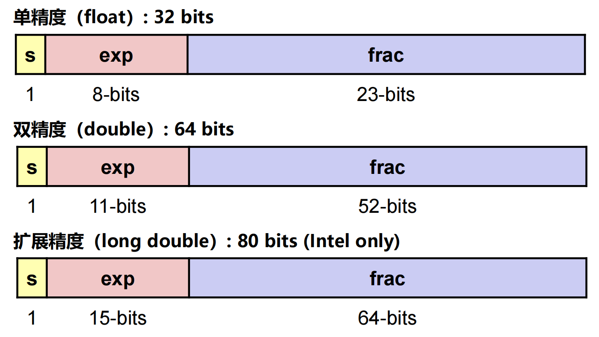
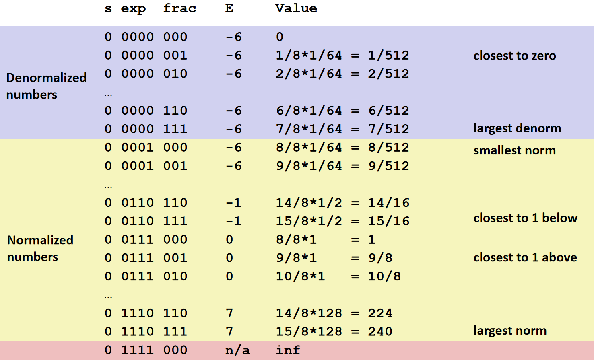
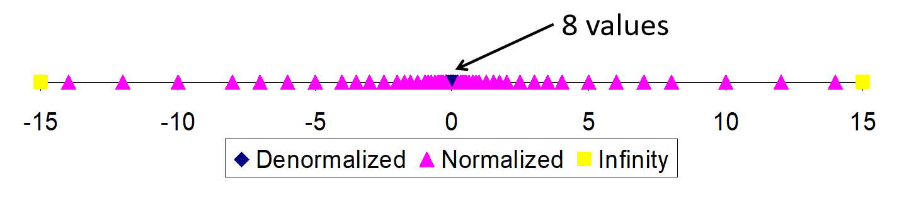
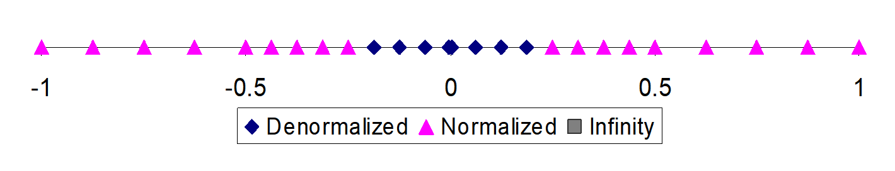

---
tags:
  - 计算机系统
  - C
---

# CMU CS15-213: CSAPP

## 位、字节和整数

### 信息存储

**C 数据类型大小**

| C 数据类型  | 典型 32-bit | IA32  | 典型 64-bit | x86-64 |
| ----------- | ----------- | ----- | ----------- | ------ |
| char        | 1           | 1     | 1           | 1      |
| short       | 2           | 2     | 2           | 2      |
| int         | 4           | 4     | 4           | 4      |
| long        | 4           | 4     | 8           | 8      |
| long long   | 8           | 8     | 8           | 8      |
| float       | 4           | 4     | 4           | 4      |
| double      | 8           | 8     | 8           | 8      |
| long double | -           | 10/12 | -           | 10/16  |
| pointer     | 4           | 4     | 8           | 8      |

!!! tip "long double 的表示"

    在 x86 体系中，`long double` 用 10 字节表示，但由于字节对齐的原因，实际会占 12 或 16 字节。

**字 / 字长**

字：计算机中 CPU 自然处理的数据单位，通常和寄存器宽度相同。

字长：字的大小，通常以 bit 为单位。

- 32 位：字大小 4 byte，字长 32 bit
- 64 位：字大小 8 byte，字长 64 bit

虚拟地址用一个字来编码，所以字长决定虚拟地址空间的最大大小。

对于字长为 $w$ 的机器，虚拟地址的范围是 $0\sim 2^w-1$，程序最多访问 $2^w$ 个字节。

**字节顺序**

两大传统模式：

<div class="annotate" markdown>

- 大端序(1)：Sun，PPC Mac，Internet
- 小端序(2)：x86，运行 Android 的 ARM 处理器，iOS，Windows

</div>

1. 大端序：高位字节占据低地址
2. 小端序：低位字节占据低地址

举例：4 字节变量 `x` 的值是 `0x01234567`，存放在 `0x100`

{ width="600" }
{.center-img}

**字符串表示**

- 标准的 7 位字符集编码
- 字符串必须以一个空字符表示结尾
- 大端或小端存储不会影响字符串存储排列

### 整数表示

**进制**

4位十六进制、十进制和二进制快速转换：

| 十六进制 | 十进制 | 二进制 |
| -------- | ------ | ------ |
| 0        | 0      | 0000   |
| 1        | 1      | 0001   |
| 2        | 2      | 0010   |
| 3        | 3      | 0011   |
| 4        | 4      | 0100   |
| 5        | 5      | 0101   |
| 6        | 6      | 0110   |
| 7        | 7      | 0111   |
| 8        | 8      | 1000   |
| 9        | 9      | 1001   |
| A        | 10     | 1010   |
| B        | 11     | 1011   |
| C        | 12     | 1100   |
| D        | 13     | 1101   |
| E        | 14     | 1110   |
| F        | 15     | 1111   |

**有符号数和无符号数**

无符号数和补码可表示的数据范围：

| 类型 | 范围            |
| ---- | --------------- |
| UMin | $0$             |
| UMax | $2^w - 1$       |
| TMin | $-2^{w - 1}$    |
| TMax | $2^{w - 1} - 1$ |

!!! note "性质"

    - $|TMin| = TMax + 1$
    - $UMax = 2 \cdot TMax + 1$

无符号和有符号数比较：

| X    | B2U(X) | B2T(X) |
| ---- | ------ | ------ |
| 0000 | 0      | 0      |
| 0001 | 1      | 1      |
| 0010 | 2      | 2      |
| 0011 | 3      | 3      |
| 0100 | 4      | 4      |
| 0101 | 5      | 5      |
| 0110 | 6      | 6      |
| 0111 | 7      | 7      |
| 1000 | 8      | -8     |
| 1001 | 9      | -7     |
| 1010 | 10     | -6     |
| 1011 | 11     | -5     |
| 1100 | 12     | -4     |
| 1101 | 13     | -3     |
| 1110 | 14     | -2     |
| 1111 | 15     | -1     |

- 唯一性：每一个位模式表达唯一的整数值，每一个整数有唯一的二进制位模式
- 满足双射：$\operatorname{U2B}(X)=\operatorname{B2U}^{-1}(X)$，$\operatorname{T2B}(X)=\operatorname{B2T}^{-1}(X)$

!!! note "相互映射"

    $$\operatorname{T2U}_w(X)=\begin{cases}X+2^w,&X<0\\X,&X\geqslant0\end{cases}$$
    
    $$\operatorname{U2T}_w(U)=\begin{cases}U,&U<2^{w-1}\\U-2^w,&U\geqslant2^{w-1}\end{cases}$$

**移位操作**

- 左移：在右侧填充 0
- 右移：
    - 逻辑移位：在左侧填充 0
    - 算术移位：在左侧填充符号位

!!! failure "未定义行为"

    在 C 语言中，移位量 < 0 或 > 字长，都是未定义行为。

**类型转换**

如果一个表达式中既有无符号数又有有符号数， 有符号数会**隐式转换成无符号数**。

该规则对比较运算符也适用：`<`、`>`、`==`、`<=`、`>=`。

!!! warning "注意 sizeof 的返回类型"

    `sizeof` 运算符的结果是**无符号数**，在参与运算时需特别注意。

**符号扩展**

任务：

- 给定一个 w 位的有符号数 x
- 将其转换为 (w + k) 位的整数，保持值不变

规则：

<div class="annotate" markdown>

- 将符号位复制 k 个
- $X'=\underset{\text{k copies of MSB}}{\underline{x_{w-1},\ldots,x_{w-1}}},x_{w-1},\ldots,x_0$ (1)

</div>

1. MSB：Most significant bit，最高有效位

!!! tip "为什么复制符号位，数值保持不变？"

    一个 $w$ 位的二进制补码，符号位可看做带有 $-2^{w-1}$ 的权值。
    复制一次符号位后，新符号位的权值为 $-2^w$，原符号位的权值变为 $2^{w-1}$，两者之和正好仍然为 $-2^{w-1}$。

**截断**

- 有符号/无符号：二进制位被截取
- 结果需重新解释
- 无符号：等价于取模运算
- 有符号：类似取模运算

### 整数运算

**无符号加法**

- 操作数：w 位
- 实际结果：w + 1 位
- 舍弃进位：w 位

{ width="400" }
{ .center-img }

$$x +^u_w y=\begin{cases}x+y,&x+y<2^w\\x+y-2^w,&2^w\leqslant x+y<2^{w+1}\end{cases}$$

**二进制补码加法**

TAdd 和 UAdd 有相同的位级表示。

溢出分为负溢出和正溢出。

{ width="400" }
{ .center-img }

$$x +^t_w y=\begin{cases}x+y-2^w,&x+y\geqslant2^{w-1}\\x+y,&-2^{w-1}\leqslant x+y<2^{w-1}\\x+y+2^w,&x+y<-2^{w-1}\end{cases}$$

**乘法**

结果可能多于 w 位：

- 无符号数最大可达 $2w$ 位：$0\leqslant xy \leqslant (2^w-1)^2=2^{2w}-2^{w+1}+1$
- 补码负的乘积最大可达 $2w-1$ 位：$xy\geqslant(-2^{w-1})\cdot(2^{w-1}-1)=-2^{2w-2}+2^{w-1}$
- 补码正的乘积最大可达 $2w$ 位，仅对 $(TMin_w)^2$ 成立：$xy\leqslant (-2^{w-1})^2=2^{2w-2}$

对于多于 w 位的结果，高 w 位将被忽略。

$$x *^u_w y=(x\cdot y)\bmod 2^w$$

补码乘法运算的位级表示是一样的。虽然完整乘积的位级表示可能不同，但截断后的乘积位级表示是相同的。

$$x *^t_w y=\operatorname{U2T}_w[(x\cdot y)\bmod 2^w]$$

**乘以常数**

与 2 的幂相乘：

- 无符号：C 变量 `x` 和 `k` 有无符号值 $x$ 和 $k$，$0\leqslant k < w$，`x<<k` 产生数值 $x *^u_w 2^k$
- 补码：C 变量 `x` 和 `k` 有补码值 $x$ 和无符号值 $k$，$0\leqslant k < w$，`x<<k` 产生数值 $x *^t_w 2^k$

整数乘法比移位和加法的代价大得多，乘以常数的行为通常被编译器优化为移位和加减法的组合。

举例：

- `u * 8 == u << 3 `
- `u * 24 == u << 5 - u << 3`

**除以 2 的幂**

无符号：

- C 变量 `x` 和 `k` 有无符号值 $x$ 和 $k$，$0\leqslant k < w$，`x>>k` 产生数值 $\lfloor x/2^k\rfloor$
- 使用逻辑右移

有符号：

- C 变量 `x` 和 `k` 有补码值 $x$ 和无符号值 $k$，$0\leqslant k < w$，`x>>k` 产生数值 $\lfloor x/2^k\rfloor$
- 使用算术右移

希望向零取整，需要对除法进行修正。
当被除数为正数时，无需额外处理。
当被除数为负时，将被除数向 0 偏置，使用 `(x+(1<<k)-1)>>k` 产生数值 $\lceil x/2^k \rceil$

### 关于无符号数

**常见错误**

错误的逆序循环：

```c linenums="1"
unsigned i;
for (i = cnt - 2; i >= 0; i--)
    a[i] += a[i + 1];
```

不易察觉的隐式转换：

```c linenums="1"
#define DELTA sizeof(int)
int i;
for (i = CNT; i - DELTA >= 0; i -= DELTA)
    ...
```

**什么时候该使用无符号数？**

- 当需要执行取模运算时：高精度、密码学……
- 使用二进制位表示集合时：逻辑右移，没有符号扩展

**使用无符号数进行逆序循环**

通过无符号数下溢绕回的良定义行为控制循环结束：

```c linenums="1"
size_t i;
for (i = cnt - 1; i < cnt; i--) {
    ...
}
```

可读性更好的写法：

```c linenums="1"
size_t i;
for (i = cnt - 1; i-- > 0; ) {
    ...
}
```

## 浮点数

### 二进制小数

表示方法：二进制小数点右侧的位表示 2 的分数幂（负幂）。

$b_m b_{m-1}\cdots b_1 b_0 . b_{-1} b{-2} \cdots b_{-n-1} b_{-n}$ 表示数

$$b=\sum_{i=-n}^m 2^i\times b_i$$

性质：

- 小数点右移一位等价于乘 2
- 小数点左移一位等价于除以 2
- 形如 $(0.111111\dots)_2$ 表示 $1.0-\varepsilon$ 的数，其中 $\varepsilon=1/2^k$

局限：

- 只能精确表示诸如 $x/2^k$ 的数，其他的值只能近似表示
- 在一个 $w$ 位的数中，小数点位置固定导致表数范围有限

### IEEE 浮点表示

**数学形式**

IEEE 浮点标准用 $(-1)^s M 2^E$ 表示一个浮点数：

- 符号（sign） $s$ 确定了这个数是负数（$s=1$）还是正数（$s=0$），数值 $0$ 的符号位特殊处理
- 尾数（significand）$M$ 是一个二进制小数，范围是 $1\sim 2-\varepsilon$ 或 $0\sim 1-\varepsilon$
- 阶码（exponent）$E$ 表示 $2$ 的幂，是一个二进制整数

**编码**

浮点数的位表示分为三个字段：

- 一个单独的符号位 $\text{s}$ 编码符号 $s$
- $k$ 位的阶码字段 $\text{exp}=e_{k-1}\cdots e_1e_0$ 编码阶码 $E$，采用移码
- $n$ 位的小数字段 $\text{frac}=f_{n-1}\cdots f_1f_0$ 编码尾数 $M$，编码值依赖阶码

**精度类型**

{ width="650" }
{.center-img}

**情况 1：规格化值**

条件：exp 的位模式不为全 0 也不为全 1（单精度 255，双精度 2047）

!!! note ""

    === "阶码"

        阶码字段被解释为以偏置形式表示的有符号整数。

        阶码的值是 $E=e-Bias$，其中 $e$ 是无符号数，位表示为 $e_{k-1}\cdots e_1e_0$，而 $Bias=2^{k-1}-1$。由此产生指数的取值范围：单精度为 $-126\sim 127$，双精度为 $-1022\sim 1023$。

    === "尾数"

        小数字段 frac 被解释为描述小数值 $f$，其中 $0\leqslant f<1$，$f=(0.f_{n-1}\cdots f_1f_0)_2$。

        尾数定义为 $M=1+f$，这种隐含的以 1 开头的表示可以获得一个额外的精度位。

**情况 2：非规格化值**

用于表示 $+0.0$ 和 $-0.0$ ，以及非常接近 $0.0$ 的值。其中，可能的数值分布均匀地接近于 $0.0$，因为阶码值是一样大的。

判断条件：阶码全为 $0$。

!!! note ""

    === "阶码"

        阶码的值是 $E=1-Bias$，而不是简单的 $-Bias$，这种方式提供了一种从非规格化值平滑转换到规格化值的方法。

    === "尾数"

        尾数的值是 $M=f$，也就是小数字段的值，不包含隐含的开头的 $1$。

!!! tip "为什么非规格化数要这样设置偏置？"

    将 $E$ 定义为 $1-Bias$ 而不是 $-Bias$，这样最大非规格化数和最小规格化数的指数是一样的，可以补偿非规格化数的尾数没有隐含的开头的 1，实现两者之间的平滑转变。

**情况 3：特殊值**

判断条件：阶码全为 $1$。

!!! note ""

    === "无穷大"

        小数域全为 $0$ 时，表示无穷大，由符号位决定是 $+\infty$ 还是 $-\infty$。
        
        无穷大可用来表示溢出结果。
        
        无穷大的来源：
        
        -  数值溢出
        -  有限非零数除以 $0$
        -  $\infty$ 参与运算的传播

    === "NaN"

        小数域不全为 $0$ 时，表示 NaN（Not a Number）。
        
        NaN 的来源：
        
        - 不定型算术运算，如：$0/0$、$\infty-\infty$、$\infty/\infty$、$0\times\infty$
        -  函数输入超出定义域：如 `sqrt(-1)`、`log(-1)`
        -  NaN 参与运算的传播
        
        比较：
        
        - 任何与 NaN 的有序比较（`<, <=, >, >=, ==`）结果都为 `false`，NaN 不等于任何值，**包括它自身**
        - 不等比较的结果始终是 `true`。如果 `x != x` 成立，则 `x` 一定是 NaN

!!! question "关于 IEEE 浮点数的几个疑问"

    **1. 浮点数的尾数为什么采用原码而不是补码？**
    
    - 符号位的解耦：判定正负只需检查最高位，无需对整个数值进行补码转换。
    - 乘除法运算的简化：如果尾数是原码，直接进行无符号乘法即可；若是补码，处理负数乘法的硬件逻辑会复杂得多。
    - 规格化的便利：负数的规格化形式会因为补码的特性变得极不直观，增加硬件开销，降低性能。
    
    **2. 阶码为什么采用移码？**
    
    - 二进制排序与实际大小一致
    - 正负指数处理简单
    - 与特殊值编码兼容，天然保留了 $0$ 和全 $1$ 作为特殊值的空间
    
    **3. $\boldsymbol{Bias}$ 为什么采用 $\boldsymbol{2^{k-1}-1}$ 而不是 $\boldsymbol{2^{k-1}}$？**
    
    如果使用后者作为偏置，浮点数最小范围会整体向下移动一倍，而最大范围减少一倍。IEEE 754 的设计选择是：优先扩大可表示的最大数范围（更不容易溢出），而不是继续扩大最小数范围。
    
    **4. 浮点数为什么不怕 $\boldsymbol{+0}$ 与 $\boldsymbol{-0}$ 编码不一致的问题？**
    
    浮点数 $+0$ 与 $-0$ 是有意义的，在某些运算中会有不同表现，如：$1/+0=+\infty,\ 1/-0=-\infty$。
    
    硬件层面也有专门的电路解决 $0$ 的比较问题。

**取值范围**

单精度：

| 描述               | 数值                           | 近似值                  |
| ------------------ | ------------------------------ | ----------------------- |
| 最小的非规格化正数 | $2^{-149}$                     | $1.401 \times 10^{-45}$ |
| 最大的非规格化正数 | $(1 - 2^{-23}) \cdot 2^{-126}$ | $1.175 \times 10^{-38}$ |
| 最小的规格化正数   | $2^{-126}$                     | $1.175 \times 10^{-38}$ |
| 最大的规格化正数   | $(2 - 2^{-23}) \cdot 2^{127}$  | $3.403 \times 10^{38}$  |

双精度：

| 描述               | 数值                            | 近似值                   |
| ------------------ | ------------------------------- | ------------------------ |
| 最小的非规格化正数 | $2^{-1074}$                     | $4.940 \times 10^{-324}$ |
| 最大的非规格化正数 | $(1 - 2^{-52}) \cdot 2^{-1022}$ | $2.225 \times 10^{-308}$ |
| 最小的规格化正数   | $2^{-1022}$                     | $2.225 \times 10^{-308}$ |
| 最大的规格化正数   | $(2 - 2^{-52}) \cdot 2^{1023}$  | $1.798 \times 10^{308}$  |

扩展精度：

| 描述               | 数值                             | 近似值                    |
| ------------------ | -------------------------------- | ------------------------- |
| 最小的非规格化正数 | $2^{-16494}$                     | $3.645 \times 10^{-4951}$ |
| 最大的非规格化正数 | $(1 - 2^{-63}) \cdot 2^{-16382}$ | $3.362 \times 10^{-4932}$ |
| 最小的规格化正数   | $2^{-16382}$                     | $3.362 \times 10^{-4932}$ |
| 最大的规格化正数   | $(2 - 2^{-63}) \cdot 2^{16384}$  | $1.190 \times 10^{4932}$  |

### 浮点数示例

**编码示例**

一个 8 位浮点数表示示例，有 1 位符号位、4 位阶码（偏置为 7）、3 位尾数。

{ width="700" }
{.center-img}

**取值分布**

一个 6 位浮点数表示，有 3 位阶码（偏置为 3）、2 位尾数。

{ width="720" }
{.center-img}

局部放大：

{ width="720" }
{.center-img}

可以观察到，可表示的数不是均匀分布的，越靠近原点处越稠密。

**特殊性质**

- 浮点数 $0$ 和整数 $0$ 的编码是相同的，所有位均为 $0$
- 几乎可以使用与无符号数相同的比较方法，但：
    - 需要比较符号位
    - 需要考虑 $-0.0=+0.0$
    - 需要考虑 NaN

### 舍入
