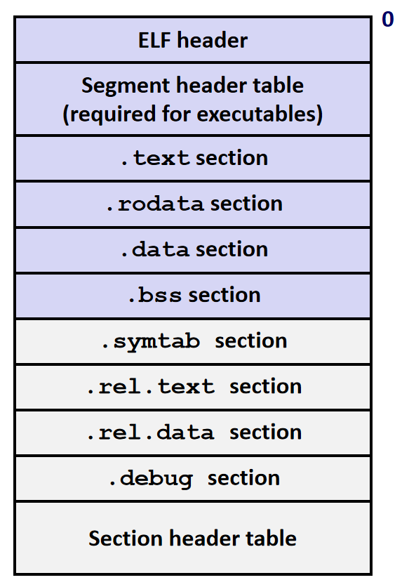
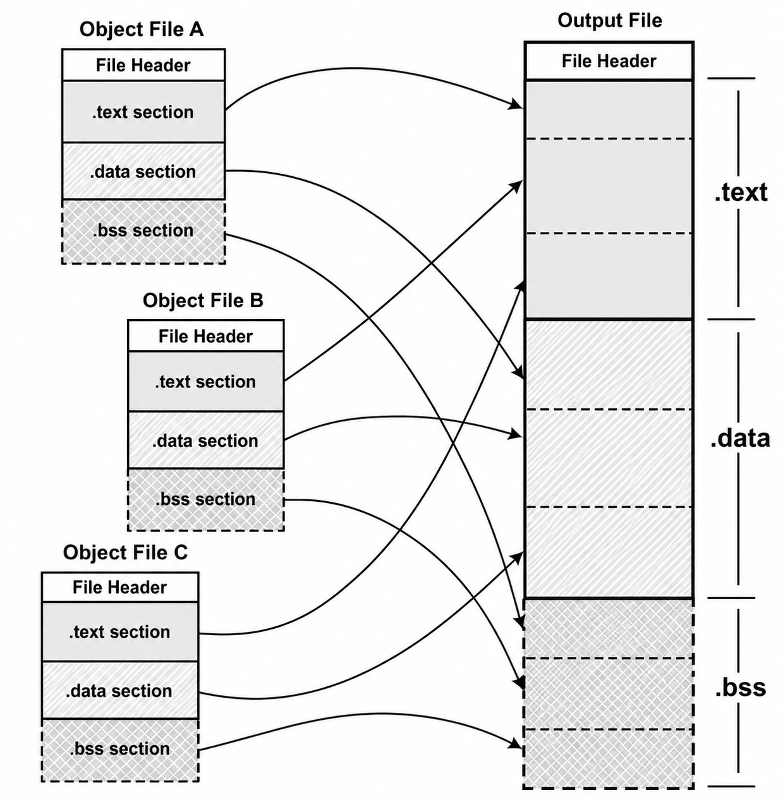
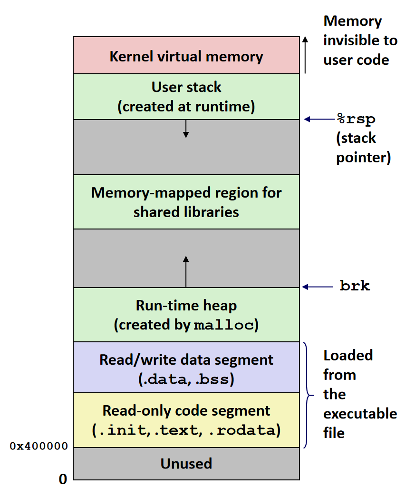

---
tags:
  - 计算机系统
  - CSAPP
  - C
---

# 链接

## ELF 目标文件

ELF（Executable and Linking Format）是 Unix / Linux 中目标文件的统一格式：

- 可重定位目标文件（`.o` 文件）
    - 包含二进制代码和数据，可以在链接时与其它可重定位目标合并，创建一个可执行目标文件
    - 每一个 `.o` 文件产生自一个源（`.c`）文件
- 可执行目标文件
    - 包含二进制代码和数据，可以被直接复制到存储器并执行
- 共享目标文件（`.so` file）
    - 一种特殊类型的可重定位目标文件，可以在加载或运行时被动态加载到存储器并链接
    - 在 Windows 中称之为动态链接库

### ELF 文件结构

{ width="300", align=right }

- ELF 头
    - 字长、字节顺序、文件类型、机器类型等
- 程序头表（可执行文件特有）
    - 页大小、虚地址内存段、段大小
- .text 节
    - 程序机器代码
- .rodata 节
    只读数据：跳转表、字符串常量
- .data 节
    - 已初始化的全局变量
    - 已初始化的静态变量
- .bss 节
    - 未初始化的全局变量，所有初始化为 0 的全局 / 静态变量
    - Block Started by Symbol
    - Better Save Space
    - 不占据实际硬盘空间
- .symtab 节
    - 符号表
    - 函数和全局变量名
    - section 名与位置
- .rel.text 节
    - .text 节中待修改的位置的信息（需要重定位）
    - 执行时需要修改的指令地址
    - 带修改位置的指令
- .rel.data 节
    - .data 中的重定位信息
    - 被模块引用或定义的已初始化的全局变量的重定位信息
- .debug 节
    - 调试符号表
- 节头部表
    - 描述不同节的位置和大小

!!! tip "Block Started by Symbol 和 Better Save Space"

    1. Block Started by Symbol
    
        这是 .bss 这个名字的历史来源。
        
        这个术语最早起源于 1950 年代中期为 IBM 704 计算机编写的汇编程序（UA-SAP）。

        虽然这个名字在今天看来已经过时，但它作为 ELF 格式的标准段名被沿用至今。

    2. Better Save Space
    
        这是一个助记词，用来描述 .bss 段最重要的特性：在磁盘上不占用实际空间。

        如果定义一个很大的全局数组并赋值（如 `int arr[1000] = {1, 2, 3...};`），这些数据必须存放在磁盘文件里。

        但如果只是定义 `int arr[1000];` 而不初始化，操作系统知道这些变量默认都要初始化为 0，.bss 节只需要记录一个总长度。只有当程序运行并被加载到内存时，系统才会分配实际的内存并清零，这使得生成的可执行文件体积更小。

???+ note "在 Linux 下使用 readelf 指令查看 ELF 文件"

    `readelf` 常用参数：
    
    - `-h` 显示 ELF 文件头
    - `-l` 显示程序头表
    - `-S` 显示节头部表
    - `-s` 显示符号表
    - `x <number/name>` 以十六进制形式倾倒指定节的内容
    - `-p <number/name>` 以字符串形式倾倒指定节的内容
    - `-d` 显示动态节
    - `-r` 显示重定位信息
    - `-V` 显示文件中的版本符号信息
    - `-n` 显示 Notes 节，通常包含编译器的版本信息、ABI 标记或核心转储的详细说明
    
    使用 `readelf -h` 查看的 ELF 文件头示例：
    
    { width="600" }
    {.center-img}

### ELF 文件头

ELF 文件以 ELF header 开始，32 位 ELF 文件头可以用下面的结构理解：

```c
typedef struct {
    unsigned char e_ident[16]; /* ELF 魔数、字长、字节序、ABI 等标识信息 */
    uint16_t e_type;           /* 文件类型 */
    uint16_t e_machine;        /* 目标机器类型 */
    uint32_t e_version;        /* ELF 版本 */
    uint32_t e_entry;          /* 程序入口虚拟地址 */
    uint32_t e_phoff;          /* 程序头表在文件中的偏移 */
    uint32_t e_shoff;          /* 节头部表在文件中的偏移 */
    uint32_t e_flags;          /* 处理器相关标志 */
    uint16_t e_ehsize;         /* ELF 文件头自身大小 */
    uint16_t e_phentsize;      /* 程序头表中每一项的大小 */
    uint16_t e_phnum;          /* 程序头表项数 */
    uint16_t e_shentsize;      /* 节头部表中每一项的大小 */
    uint16_t e_shnum;          /* 节头部表项数 */
    uint16_t e_shstrndx;       /* 节名字符串表在节头部表中的索引 */
} Elf32_Ehdr;
```

几个比较关键的字段：

**标识信息（e_ident）**&ensp;前 4 个字节是 ELF 魔数：`0x7f`、`E`、`L`、`F`。后续字节记录文件类别（32 位 / 64 位）、字节序（小端 / 大端）、ELF 版本和 ABI 等信息。

**文件类型（e_type）**&ensp;说明目标文件类型，例如可重定位目标文件、可执行目标文件或共享目标文件。

**机器类型（e_machine）**&ensp;说明该文件面向的指令集架构，例如 x86、x86-64、ARM 等。

**入口地址（e_entry）**&ensp;可执行文件的入口地址，即程序开始执行时跳转到的虚拟地址。对可重定位目标文件来说通常为 0，因为它还不能被直接执行。

**程序头表位置（e_phoff 和 e_phnum）**&ensp;分别给出程序头表的文件偏移和表项数量。程序头表主要给加载器使用，描述如何把文件中的段加载到内存。

**节头部表位置（e_shoff 和 e_shnum）**&ensp;分别给出节头部表的文件偏移和表项数量。节头部表主要给链接器使用，描述 `.text`、`.data`、`.bss`、`.symtab` 等节的位置和大小。

**文件头大小（e_ehsize）**&ensp;记录 ELF 文件头本身的字节数。对 32 位 ELF 来说通常是 52 字节。

**表项大小（e_phentsize 和 e_shentsize）**&ensp;分别记录程序头表项和节头部表项的大小。读取表时可以用文件偏移加上表项大小逐项定位。

**节名字符串表索引（e_shstrndx）**&ensp;`.text`、`.data` 等节名并不直接写在节头部表项中，而是存放在字符串表里。`e_shstrndx` 记录节名字符串表在节头部表中的下标。

### 节头部表

节头部表是一个数组，每个表项描述一个节。链接器会通过它找到 `.text`、`.data`、`.bss`、`.symtab` 等节在文件中的位置、大小、地址和属性。

32 位 ELF 中，一个节头部表项可以用下面的结构理解：

```c
typedef struct {
    uint32_t sh_name;      /* 节名在节名字符串表中的偏移 */
    uint32_t sh_type;      /* 节的类型 */
    uint32_t sh_flags;     /* 节的标志位 */
    uint32_t sh_addr;      /* 节加载后的虚拟地址 */
    uint32_t sh_offset;    /* 节在文件中的偏移 */
    uint32_t sh_size;      /* 节的字节大小 */
    uint32_t sh_link;      /* 与该节相关的另一个节的下标 */
    uint32_t sh_info;      /* 该节的附加信息 */
    uint32_t sh_addralign; /* 节的地址对齐要求 */
    uint32_t sh_entsize;   /* 节中固定大小表项的字节大小 */
} Elf32_Shdr;
```

几个比较关键的字段：

**节名（sh_name）**&ensp;节名并不直接存放在节头部表项中，而是存放在节名字符串表 `.shstrtab` 中。`sh_name` 记录的是节名字符串在 `.shstrtab` 中的偏移。

**节类型（sh_type）**&ensp;说明节的类型，例如程序数据、符号表、字符串表、重定位信息、无实际内容的 `.bss` 等。

**节标志（sh_flags）**&ensp;说明节的属性，例如是否可写、是否需要分配到内存、是否包含可执行指令。

**节地址（sh_addr）**&ensp;如果该节运行时会被加载到进程地址空间中，`sh_addr` 记录它加载后的虚拟地址；如果该节不需要加载到内存中，通常为 0。

**节偏移（sh_offset）**&ensp;记录该节内容在 ELF 文件中的偏移。对 `.bss` 这类不占据实际文件空间的节来说，这个字段通常没有实际意义。

**节大小（sh_size）**&ensp;记录该节的字节大小。即使 `.bss` 不占据文件空间，也需要用 `sh_size` 记录运行时应该分配多少空间。

**节链接信息（sh_link 和 sh_info）**&ensp;这两个字段的具体含义取决于节的类型。例如符号表节可能通过 `sh_link` 指向对应的字符串表，通过 `sh_info` 记录局部符号数量等附加信息。

**节地址对齐（sh_addralign）**&ensp;记录节的地址对齐要求。如果值为 0 或 1，表示没有额外对齐要求；如果值为 8，则表示节地址应当是 8 的倍数。

**节表项大小（sh_entsize）**&ensp;如果该节由若干个固定大小的表项组成，`sh_entsize` 记录每个表项的大小，例如符号表中的每个符号表项大小相同，因此可以用它逐项读取。如果该节不包含固定大小的表项，则该字段为 0。

### 重定位表

链接器在合并多个目标文件时，需要修改代码或数据中对地址的引用，这个过程称为重定位。ELF 会把这些“需要修改的位置”记录在重定位表中。

重定位表节类型为 `SHT_REL`。对于每个需要重定位的节，ELF 中通常会有一个对应的重定位表，例如：

- `.rel.text` 记录 `.text` 节的重定位信息
- `.rel.data` 记录 `.data` 节的重定位信息

重定位表和它服务的节之间的关系由节头部表项记录：

**关联符号表（sh_link）**&ensp;记录该重定位表所使用的符号表在节头部表中的下标。链接器需要通过符号表找到被引用符号的定义。

**作用目标节（sh_info）**&ensp;记录该重定位表作用于哪个节。例如 `.rel.text` 作用于 `.text` 节，如果 `.text` 在节头部表中的下标为 1，那么 `.rel.text` 的 `sh_info` 就是 1。

### 符号表

符号表通常存放在 `.symtab` 节中，它是一个符号表项数组。每个表项描述一个符号，例如函数名、全局变量名、节名或源文件名。符号表的第 0 项固定为未定义符号，不能表示真实符号。

32 位 ELF 中，一个符号表项可以用下面的结构理解：

```c
typedef struct {
    uint32_t st_name;       /* 符号名在字符串表中的偏移 */
    uint32_t st_value;      /* 符号值 */
    uint32_t st_size;       /* 符号大小 */
    unsigned char st_info;  /* 符号类型和绑定信息 */
    unsigned char st_other; /* 目前通常为 0 */
    uint16_t st_shndx;      /* 符号所在节的下标 */
} Elf32_Sym;
```

几个比较关键的字段：

**符号名（st_name）**&ensp;符号名并不直接存放在符号表项中，而是存放在字符串表中。`st_name` 记录的是符号名字符串在字符串表中的偏移。

**符号值（st_value）**&ensp;符号对应的值，具体含义取决于目标文件类型和符号种类。在可重定位目标文件中，如果符号定义在某个节里，`st_value` 通常表示它在该节中的偏移；在可执行目标文件中，它通常表示运行时虚拟地址。对于 `SHN_COMMON` 符号，`st_value` 表示对齐要求。

**符号大小（st_size）**&ensp;记录符号对应对象的字节大小。对于数据对象，它通常是变量或数组的大小。如果为 0，则表示大小为 0 或未知。

**符号信息（st_info）**&ensp;同时记录符号类型和绑定信息。低 4 位表示符号类型，例如数据对象、函数、节名或源文件名；高 4 位表示绑定信息，例如局部符号、全局符号或弱符号。

**其它信息（st_other）**&ensp;这个字段目前通常为 0，保留字段。

**所在节（st_shndx）**&ensp;如果符号定义在当前目标文件中，`st_shndx` 记录它所在节在节头部表中的下标。它也可能是一些特殊值：`SHN_UNDEF` 表示该符号在当前目标文件中未定义，需要链接器从其它目标文件中寻找定义；`SHN_ABS` 表示该符号的值是绝对值，不需要重定位；`SHN_COMMON` 表示一个 COMMON 符号，常见于未初始化的全局变量。

## 符号

### 符号的可见性

在链接器的上下文中，符号分为三类：

- 全局符号（global symbol）：由当前模块定义，并且可以被其它模块引用，例如非 `static` 的函数和全局变量
- 外部符号（external symbol）：由其它模块定义，被当前模块引用，例如在当前文件中调用的外部函数，或使用 `extern` 声明的变量
- 局部 / 本地符号（local symbol）：只在当前模块内部可见，不能被其它模块引用，例如 `static` 函数和 `static` 全局变量

例如：

```c
static int local_static = 1;
int global_var = 2;

extern int ext_var;

static void local_func(void) {}
void global_func(void) {}
```

- `local_static` 和 `local_func` 是局部符号，只能在当前目标文件内部使用
- `global_var` 和 `global_func` 是全局符号，可以被其它目标文件引用
- `ext_var` 是外部符号，在当前目标文件中是 `UNDEF`，最终需要由其它目标文件提供定义

### 强符号和弱符号

在 C 语言中，编译器会把全局符号分成强符号和弱符号：

- 强符号：函数定义，以及已经初始化的全局变量
- 弱符号：未初始化的全局变量

!!! note "局部符号没有也不需要强弱之分"

    符号的 `st_info` 字段包含其绑定信息：
    
    - `STB_LOCAL`：局部符号，只在当前目标文件内部可见
    - `STB_GLOBAL`：全局符号，可以被其它目标文件引用
    - `STB_WEAK`：弱符号，链接时优先级低于同名全局强符号
    
    可以看出，`STB_LOCAL` 和 `STB_WEAK` 是平级的、互斥的绑定属性。

链接器在解析同名全局符号时，按下面的规则处理：

1. 不允许出现多个同名强符号
    
    如果多个目标文件都定义了同名强符号，链接器会报错。例如两个文件都定义了函数 `p1`。

2. 如果一个强符号和多个弱符号同名，选择强符号
    
    例如一个文件中有 `int x = 0;`，另一个文件中有 `int x;`，链接器会把所有对 `x` 的引用解析到那个已初始化的全局变量。

3. 如果多个弱符号同名，任选其中一个
    
    这条规则最危险。链接器不一定报错，但如果这些弱符号类型不同，程序运行时可能出现难以发现的内存覆盖问题。

!!! example "强符号和弱符号的解析例子"

    **两个强符号：链接错误**

    ```c
    /* file1.c */
    int x;
    void p1(void) {}

    /* file2.c */
    void p1(void) {}
    ```

    `p1` 在两个文件中都是函数定义，都是强符号，因此链接时报错。

    **一个强符号和一个弱符号：选择强符号**

    ```c
    /* file1.c */
    int x = 0;
    void p1(void) {}

    /* file2.c */
    int x;
    void p2(void) {
        x = 100;
    }
    ```

    `int x = 0;` 是强符号，`int x;` 是弱符号，链接器会把所有对 `x` 的引用解析到同一个已初始化变量。

    **多个弱符号且类型不同：可能覆盖相邻数据**

    ```c
    /* file1.c */
    int x;
    int y;
    void p1(void) {}

    /* file2.c */
    double x;
    void p2(void) {}
    ```

    `int x;` 和 `double x;` 都是弱符号，链接器可能任选一个作为 `x`。如果 `p2` 按 `double` 写入 `x`，就可能覆盖相邻的 `y`。

    **一个强符号和一个类型不同的弱符号：更危险**

    ```c
    /* file1.c */
    int x = 7;
    int y = 5;
    void p1(void) {}

    /* file2.c */
    double x;
    void p2(void) {}
    ```

    链接器会选择强符号 `int x = 7;`，但 `file2.c` 仍可能按 `double` 的方式访问 `x`，从而覆盖后面的 `y`。

    **多个同名弱符号：会被合并**

    ```c
    /* file1.c */
    int x;
    void p1(void) {}

    /* file2.c */
    int x;
    void p2(void) {}
    ```

    两个 `int x;` 都是弱符号，链接器会把它们合并成同一个未初始化的全局变量。

因此，全局变量最好只在一个源文件中定义。其它文件需要使用时，用 `extern` 声明。尤其不要在多个文件中写同名、不同类型的未初始化全局变量。

## 静态链接

现在的链接器空间分配的策略基本上都采用两步链接（Two-pass Linking）的方法，整个链接过程分为两步：

- 空间与地址分配

    链接器扫描所有的输入目标文件，获得它们各个节的长度、属性和位置，并且将输入目标文件的符号表中所有符号定义和符号引用收集起来，统一放到一个全局符号表中。
    
    这一步中，链接器将能够获得所有输入目标文件的节长度，并且将它们合并，计算出输出文件中各个节合并后的长度与位置，并建立映射关系。

- 符号解析与重定位

    链接器使用上一步中收集到的所有信息，读取输入文件中段的数据和重定位信息，并且进行符号解析与重定位，调整代码中的地址等。

    这一步是链接过程的核心，特别是重定位过程。


### 空间与地址分配

链接器会先将同类节按照如下的方式合并：

{ width="500" }
{.center-img}

然后将运行时的存储器地址分配给合并后的新节，使每条指令和每个符号定义有唯一的存储地址。

**虚拟空间分配**

在链接之前，目标文件中的所有节的 VMA（Virtual Memory Address，虚拟地址）都是 0，因为虚拟空间还没有被分配。
链接之后，各个节都会被分配相应的虚拟地址。

**符号地址的确定**

接下来，链接器开始计算各个符号的虚拟地址。因为各个符号在节内的相对位置是固定的，所以链接器只需要给每个符号加上一个偏移量，即节的起始地址，就能将其调整到正确的地址。


### 符号解析与重定位

下面，我们基于这两个程序的链接过程进行分析：

???+ code "链接示例代码"

    === "main.c"
    
        ```c linenums="1"
        int buf[2] = {1, 2};

        void swap();

        int main() {
            swap();
            return 0;
        }
        ```
    
    === "swap.c"
    
        ```c linenums="1"
        extern int buf[];

        int *bufp0 = &buf[0];
        static int *bufp1;

        void swap() {
            int temp;
            bufp1 = &buf[1];
            temp = *bufp0;
            *bufp0 = *bufp1;
            *bufp1 = temp;
        }
        ```

使用如下指令编译并链接：

```shell
$ gcc -m32 -fno-pie -c main.c -o main.o
$ gcc -m32 -fno-pie -c swap.c -o swap.o
$ gcc -m32 -no-pie main.o swap.o -o p
```

#### 重定位与重定位表

与重定位相关的信息被保存在重定位表中，我们可以使用 `objdump -r` 来查看重定位表：

```text
$ objdump -r swap.o

swap.o:     file format elf32-i386

RELOCATION RECORDS FOR [.text]:
OFFSET   TYPE              VALUE
00000008 R_386_32          .bss
0000000c R_386_32          buf
00000011 R_386_32          bufp0
0000001c R_386_32          .bss
00000021 R_386_32          bufp0
0000002a R_386_32          .bss


RELOCATION RECORDS FOR [.data]:
OFFSET   TYPE              VALUE
00000000 R_386_32          buf


RELOCATION RECORDS FOR [.eh_frame]:
OFFSET   TYPE              VALUE
00000020 R_386_PC32        .text
```

每个要被重定位的地方叫一个重定位入口（relocation entry），重定位入口的偏移表示该入口在要被重定位的节中的位置。

对于 32 位 Intel x86 系列处理器来说，重定位表的结构比较简单，它是一个 `Elf32_Rel` 结构的数组，每个数组元素对应一个重定位入口：

```c
typedef struct {
    Elf32_Addr r_offset;
    Elf32_Word r_info;
} Elf32_Rel;
```

**重定位偏移（r_offset）**&ensp;记录重定位入口的偏移。对于可重定位目标文件来说，这个值是需要被修正位置的第一个字节相对于所在节起始位置的偏移；对于可执行文件或共享目标文件来说，这个值是需要被修正位置的第一个字节的虚拟地址。这里先关注可重定位目标文件的情况。

**重定位信息（r_info）**&ensp;同时记录重定位入口的类型和符号信息。低 8 位表示重定位类型，高 24 位表示被引用符号在符号表中的下标。链接器会根据符号下标找到目标符号，再根据重定位类型决定如何修改指令或数据中的地址。

因为不同处理器的指令格式不同，需要修正的地址格式也不同，所以重定位类型是和处理器相关的。对于后续的可执行文件和共享目标文件，重定位入口还会服务于动态链接过程。

下面我们具体分析一下两个文件的重定位信息。

使用 `objdump -rd` 来混合查看代码和重定位信息：

```text
$ objdump -rd main.o

main.o:     file format elf32-i386


Disassembly of section .text:

00000000 <main>:
   0:	55                   	push   %ebp
   1:	89 e5                	mov    %esp,%ebp
   3:	83 e4 f0             	and    $0xfffffff0,%esp
   6:	e8 fc ff ff ff       	call   7 <main+0x7>
			7: R_386_PC32	swap
   b:	b8 00 00 00 00       	mov    $0x0,%eax
  10:	c9                   	leave
  11:	c3                   	ret
```

可以看到，在调用 `swap` 函数的位置有一条重定位信息：`7: R_386_PC32	swap`。这里的 `7` 表示重定位入口的偏移，重定位类型为 `R_386_PC32`。

这条指令是一条近址相对位移调佣指令，`0xe8` 为操作码，后面 4 字节是被调用函数相对于调用指令的下一条指令的偏移量。在没有重定位之前，相对偏移量被设置为 `0xff ff ff fc`，即 -4 的补码形式。`call` 指令的下一条指令地址为 `0xb`，因此实际调用地址为 `0xb - 4 = 7`。

查看 `swap.o` 的重定位信息：

```text
$ objdump -rd swap.o

swap.o:     file format elf32-i386


Disassembly of section .text:

00000000 <swap>:
   0:	55                   	push   %ebp
   1:	89 e5                	mov    %esp,%ebp
   3:	83 ec 10             	sub    $0x10,%esp
   6:	c7 05 00 00 00 00 04 	movl   $0x4,0x0
   d:	00 00 00 
			8: R_386_32	.bss
			c: R_386_32	buf
  10:	a1 00 00 00 00       	mov    0x0,%eax
			11: R_386_32	bufp0
  15:	8b 00                	mov    (%eax),%eax
  17:	89 45 fc             	mov    %eax,-0x4(%ebp)
  1a:	8b 15 00 00 00 00    	mov    0x0,%edx
			1c: R_386_32	.bss
  20:	a1 00 00 00 00       	mov    0x0,%eax
			21: R_386_32	bufp0
  25:	8b 12                	mov    (%edx),%edx
  27:	89 10                	mov    %edx,(%eax)
  29:	a1 00 00 00 00       	mov    0x0,%eax
			2a: R_386_32	.bss
  2e:	8b 55 fc             	mov    -0x4(%ebp),%edx
  31:	89 10                	mov    %edx,(%eax)
  33:	90                   	nop
  34:	c9                   	leave
  35:	c3                   	ret
```

可以看到，`buf[1]` 的地址被暂时设置为 `0x4`，其他地址被暂时设置为 `0x0`，重定位类型均为 `R_386_32`。

#### 地址修正方式

对于 IA32 架构，重定位入口所修正的指令寻址方式有两种：

- 绝对近址 32 位寻址
- 相对近址 32 位寻址

这两种寻址方式分别对应两种重定位入口类型：`R_386_32` 和 `R_386_PC32`。两种重定位入口需要修正的地址长度都为 32 位，而且都是近址寻址，不用考虑 Intel 的段间远址寻址。

两种重定位入口对应的地址修正方法如下：

- `R_386_32` &emsp;&emsp;$S+A$
- `R_386_PC32` &emsp;$S+A-P$

!!! note "$\boldsymbol{A}$、$\boldsymbol{P}$、$\boldsymbol{S}$ 的含义"

    按照 Intel 386 ABI 的定义，重定位表达式中的符号含义如下：
    
    - $A$：加数（Addend）。
    
        对于 Intel 386 使用的 Elf32_Rel 格式，$A$ 为重定位位置原有的值。
    
    - $P$：被重定位的位置（Place）。
    
        对于可重定位目标文件，$P$ 表示被重定位字段相对于所在节的偏移；对于静态链接或动态链接过程，$P$ 表示被重定位字段的虚拟地址。$P$ 可由所在节基址与 `r_offset` 共同确定。
    
    - $S$：重定位项引用符号的值（Symbol Value）。
    
        对于普通函数和变量而言通常就是符号的实际地址。

此时我们便可以知道 `R_386_PC32` 重定位入口的 $A$ 被设置为 -4 的原因了，因为 PC 指向下一条将要执行的指令地址，需要减掉重定位地址本身的 4 字节得到正确的偏移。

### 静态库

静态库（`.a` 文件，存档文件集）可以看成一组可重定位目标文件的集合，有一个头部用来描述每个目标文件的大小和位置。

???+ tip "使用 ar 创建和查看静态库"

    `ar`（archiver）用于创建、修改和查看归档文件。

    常用参数如下：

    - `r`：将目标文件加入归档，如果同名成员已经存在，则替换它
    - `c`：创建归档文件，如果文件不存在，不显示提示信息
    - `s`：为归档建立符号表索引，方便链接器快速查找符号
    - `t`：列出归档中的成员文件
    - `x`：从归档中解出成员文件

    例如把 `add.o` 和 `mul.o` 打包成静态库并使用：

    ```shell
    $ gcc -c add.c -o add.o
    $ gcc -c mul.c -o mul.o
    $ ar rcs libmathutils.a add.o mul.o
    $ gcc main.o -L. -lmathutils -o main
    ```

    链接时，`-L.` 表示在当前目录查找库文件，`-lmathutils` 会让链接器查找名为 `libmathutils.so` 或 `libmathutils.a` 的库。如果当前目录下只有 `libmathutils.a`，链接器就会使用这个静态库，并且只从中抽取当前程序真正需要的目标文件。

???+ note "C 程序常见的静态库与链接"

    在 Linux 下，C 静态库文件名通常形如 `libxxx.a`。

    常见静态库如下：

    - `libc.a`：C 标准库，提供 `printf`、`malloc`、`strlen`、`fopen` 等常用函数
    - `libm.a`：数学库，提供 `sqrt`、`sin`、`cos`、`pow` 等数学函数
    - `libpthread.a`：POSIX 线程库，提供 `pthread_create`、`pthread_join`、互斥锁和条件变量等线程相关接口
    - `libgcc.a`：GCC 运行时辅助库，包含编译器生成代码可能依赖的一些底层辅助函数

    链接选项 `-l<name>` 会让链接器查找形如 `lib<name>.so` 或 `lib<name>.a` 的库文件。默认情况下，链接器通常优先使用共享库；如果使用 `-static` 或者只找得到静态库，才会使用 `.a` 文件。例如，使用数学库时，可以这样链接：

    ```shell
    $ gcc main.o -lm -o main
    ```

    这里的 `-lm` 会匹配 `libm.so` 或 `libm.a`。如果库不在系统默认搜索路径中，则需要配合 `-L<dir>` 指定额外的库搜索目录。

#### 静态库的外部引用解析

链接器按照命令行中目标文件和库文件出现的顺序，从左到右解析符号。可以用下面三个集合来理解这个过程：

- $E$：会被合并进可执行文件的目标文件集合，初始为空集
- $U$：当前尚未解析的引用符号集合，初始为空集
- $D$：当前已经遇到的定义符号集合，初始为空集

处理普通目标文件（`.o`）时，链接器会将该目标文件加入 $E$，把其中引用但尚未在 $D$ 中出现的符号加入 $U$，把其中定义的符号加入 $D$，并从 $U$ 中移除已经在 $D$ 中找到定义的符号。

处理静态库（`.a`）时，链接器不会直接把整个库加入 $E$，而是检查库中各成员目标文件的符号表。只有当某个成员定义了 $U$ 中尚未解析的符号时，链接器才会抽取这个成员，将它加入 $E$，并据此更新 $U$ 和 $D$。由于新抽取的成员可能继续引入新的未解析符号，链接器会在这个静态库内部重复扫描，直到没有新的成员需要被抽取。

当命令行上的所有输入文件都扫描完成后，如果 $U$ 中仍然存在未解析符号，链接器就会报错；否则，链接器会合并并重定位 $E$ 中的目标文件，生成最终的可执行文件。

!!! info "静态库的顺序很重要"

    因为链接器是从左到右扫描命令行参数的，所以库文件通常应该放在引用它的目标文件之后：

    ```text
    $ gcc -static main.o ./libvector.a -o main
    ```

    如果把库文件放在前面，链接器扫描 `./libvector.a` 时，`main.o` 中对库函数的引用还没有加入 $U$，库中的成员目标文件就不会被抽取。等之后扫描到 `main.o` 时，未解析符号已经没有机会再回头由这个库解决，因此可能产生未定义引用错误：

    ```text
    $ gcc -static ./libvector.a main.o -o main
    main.o: In function `main':
    main.o:(.text+0x18): undefined reference to `addvec'
    ```

    如果库之间存在循环依赖，可以重复写库文件，或者使用链接器的分组选项，例如 `-Wl,--start-group ... -Wl,--end-group`，让链接器在这一组库之间反复解析。

静态库的缺点：

- 链接时会将所需库代码复制到目标可执行文件中，不同程序之间无法共享这部分代码，导致磁盘空间占用增加
- 同一静态库代码会随多个进程分别装入内存，导致额外的内存占用
- 库文件更新后，需要重新链接所有依赖该库的程序

## 可执行文件的装载

操作系统在执行程序时，会通过加载器将可执行文件映射到进程的虚拟地址空间中，然后把控制转移到 ELF 头中记录的入口地址。

在 Linux 下，用户通过 shell 运行程序时，大致会发生如下过程：

1. shell 调用 `fork` 创建子进程
2. 子进程调用 `execve` 加载新的可执行文件
3. 内核读取 ELF 头，检查文件类型、目标机器、入口地址等信息
4. 内核根据程序头表建立虚拟地址空间映射
5. 内核设置初始栈，将 `argc`、`argv`、环境变量等信息放入用户栈
6. 内核跳转到程序入口地址，程序从 `_start` 开始执行

{ width="400" }
{.center-img}

可执行文件中真正需要装入内存执行的内容，主要由程序头表（Program Header Table）描述。节头部表偏向链接器视角，用来描述 `.text`、`.data`、`.symtab` 等节；程序头表偏向加载器视角，用来描述哪些文件区域应该被映射到哪些虚拟内存区域。

程序头表中的每个表项描述一个段（segment），常见字段包括：

- 段类型，例如 `LOAD` 表示需要装载到内存的段
- 文件偏移，即该段内容在可执行文件中的位置
- 虚拟地址，即该段运行时映射到进程地址空间的位置
- 文件中大小和内存中大小
- 访问权限，例如可读、可写、可执行
- 对齐要求

其中，代码段通常包含 `.init`、`.text`、`.rodata` 等只读内容，会被映射为只读、可执行；数据段通常包含 `.data` 和 `.bss`，会被映射为可读、可写。`.bss` 在文件中不占据实际空间，但程序头表会记录它在内存中需要的大小，加载时由内核负责分配并清零。

!!! note "段和节的关系"

    节是链接视角的划分，数量可能很多；段是装载视角的划分，通常按照运行时权限把若干节合并在一起。
    
    这样做主要有两个好处：一是减少按页映射造成的空间浪费，二是方便内核统一设置权限。例如 `.init` 和 `.text` 都是只读、可执行内容，可以合并到同一个 `LOAD` 段；`.data` 和 `.bss` 都需要读写权限，也可以放入同一个数据段。

### 从内核到 main

ELF 头中的入口地址通常并不是 `main`，而是 C 运行时提供的 `_start`。`main` 只是用户代码的入口，完整启动流程还需要先完成运行时初始化。

Linux 程序从内核进入 `main` 的典型流程如下：

- 内核空间
    - `fork` / `execve` 创建并替换进程映像
    - 内核读取并加载 ELF 可执行文件
    - 内核设置用户态初始执行环境
- 用户空间 `_start`
    - `_start` 是 ELF 入口点，通常来自 `crt1.o`
    - 设置 C 程序需要的初始栈信息，例如 `argc`、`argv`、`envp`
    - 调用 `__libc_start_main`
- `__libc_start_main`
    - 初始化 C 运行时环境
    - 注册 `atexit` 处理函数
    - 调用全局构造逻辑，例如 `.init` 或 `.init_array`
    - 调用用户定义的 `main`
- `main`
    - 执行用户代码
    - 返回退出码
- 退出处理
    - 控制返回到 `__libc_start_main`
    - 调用析构逻辑，例如 `.fini` 或 `.fini_array`
    - 调用 `exit`
    - 最终通过 `_exit` 系统调用结束进程

## 动态链接

静态链接会把程序需要的库代码复制进可执行文件中。动态链接则把库代码保存在共享目标文件中，程序运行时再把这些共享库映射到进程地址空间，并完成必要的符号解析和重定位。

共享库在 Linux 中通常是 `.so` 文件，在 Windows 中通常称为动态链接库。

### 为什么需要动态链接

动态链接主要解决静态链接的几个问题：

- 减少可执行文件体积
    
    程序中不再保存一份完整的库代码，而是记录自己依赖哪些共享库。

- 节省内存
    
    多个进程可以共享同一份只读库代码页，例如共享 `libc.so` 中的 `.text`。

- 方便库升级
    
    修复共享库后，依赖它的程序通常不需要重新链接，只要 ABI 保持兼容即可使用新的库实现。

- 支持运行时加载
    
    程序可以通过 `dlopen`、`dlsym`、`dlclose` 等接口在运行时加载插件或可选功能模块。

动态链接也会带来额外成本：程序启动时需要加载共享库并处理动态重定位；间接跳转和全局偏移表访问也可能增加少量运行时开销。

### 地址无关代码

共享库希望能被映射到不同进程的不同虚拟地址。如果库代码中写死了绝对地址，那么每个进程加载时都必须修改代码段中的地址，这会破坏代码页共享，也会增加重定位开销。

因此，共享库通常使用地址无关代码（Position Independent Code，PIC）。PIC 的核心目标是：代码段本身不依赖固定装载地址，尽量保持只读且可共享；需要随装载地址变化的内容放在可写数据区中处理。

在 ELF 动态链接中，PIC 常和下面两个表配合使用：

- GOT（Global Offset Table，全局偏移表）
    
    保存全局变量和外部符号的运行时地址。代码通过相对寻址找到 GOT，再从 GOT 中取出真正地址。

- PLT（Procedure Linkage Table，过程链接表）
    
    为外部函数调用提供一段跳板代码。第一次调用时可以进入动态链接器解析符号，之后通常直接跳到已经解析出的函数地址。

**模块内调用或跳转**

模块内的函数调用和跳转可以使用 PC 相对寻址。因为调用者和被调用者都在同一个共享对象内部，它们之间的相对距离在链接后就是确定的，不会因为整个共享库被装载到不同基址而改变。

例如：

```asm
call local_function
```

这类调用只需要编码相对偏移，不需要通过 GOT 或 PLT，也不需要动态链接器在装载时修改代码。

**模块内数据访问**

模块内数据访问不能把数据的绝对地址直接写进指令，否则共享库换一个装载地址后，代码段就必须被修改。因为模块内部代码和数据的相对位置在链接后是确定的，所以可以先得到当前代码所在位置，再加上固定偏移访问目标数据。

在 x86-64 中，这通常可以直接用 RIP 相对寻址完成；在 32 位 x86 中，由于没有通用的 PC 相对数据寻址，编译器常用一个小的 thunk 函数把返回地址取到寄存器中，再用这个寄存器作为基准地址。

```asm
call __i686.get_pc_thunk.cx
add  $offset, %ecx
mov  $1, data_offset(%ecx)
```

如果访问的是本模块中可被符号抢占的全局变量，编译器仍可能通过 GOT 间接访问；如果是确定不会被外部替换的局部数据，则可以直接使用模块内相对偏移。

**模块间数据访问**

访问其它共享对象中定义的全局变量时，编译器无法在当前模块内确定该变量的最终地址。因此，代码会通过 GOT 间接访问：

1. 当前模块的代码根据 PC 相对寻址找到自己的 GOT
2. 从 GOT 的某个表项中读出外部变量的运行时地址
3. 再通过这个地址读写外部变量

动态链接器在加载时负责把 GOT 表项填成正确地址。这样需要修改的是数据段中的 GOT，而不是只读代码段。

**模块间调用或跳转**

调用其它共享对象中的函数时，代码通常不会直接跳到目标函数，而是先跳到本模块的 PLT 表项：

```asm
call printf@plt
```

PLT 表项会根据 GOT 中保存的地址继续跳转。这个地址可以在程序启动时解析，也可以在第一次调用时再解析。通过 PLT 和 GOT，外部函数调用也能避免直接修改代码段。

!!! info "GOT 和 PLT 相关节辨析"

    `.got` 主要保存全局数据地址、非 PLT 重定位结果等普通 GOT 表项，服务于数据访问和一部分已解析的地址引用。
    
    `.plt` 是代码区中的跳板，每个外部函数通常有一个 PLT 表项。调用外部函数时，代码先跳到对应的 PLT 表项，再由它继续跳转或触发解析。
    
    `.got.plt` 是 PLT 使用的 GOT 区域。它既保存动态链接器需要的少量保留项，也保存各个外部函数调用表项。延迟绑定时，这些函数表项最初指回 PLT 中的解析路径，解析完成后被改写为真实函数地址。
    
    `.plt.got` 的具体使用和架构、链接器有关，可以理解为一种更简单的 PLT 跳板：它通常只负责从 GOT 表项取地址并跳转，不走完整的延迟绑定入口。

### 延迟绑定

动态链接器可以在程序启动时解析所有外部函数符号，但很多函数在一次运行中可能根本不会被调用。如果启动时全部解析，会增加程序启动时间。延迟绑定（Lazy Binding）的思想就是：函数第一次被调用时才解析，之后直接复用解析结果。

以调用外部函数 `bar` 为例，调用点通常不是直接跳到 `bar`，而是跳到 `bar@plt`。在第一次调用前，`bar` 对应的 `.got.plt` 表项还没有保存真实地址，而是指向 PLT 中继续解析的代码。

典型过程如下：

1. 程序第一次执行 `call bar@plt`
2. `bar@plt` 先通过 `.got.plt` 间接跳转
3. 由于表项还没解析，控制流回到 PLT 中的解析入口
4. PLT 把符号对应的重定位下标等信息交给动态链接器
5. 动态链接器查找 `bar` 的真实地址，并把它写回 `bar` 对应的 `.got.plt` 表项
6. 后续再次调用 `bar@plt` 时，第一条间接跳转就会直接跳到真实的 `bar`

可以把 PLT 表项粗略理解成下面的结构：

```asm
bar@plt:
    jmp  *bar@GOT
    push relocation_index
    jmp  PLT0
```

第一次调用时，`bar@GOT` 指回后两条解析指令；解析完成后，`bar@GOT` 被改成真实函数地址，于是后两条指令不再执行。PLT0 则是所有延迟绑定表项共用的入口，负责把控制权交给动态链接器的解析函数。
