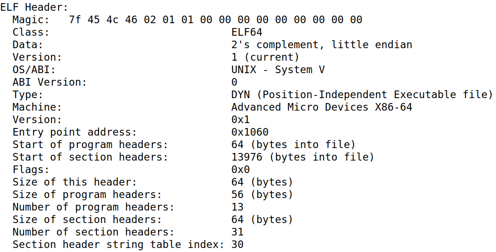

---
tags:
  - 计算机系统
  - CSAPP
  - C
---

# 链接

## 符号

### ELF 目标文件

**认识 ELF**

ELF（Executable and Linking Format）是 Unix / Linux 中目标文件的统一格式：

- 可重定位目标文件（`.o` 文件）
    - 包含二进制代码和数据，可以在链接时与其它可重定位目标合并，创建一个可执行目标文件
    - 每一个 `.o` 文件产生自一个源（`.c`）文件
- 可执行目标文件
    - 包含二进制代码和数据，可以被直接复制到存储器并执行
- 共享目标文件（`.so` file）
    - 一种特殊类型的可重定位目标文件，可以在加载或运行时被动态加载到存储器并链接
    - 在 Windows 中称之为动态链接库

**ELF 目标文件格式**

{ width="300", align=right }

- ELF 头
    - 字长、字节顺序、文件类型、机器类型等
- 程序头表（可执行文件特有）
    - 页大小、虚地址内存段、段大小
- .text 节
    - 程序机器代码
- .rodata 节
    只读数据：跳转表、字符串常量
- .data 节
    - 已初始化的全局变量
    - 已初始化的静态变量
- .bss 节
    - 未初始化的全局变量，所有初始化为 0 的全局 / 静态变量
    - Block Started by Symbol
    - Better Save Space
    - 不占据实际硬盘空间
- .symtab 节
    - 符号表
    - 函数和全局变量名
    - section 名与位置
- .rel.text 节
    - .text 节中待修改的位置的信息（需要重定位）
    - 执行时需要修改的指令地址
    - 带修改位置的指令
- .rel.data 节
    - .data 中的重定位信息
    - 被模块引用或定义的已初始化的全局变量的重定位信息
- .debug 节
    - 调试符号表
- 节头部表
    - 描述不同节的位置和大小

!!! tip "Block Started by Symbol 和 Better Save Space"

    1. Block Started by Symbol
    
        这是 .bss 这个名字的历史来源。
        
        这个术语最早起源于 1950 年代中期为 IBM 704 计算机编写的汇编程序（UA-SAP）。

        虽然这个名字在今天看来已经过时，但它作为 ELF 格式的标准段名被沿用至今。

    2. Better Save Space
    
        这是一个助记词，用来描述 .bss 段最重要的特性：在磁盘上不占用实际空间。

        如果定义一个很大的全局数组并赋值（如 `int arr[1000] = {1, 2, 3...};`），这些数据必须存放在磁盘文件里。

        但如果只是定义 `int arr[1000];` 而不初始化，操作系统知道这些变量默认都要初始化为 0，.bss 节只需要记录一个总长度。只有当程序运行并被加载到内存时，系统才会分配实际的内存并清零，这使得生成的可执行文件体积更小。

???+ note "在 Linux 下使用 readelf 指令查看 ELF 文件"

    `readelf` 常用参数：
    
    - `-h` 显示 ELF 文件头
    - `-l` 显示程序头表
    - `-S` 显示节头部表
    - `-s` 显示符号表
    - `x <number/name>` 以十六进制形式倾倒指定节的内容
    - `-p <number/name>` 以字符串形式倾倒指定节的内容
    - `-d` 显示动态节
    - `-r` 显示重定位信息
    - `-V` 显示文件中的版本符号信息
    - `-n` 显示 Notes 节，通常包含编译器的版本信息、ABI 标记或核心转储的详细说明
    
    使用 `readelf -h` 查看的 ELF 文件头示例：
    
    { width="600" }
    {.center-img}

**符号表**

