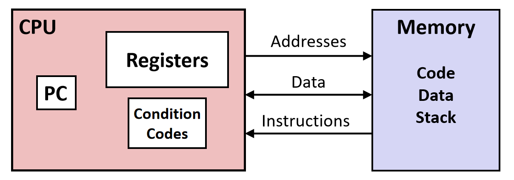
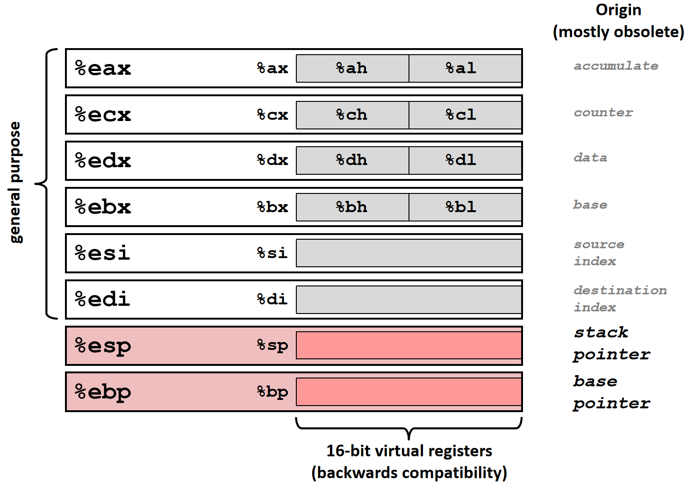
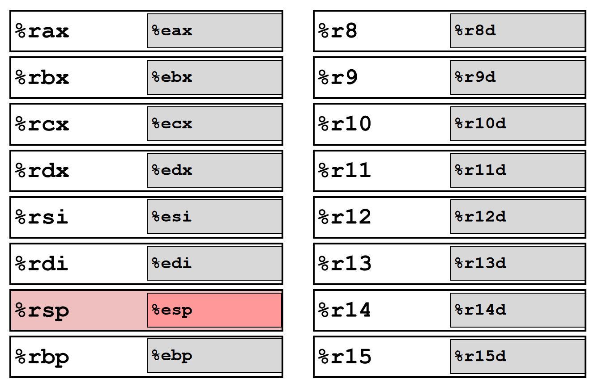

---
tags:
  - 计算机系统
  - CSAPP
  - C
---

# 程序的机器级表示

## 基本

### 汇编基础

**汇编程序员视角**

{ width="500" }
{.center-img}

程序员可见的状态：

- 程序计数器
- 寄存器文件
- 条件码
- 内存

**汇编数据类型**

- 1、2、4、8 字节的整数数据
    - 数值
    - 地址（无类型指针）
- 4、8、10 字节的浮点数据
- SIMD 向量数据类型
- 代码：字节序列编码的一系列指令

**IA32 通用寄存器**

{ width="550" }
{.center-img}

寄存器的细粒度访问如图所示。

**x86-64 通用寄存器**

{ width="500" }
{.center-img}

在 x86-64 中，%rbp 通常已不再作为栈底指针，可以当做普通寄存器使用。

!!! note "x86-64 寄存器的细粒度访问"

    1. 传统寄存器（RAX、RBX、RCX、RDX）
    
        - 32-bit：EAX、EBX、ECX、EDX
        - 16-bit：AX、BX、CX、DX
        - High 8-bit：AH、BH、CH、DH
        - Low 8-bit：AL、BL、CL、DL
    
    2. 指针与变址寄存器（RSI、RDI、RBP、RSP）
    
        - 32-bit：ESI、EDI、EBP、ESP
        - 16-bit：SI、DI、BP、SP
        - 8-bit：SIL、DIL、BPL、SPL
    
    3. 新增寄存器（R8 ~ R15）
    
        - 32-bit：R8D ~ R15D
        - 16-bit：R8W ~ R15W
        - 8-bit：R8B ~ R15B

**数据长度后缀**

再次注意：在 Intel 术语中，为了保持兼容性，字始终定义为 16 位。

- `b`（byte）：单字节
- `w`（word）：字，2 字节
- `l`（long）：双字，4 字节
- `q`（quad）：四字，8 字节

**AT&T 格式和 Intel 格式**

| 特性           | AT&T                               | Intel                                                     |
| -------------- | ---------------------------------- | --------------------------------------------------------- |
| 操作数顺序     | src &rarr; dst                     | dst &larr; src                                            |
| 寄存器         | 需要加 %                           | 直接写寄存器名称                                          |
| 立即数         | 需要加 $                           | 直接写数字                                                |
| 内存寻址       | `disp(base, index, scale)`         | `[base + index*scale + disp]`                             |
| 操作数大小表示 | 通过指令后缀<br>`b`、`w`、`l`、`q` | 通过关键字或上下文<br>`byte ptr`、`word ptr`、`dword ptr` |
| 注释           | `#`                                | `;`                                                       |

示例：

```asm
# AT&T
movb $1, (%eax)

; Intel
mov byte ptr [eax], 1
```

### 数据传送指令
