# 存储器层级结构

## 存储基础

理想的存储器应当同时具备容量大、速度快、价格低且断电后数据不丢失等特点，但现实中的存储技术无法兼顾这些目标。因此，计算机系统将多种存储设备组织为一个层级结构。

### 存储芯片的分类

按照断电后能否保留数据，存储芯片可以分为两大类：

- 易失性存储器：断电后数据丢失，主要包括 SRAM 和 DRAM。
- 非易失性存储器：断电后仍能保留数据，通常归入 ROM 家族，包括 PROM、EPROM、EEPROM，以及由 EEPROM 发展而来的 Flash。

Flash 又可分为：

- NOR Flash：支持随机读取和就地执行，读取延迟低，适合保存固件和启动代码。
- NAND Flash：以页和块为单位访问，密度更高、单位容量成本更低，适合 SSD 等大容量存储设备。

| 类型   | 主要特点                                               | 常见用途                |
| ------ | ------------------------------------------------------ | ----------------------- |
| SRAM   | 用双稳态电路保存位，不需要刷新；速度快、成本高、密度低 | CPU 高速缓存            |
| DRAM   | 用电容保存位，需要周期性刷新；速度较慢、成本低、密度高 | 主存                    |
| PROM   | 出厂后可由用户写入一次，写入后不能擦除                 | 固定配置、早期固件      |
| EPROM  | 可用紫外线整体擦除，再重新编程                         | 早期可升级固件          |
| EEPROM | 可用电信号擦写，通常支持较细粒度的更新                 | 配置数据、嵌入式固件    |
| Flash  | 按页读写、按块擦除，密度高                             | SSD、U 盘、存储卡、固件 |

!!! info "ROM 不等于只读"

    ROM 最初指只能读取的存储器，但 PROM、EPROM、EEPROM 和 Flash 都能在特定条件下写入。现代语境中的 ROM 家族更强调非易失性，以及写入通常比读取更受限制。

### 存储器层级结构

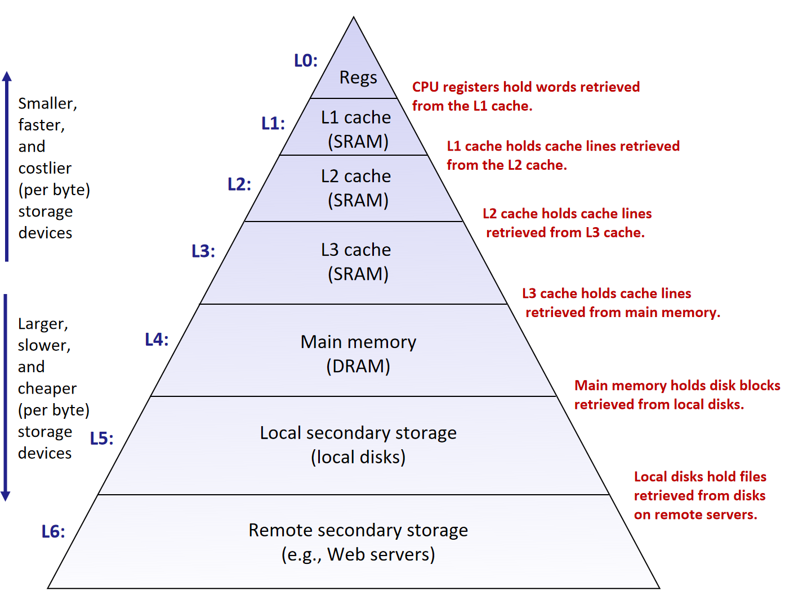{ width=80% }
{.center-img}

从上到下，典型存储器层级包括：

1. 寄存器：直接位于 CPU 内部，保存当前正在计算的数据。
2. L1、L2、L3 高速缓存：通常使用 SRAM，保存来自下一层的缓存行。
3. 主存：通常使用 DRAM，保存从本地二级存储中调入的数据块。
4. 本地二级存储：包括 SSD 和机械硬盘，持久保存文件。
5. 远程二级存储：包括远程服务器、网络文件系统和云存储。

层级越靠上，设备越小、越快、每字节成本越高；层级越靠下，设备越大、越慢、每字节成本越低。

## 随机访问存储器

随机访问存储器允许以近似相同的时间访问任意地址。SRAM 和 DRAM 都属于易失性 RAM，但二者的位存储方式不同。

### SRAM 和 DRAM

SRAM 的每一位通常由一个包含 6 个晶体管的双稳态电路保存。只要持续供电，电路就能稳定保持在两种状态之一，不需要刷新。SRAM 访问速度快，但集成密度较低、单位容量成本较高，适合构成容量较小、要求低延迟的 CPU 高速缓存。

DRAM 的每一位通常由一个电容和一个访问晶体管保存。电容会逐渐漏电，因此控制器必须周期性读取并重写数据，这一过程称为刷新。DRAM 集成密度高、单位容量成本低，但访问延迟高，适合构成容量较大的主存。

### DRAM 芯片的组织

DRAM 芯片可以看成由若干行、若干列组成的二维阵列。阵列中每个位置称为一个超单元，一个超单元可以保存一个 $w$ 位字。

一个标记为 $d \times w$ 的 DRAM 芯片包含 $d$ 个超单元，每个超单元保存 $w$ 位，总容量为 $d \cdot w$ 位。例如，图中的 $16 \times 8$ DRAM 芯片包含 $4$ 行、$4$ 列，共 $16$ 个超单元，每个超单元保存 $8$ 位，总容量为 $128$ 位。

为了减少地址引脚数量，DRAM 会复用同一组地址引脚，先传送行地址，再传送列地址。一次读取可以分为两个阶段。

**选择行**

内存控制器首先在地址引脚上发送行地址，并触发行地址选通 RAS。选中行的所有超单元都会被读入内部行缓冲区。

行缓冲区会暂存整行数据。由于 DRAM 的读取具有破坏性，行缓冲区还负责将数据写回存储阵列，恢复各个单元的状态。

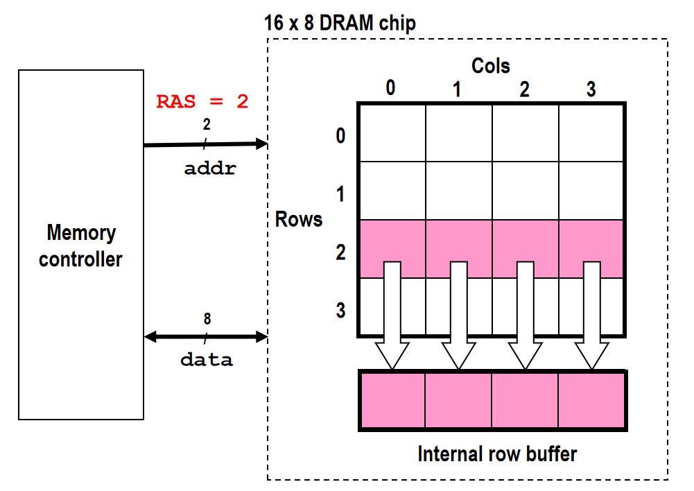{ width=50% }
{.center-img}

**选择列**

随后，控制器在同一组地址引脚上发送列地址，并触发列地址选通 CAS，控制器将选中超单元的数据传回处理器。

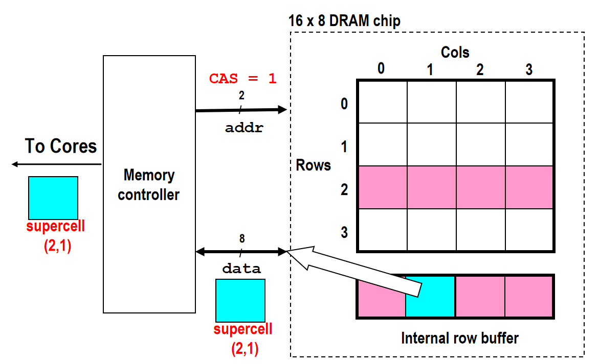{ width=60% }
{.center-img}

!!! tip "行缓冲区局部性"

    如果连续访问位于同一行的数据，后续访问可以直接在已经打开的行缓冲区中选择不同列，避免重新激活另一行。这样的访问称为行命中，通常比切换到另一行更快。

!!! note "内存模块"

    单个 DRAM 芯片的数据位宽通常不足以组成处理器所需的字。内存模块会让多个 DRAM 芯片并行工作，它们接收相同的行、列地址，每个芯片提供其中一部分数据位，合起来构成完整的数据字。

    多个 DRAM 芯片还可以组织成不同的 rank 和 bank。不同 bank 可以在一定程度上并行执行激活、读写和预充电操作，以提高内存带宽。

## 非易失性存储器

非易失性存储器的主要区别在于写入和擦除方式：

- ROM 的内容通常在制造时确定
- PROM 可以由用户编程一次
- EPROM 需要使用紫外线照射，通常整片擦除
- EEPROM 可以用电信号擦写，更新粒度比 Flash 更细
- Flash 采用类似 EEPROM 的浮栅技术，但通过按块擦除换取更高密度和更低成本

从 PROM 到 Flash，存储器逐渐获得了更方便的重写能力。不过，与 RAM 相比，这些设备的写入仍然更慢、限制更多，并且通常存在有限的擦写寿命。

### Flash 和 SSD

NAND Flash 通常由若干块组成，每个块又包含若干页。其读取和编程以页为基本单位，擦除以块为基本单位，每个块能够承受的擦除次数有限。

SSD 主要由 Flash 存储器、Flash 转换层和 DRAM 缓冲区组成：

- Flash 存储器：真正保存数据，由多个块组成，每个块包含多个页
- Flash 转换层：把操作系统使用的逻辑块地址映射到 Flash 的物理页
- DRAM 缓冲区：缓存映射表和读写数据，减少访问 Flash 的次数

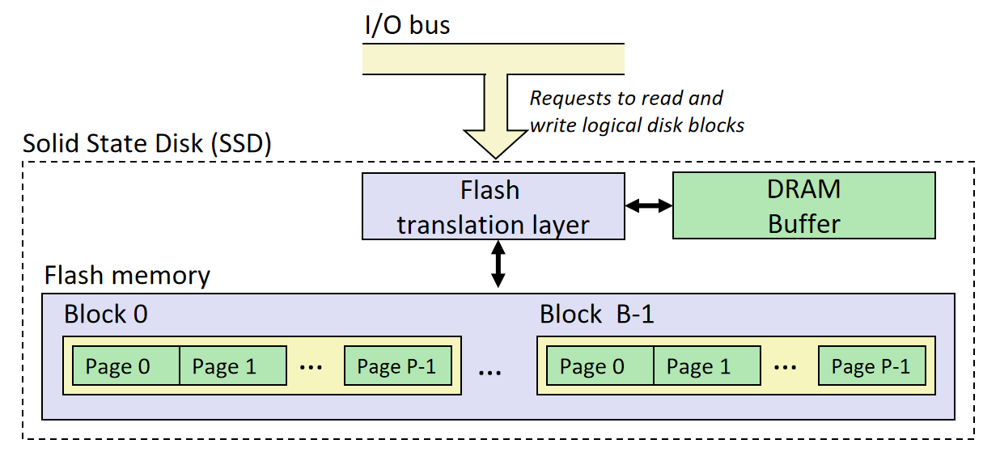{ width=70% }
{.center-img}

操作系统通过 I/O 总线向 SSD 发出逻辑磁盘块的读写请求。FTL 隐藏了底层 Flash 的页、块和擦除限制，使 SSD 对上层表现为可以读写逻辑块的普通存储设备。

!!! note "Flash 转换层的职责"

    由于 Flash 不能直接覆盖已有数据，更新一个逻辑块时，FTL 通常将新数据写入另一个空闲页，再修改逻辑地址到物理地址的映射。旧页被标记为无效，之后由垃圾回收统一整理。

    FTL 需要让擦除操作尽量均匀地分布到各个块，并避开已经损坏或可靠性下降的块。

## 局部性

存储器层级能够有效工作的根本原因是程序通常具有局部性。

### 时间局部性

一个数据对象在近期被访问过，那么它在不久后再次被访问的概率较高。例如，循环中的计数变量和反复调用的函数指令都具有时间局部性。

### 空间局部性

一个地址被访问后，其附近地址在不久后也可能被访问。例如，顺序遍历数组时，相邻元素会被依次访问。

```c
int sum = 0;

for (int i = 0; i < n; ++i) {
    sum += a[i];
}
```

变量 `sum` 被反复使用，体现时间局部性；数组 `a` 按连续地址访问，体现空间局部性。

## Cache

设第 $k$ 层存储器是第 $k + 1$ 层的缓存。数据在相邻层级之间通常以固定大小的块为单位传送，在 CPU Cache 中常称为高速缓存块或高速缓存行。

!!! question "缓存块与缓存行"

    严格来说，缓存块是从下一层复制来的数据，缓存行是容纳数据块及其元数据的槽位。实际讨论中经常混用这两个术语。

### Cache 的组织

一个 Cache 可以描述为一个元组 $(S, E, B, m)$：

- $S = 2^s$：组（set）的数量
- $E = 2^e$：每组包含的行数，也称相联度
- $B = 2^b$：每个缓存块包含的字节数
- $m$：物理地址或虚拟地址的位数

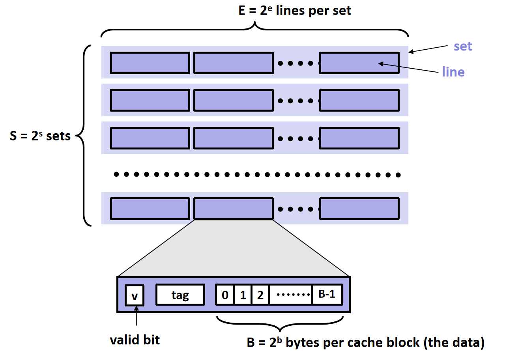{ width=60% }
{.center-img}

Cache 中共包含 $S \cdot E$ 行，能够保存的数据容量为：

$$
C = S \cdot E \cdot B
$$

每个缓存行通常包含：

- **有效位**：表示该行中是否保存着有效数据
- **标记**：区分映射到同一组的不同内存块
- **数据块**：从下一层存储器取回的 $B$ 字节数据
- **脏位**：只在采用写回策略时需要，表示该行是否已被修改
- **替换状态**：例如近似 LRU 算法使用的状态位

### 地址划分

一个 $m$ 位地址会被划分为标记、组索引和块内偏移三部分：

- 标记：$t$ 位，判断选中组中的行是否对应目标内存块
- 组索引：$s$ 位，选择 Cache 中的一组
- 块内偏移：$b$ 位，选择缓存块中的具体字节

其中，$t = m - s - b$。

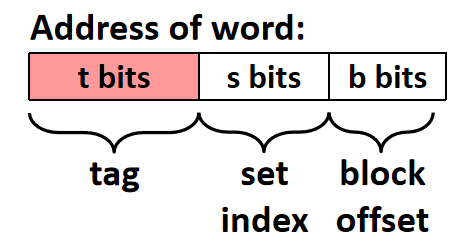{ width="200" }
{.center-img}

!!! warning "一次访问可能跨越两个缓存块"

    如果访问对象的起始位置接近缓存块末尾，并且对象大小超过块内剩余空间，一次加载或存储可能涉及两个缓存块。下文的查找示意图都假设对象没有跨块。

### 映像规则

映像规则决定主存中的一个块可以放入 Cache 的哪些行。按照每组行数 $E$ 的不同，可以分为直接映射、组相联和全相联三种。

#### 直接映射

直接映射 Cache 的每组只有一行，即 $E = 1$。内存块只能放入由组索引指定的唯一缓存行。

访问时先用组索引找到唯一的行，再检查有效位和标记：

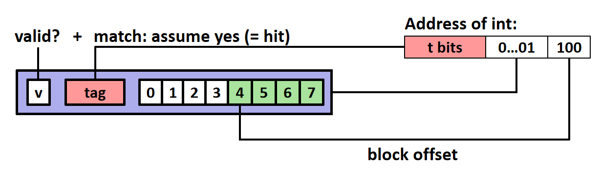{ width=70% }
{.center-img}

直接映射只需比较一个标记，硬件简单、查找速度快，但多个频繁访问的内存块可能反复映射到同一行，产生较多冲突不命中。

#### 组相联

$E$ 路组相联 Cache 的每组包含 $E$ 行。内存块仍然只能映射到一个确定的组，但可以放在该组中的任意一行。

查找时先用组索引选择一组，再并行比较该组中所有有效行的标记：

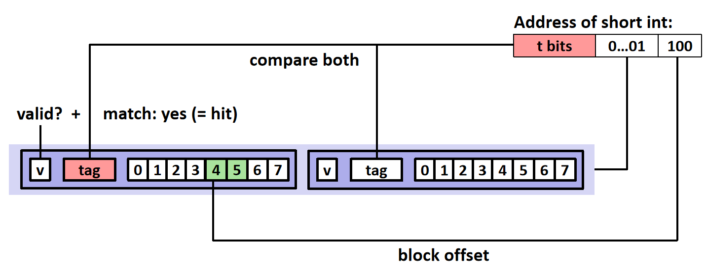{ width=80% }
{.center-img}

提高相联度可以降低冲突不命中，但需要同时比较更多 tag，还需要维护替换状态，因此会增加硬件开销和命中延迟。

#### 全相联

全相联 Cache 只有一组，即 $S = 1$，所有缓存行都属于这一组。任意内存块可以放入任意一行，地址中没有组索引字段，即：$s = 0,\quad t = m - b$。

访问时必须在所有行中查找匹配的 tag。全相联几乎消除了冲突不命中，但比较器数量和替换逻辑的成本很高，因此通常用于 TLB 等容量较小的结构，而不是大型数据 Cache。

### Cache 查找

无论采用哪种映像方式，Cache 读取都遵循相同的基本过程：

1. 从地址中取出组索引，定位目标组（全相联 Cache 会跳过这一步）
2. 将地址中的 tag 与目标组内各行的 tag 比较
3. 若某一行的有效位为 $1$ 且 tag 相同，则发生命中
4. 命中后，用块内偏移从该行的数据块中选择目标字节
5. 若没有任何有效行的 tag 匹配，则发生不命中

### Cache 不命中

处理器请求数据时可能出现两种情况：

- 缓存命中：所需数据已经位于第 $k$ 层，可以直接取得
- 缓存不命中：所需数据不在第 $k$ 层，必须从第 $k + 1$ 层取回包含该数据的块

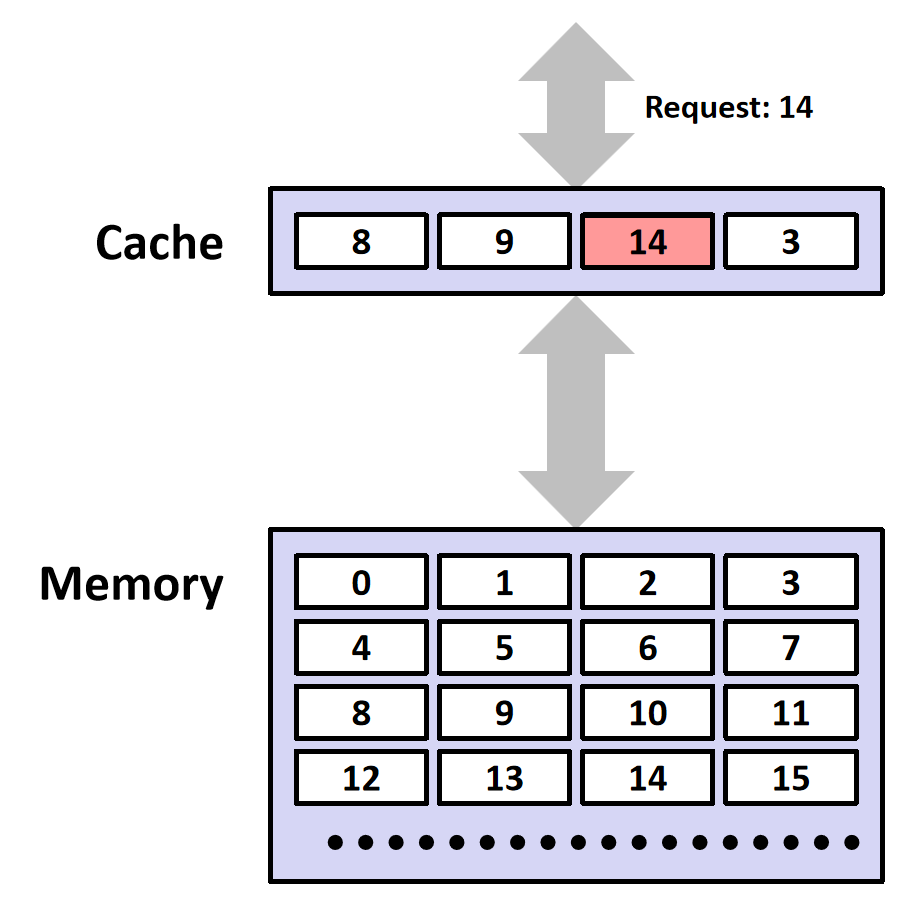{ width="250" }
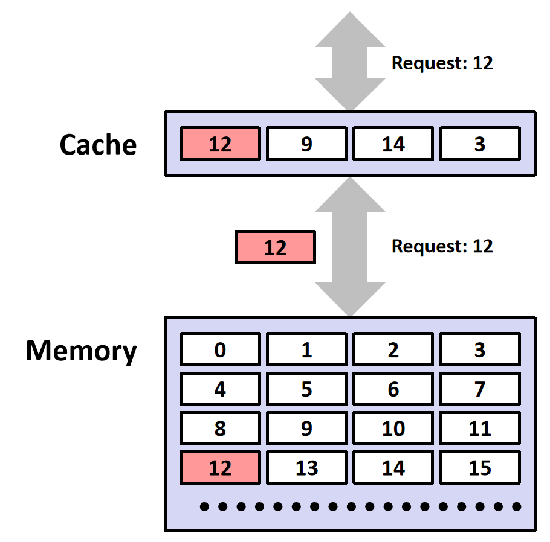{ width="250" }
{.md-img-group}

常见的不命中原因包括：

- **{{abbr:冷不命中}}**：第一次访问某个块，上层 Cache 中还没有数据
- **{{abbr:容量不命中}}**：程序的工作集超过 Cache 能够容纳的总容量
- **{{abbr:冲突不命中}}**：Cache 仍有其它空闲空间，但多个块受映像规则限制，竞争同一个组
- **{{abbr:一致性不命中}}**：在多核系统中，其它核心的写入使本地 Cache 行失效

读不命中时，Cache 通常执行以下操作：

1. 根据映像规则确定目标组
2. 如果组内存在无效行，优先使用该行
3. 否则由替换算法选择一行作为牺牲行
4. 如果牺牲行采用写回策略且脏位为 $1$，先把它写回下一层
5. 从下一层读取包含目标地址的整个块
6. 将数据块和 tag 写入选中的行，并将有效位置为 $1$
7. 将请求的数据返回给处理器

### 替换策略

直接映射 Cache 没有替换选择：目标组中只有一行，不命中时只能替换它。组相联和全相联 Cache 则需要从候选行中选择牺牲行。

常见替换策略包括：

- **随机替换**：随机选择一行，状态开销小，硬件实现简单
- **先进先出**：替换最早进入该组的行，不考虑近期是否被访问
- **最近最少使用**：替换最长时间未被访问的行，尝试利用时间局部性
- **近似 LRU / 伪 LRU**：用较少状态位近似真正的 LRU，常用于相联度较高的硬件 Cache

!!! abstract "LRU 不一定总是最好"

    真正的 LRU 需要记录一组内所有行的访问顺序，状态和更新逻辑会随相联度增加而变得昂贵。现代处理器通常使用伪 LRU、随机策略或其它近似算法。

### 写策略

读操作不会改变缓存块，而写操作必须处理 Cache 与下一层副本之间的一致性。写策略包含两个相互独立的问题：写命中时如何更新下一层，写不命中时是否把目标块载入 Cache。

#### 写命中

写命中有两种基本策略：

- **{{abbr:直写}}**：同时更新 Cache 和下一层存储器
    - 优点：两层数据始终一致，控制逻辑简单
    - 缺点：每次写入都会产生下一层流量，通常需要写缓冲区隐藏延迟
- **{{abbr:写回}}**：只修改 Cache，并将该行的脏位置为 $1$，直到该行被替换时，才把整个块写回下一层
    - 优点：对同一缓存块的多次写入可以合并，显著减少下层流量
    - 缺点：控制逻辑更复杂，替换脏行时会产生额外延迟

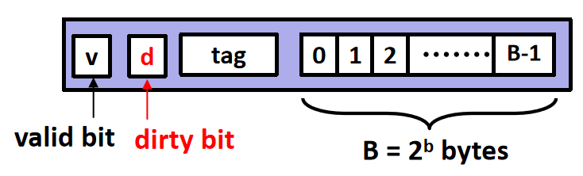{ width="300" }
{.center-img}

写回 Cache 的缓存行除有效位和 tag 外，还包含脏位。有效位表示该行是否包含有效副本；脏位表示该副本是否已被处理器修改、因而比下一层中的副本更新。无效行的脏位没有意义。

#### 写不命中

写不命中也有两种基本策略：

- **{{abbr:写分配}}**：先把目标块从下一层载入 Cache，再在 Cache 中完成写入
    - 适合预计该块很快还会被读写的场景
    - 通常与写回策略搭配
- **{{abbr:非写分配}}**：不把目标块载入 Cache，直接把数据写到下一层
    - 避免一次不再使用的写入挤占 Cache
    - 通常与直写策略搭配

!!! tip "写缓冲区"

    即使采用直写，处理器也不必在每次写入时停下来等待下一层完成操作。写缓冲区可以暂存待提交的写入，但当缓冲区已满或后续读取依赖尚未完成的写入时，处理器仍可能停顿。

### Cache 性能

评价 Cache 的常用指标包括：

- **{{abbr:命中率}}**：命中的访问次数占总访问次数的比例
- **{{abbr:不命中率}}**：1 - 命中率
- **{{abbr:命中时间}}**：命中时访问 Cache 所需的时间
- **{{abbr:不命中代价}}**：不命中后从下一层取得数据并恢复执行所增加的时间

增大 Cache、增大缓存块或提高相联度有可能降低不命中率，但也可能增加命中时间、硬件面积和能耗。Cache 设计需要在命中时间、不命中率、不命中代价和实现成本之间权衡。

*[易失性存储器]: Volatile memory
*[非易失性存储器]: Nonvolatile memory
*[SRAM]: Static RAM
*[DRAM]: Dynamic RAM
*[PROM]: Programmable ROM
*[EPROM]: Erasable PROM
*[EEPROM]: Electrically Erasable PROM
*[Flash]: Flash EEPROM
*[超单元]: Supercell
*[RAS]: Row Address Strobe
*[随机访问存储器]: Random-Access Memory，RAM
*[内部行缓冲区]: Internal row buffer
*[CAS]: Column Address Strobe
*[Flash 转换层]: Flash Translation Layer，FTL
*[局部性]: Locality
*[高速缓存块]: Cache block
*[高速缓存行]: Cache line
*[冷不命中]: Compulsory miss
*[容量不命中]: Capacity miss
*[冲突不命中]: Conflict miss
*[一致性不命中]: Coherence miss
*[最近最少使用]: Least Recently Used，LRU
*[近似 LRU / 伪 LRU]: Pseudo-LRU
*[直写]: Write-through
*[写回]: Write-back
*[写分配]: Write-allocate
*[非写分配]: No-write-allocate / Write-around
*[命中率]: Hit rate
*[不命中率]: Miss rate
*[命中时间]: Hit time
*[不命中代价]: Miss penalty
