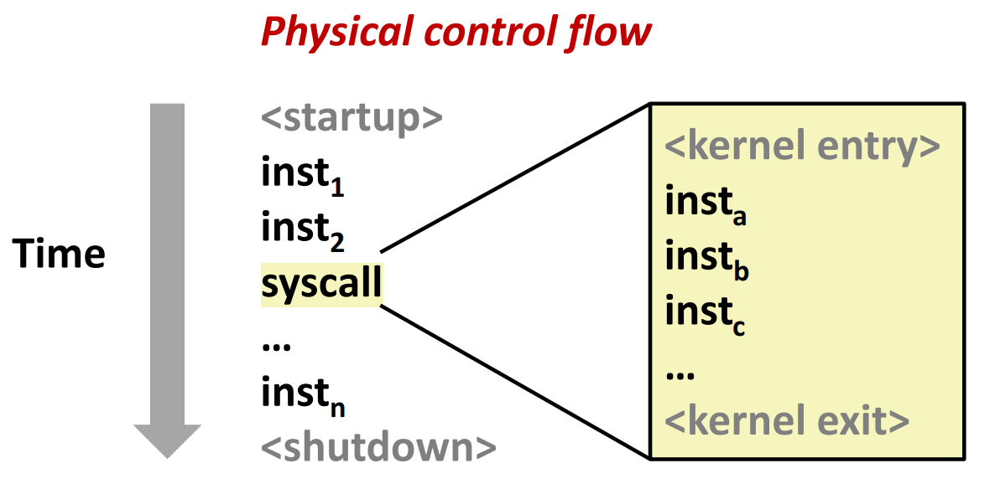
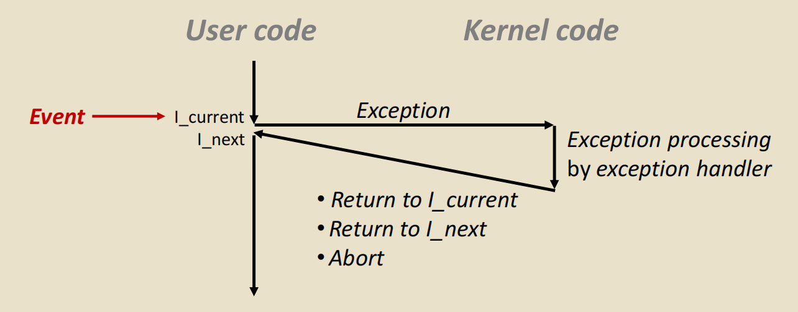
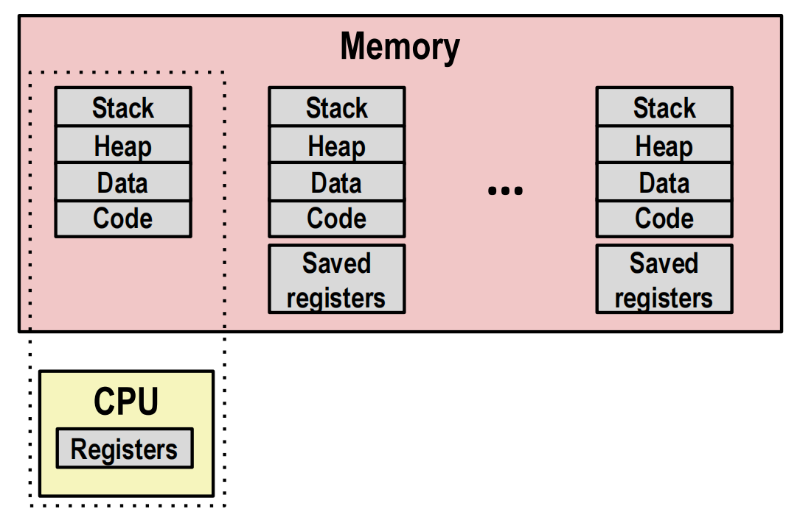
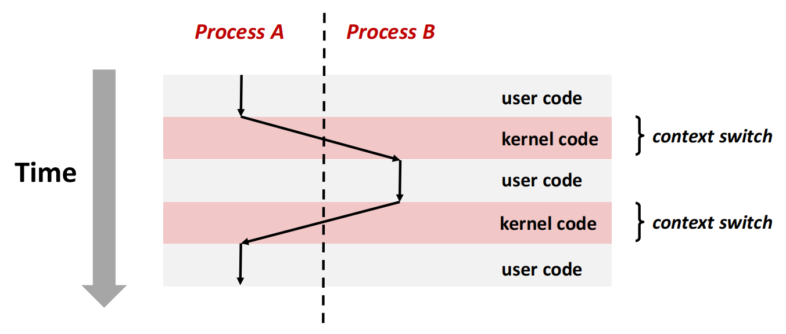
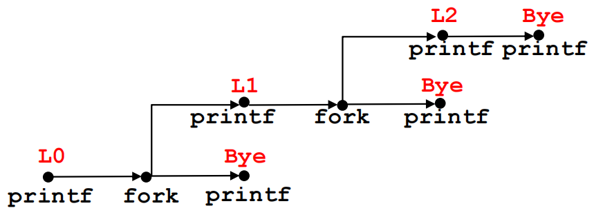
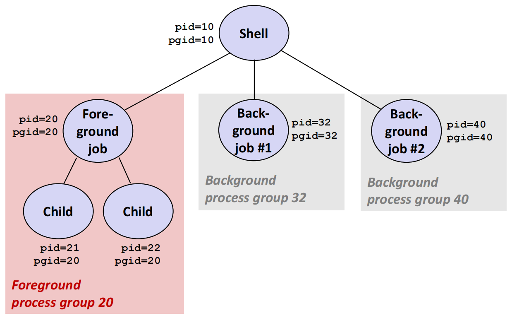

---
tags:
  - 计算机系统
  - CSAPP
  - C
---

# 异常控制流与进程

处理器通常按照地址相邻的指令依次执行，这条指令序列称为物理控制流。实际系统还必须响应键盘输入、定时器、缺页、系统调用和子进程退出等事件，因此控制流会从当前程序跳转到另一段代码，之后再返回或终止。

这种由系统事件引起的突变统称为{{abbr:异常控制流}}。它贯穿计算机系统的各个层次：

- 硬件与操作系统通过异常把控制转移到内核
- 操作系统通过进程和上下文切换实现并发
- 内核通过信号把事件通知给用户进程
- shell 通过进程组和信号实现作业控制

## 异常

### 从顺序执行到异常控制流

正常情况下，处理器从启动开始执行一条指令序列，直到关机。程序执行系统调用时，控制流会暂时进入内核，执行完内核代码后再回到用户程序：

{ width=65% }
{.center-img}

异常是异常控制流在硬件和操作系统之间的基本接口。处理器检测到事件后，会依据异常号在异常表中找到处理程序，保存必要的处理器状态，再把控制转移到内核。异常处理程序完成后有三种可能：

- 返回当前指令 $I_{\text{current}}$，重新执行引发异常的指令
- 返回下一条指令 $I_{\text{next}}$，继续执行
- 终止当前程序

{ width=80% }
{.center-img}

!!! info "异常与高级语言异常"

    这里的异常是处理器和操作系统层面的控制转移机制，不是 C++、Java 等语言中的 `throw` / `catch`。语言异常最终可能借助系统机制实现，但二者不是同一个概念。

### 异常的类别

按照事件来源、同步性和处理后的行为，异常可以分为四类：

| 类别 | 原因 | 同步性 | 处理后的典型行为 | 示例 |
| --- | --- | --- | --- | --- |
| 中断 | 外部设备发出的信号 | 异步 | 返回下一条指令 | 定时器、网络与磁盘 I/O |
| 陷阱 | 当前指令有意触发 | 同步 | 返回下一条指令 | 系统调用、断点 |
| 故障 | 当前指令执行出错，但可能恢复 | 同步 | 重新执行当前指令或终止 | 缺页、保护故障 |
| 终止 | 无法恢复的严重错误 | 同步 | 终止程序 | 硬件校验错误 |

- **{{abbr:中断}}**：来自处理器外部。设备通过中断引脚通知处理器，处理器在完成当前指令后进入中断处理程序，因此中断与当前正在执行的指令没有直接关系。
- **{{abbr:陷阱}}**：有意触发的异常。用户程序通过系统调用指令进入内核，请求读取文件、创建进程等受保护的服务。处理完成后，程序从系统调用之后继续执行。
- **{{abbr:故障}}**：通常由当前指令引起，并且可能被修复。缺页是典型例子：内核把缺失页面调入内存、更新页表，然后重新执行引发缺页的指令；若地址非法，内核则向进程发送 `SIGSEGV`。
- **{{abbr:终止}}**：发生了无法由处理程序恢复的严重错误，处理程序会直接终止当前程序。

### {{abbr:系统调用}}

用户代码不能直接执行修改页表、访问设备等特权操作，只能通过系统调用请求内核代为完成。系统调用在形式上像函数调用，但执行过程不同：

1. 用户程序把系统调用号和参数放入约定的位置
2. 执行专用陷阱指令，处理器切换到内核态
3. 内核检查参数并执行对应的系统调用处理程序
4. 内核设置返回值，恢复用户态上下文
5. 用户程序从陷阱指令之后继续执行

## 进程

进程是一个正在执行的程序实例。操作系统向每个进程提供两个关键抽象：

- 独立的逻辑控制流：程序看起来在独占处理器
- 私有的虚拟地址空间：程序看起来在独占内存

程序是磁盘上的代码和数据，进程则包含运行时状态。多个进程可以执行同一个程序，也可以在同一进程中用 `execve` 更换正在执行的程序。

### 进程上下文

内核要让一个进程暂停后还能继续运行，就必须保存重建其执行状态所需的信息。进程上下文主要包括：

- 通用寄存器、程序计数器、栈指针和状态寄存器
- 虚拟地址空间及页表
- 打开的文件描述符
- 进程 ID、进程组、信号状态等内核数据

正在运行的进程把寄存器状态保存在 CPU 中；未运行进程的寄存器状态由内核保存在内存中。每个进程又拥有自己的代码、数据、堆和栈：

{ width=60% }
{.center-img}

### 并发与{{abbr:上下文切换}}

如果两个进程的逻辑控制流在时间上重叠，就称它们并发执行。单核处理器在任一时刻只能执行一个进程，但可以快速交替运行多个进程；多核处理器还可以让多个进程真正并行。

内核通过上下文切换改变当前运行的进程：

1. 异常或系统调用把控制转移到内核
2. 内核保存当前进程的寄存器等上下文
3. 调度器选择另一个可运行进程
4. 内核恢复新进程的上下文
5. 处理器返回用户态，继续执行新进程

{ width=90% }
{.center-img}

引发调度的常见事件包括定时器中断、进程等待 I/O、进程主动让出处理器以及进程退出。上下文切换需要保存和恢复状态，还会扰乱 Cache 和 TLB，是有一定成本的。

## 进程控制

### 获取进程 ID

每个进程都有唯一的正整数 PID，并记录父进程的 PID：

```c
#include <sys/types.h>
#include <unistd.h>

pid_t getpid(void);
pid_t getppid(void);
```

`getpid` 返回当前进程的 PID，`getppid` 返回父进程的 PID。这两个函数总是成功。

### 创建进程

`fork` 创建一个子进程：

```c
#include <sys/types.h>
#include <unistd.h>

pid_t fork(void);
```

调用成功后，父子进程从同一个位置继续执行，但返回值不同：

- 在父进程中返回子进程的 PID
- 在子进程中返回 `0`
- 创建失败时只在父进程中返回 `-1`

子进程得到父进程虚拟地址空间的逻辑副本，并继承打开的文件描述符。两者初始内存内容相同，但之后的修改通常彼此独立，内核会用写时复制推迟真正的物理页面复制。

`fork` 调用示例：

```c
void my_fork()
{
    printf("L0\n");
    if (fork() == 0) {
        printf("L1\n");
        if (fork() == 0) {
            printf("L2\n");
        }
    }
    printf("Bye\n");
}
```

一次 `fork` 会把一条控制流分成两条。可以用进程图表示语句执行和控制流分叉，从而分析上面程序的输出：

{ width=65% }
{.center-img}

第一次 `fork` 只有子进程进入外层 `if`，第二次 `fork` 又只由这个子进程执行，因此最终共有三个进程。`L0`、`L1`、`L2` 各打印一次，`Bye` 打印三次。图中每条从起点到 `Bye` 的路径对应一个进程，同一条路径内的输出顺序固定，不同进程之间的执行顺序则由调度决定。

!!! bug "fork 与标准 I/O 缓冲"

    `fork` 也会复制用户空间的标准 I/O 缓冲区。如果缓冲区在 `fork` 前尚未刷新，父子进程之后都可能刷新同一份内容，造成重复输出。交互式终端上的 `stdout` 通常按行缓冲，重定向到文件时通常为全缓冲。

### 装载程序

`execve` 用一个新程序替换当前进程的代码、数据、堆和栈：

```c
#include <unistd.h>

int execve(const char *filename, char *const argv[], char *const envp[]);
```

调用成功后，当前进程从新程序的入口开始执行，`execve` 不会返回，只有失败时才返回 `-1`。它不会创建新进程，PID 也不会改变。默认情况下，未设置 close-on-exec 标志的文件描述符会保留。

`fork` 与 `execve` 的分工使 shell 可以先创建子进程，在子进程中设置重定向、管道和进程组，再装载用户指定的程序。

### 终止进程

进程会在以下情况终止：

- 从 `main` 返回
- 调用 `exit` 或 `_exit`
- 收到默认行为为终止的信号

```c
#include <stdlib.h>
#include <unistd.h>

void exit(int status);
void _exit(int status);
```

`exit` 会调用通过 `atexit` 注册的函数并刷新标准 I/O 缓冲区，`_exit` 则直接请求内核终止进程。`fork` 后的子进程若在 `execve` 失败时退出，常使用 `_exit`，以免重复刷新从父进程复制来的缓冲区。

### 回收子进程

子进程终止后，内核仍会保留它的 PID、退出状态和资源使用信息，等待父进程读取。处于这种状态的进程称为僵尸进程。僵尸进程不再执行代码，却仍占用内核中的进程表项。

父进程通过 `wait` 或 `waitpid` 回收子进程：

```c
#include <sys/types.h>
#include <sys/wait.h>

pid_t wait(int *statusp);
pid_t waitpid(pid_t pid, int *statusp, int options);
```

`waitpid` 的 `pid` 参数决定等待范围：

- `pid > 0`：等待指定 PID 的子进程
- `pid == -1`：等待任意子进程
- `pid == 0`：等待与调用者同进程组的任意子进程
- `pid < -1`：等待进程组 ID 为 `-pid` 的任意子进程

常用选项包括 `WNOHANG`、`WUNTRACED` 和 `WCONTINUED`。可以用宏检查 `status`：

- `WIFEXITED(status)` 与 `WEXITSTATUS(status)`：子进程正常退出及其退出码
- `WIFSIGNALED(status)` 与 `WTERMSIG(status)`：子进程因信号终止及信号编号
- `WIFSTOPPED(status)` 与 `WSTOPSIG(status)`：子进程停止及停止信号

```c
int status;
pid_t pid;

while ((pid = waitpid(-1, &status, 0)) > 0) {
    if (WIFEXITED(status)) {
        printf("child %ld exited with %d\n", (long)pid, WEXITSTATUS(status));
    }
}
```

如果父进程先终止，仍在运行的子进程会成为孤儿进程，并由系统指定的进程接管和回收。孤儿进程与僵尸进程含义不同：前者可能仍在正常运行，后者已经终止但尚未被回收。

## 信号

信号是 Unix 系统通知进程发生某类事件的软件机制。信号把较低层的异常暴露给用户进程，例如：

- 子进程终止后，内核向父进程发送 `SIGCHLD`
- 用户在终端按下 ++ctrl+c++，内核向前台进程组发送 `SIGINT`
- 非法内存访问通常使进程收到 `SIGSEGV`
- `kill` 系统调用可以向指定进程或进程组发送信号

### 发送、待处理与接收

信号的生命周期包含三个关键状态：

- 发送：内核因为系统事件或进程请求产生一个信号
- 待处理：信号已经发送，但尚未被目标进程接收
- 接收：内核让进程执行信号的默认行为或用户定义的处理程序

进程可以阻塞某种信号。被阻塞的信号仍然会变成待处理状态，解除阻塞后才会被接收。

!!! info "普通信号不排队"

    对同一种普通信号，内核通常只记录一个待处理位。该信号已经待处理时，再次发送可能不会形成额外记录。因此不能把普通信号当成可靠的事件计数器。

### 常见信号

| 信号      | 默认行为   | 常见原因                 |
| --------- | ---------- | ------------------------ |
| `SIGINT`  | 终止       | 终端按下 ++ctrl+c++      |
| `SIGTSTP` | 停止       | 终端按下 ++ctrl+z++      |
| `SIGCONT` | 继续       | 恢复已停止进程           |
| `SIGCHLD` | 忽略       | 子进程停止或终止         |
| `SIGTERM` | 终止       | 请求进程有机会清理后退出 |
| `SIGKILL` | 终止       | 强制终止，不能捕获或阻塞 |
| `SIGSTOP` | 停止       | 强制停止，不能捕获或阻塞 |
| `SIGSEGV` | 终止并转储 | 非法内存访问             |
| `SIGALRM` | 终止       | `alarm` 定时器到期       |

进程可以为大多数信号安装处理程序：

```c
#include <signal.h>

typedef void (*sighandler_t)(int);
sighandler_t signal(int signum, sighandler_t handler);
```

???+ note "信号相关函数"

    **安装处理程序**

    `signal(signum, handler)` 修改信号 `signum` 的处理方式。`handler` 可以是自定义处理函数，也可以使用两个特殊值：

    - `SIG_DFL`：恢复该信号的默认行为
    - `SIG_IGN`：忽略该信号

    调用成功时返回原来的处理方式，失败时返回 `SIG_ERR`。`SIGKILL` 和 `SIGSTOP` 不能被捕获或忽略。

    ```c
    signal(SIGINT, handler);       /* 收到 SIGINT 时调用 handler */
    signal(SIGINT, SIG_IGN);       /* 忽略 SIGINT */
    signal(SIGINT, SIG_DFL);       /* 恢复 SIGINT 的默认行为 */
    ```

    **发送信号**

    `kill` 向进程或进程组发送信号，`raise` 向当前进程发送信号：

    ```c
    #include <signal.h>
    #include <sys/types.h>

    int kill(pid_t pid, int sig);
    int raise(int sig);
    ```

    `kill` 根据 `pid` 的取值确定接收者：

    - `pid > 0`：发送给 PID 为 `pid` 的进程
    - `pid == 0`：发送给调用进程所在进程组的所有进程
    - `pid < -1`：发送给进程组 ID 为 `-pid` 的所有进程
    - `pid == -1`：发送给调用者有权发送信号的所有进程，但系统会排除一部分特殊进程

    `kill` 的名字不表示一定终止进程，实际行为由 `sig` 决定。例如 `kill(pid, SIGCONT)` 会恢复进程；令 `sig = 0` 不会真正发送信号，可用于检查目标是否存在以及调用者是否有相应权限。

    **设置定时器与等待信号**

    ```c
    #include <unistd.h>

    unsigned int alarm(unsigned int seconds);
    int pause(void);
    ```

    `alarm(seconds)` 安排内核在指定秒数后向当前进程发送 `SIGALRM`。进程同时只能有一个 alarm 定时器，新的调用会替换旧定时器；`alarm(0)` 用于取消定时器。返回值是旧定时器剩余的秒数，没有旧定时器时返回 `0`。

    `pause()` 让进程休眠，直到捕获到一个信号并且对应的处理程序返回。此时 `pause` 返回 `-1`，并将 `errno` 设为 `EINTR`。单独使用 `pause` 容易产生检查条件与进入休眠之间的竞态。

    **操作信号集与信号掩码**

    `sigset_t` 表示一组信号。下列函数用于构造和查询信号集：

    ```c
    #include <signal.h>

    int sigemptyset(sigset_t *set);
    int sigfillset(sigset_t *set);
    int sigaddset(sigset_t *set, int signum);
    int sigdelset(sigset_t *set, int signum);
    int sigismember(const sigset_t *set, int signum);
    ```

    `sigprocmask` 修改当前进程的阻塞信号集合，`sigpending` 查询已经到达但因阻塞而尚未接收的信号：

    ```c
    int sigprocmask(int how, const sigset_t *set, sigset_t *oldset);
    int sigpending(sigset_t *set);
    ```

    `how` 可以取 `SIG_BLOCK`、`SIG_UNBLOCK` 或 `SIG_SETMASK`。修改掩码前通常通过 `oldset` 保存原掩码，关键操作完成后再恢复：

    ```c
    sigset_t mask, previous;

    sigemptyset(&mask);
    sigaddset(&mask, SIGCHLD);
    sigprocmask(SIG_BLOCK, &mask, &previous);

    /* 不希望被 SIGCHLD 打断的操作 */

    sigprocmask(SIG_SETMASK, &previous, NULL);
    ```

    `sigsuspend(mask)` 原子地把当前信号掩码替换为 `mask`，然后挂起进程。捕获到信号且处理程序返回后，它会恢复原来的掩码，并以 `-1` 返回。该函数适合在等待信号时避免 `pause` 的竞态：

    ```c
    int sigsuspend(const sigset_t *mask);
    ```

!!! abstract "编写处理程序时应遵循的原则"

    - 处理程序尽量短，只做记录事件等必要工作
    - 只调用异步信号安全函数，不在处理程序中调用 `printf`、`malloc` 等函数
    - 用 `volatile sig_atomic_t` 保存处理程序与主程序共享的简单标志
    - 若处理程序可能修改 `errno`，进入时保存、返回前恢复
    - 访问共享数据结构时，用 `sigprocmask` 暂时阻塞相关信号

!!! warning "可重入不等于异步信号安全"

    信号可能在主程序执行任意指令时到达。即使某个函数能被多个线程并发调用，也不一定能安全地从信号处理程序中调用，应以 POSIX 定义的异步信号安全函数集合为准。

### 避免信号竞争

创建子进程时存在一个经典竞争：子进程可能在父进程把它加入作业表之前就终止，`SIGCHLD` 处理程序随即尝试删除一个尚未加入的记录。

可靠的顺序是：

1. 父进程阻塞 `SIGCHLD`
2. 调用 `fork`
3. 父进程把子进程加入作业表
4. 父进程解除 `SIGCHLD` 阻塞
5. 子进程在 `execve` 前恢复原信号掩码

等待信号时也不应采用“检查标志后调用 `pause`”的写法，因为信号可能恰好在检查之后、`pause` 之前到达，导致进程永久休眠。`sigsuspend` 能原子地替换信号掩码并挂起进程，从而关闭这个竞争窗口。

## 进程组与作业控制

每个进程都属于一个进程组，进程组由 PGID 标识。shell 把一条命令行启动的所有进程组织为一个作业；管道中的多个进程虽然 PID 不同，但属于同一个进程组。

{ width=80% }
{.center-img}

一个终端至多有一个前台进程组，其余作业位于后台。终端驱动把键盘产生的信号发送给整个前台进程组，而不是只发送给其中一个进程：

- ++ctrl+c++ 发送 `SIGINT`，通常终止前台作业
- ++ctrl+z++ 发送 `SIGTSTP`，通常停止前台作业

shell 自身位于独立进程组中，因此不会跟随前台作业一起终止或停止。后台作业若试图直接读取控制终端，通常会收到 `SIGTTIN` 并停止。

一个支持作业控制的 shell 大致执行以下步骤：

1. 解析命令行，判断前台或后台运行
2. 阻塞 `SIGCHLD` 后调用 `fork`
3. 子进程建立新的进程组，恢复信号掩码并调用 `execve`
4. 父进程记录作业并解除 `SIGCHLD` 阻塞
5. 对前台作业，shell 等待其终止或停止
6. 对后台作业，shell 立即返回提示符
7. `SIGCHLD` 处理逻辑循环调用 `waitpid`，回收所有状态已变化的子进程

!!! tip "一次 SIGCHLD 可能对应多个子进程"

    普通信号不会为每次事件分别排队。收到一次 `SIGCHLD` 后，应循环调用 `waitpid(-1, &status, WNOHANG | WUNTRACED | WCONTINUED)`，直到没有更多状态已变化的子进程。

*[异常控制流]: Exceptional Control Flow，ECF
*[物理控制流]: Physical Control Flow
*[异常表]: Exception Table
*[中断]: Interrupt
*[陷阱]: Trap
*[故障]: Fault
*[终止]: Abort
*[系统调用]: System Call
*[上下文切换]: Context Switch
*[并行]: Parallelism
*[僵尸进程]: Zombie Process
*[孤儿进程]: Orphan Process
*[待处理]: Pending
