# 虚拟内存

虚拟内存为每个进程提供一个独立、连续且私有的地址空间。程序使用虚拟地址访问数据，处理器中的内存管理单元负责把虚拟地址翻译成物理地址，再访问主存。

虚拟内存同时承担三项职责：

- **缓存**：把磁盘上的数据按需缓存在主存中，使主存成为磁盘的缓存
- **内存管理**：为每个进程提供统一的地址空间，简化内存分配、共享和程序装载
- **保护**：在地址翻译时检查访问权限，隔离不同进程和内核

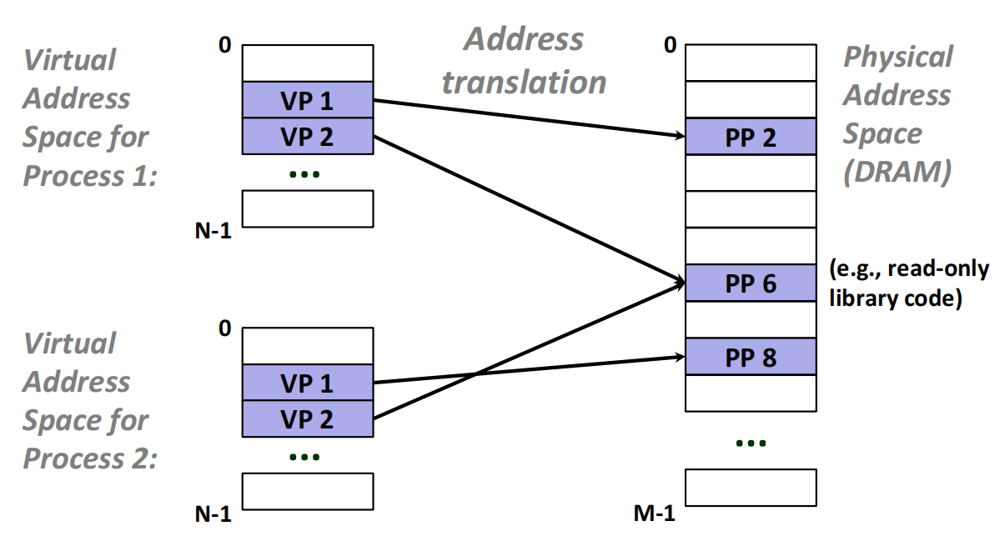{ width=75% }
{.center-img}

不同进程可以把同一个虚拟页映射到不同的物理页，因此相同的虚拟地址在不同进程中可以保存不同内容。也可以把不同的虚拟页映射到同一个物理页，以共享只读库代码等数据。

## 分页

虚拟内存将虚拟地址空间划分为固定大小的虚拟页，将物理内存划分为同样大小的物理页，也称页框。设页面大小为 $P = 2^p$ 字节：

- 一个 $n$ 位虚拟地址空间包含 $2^{n-p}$ 个虚拟页
- 一个 $m$ 位物理地址空间包含 $2^{m-p}$ 个物理页
- 页面内的字节偏移需要 $p$ 位表示

在任意时刻，虚拟页可能处于三种状态：

- **未分配**：没有对应的数据，不占用磁盘或物理内存
- **已缓存**：页面当前位于某个物理页中
- **未缓存**：页面已分配，但当前只位于磁盘中

### 页表

操作系统为每个进程维护一张页表。页表常驻主存，由页表项记录虚拟页的位置和权限。简化的页表项包含一个有效位，以及物理页号或磁盘地址：

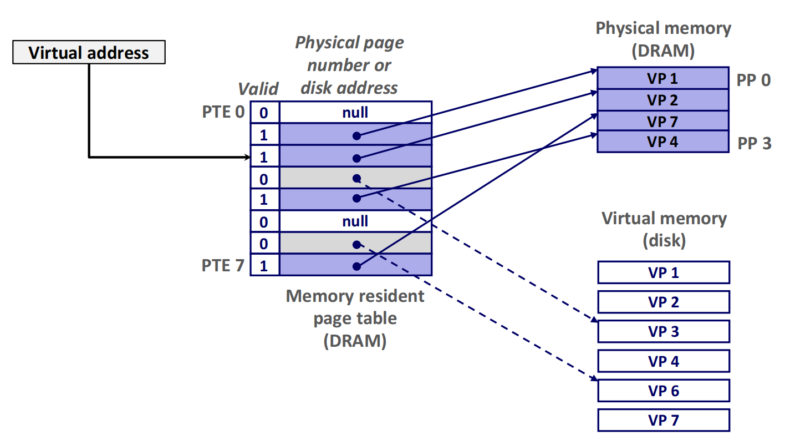{ width=90% }
{.center-img}

- 有效位为 $1$：页面已缓存在主存中，页表项保存物理页号
- 有效位为 $0$ 且存在磁盘地址：页面已分配，但当前不在主存
- 有效位为 $0$ 且地址为空：页面尚未分配

!!! info "有效位"

    以上为简化模型，有效位表示页面当前是否驻留在主存。实际体系结构中的页表项还可能用 present、accessed、dirty 等位分别记录驻留状态和访问信息。

## 地址翻译

虚拟地址由虚拟页号和虚拟页偏移组成，物理地址由物理页号和物理页偏移组成：

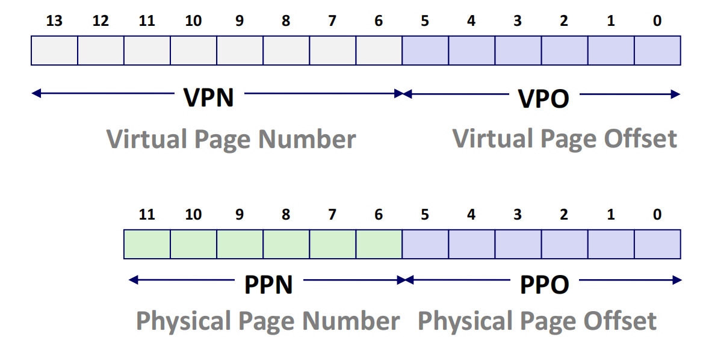{ width=60% }
{.center-img}

因为虚拟页和物理页大小相同，地址翻译只替换页号，页内偏移保持不变，即 PPO = VPO。

处理器用页表基址寄存器保存当前进程一级页表的物理地址。在 x86-64 中，这一寄存器是 `CR3`。基本翻译过程如下：

1. 处理器从虚拟地址中取出虚拟页号
2. 内存管理单元根据页表基址和虚拟页号定位页表项
3. 检查页表项的有效位和访问权限
4. 若页面驻留在主存且访问合法，取出物理页号
5. 将物理页号与原来的页内偏移拼接成物理地址

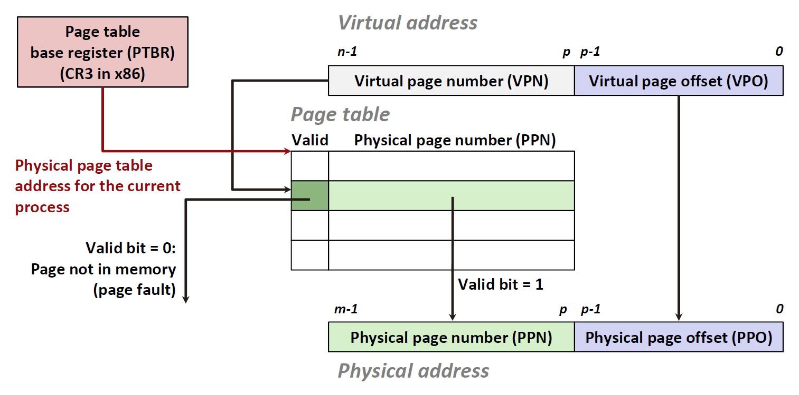{ width=90% }
{.center-img}

### 页面命中与缺页

若页表项表明页面已经位于主存，就发生页面命中。否则，访问会触发缺页异常，控制权转移到内核中的缺页异常处理程序：

1. 判断虚拟地址是否合法、访问权限是否满足，非法访问通常导致进程收到 `SIGSEGV`
2. 在物理内存中选择一个空闲页，若没有空闲页，则根据替换策略选择牺牲页
3. 如果牺牲页被修改过，先将其写回磁盘
4. 从磁盘把目标页读入选中的物理页
5. 更新页表项并重新执行引发缺页的指令

页面从建立映射到换入、驻留和换出的完整过程如下：

<div class="mermaid-sized" style="--diagram-width: 70%;" markdown>

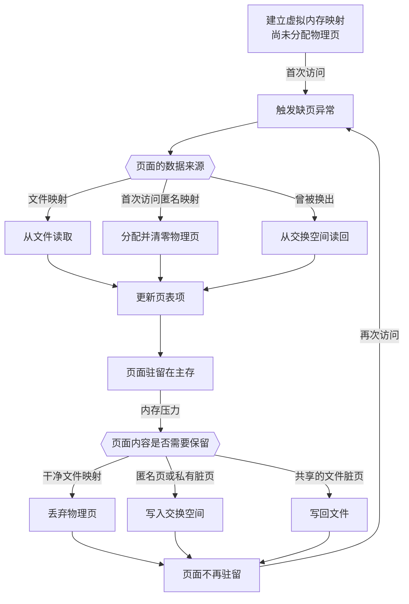

</div>

由于磁盘访问比 DRAM 慢得多，缺页代价极高。系统采用按需分页，只在页面第一次被真正访问时调入，并依赖程序的局部性让工作集尽量保留在主存中。

!!! danger "颠簸"

    如果多个进程的活跃页面总量超过可用物理内存，系统会不断换入和换出页面，大部分时间都消耗在处理缺页上。这种状态称为颠簸。

### 权限与共享

页表项除了页号和驻留状态，还保存权限位，例如：

- `SUP`：是否只有内核态可以访问
- `READ`：是否允许读取
- `WRITE`：是否允许写入
- `EXEC`：是否允许执行

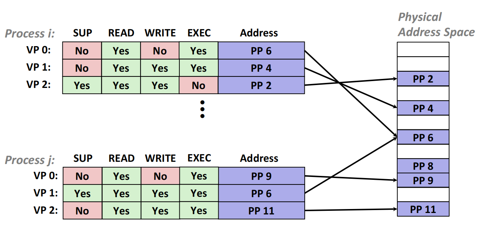{ width=80% }
{.center-img}

每次地址翻译都会同时检查权限。不同进程的页表彼此独立，从而实现进程隔离。多个页表项又可以指向同一物理页，从而高效共享库代码和只读数据。

## TLB

如果每次访存都先从主存读取页表项，再读取目标数据，一次普通访问至少需要两次内存访问。TLB 是位于 MMU 内部的小型、快速的地址翻译缓存，用于保存最近使用的页表项。

TLB 通常采用组相联结构。虚拟页号被划分为 TLB 标记和 TLB 组索引，页内偏移不参与 TLB 查找：

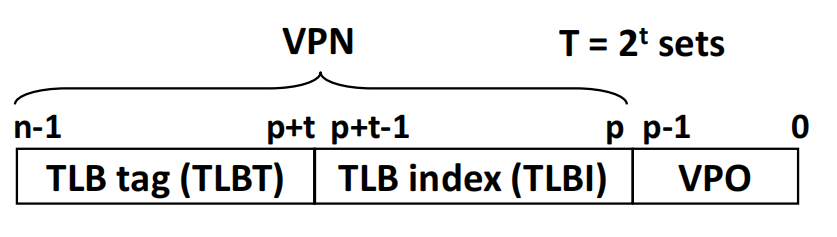{ width=55% }
{.center-img}

设 TLB 有 $T = 2^t$ 组，则从 VPN 的低 $t$ 位取得 TLB 组索引，其余位构成 TLB 标记。

### TLB 命中

1. MMU 用 VPN 查找 TLB
2. 若标记和有效位匹配，直接得到页表项
3. 检查权限后，将 PPN 与 VPO 拼接成物理地址

### TLB 不命中

1. MMU 或操作系统遍历页表，读取目标页表项
2. 若页面驻留在主存，将页表项填入 TLB，再完成地址翻译
3. 若页面不在主存，则触发缺页异常

一次访存的地址翻译路径可以统一表示为：

<div class="mermaid-sized" style="--diagram-width: 90%;" markdown>

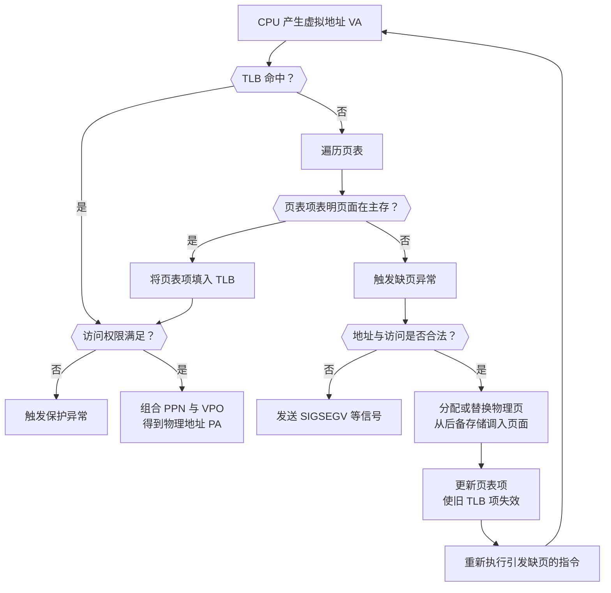

</div>

进程切换后，旧进程的 TLB 项不能直接用于新进程。系统可以清空 TLB，也可以使用地址空间标识符为不同进程的条目加标签。修改页表后，操作系统还必须使相应的旧 TLB 项失效。

## 多级页表

若直接为每个虚拟页分配页表项，稀疏的虚拟地址空间会产生很大的页表。多级页表把 VPN 划分为多个字段，逐级索引页表：

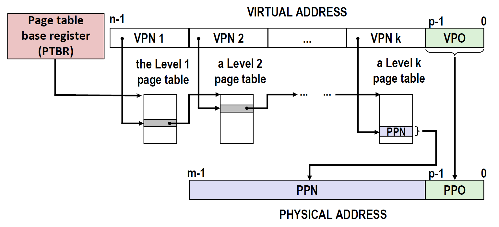{ width=90% }
{.center-img}

页表基址寄存器指向一级页表。一级页表项指向二级页表，之后依次类推，最后一级页表项给出目标 PPN。

多级页表的关键优势是按需分配：如果某一大片虚拟地址从未使用，对应的下级页表就不需要存在。代价是 TLB 不命中时需要多次访问主存才能完成页表遍历。TLB 缓存最终得到的翻译，使大多数访存不必重复遍历。

## 地址翻译与 Cache

地址翻译和 Cache 查找共同位于处理器访存的关键路径上：

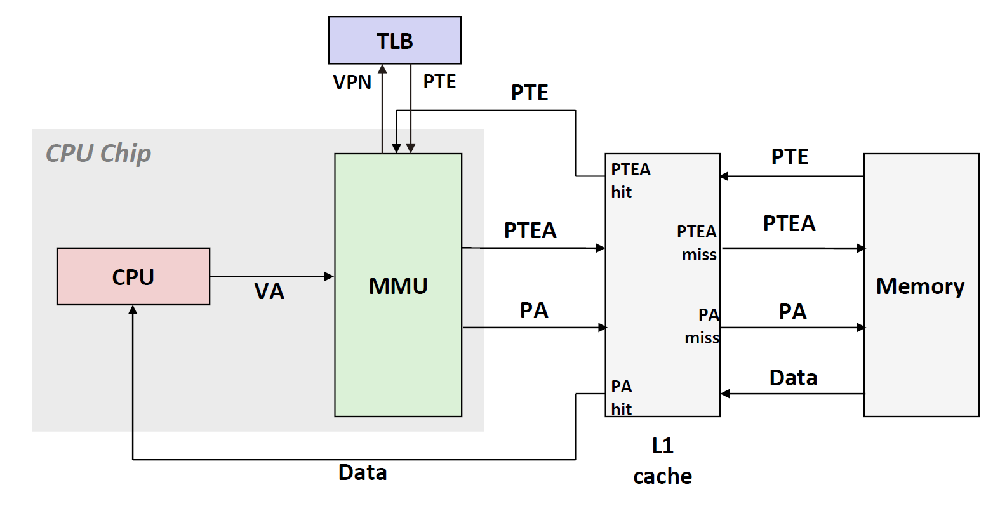{ width=85% }
{.center-img}

一种直观设计是物理索引、物理标记 Cache：MMU 先把 VA 翻译为 PA，Cache 再用 PA 查找数据。它避免了不同虚拟地址指向同一物理地址所产生的别名问题，但串行执行会增加访问延迟。

页内偏移在地址翻译前后保持不变，因此，如果 L1 Cache 的组索引位完全位于页内偏移中，就可以并行执行 TLB 查找和 Cache 组选择。得到 PPN 后，再用完整的物理标记完成比较。

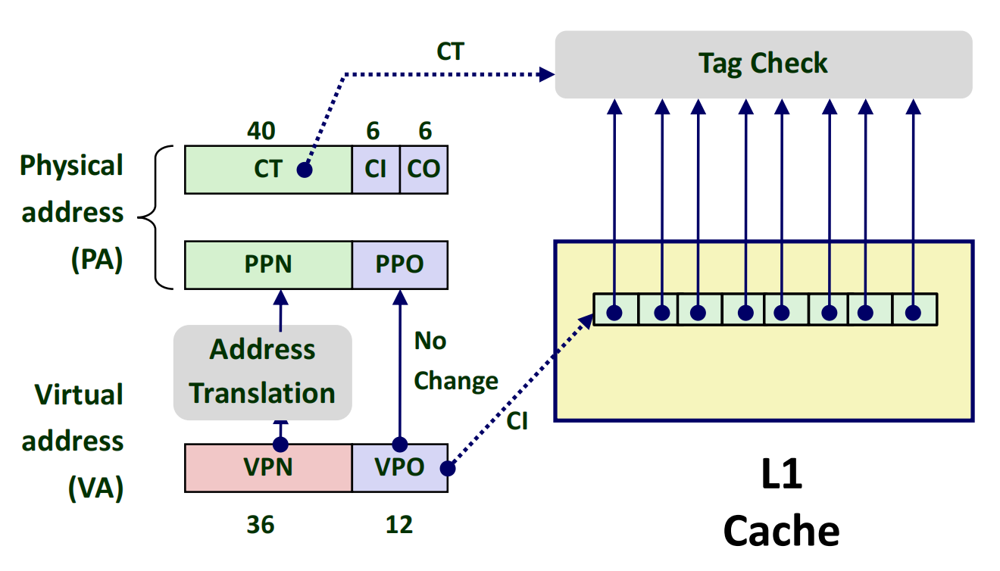{ width=60% }
{.center-img}

图中页面大小为 $2^{12}$ 字节，因而 VPO 和 PPO 都是 12 位。Cache 的 6 位块偏移和 6 位组索引正好全部落在页内偏移中，可以在地址翻译完成前开始选择 Cache 组。

## Linux 中的虚拟内存

Linux 将进程的虚拟地址空间组织成若干区域，每个区域是一段连续的已分配虚拟页，并具有统一的读、写、执行权限。典型区域包括代码段、只读数据、数据段、堆、共享库映射、用户栈和内核空间。

### 内存映射

内存映射把虚拟内存区域与磁盘上的对象关联起来。对象可以是普通文件，也可以是由内核创建的匿名文件：

- **文件映射**：页面初始内容来自文件，适合装载可执行文件、共享库和访问映射文件
- **匿名映射**：第一次访问时得到全零页面，适合堆、栈以及匿名内存
- **共享映射**：对页面的修改对其它映射同一对象的进程可见，并可以写回文件
- **私有映射**：修改通过写时复制留在当前进程，不改变底层文件

### fork 与{{abbr:写时复制}}

调用 `fork` 时，内核不必立即复制父进程的所有物理页。父子进程最初共享这些页面，页表项被标记为只读私有。只有某一方尝试写入时才触发保护异常，内核复制目标页，并让写入方的页表项指向副本。

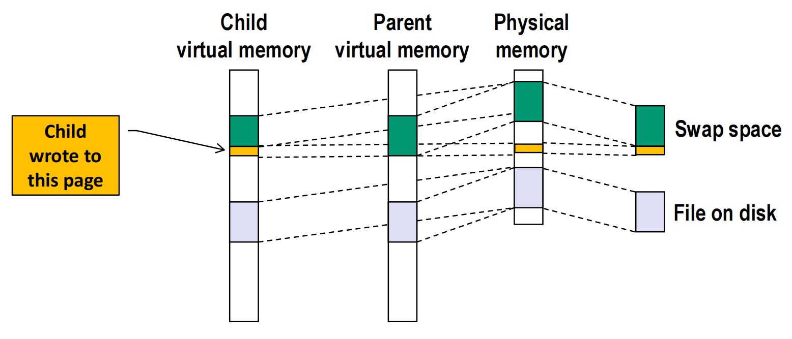{ width=85% }
{.center-img}

写时复制避免复制从未被修改的页面，特别适合 `fork` 后很快调用 `execve` 的场景。共享库的只读页面和共享映射则可以继续由多个进程共同使用，无须复制。

!!! note "虚拟内存相关的 Unix 接口"

    下列函数用于创建、删除或修改映射：

    ```c
    #include <sys/mman.h>
    #include <sys/types.h>
    #include <unistd.h>

    void *mmap(void *addr, size_t length, int prot,int flags, int fd, off_t offset);
    int munmap(void *addr, size_t length);
    int mprotect(void *addr, size_t length, int prot);
    ```

    **mmap**

    `mmap` 在进程地址空间中创建一段映射，成功时返回映射的起始地址，失败时返回 `MAP_FAILED`。`addr` 通常传入 `NULL`，由内核选择地址；`length` 指定映射长度；`prot` 使用 `PROT_READ`、`PROT_WRITE` 和 `PROT_EXEC` 等标志设置页面权限；`flags` 常用 `MAP_SHARED` 或 `MAP_PRIVATE` 选择共享或私有映射。

    文件映射通过 `fd` 和 `offset` 指定后备文件及起始偏移。匿名映射通常使用 `MAP_PRIVATE | MAP_ANONYMOUS`，同时令 `fd = -1`、`offset = 0`：

    ```c
    size_t length = 4096;
    void *p = mmap(NULL, length, PROT_READ | PROT_WRITE, MAP_PRIVATE | MAP_ANONYMOUS, -1, 0);

    if (p == MAP_FAILED) {
        /* 处理映射失败 */
    }
    ```

    **munmap 与 mprotect**

    `munmap` 删除从 `addr` 开始、长度为 `length` 的映射。删除后再次访问该区域通常会触发段错误。`mprotect` 不改变映射内容，只修改页面的读、写、执行权限。二者成功时返回 `0`，失败时返回 `-1`；传入的起始地址需要按页面边界对齐。

*[内存管理单元]: Memory Management Unit，MMU
*[虚拟页]: Virtual Page，VP
*[物理页]: Physical Page，PP
*[页框]: Page Frame
*[页表项]: Page Table Entry，PTE
*[虚拟页号]: Virtual Page Number，VPN
*[虚拟页偏移]: Virtual Page Offset，VPO
*[物理页号]: Physical Page Number，PPN
*[物理页偏移]: Physical Page Offset，PPO
*[页表基址寄存器]: Page Table Base Register，PTBR
*[缺页异常]: Page Fault
*[按需分页]: Demand Paging
*[工作集]: Working Set
*[颠簸]: Thrashing
*[TLB]: Translation Lookaside Buffer
*[地址空间标识符]: Address Space Identifier，ASID
*[物理索引、物理标记]: Physically Indexed, Physically Tagged，PIPT
*[内存映射]: Memory Mapping
*[写时复制]: Copy-on-Write，COW
