---
tags:
  - Python
---

# CS61A

## Functions

### Call Expressions

```python
add(1 + 1, 3)
```

- `add` - operator
- `1+1, 3` - operand

### Names, Assignment, and User-Defined Functions

Bind names to values:

- Import statement
- Assignment statement
- Def statement

Assignment statements can be used to bind name to functions:

```shell
>>> f = max
>>> f
<built-in function max>
```

Now `f` and `max` are both name to the same function.

We can also change what the name `max` means,

```shell
>>> max = 7
>>> f(1, 2, max)
7
```

There are names for common infix operators, which is in the `operator` module.
E.g.: `from operator import add, mul`.

Type of Expressions:

- Primitive expressions:
  - Number or numeral
  - Name
  - String
- Call expressions

### Environment Diagrams

Environment diagrams visualize the interpreter's process.
We can use the Online Python Tutor to do this automatically.

Execution rule for assignment statement:

1. Evaluate all expressions to the right of = from left to right
2. Bind all names to the left to = to the resulting values in the current frame.

```shell
>>> a = 1
>>> b = 2
>>> b, a = a + b, b
>>> a
2
>>> b
3
```

### Defining Functions

```python
def <name>(<formal parameters>):
    return <return expression>
```

Function signature: `<name>(<formal parameters>)`

Execution procedure for def statement:

1. Create a function with signature `<name>(<formal parameters>)`
2. Set the body of that function to be everything indented after the first line
3. Bind `<name>` to that function in the current frame

Procedure for calling/applying user-defined functions:

1. Add a local frame, forming a new environment
2. Bind the function's formal parameters to its arguments in that frame
3. Execute the body of the function in that new environment

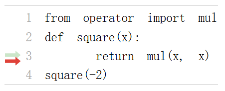{ width="280" }

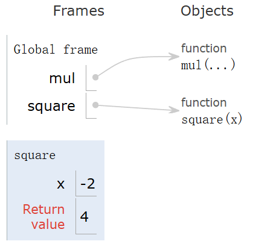{ width="250" }

A function signature has all the information needed to create a local frame.

An environment is a sequence of frames.
A name evaluates to the value bound to that name in the earliest frame of the current environment in which that name is found.
E.g., to look up some name in the body of a function:

1. Look up that name in the local frame
2. If not found, look for it in the global frame

A more complicated example:

```shell
>>> from operator import mul
>>> def square(square):
...    return mul(square, square)
...
>>> square
<function square at ...>
>>> square(4)
16
```

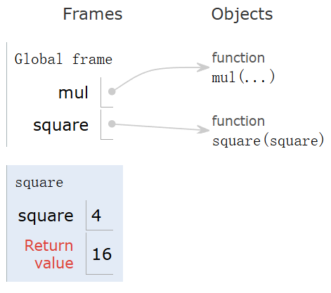{ width="250" }

### Print and None

#### None

```shell
>>> -2
-2
>>> print(-2)
-2
>>> 'Hello World!'
'Hello World!'
>>> print('Hello World')
Hello World!
>>> None
>>> print(None)
None
>>> print(print(1), print(2))
1
2
None None
```

A special value `None` represents nothing in Python.
A function that does not explicitly return a value will return `None`.
Careful: None is not displayed by the interpreter as the value of an expression.

### Pure Functions & None-Pure Functions

- Pure functions: just return values (abs, pow)
- None-pure functions: have side effects (print)

## Control

### Multiple Environments

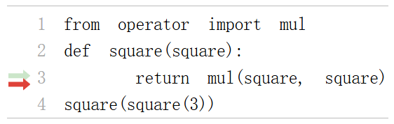{ width="280" }

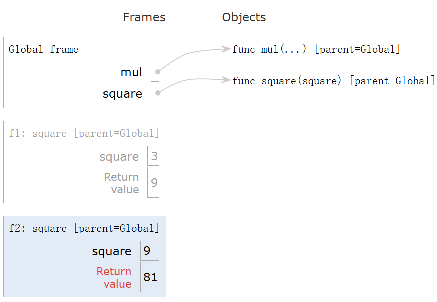{ width="460" }

An environment is a sequence of frames.
In the case above, there's 3 environments.

- The global frame
- f1, followed by the global frame
- f2, followed by the global frame

Names has no meanings without these environments.

### Miscellaneous Python Features

#### Division

There are two kinds of division:

- True division, `/`
- Integer division, `//`

These have corresponding functions in the `operator` module:

- `truediv`
- `floordiv`

And `%` gives the remainder of division. The corresponding function is `mod`.

#### Return Multiple Values from a Function

```shell
>>> def divide_exact(n, d):
... return n//d, n%d
...
>>> quotient, remainder = divide_exact(2013, 10)
>>> quotient
2013
>>> remainder
3
```

#### Interactive Mode

```shell
python3 -i *.py
```

#### Doc Test

It is suggested to use cap letters to refer to the formal parameters in comments.

```python
def divide_exact(n, k):
    """Return the quotient and remainder of dividing N by D.
    
    >>> q, r = divide_exact(2013, 10)
    >>> q
    201
    >>> r
    3
    """
    return q // r, q % r
```

Then we can type `python3 -m doctest test.py` in the terminal to test  the code. If everything does what it is supposed to do, we will see no output.
If we want to see more information, we can use `python3 -m doctest -v test.py`, which will tell us everything that happen.

#### Default Values

```python
def <function name>(<formal parameter> = <default value>)
```

### Conditional Statements

Compound statements have a structure like this:

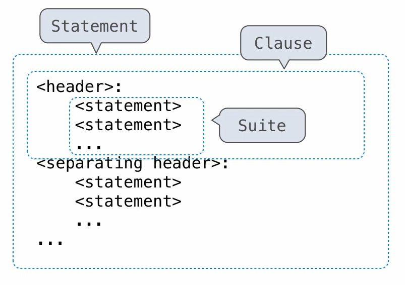{ width="370" }

The first statements determines a statement's type. The header of a clause 'controls' the suite that follows. Def statements are compound statements.

```python
if <condition>:
    ...
elif <condition>:
    ...
else:
    ...
```

There can be zero or one 'else' clause in the end.

#### Boolean Context

False values in python:

- `False`
- `0`
- Empty string
- `None`

### Iteration

#### While Statement

```python
while <condition>:
    ...
```

## Higher-Order Functions

### Control Expressions

#### Logical Operators

The logical operators exhibit a behavior called 'short-circuiting'.

To evaluate the expressions `<left> and <right>`:

1. Evaluate `<left>`
2. If the result is a false value `v`, then the expression evaluates to `v`
3. Otherwise, the expression evaluates to `<right>`

To evaluates the expression `<left> or <right>`:

1. Evaluate `<left>`
2. If the result is a true value `v`, then the expression evaluates to `v`
3. Otherwise, the expression evaluates to `<right>`

Python's and and or operators short-circuit. That is, they don't necessarily evaluate every operand.

|Operator|Checks if:|Evaluates from left to right up to:|Example|
|---|---|---|---|
|`and`|All values are true|The first false value|`False and 1 / 0` evaluates to False|
|`or`|At least one value is true|The first true value|`True or 1 / 0` evaluates to True|

#### Assertion

E.g.:

```python
assert 3 > 2, 'Math is broken.'
assert 2 > 3, 'That is false.'
```

### Higher-Order Functions

E.g.:

```python
from math import pi, sqrt

def area(r, shape_constant):
    assert r > 0, 'A length must ne positive.'
    return r * r *shape_constant

def area_square(r):
    return area(r, 1)

def area_circle(r):
    return area(r, pi)

def area_hexagon(r):
    return area(r, 3 * sqrt(3) / 2)
```

A formal parameter can be bound to a function, so we can pass a function to a function as its argument.

### Functions as Return Values

```python
def make_adder(n):
    """
    
    >>> add3 = make_adder(3)
    >>> add3(4)
    7
    """
    def adder(k):
        return n + k
    return adder
```

We can also use `make_adder(2000)(13)` to get `2013`.

## Environments

### Environments for Higher-Order Functions

Higher-Order function: A function that takes a function as an argument value or return a function as a return value.

```python
def apply_twice(f, x):
    return f(f(x))
    
def square(x):
    return x * x
    
result = apply_twice(square, 2)
```

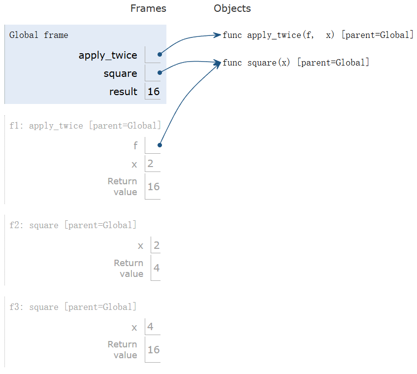{ width="500" }

### Environments for Nested-Definitions

E.g.:

```python
def make_adder(n):
    def adder(k):
        return k + n
    return adder

add_three = make_adder(3)
result = add_three(4)
```

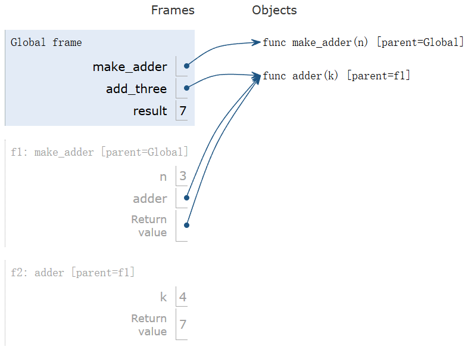{ width="500" }

Every user-defined function has a parent frame(often global).
The parent of a function is the frame in which it was defined.

Every local frame has a parent frame(often global).
The parent of a frame is the parent of the function called.

### Local Names

```python
def f(x, y):
    return g(x)
    
def g(a):
    return a + y
    
result = f(1, 2)
```

This will cause an error, because the name `y` cannot be found in the global frame.

### Function Composition

```python
def make_adder(n):
    def adder(k):
        return n + k
    return adder
    
def square(x):
    return x * x

def triple(x):
    return 3 * x

def compose1(f, g):
    def h(x):
        return f(g(x))
    return h

squiple = compose1(square, triple)
squiple(5)  # Evaluates to 225

tripare = compose1(triple, square)
tripare(5)  # Evaluates to 75

squadder = compose1(square, make_adder(2))
squadder(3)  # Evaluates to 25
compose1(square, make_adder(2))  # The same as above
```

### Lambda Expressions

```python
square = lambda x: x * x
square(10)  # Evaluates to 100
```

### Function Currying

Currying: Transforming a multi-argument function into a single-argument, higher-order function.

```python
def curry2(f):
    def g(x):
        def h(y):
            return f(x, y)
        return h
    return g

curry2(add)(2)(3)  # Evaluates to 5
```

We can also write it like this:

```python
curry2 = lambda f: lambda x: lambda y: f(x, y)
```

## Functional Abstraction

### Lambda Function Environments

```python
a = 1

def f(g):
    a = 2
    return lambda y: a * g(y)

print(f(lambda y: a + y)(a))  # Evaluates to 4
```

### Return

A return statement completes the evaluation of a call expression and provides its value.

```python
def end(n, d):
    """Print the final digits of N in reverse order until D is found.
    
    >>> end (34567, 5)
    7
    6
    5
    """
    while n > 0:
        last, n = n % 10, n // 10
        print(last)
        if d == last:
            return None
```

A more complicated example:

```python
def square(x):
    return x * x

def search(f):
    x = 0
    while not f(x):
        x += 1
    return x
        
def inverse(f):
    ## Return g such that g(f(x)) -> x.
    return lambda y: search(lambda x: f(x) == y)
    
sqrt = inverse(square)
sqrt(256)  # Evaluates to 16
```

### Abstraction

- Function abstraction
- Choosing names for functions
- Which values deserve a name
  - Repeat compound expressions
  - Meaningful parts of complex expressions

### Errors and Tracebacks

Errors:

- Syntax errors
- Runtime errors -> Tracebacks
- Logical or behavior errors

## Function Examples

### Decorators

```python
def trace(fn):
    """Returns a version of fn that first prints before it is called.
    
    fn - a function of 1 argument
    """
    def traced(x):
        print('Calling', fn, 'on argument', x)
        return fn(x)
    return traced

@trace
def square(x):
    return x * x
```

When we call `square(12)`, we will get the output below:

```shell
Calling <function square at 0x...> on argument 12
```

It is identical to this:

```python
def square(x):
    return x * x
square = trace(square)
```

### Project - Hog: Arbitrary Positional Arguments

Instead of listing formal parameters for a function, we can write `*args`, which represents all of the arguments that get passed into the function.

```python
def printed(f):
    def print_and_return(*args):
        result = f(*args)
        print('Result:', result)
        return result
    return print_and_return
```

## Recursion

### Self-Reference

```python
def print_all(x):
    print(x)
    return print_all

print_all(1)(3)(5)
```

The output is:

```shell
1
3
5
```

A more complicated example:

```python
def print_sums(x):
    print(x)
    def next_sum(y):
        return print_sums(x + y)
    return next_sum

print_sums(1)(3)(5)
```

The output is:

```shell
1
4
9
```

The environment diagram of the code above is:

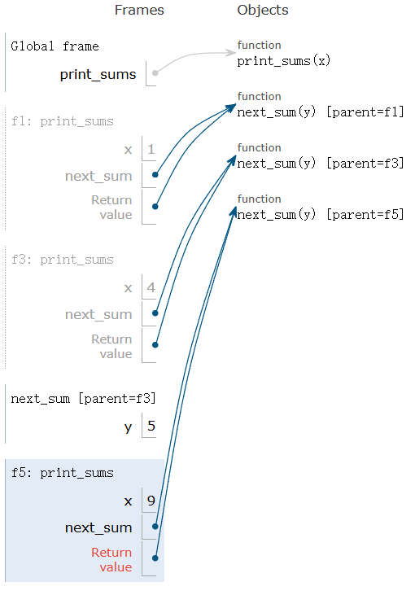{ width="400" }

Notice that the function `next_sums` was defined 3 times.

### Recursive Functions

Definition: A function is called recursive if the body of that function calls itself, either directly or indirectly.

### Mutual Recursion

#### The Luhn Algorithm

The Luhn sum of a valid credit card number is a multiple of 10.

How to compute:

1. From the right most digit, which is the check digit, moving left, double the value of every second digit; if product of this doubling operation is greater than 9, then sum the digits of the products.
2. Take the sum of all the digits.

```python
def split(n):
    return n // 10, n % 10

def sum_digits(n):
    if n < 10:
        return n
    else:
        return all_but_last, last = split(n)
        return sum_digits(all_but_last) + last

def luhn_sum(n):
    if n < 10:
        return n
    else:
        all_but_last, last = split()
        return luhn_sum_double(all_but_last) + last

def luhn_sum_double(n):
    all_but_last, last = split()
    luhn_digit = sum_digits(2 * last)
    if n < 10:
        return luhn_digit
    else:
        return luhn_sum(all_but_last) + luhn_digit
```

## Tree Recursion

### Example: Inverse Cascade

This is an inverse cascade:

```shell
1
12
123
12
1
```

The implementation code is:

```python
def inverse_cascade(n):
    grow(n)
    print(n)
    shrink(n)
    
def f_then_g(f, g, n):
    if n:
        f(n)
        g(n)

grow = lambda n: f_then_g(grow, print, n // 10)
shrink = lambda n: f_then_g(print, shrink, n // 10)
```

### Tree Recursion

Tree-shaped process arise whenever executing the body of a recursive function makes more than one call to that function.

### Example: Counting Partitions

The number of partitions of a positive integer n, using parts up to size m, is the number of ways in which n can be expressed as the sum of positive integer parts up to m in increasing order.

```python
def count_partitions(n, m):
    if n == 0:
        return 1
    elif n < 0:
        return 0
    elif m == 0:
        return 0
    else:
        with_m = count_partitions(n - m, m)
        without_m = count_partitions(n, m - 1)
        return with_m + without_m
```

### HW03: Anonymous Factorial

#### Conditional Expressions

The expression `x if C else y` first evaluates the condition, `C` rather than `x`. If `C` is true, `x` is evaluated and its value is returned; otherwise, `y` is evaluated and its value is returned.

#### Anonymous Factorial

Task: Write an expression that computes n factorial using only call expressions, conditional expressions, and lambda expressions (no assignment or def statements).

```python
from operator import sub, mul

def make_anonymous_factorial():
    return (lambda f: lambda k: f(f, k))(lambda f, k: (k if k == 1 else mul(k, f(f, sub(k, 1)))))
    ## Alternate solution:
    return (lambda f: f(f))(lambda f: lambda x: (1 if x == 0 else x * f(f)(x - 1)))
```

## Sequences

### Lists

Bind a list literal to a name:

```python
a = [1, 2, 3]
```

To get the number of elements, we can use the built-in function `len`:

```python
a =  [1, 2, 3]
len(a)  # Evaluates to 3
```

If we want to get an element selected by its index, we can use the element selection syntax or the `getitem` function in the `operator` module:

```python
from operator import *
a = [1, 2, 3]
a[0]  # Evaluates to 1
getitem(a, 0)  # The same as above
```

Concatenation and repetition:

```python
a = [1, 2, 3]
[4, 5] * 2 + a  # Evaluates to [4, 5, 4, 5, 1, 2, 3]
```

### Containers

The built-in operator `in` can test whether an element appears in a compound value.

```python
a = [1, 2, 3]
1 in a       # True
5 not in a   # True
not(5 in a)  # Equivalent to the above
[1, 2] in a  # False
[1, 2] in [[1, 2], 3]  # True
```

### For Statements

#### Sequence Iteration

```python
def count(s, value):
    total = 0
    for element in s:
        if element == value:
            total += 1
    return total
```

The name `element` is bound in the first frame of the current environment. No new frames were introduced to the for statement.

#### For Statement Execution Procedure

```python
for <name> in <expression>:
    <suite>
```

1. Evaluate the header `<expression>`, which must yield an iterable value.
2. For each element in that sequence, in order:
   1. Bind `<name>` to that element in the current frame.
   2. Execute the `<suite>`.

```python
for i in [1, 2, 3]:
    print(i)
print(i)
```

The output of the code above is:

```shell
1
2
3
3
```

#### Sequence Unpacking in For Statement

Sequence unpacking works for a sequence of **fixed-length** sequence.

```python
pairs = [[1, 2], [2, 2], [3, 2], [4, 4]]
same_count = 0

for x, y in pairs:
    if x == y:
        same_count += 1

print(same_count)  # Output: 2
```

### Ranges

Ranges are another sequence type to represent consecutive integers.

To convert ranges to lists, we can call the list constructor `list`, a built-in function. When we call it on any other sequence, it gives us back a list full of the elements of that sequence.

There are cases when we actually don't care about the integers themselves. A typical way to write that is a for statement like this:

```python
for _ in range(n):
    <suite>
```

### List Comprehensions

A list comprehension takes an existing list and computes a new list from it according to some expressions.

```python
letters = ['a', 'b', 'c', 'd', 'e']
[letters[i] for i in [0, 2, 4]]  # Evaluates to ['a', 'c', 'e']

odds = [1, 3, 5, 7, 9]
[x + 1 for x in odds]  # Evaluates to [2, 4, 6, 8, 10]
[x for x in odds if 25 % x == 0]  # Evaluates to [1, 5]

def divisors(n):
    return [1] + [x for x in range(2, n) if n % x == 0]
divisors(12)  # Evaluates to [1, 2, 3, 4, 6]
```

### Lists, Slices, & Recursion

For any list `s`, the expression `s[1:]` is called a slice from index 1 to the end (or 1 onward).

## Containers

### Box-and-Pointer Notation

Box-and-pointer notation is a way to represent a list without environment diagrams.

#### The Closure Property of Data Types

- A method for combining data values satisfies the **closure property** if: The result of combination can itself be combined using the same method
- Closure is powerful because it permits us to create hierarchical structures
- Hierarchical structures are made up of parts, which themselves are made up of parts, and so on

#### Box-and-Pointer Notation in Environment Diagrams

Lists are presented as a row of index-labeled adjacent boxes, one per element.
Each box either contains a primitive value or points to a compound value.

A complicated example of nested lists represented by box-and-pointer notation:

```python
pair = [1, 2]
nested_list = [[1, 2], [], [[2, False, None], [4, lambda: 5]]]
```

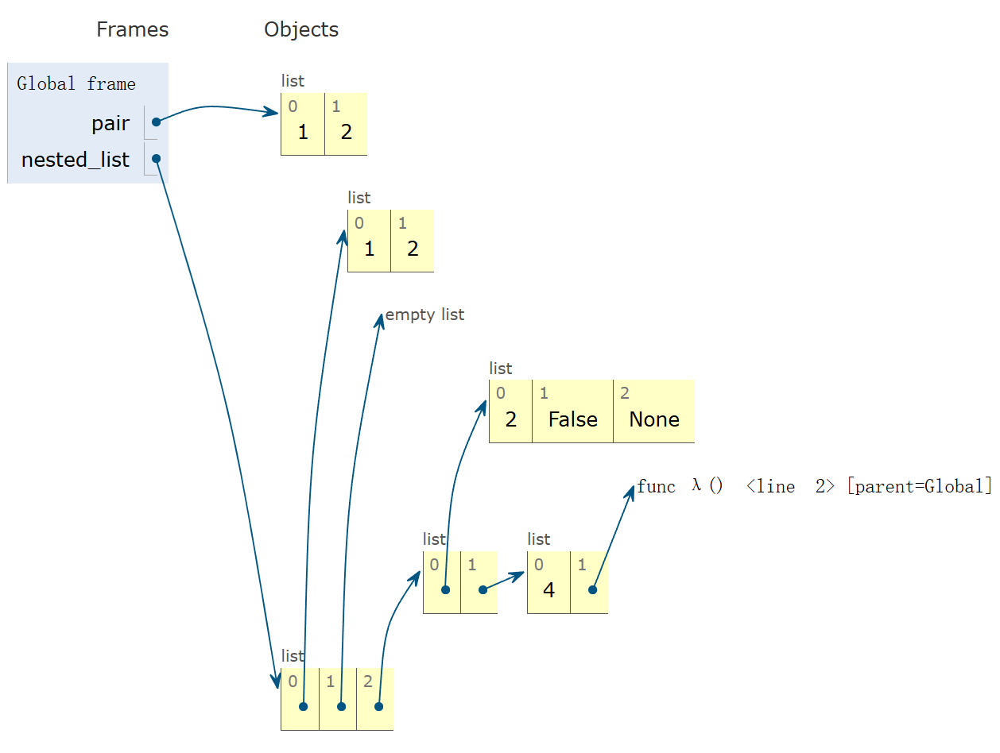{ width="550px" }

### Slicing

Slicing is an operation that we can perform on sequences, such as lists and ranges.

`[:]` is the slicing operator.

```python
a = [1, 2, 3, 4, 5]
a[1:3]  # [2, 3]
a[:3]   # [1, 2, 3]
a[1:]   # [2, 3, 4, 5]
a[:]    # [1, 2, 3, 4, 5]
```

### Processing Container Values

#### Sequence Aggregation

Several built-in functions take iterable arguments and aggregate then into a new value.

##### Sum

`sum(iterable[, start]) -> value`

Return the sum of an iterable of numbers (NOT strings) plus the value of parameter `start` (which defaults to `0`). When the iterable is empty, return start.

E.g.:

```python
sum([2, 3, 4])  # 9
sum([[2, 3], [4]], [])  # [2, 3, 4]
```

##### Max

`max(iterable[, key=func]) -> value`

`max(a, b, c, ...[, key=func]) -> value`

With a single iterable argument, return its largest item.
With two or more arguments, return the largest argument.
The `key` parameter: It applies a function to every element that are being considered, and actually computes the maximum based on the values of calling those functions.

E.g.:

```python
max(range(5))  # 4
max(0, 1, 2, 3, 4)  # 4
max(range(10), key=lambda x: 7 - (x - 4) * (x - 2))  # 3
```

##### All

`all(iterable) -> bool`

Return `True` if `bool(x)` is `True` for all values `x` in the iterable. If the iterable is empty, return `True`.

E.g.

```python
all([x < 5 for x in range(5)])  # True
```

There's also `min` and `any`, which are complements to `max` and `all`.

### Strings

The function `exec` can execute the code stored in a string.

#### String literals

```python
'I am string!'
"I'm string!"
"""The Zen of Python
claims, Readability counts.
Read more, import this."""
```

Single-quoted and double-quoted strings are equivalent except for that we can put an apostrophe in the double-quoted string, but it will not work on single-quoted strings, which will end string.

A triple-quoted string can span multiple lines. We often use it for docstrings.

#### String are Sequences

Length and element selection are similar to all sequences.
However, the `in` and `not in` operators **match substrings**.

### Dictionaries

Looking up values by their keys uses the element selection operator.

```python
numerals = {"I": 1, "V": 5, "X": 10}
numerals["I"]  # 1
numerals["V"]  # 5
numerals["X"]  # 10
```

Dictionaries are also **sequences**. In particular, they are sequences of keys. This means we can use dictionaries inside of a for statement to go through all of the keys.

```python
list(numerals)  # ["I", "V", "X"]
```

Dictionaries support various methods of iterating over the contents. The methods `keys`, `values`, and `items` all return iterable values. Although their return values are not a list, we can sum them up or iterate through them using a for statement. If for some reason we really need a list, we can call the method `list` on them to get a list.

```shell
>>> numerals.keys()
dict_keys(['I', 'V', 'X'])
>>> numerals.values()
dict_values([1, 5, 10])
>>> numerals.items()
dict_items([('I', 1), ('V', 5), ('X', 10)])
>>> list(numerals.keys())
['I', 'V', 'X']
```

Dictionaries can be constructed with no elements.

```python
d = {}
```

Two important **restrictions** about the keys of a dictionary:

- There can be at most one value for a given key.
- The key itself cannot be a list or a dictionary (or any mutable type).

```python
>>> {1: "first", 1: "second"}
{1: 'second'}
>>> {[1]: "first"}
Traceback (most recent call last):
  File "<stdin>", line 1, in <module>
TypeError: unhashable type: 'list'
```

#### Dictionary Comprehensions

Dictionaries also have a comprehension syntax analogous to those of lists.

```python
{<key exp>: <value exp> for <name> in <iter exp>[ if <filter exp>]}
```

An expression that evaluates to a dictionary using this evaluation procedure:

1. Add a new frame with the current frame as its parent
2. Create an empty result dictionary that is the value of the expression
3. For each element in the iterable value of `<iter exp>`:
   1. Bind `<name>` to that element in the new frame from step 1
   2. If `<filter exp>` evaluates to a true value, then add to the result dictionary an entry that pairs the value of `<key exp>` to the value of `<value exp>`

##### Example: Indexing

```python
def index(keys, values, match):
    """Return a dictionary from keys k to a list of values v for which match (k, v) is a true value.
    
    >>> index([7, 9, 11], range(30, 50), lambda k, v: v % k == 0)
    {7: [35, 42, 49], 9: [36, 45], 11: [33, 44]}
    """
    
    return {k: [v for v in values if match(k, v)] for k in keys}
```

## Data Abstraction

An abstract data type let us manipulate compound objects as units.
Data abstraction is a methodology by which function enforce an abstraction barrier between representation and use.

### Example: Rational Numbers

Assume we can compose and decompose rational numbers:

- Constructor:
  - `rational(n, d)`: returns a rational number `x`
- Selectors:
  - `numer(x)`: returns the numerator of `x`
  - `denom(x)`: returns the denominator of `x`

These functions implement an abstract data type for rational numbers. Then we can implement rational number arithmetic:

- `add_rational(x, y)`
- `mul_rational(x, y)`
- `equal_rational(x, y)`

### Representing Rational Numbers

```python
from fractions import gcd

def rational(n, d):
    g = gcd(n, d)
    return [n // g, d // g]

def numer(x):
    return x[0]

def denom(x):
    return x[1]
```

### Abstraction Barrier

The higher we stay up without crossing these boundaries, the easier it will be to change the program in the future.

|Parts of the program that...|Treat rationals as...|Using...|
|:---|:---|:---|
|Use rational numbers to perform computation|whole data values|`add_rational`, `mul_rational`, `equal_rational`, `print_rational`|
|Create rationals or implement rational operations|numerators and denominators|`rational`, `numer`, `denom`|
|Implement constructor and selectors for rationals|two-elements lists|list literals and element selection|

#### Violating Abstraction Barriers

```python
add_rational([1, 2], [1, 4])  # Does not use constructors

def divide_rational(x, y):
    return [x[0] * y[1], x[1] * y[0]]  # Does not use selectors
```

### Data Representations

Data abstraction is recognized by its behavior, not necessarily by how it is constructed or how the constructor and selectors is implemented.

In the case below, we changed the implementation of the constructor and selectors of rationals, which still works well with the old code.

```python
def rational(n, d):
    def select(name):
        if name == 'n':
            return n
        elif name == 'd':
            return d
    return select

def numer(x):
    return x('n')

def denom(x):
    return x('d')
```

## Trees

### Implementing the Tree Abstraction

```python
def tree(label, branches=[]):
    for branch in branches:
        assert is_tree(branch), 'branches must be trees'
    return [label] + list(branches)

def label(tree):
    return tree[0]

def branches(tree):
    return tree[1:]

def is_tree(tree):
    if type(tree) != list or len(tree) < 1:
        return False
    for branch in branches(tree):
        if not is_tree(branch):
            return False
    return True

def is_leaf(tree):
    return not branches(tree)
```

### Tree Processing

Processing a leaf is often the base case of a tree processing function.
The recursive case typically makes a recursive call on each branch, then aggregates.

#### Count Leaves

```python
def count_leaves(t):
    if is_leaf(t):
        return 1
    else:
        return sum([count_leaves(b) for b in branches(t)])
```

#### Printing Trees

```python
def print_tree(t, indent=0):
    print("  " * indent + str(label(t)))
    for b in branches(t):
        print_tree(b, indent + 1)
```

#### Summing Paths

```python
def print_sums(t, so_far):
    so_far += label(t)
    if is_leaf(t):
        print(so_far)
    else:
        for b in branches(t):
            print_sums(b, so_far)
```

#### Counting Path

The function returns the number of paths from the root to any node in tree `t` for which the labels along the path sum to total.

```python
def count_path(t, total):
    if label(t) == total:
        found = 1
    else:
        found = 0
    return found + sum([count_paths(b, total - label(t)) for b in branches(t)])
```

## Mutability

### Objects

Object consist of data and behavior, bundled together to create abstractions.
A type of object is called a class; classed are first-class values in Python.
In Python, every value is an object and all objects have attributes.

### Example: Strings

```python
s = "Hello"
s.upper()  # "HELLO"
s.lower()  # "hello"
s.swapcase()  # "hELLO"
```

#### Representing Strings: the ASCII Standard

```python
a = 'A'
ord(a)  # 65
hex(ord(a))  # '0x41'
```

#### Representing Strings: the Unicode Standard

- Supports bidirectional display order
- A canonical name for every character
  - `U+0058`: LATIN CAPITAL LETTER X
  - `U+263a`: WHITE SMILING FACE
  - `U+2639`: WHITE FROWNING FACE

```python
>>> from unicodedata import name, lookup
>>> name('A')
'LATIN CAPITAL LETTER A'
>>> lookup('WHITE SMILING FACE')
'☺'
>>>lookup('WHITE SMILING FACE').encode()
b'\xe2\x98\xba'
```

### Mutation Operations

The same object can change in value throughout the course of computation. Only objects of mutable types can change.

```python
>>> L = [1, 2, 3]
>>> L.pop()
3
>>> L.remove(2)
>>> L
[1]
>>> L.extend([4, 5])
>>> L
[1, 4, 5]
>>> L[0:2] = [1, 2, 3, 4]
>>> L
[1, 2, 3, 4, 5]
```

```python
>>> numerals = {'I': 1, 'V': 5, 'X': 10} 
>>> numerals['L'] = 50
>>> numerals
{'I': 1, 'V': 5, 'X': 10, 'L': 50}
>>> numerals.pop('X')
10
>>> numerals.get('X')
```

Mutation can happen within a function call.
A function can change the value of any object in its scope.

```python
L = [1, 2, 3, 4]

def func():
    L[2:] = []

func()
print(L)  # The output is [1, 2]
```

### Tuples

Tuples are **immutable sequences**.

```python
>>> (1, 2, 3, 4)
(1, 2, 3, 4)
>>> 1, 2, 3, 4
(1, 2, 3, 4)
>>> ()
()
>>> tuple()
()
>>> tuple([1, 2])
(1, 2)
>>> 2,
(2,)
>>> (3, 4) + (5, 6)
(3, 4, 5, 6)
>>> 5 in (3, 4, 5)
True
>>> (1, 2, 3)[1:]
(2, 3)
```

Tuples are immutable values, so they can be used as keys in a dictionary.

```python
>>> {(1, 2): 3}
{(1, 2): 3}
>>> {(1, [2]): 3}
Traceback (most recent call last):
  File "<stdin>", line 1, in <module>
TypeError: unhashable type: 'list'
```

Immutable values are **protected** from mutation.

```python
a = 1, 2, 3
s = "abc"

def func():
    a = 4, 5, 6
    s = "def"

func()
print(a, s)  # The output is: (1, 2, 3) abc
```

The value of an expression can change because of changes in names or objects.

- Name change:

  ```python
  x = 1
  x = 2
  ```
  
- Object mutation:

  ```python
  x = [1, 2]
  x.append(3)
  ```

An immutable sequence may still **change** if it contains a value as an element.

```python
s = ([1, 2], 3)
s[0] = 4  # An error occurs
s[0][0] = 4  # ([4, 2], 3)
```

### Mutation

A compound data objects hax an "identity" in addition to the pieces of which it is composed. A list is still "the same" list even if we change its contents.

```python
>>> a = [10]
>>> b = a
>>> b.append(20)
>>> a
[10, 20]
>>> b
[10, 20]
```

#### Identity Operators

`<exp0> is <exp1>` evaluates to `True` if both `<exp0>` and `<exp1>` evaluates to the same object.

The opposite of `is` is called `is not`.

#### Mutable Default Arguments

Mutable default arguments are **dangerous**.

A default argument value is part of a function value, not generated by a call.

```python
>>> def f(s=[]):
...     s.append(1)
...     return len(s)
... 
>>> f()
1
>>> f()
2
```

Every time `f` is called, `s` will be bound to the same object, which is how default arguments work.

### Mutable Functions

Mutable values can be used to define mutable functions.

Below is a function with behaviors that varies over time, which model a bank account that has a balance of $100.

```python
def make_withdraw_list(balance):
    b = [balance]

    def withdraw(amount):
        if amount > b[0]:
            return "Insufficient funds"
        b[0] -= amount
        return b[0]

    return withdraw


withdraw1 = make_withdraw_list(100)
withdraw2 = make_withdraw_list(100)
print(withdraw1(10))  # 90
print(withdraw2(20))  # 80
```

If `b` is not a mutable value, we cannot access `b` in the `withdraw` function.

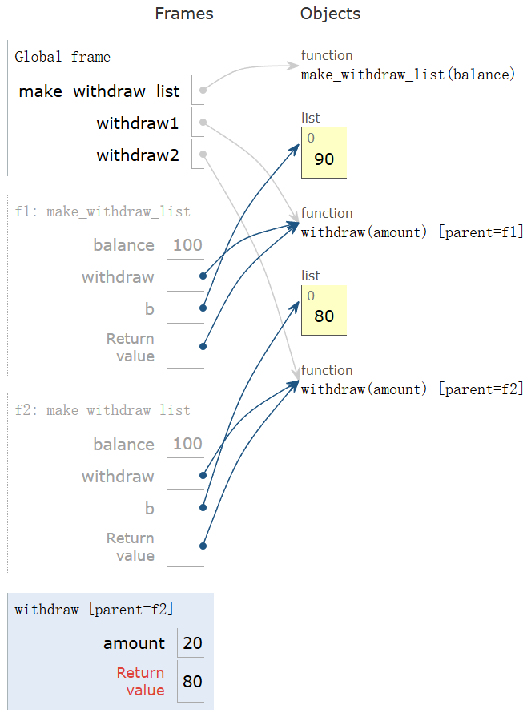{ width="400" }

## Iterators

A container can provide an iterator that provides access to its elements in some order.

`iter(<iterable>)`: Return an iterator over the elements of an iterable value.

`next(<iterator>)`: Return the next element in an iterator.

When `next` is called on an iterator which has reached the end, an error will occur.

```python
>>> s = [1, 2, 3, 4, 5]
>>> t = iter(s)
>>> next(t)
1
>>> next(t)
2
>>> list(t)
[3, 4, 5]
```

### For Statements

For statement can iterate over iterators.

```python
>>> r = range(3, 6)
>>> ri = iter(r)
>>> for i in ri:
...     print(i)
... 
3
4
5
```

### Built-In Iterator Functions

Many built-in Python sequence operations return iterators that compute results **lazily**.

|Name|Depict|
|---|---|
|`map(func, iterable)`|Iterate over `func(x)` for `x` in `iterable`|
|`filter(func, iterable)`|Iterate over `x` in iterable if `func(x)` is `True`|
|`zip(first_iter, second_iter)`|Iterate over co-indexed `(x, y)` pairs|
|`reversed(sequence)`|Iterate over `x` in a sequence in reverse order|

To view the contents of an iterator, place the resulting elements into a container. We can use `list(iterable)`, `tuple(iterable)` or `sorted(iterable)`.

### Zip

If one iterator is longer than the other, `zip` only iterated over matches and skips extras.

```python
>>> list(zip([1, 2], [3, 4, 5]))
[(1, 3), (2, 4)]
```

More than two iterables can be passed to `zip`.

```python
>>> list(zip([1, 2], [3, 4, 5], [6, 7]))
[(1, 3, 6), (2, 4, 7)]
```

## Generators

A generator is a special kind of iterator. It is returned from a generator function.

### Generator Function

A generator function is a function that **yields** values instead of returning them. That computation will be executed **lazily**.

```python
def pos_neg(x):
    yield x
    yield -x

t = pos_neg(3)  # <generator object pos_neg ...>
next(t)  # 3
next(t)  # -3
```

### Generators &  Iterators

A `yield from` statement yields all values from an iterator or iterable (*Python 3.3*).

```python
def a_then_b(a, b):
    yield from a
    yield from b

list(a_then_b([3, 4], [5, 6]))  # [3, 4, 5, 6]

def countdown(k):
    if k > 0:
        yield k
        yield from countdown(k - 1)

list(countdown(3))  # [3, 2, 1]
```

### Example: Partitions

```python
def partitions(n, m):
    if n > 0 and m > 0:
        if n == m:
            yield str(m)
        for p in partitions(n - m, m):
            yield p + " + " + str(m)
        yield from partitions(m, m - 1)
```

## Objects

### Class Statements: the Account Class

```python
class Account:
    def __init__(self, account_holder):
        self.balance = 0
        self.holder = account_holder
    
    def deposit(self, amount):
        self.balance =  self.balance + amount
        return self.balance
    
    def withdraw(self, amount):
        if amount > self.balance:
            return "Insufficient funds"
        self.balance -= amount
        return self.balance
```

`__init__` is the constructor of a class.

### Creating Instances

When a class is called:

1. A new instance of that class is created.
2. The `__init__` method of the class is called with the new object as its first argument (named `self`), along with any additional arguments provided in the call expression.

Any attribute can be assigned any value. A new attribute can be added at **any time**.

Binding an object to a new name using assignment does not create a new object.

### Methods

#### Invoking Methods

All invoked methods have access to the object via the self parameter, and so they can all access and manipulate the object's attribute. Dot notation automatically supplies the first argument to a method.

## Attributes

### Attribute Lookup

Both instances and classes have attributes that can be looked up by dot expressions: `<expression>.<name>`.

To evaluate a dot expression:

1. Evaluate the `<expression>` to the left of the dot, which yields the object of the dot expression.
2. `<name>` is matched against the instance attributes of that object; if an attribute with that name exists, its value is returned.
3. If not, `<name>` is looked up in the class, which yields a class attribute value.
4. That value is returned unless it is a function, in which case a bound method is returned instead.

Using `getattr`, we can look up an attribute using a string.

```python
>>> getattr(tom_account, 'balance')
10
>>> hasattr(tom_account, 'deposit')
True
```

### Class Attributes

```python
class <name>:
    <suite>
```

A class statement creates a new class and binds that class to `<name>` in the first frame of the current environment.

Assignment & def statements in `<suite>` create attributes of the class (not names in frames).

Class attributes are shares across all instance of class because they are attributes of the class, not the instance.

```python
class Account:
    interest = 0.02  ## A class attribute
    ...

tom_account = Account("Tom")
tom_account.interest  # 0.02
```

Here the `interest` attribute is not part of the instance: it's part of the class. It's just the lookup procedure that gives us access to it.

### Bound Methods

Terminology:

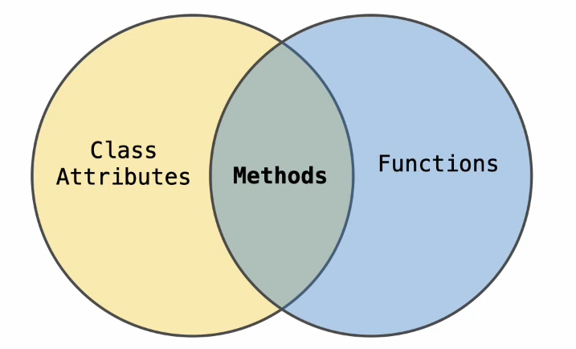{ width="300" }

Functions and bound methods are both objects. Dot expressions evaluate to bound methods for class attributes that are functions.

Python distinguishes between functions and bound methods.

```python
>>> type(Account.deposit)
<class 'function'>
>>> type(tom_account.deposit)
<class 'method'>

>>> Account.deposit(tom_account, 100)
100
>>> tom_account.deposit(100)
200
```

### Attribute Assignment

Assignment statements with a dot expression on their left-hand side affect attributes for the object of that dot expression.

- If the object is an instance, then assignment sets an instance attribute.
- If the object is a class, then assignment sets a class attribute.

```python
class Account:
    interest = 0.02
    ...

tom_account = Account('Tom')
```

Class attribute assignment: `Account.interest = 0.04`

Instance attribute assignment: `tom_account.interest = 0.08`

The name `interest` is not looked up in the object. Instead of going find it in the class, it just directly assigned to the attribute of the object.

Attribute assignment statement adds or modifies the attribute `interest` of `tom_account`.

Instance attributes and class attributes are totally independent in case of attribute assignment. They just relate to each other in attribute lookup.

## Inheritance

Syntax:

```python
class <name>(<base class>):
    <suite>
```

### Inheritance example

```python
>>> ch =CheckingAccount('Tom')
>>> ch.interest  # Lower interest rate
0.01
>>> ch.deposit(20)  # Deposits are the same
20
>>> ch.withdraw(5)  # Withdrawals incur a $1 fee
14
```

Since we are looking the name `withdraw` on a class in the implementation of `withdraw` as opposed to on an instance, we will not get a bound method back. We have to supply the `self` ourselves.

```python
class CheckingAccount(Account):
    withdraw_fee = 1
    interest = 0.01

    def withdraw(self, amount):
        return Account.withdraw(self, amount + self.withdraw_fee)
```

### Looking up Attribute Names on Classes

Base class attributes **aren't copied** into subclasses.

To look up a name in a class:

1. If it names an attribute in the class, return the attribute value.
2. Otherwise, look up the name in the base class, if there is one.

#### A Complicated Example

```python
class A:
    z = -1
    def f (self, x):
        return B(x - 1)

class B(A):
    n = 4
    def __init__(self, y):
        if y:
            self.z = self.f(y)
        else:
            self.z = C(y + 1)

class C(B):
    sef f(self, x):
    return x
```

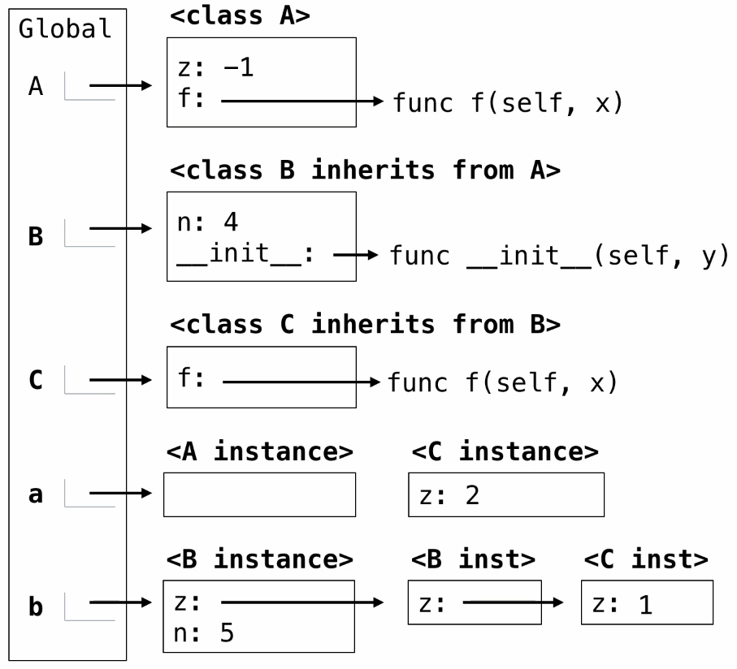{ width="360" }

```python
>>> a = A()
>>> b = B(1)
>>> b.n = 5
>>> C(2).n
4
>>> a.z == C.z
True
>>> a.z == b.z
False
```

### Multiple Inheritance

```python
class SavingAccount(Account):
    deposit_fee = 2

    def deposit(self, amount):
        return Account.deposit(self, amount - self.deposit_fee)
```

CleverBank marketing executive wants:

- Low interest rate of 1%
- A $1 fee for withdrawals
- A $2 fee for deposits
- A free dollar when you open your account

```python
class AsSeenOnTVAccount(CheckingAccount, SavingAccount):
    def __init__(self, account_holder):
        self.holder = account_holder
        self.balance = 1
```

## Representation

### String Representations

In Python, all objects produce two string representations:

- The `str` is legible to humans.
- The `repr` is legible to the Python interpreter.

The `repr` function returns a Python expression that evaluates to an equal object.

`repr(object) -> string`: Return the canonical string representation of the object.
For most object types, `eval(repr(object)) == object`.

The result of calling `repr` on a value is what Python prints in an interactive session.

```python
>>> 12e3
12000.0
>>>print(repr(12e3))
12000.0
```

Some objects do not have a simple Python-readable string.

```python
>>> repr(min)
'<built-in function min>'
```

The result of calling `str` on teh value of an expression is waht Python prints using `print` function:

```python
>>> from fractions import Fraction
>>> half = Fraction(1, 2)
'Fraction(1, 2)'
>>> str(half)
'1/2'
>>> print(half)
1/2
```

### String Interpolation

String interpolation involves evaluating a string literal that contains expressions. Sub-expressions in an f-string are evaluated in the current environment.

```python
>>> f'pi starts with {pi}...'
'pi starts with 3.141592653589793...'
```

The result of evaluating an f-string expression is the str string of the values of the sub-expressions.

```python
>>> repr(half * half)
'Fraction(1, 4)'
>>> f'{half * half}'
'1/4'
```

### Polymorphic Functions

Polymorphic function: A function that applies to many (*poly*) different forms (*morph*) of data.

`str` and `repr` are both polymorphic.
`repr` invokes a zero-argument method `__repr__` on its argument. `str` invokes a zero-argument method `__str__` on its argument.

```python
>>> half.__repr__()
'Fraction(1, 2)'
>>> half.__str__()
'1/2'
```

The behavior of `repr` is slightly more complicated than invoking `__repr__` on its argument:

- An instance attribute called `__repr__` is ignored.
- Only class attributes are found.

```python
def repr(x):
    return type(x).__repr__(x)
```

The behavior of `str` is also complicated:

- An instance attribute called `__str__` is ignored.
- If no `__str__` attribute is found, uses repr string.

#### Interface

Message passing: Objects interact by looking up attributes on each other.

The attribute look-up rules allow different data types to respond to the same message. A shared message (attribute name) that elicits similar behavior from different data types is called an interface, along with the its expected behavior.

```python
class Ratio:
    def __init__(self, n, d):
        self.numer = n
        self.denom = d

    def __repr__(self):
        return "Ratio({0}, {1})".format(self.numer, self.denom)

    def __str__(self):
        return "{0}/{1}".format(self.numer, self.denom)
```

```python
>>> half = Ratio(1, 2)
>>> print(half)
1/2
>>> half
Ratio(1, 2)
```

### Special Method Names

Special method names are used to implement the behavior of built-in functions and operators. These names always start and end with double underscores.

|Names|Behaviors|
|---|---|
|`__init__`| Method invoked automatically when an object is constructed.|
|`__repr__`| Method invoked to display an object as a Python expression.|
|`__str__`| Method invoked to display an object as a string.|
|`__add__`| Method invoked to add one object to another.|
|`__bool__`| Method invoked to convert an object to a boolean value.|

```python
>>> a, b = 1, 2
>>> a.__add__(b)
3
>>> a.__bool__()
True
```

Extend the `Ratio` class:

```python
class Ratio:
    def __init__(self, n, d):
        self.numer = n
        self.denom = d

    def __repr__(self):
        return "Ratio({0}, {1})".format(self.numer, self.denom)

    def __str__(self):
        return "{0}/{1}".format(self.numer, self.denom)

    def __add__(self, other):
        if isinstance(other, int):
            n = self.numer + other * self.denom
            d = self.denom
        elif isinstance(other, Ratio):
            n = self.numer * other.denom + other.numer * self.denom
            d = self.denom * other.denom
        elif isinstance(other, float):
            return float(self) + other
        g = gcd(n, d)
        return Ratio(n // g, d // g)

    __radd__ = __add__

    def __float__(self):
        return self.numer / self.denom
```

`isinstance`: Returns whether an object is an instance of a class or a subclass thereof.


## Efficiency

### Measuring Efficiency

```python
def count(f):
    def counted(*args, **kwargs):
        counted.count += 1
        return f(*args, **kwargs)

    counted.count = 0
    return counted
```

About `counted.count`:

- In Python, functions are first-class objects, meaning they can have attributes.
- `counted` is a closure and `counted.count` is not a variable captured by the closure. Instead, it is an attribute of the `counted` function itself, so it can be accessed as `counted.count` outside the function.

### Memoization

```python
def memoize(f):
    cache = {}
    def memoized(*args):
        if args not in cache:
            cache[args] = f(*args)
        return cache[args]
    return memoized
```

## Scheme

Scheme is a minimalist dialect of the Lisp programming language.

### Scheme Fundamentals

Scheme programs consist of expressions, which can be:

- Primitive expressions: 2, 3.3, true, +, quotient, etc.
- Combinations: (quotient 10 2), (not true), etc.

Numbers are self-evaluating; symbols are bound to values.

Call expressions include an operator and 0 or more operands in the parentheses.

Combinations can span multiple lines, and indentation doesn't matter.

```scheme
> (quotient 10 2)
5
> (+ (* 3
        (+ (* 2 4)
           (+ 3 5)))
     (+ (- 10 7)
        6))
26
> (+ 1 2 3 4)
10
> (+)
0
> +
##[+]
> (number? 3)
##t
> (zero? 0)
##t
```

### Special Forms

A combination that is not a call expression is a special form:

- **If** expressions: `(if <predicate> <consequent> <alternative>)`
- **And** and **or**: `(and <e1> <e2> ...)`, `(or <e1> <e2> ...)`
- Binding symbols: `(define <symbol> <expression>)`
- New procedures: `(define (<symbol> <formal-parameters>) <body>)`

```scheme
> (define (square x) (* x x))
> (square 5)
25
> (define (sqrt x)
    (define (update guess)
      (if (= (square guess) x)
          guess
          (update (/ (+ guess (/ x guess)) 2))))
    (update 1))
> (sqrt 9)
3
```

The `cond` special form that behaves like `if-elif-else` statements in Python:

```scheme
(cond ((> x 0) 'positive)
      ((< x 0) 'negative)
      (else 'zero))
```

The `begin` special form allows multiple expressions to be evaluated in sequence:

```scheme
(begin
  (define x 10)
  (define y 20)
  (+ x y))
```

The `let` special form binds symbols to values temporatily; just for one expression:

```scheme
(let ((x 10)
      (y 20))
  (+ x y))
```

### Lambda Expressions

Lambda expressions evaluate to anonymous procedures.

```scheme
(lambda (<formal-parameters>) <body>)
```

Two equivalent expressions:

```scheme
(define (plus4 x) (+ x 4))
(define plus4 (lambda (x) (+ x 4)))
```

### Example: Sierpinski's Triangle

```scheme
(define (line) (fd 50))
(define (twice fn) (fn) (fn))
(define (repeat k fn)
  (fn)
  (if (> k 1) (repeat (- k 1) fn)))
(define (tri fn)
  (repeat 3 (lambda () (fn) (lt 120))))
(define (sierpinski d k)
  (tri (lambda () (if (= d 1) (fd k) (leg d k)))))
(define (leg d k)
  (sierpinski (- d 1) (/ k 2))
  (penup) (fd k) (pendown))
(sierpinski 5 200)
```

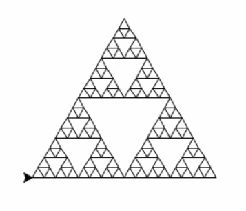{ width="200" }

## Scheme Lists

### Lists

Basic symbols in Scheme related to lists:

- `cons`: Two-argument procedure that creates a linked list
- `car`: Procedure that returns the first element of a list
- `cdr`: Procedure that returns the rest of a list
- `nil`: The empty list

Scheme lists are written in **parentheses with elements separated by spaces**.

```scheme
> (cons 1 (cons 2 nil))
(1 2)
> (define x (cons 1 (cons 2 nil)))
> x
(1 2)
> (car x)
1
> (cdr x)
(2)
> (cons (cons 3 (cons 4 nil)) (cons 1 (cons 2 nil)))
((3 4) 1 2)
```

Some built in procedures related to lists:

- `(list? s)`: test if s is a list
- `(null? s)`: test if s is an empty list
- `(list e1 e2 ...)`: build a list with the provided elements

### Symbolic Programming

Symbols normally refer to values, while quotation is used to refer to symbols directly in Lisp.

```scheme
> (define a 1)
> (define b 2)
> (list 'a 'b)
(a b)
```

The quote is actually shorthand for a special form called quote: `'a` is short for `(quote a)` and `'b` is short for `(quote b)`.

Quotation can also be applied to combinations to form lists.

```scheme
> '(a b c)
(a b c)
> (car '(a b c))
a
```

We can refer to a symbol even before it have been defined.

### Built-in List Processing Procedures

- `(append s t)`: list the elements of `s` and `t`; `append` can be called on more than 2 lists
- `(map f s)`: call a procedure `f` on each element of a list `s` and list the results
- `(filter f s)`: call a procedure `f` on each element of a list `s` and list the elements for which a true value is the result
- `(apply f s)`: call a procedure `f` with the elements of a list as its arguments

```scheme
> (map (lambda (s) (cons 5 s)) (filter list? `(5 (6 7))))
((5 6 7))
> (apply + `(1 2 3 4))
10
```

### Example: Even Subsets

Definition: a non-empty subset of a list s is a list containing some of the elements of s.

```scheme
;;; none-empty subsets of integer list s that have an even sum
;;; scm> (even-subsets `(3 4 5 7))
;;; ((5 7) (4 5 7) (4) (3 7) (3 5) (3 4 7) (3 4 5))
(define (even-subsets s) 
  (if (null? s) nil
    (append (even-subsets (cdr s))
            (subset-helper even? s))))

;;; none-empty subsets of integer list s that have an odd sum
(define (odd-subsets s) 
  (if (null? s) nil
    (append (odd-subsets (cdr s))
            (subset-helper odd? s))))

(define (subset-helper f s)
  (append (map (lambda (t) (cons (car s) t))
               (if (f (car s))
                   (even-subsets (cdr s))
                   (odd-subsets (cdr s))))
          (if (f car s)
              (list (list (cdr s)))
              nil)))
```

### Discussion Question: Even Subsets Using Filter

```scheme
;;; non-empty subsets of s
(define (nonempty-subsets s)
  (if (null? s) 
      nil
      (let ((rest (nonempty-subsets (cdr s))))
           (append rest
                   (map (lambda (t) (cons (car s) t))
                        rest)
                   (list (list (car s)))))))

;;; non-empty subsets of integer list that have an even sum
(define (even-subsets s)
  (filter (lambda (s) (even? (apply + s)))
          (nonempty-subsets s)))
```
## Calculator

### Exceptions

#### Raise Statements

Python exceptions are raised with a **raise statement**: `raise <exception>`.

`<exception>` must evaluate to a **subclass** of `BaseException` or an **instance** of one.

Exception are constructed like any other object. 
E.g., `TypeError('Bad argument!')`.

Some built-in error types:
- `TypeError`: A function was passed the wrong number/type of argument.
- `NameError`: A name wasn't found.
- `KeyError`: A key wasn't found in a dictionary.
- `RecursionError`: Too many recursive calls.

These exceptions get raised automatically in certain cases and we can also raise them ourselves.

#### Try Statements

Try statement handle exceptions, which can prevent a program from terminating.

```python
try:
    <try suite>
except <exception class> as <name>:
    <except suite>
...
```

**Execution rule:**

- The `<try suite>` is executed first.
- If, during the course of executing the `<try suite>`,
an exception is raised that is not handled otherwise,
and if the class of the exception inherits from `<exception class>`,
then the `<except suite>` is executed,
with `<name>` bound to the exception.

### Example: Reduce

Reduce is an important higher-order function which is there to reduce a whole sequence of values to a single value.

There is a built-in version of reduce, but we can also write our own version.

```python
def reduce(f, s, initial): 
    for x in s:
        initial = f(initial, x)
    return initial
```

`f` is a two-argument function,
`s` is a sequence of values that can be the second argument,
`initial` is a value that can be the first argument.

With the `reduce` function, we can complement a `divide_all` function:

```python
def divide_all(n, ds):
    try:
        return reduce(truediv, ds, n)
    except ZeroDivisionError:
        return float('inf')
```

### Parsing

To interpret text as a programming language, we first need to parse that text into some structure that makes it easy to perform interpretation.

A parser takes text and returns an expression.

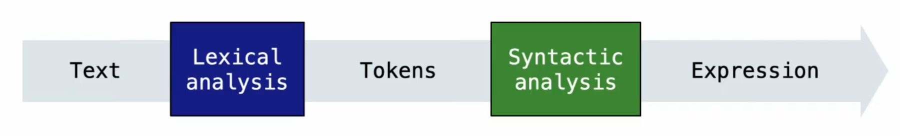{ width="500" }

Syntactic analysis identifies the hierarchical structure of an expression, which may be nested.

## SQL

### Databases

Database management systems (DBMS):

A table is a collection of records, which are rows that have a value for each column.

The Structured Query Language (SQL) is perhaps the most widely used programming language.

SQL is a **declarative programming language**.

#### Declarative Programming

In **declarative languages** such as SQL & Prolog:

- A "program" is a description of the desired result.
- The interpreter figures out how to generate the result.

In **imperative language** such as Python & Scheme:
- A "program" is a description of computational processes.
- The interpreter carries out execution/evaluation rules.

An example of an SQL query:

```sql
SELECT "West Coast" AS region, name FROM cities
  WHERE longitude >= 115
  ORDER BY latitude;
```

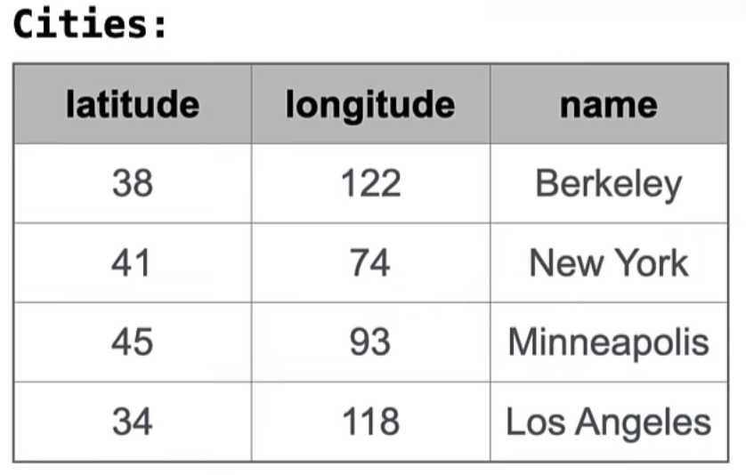{ width="280" }

The role of a query is to take an existing table, like the cities table above, and **build another table**.

In this case,
we'll create one that has "West Coast" as one of the values in each row,
along with the name of the city.

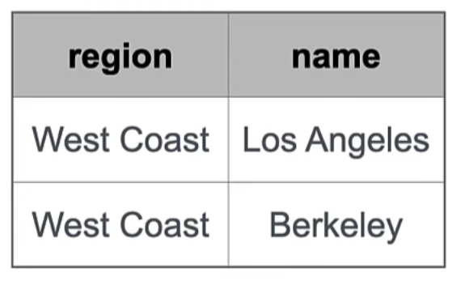{ width="190" }

### Structured Query Language

#### Selecting Value Literals

A `SELECT` statement always includes a comma-separated list of column descriptions.

A **column description** is an expression, optionally followed by `AS` and a column name:

```sql
SELECT [expressions] AS [name], [expression] AS [name], ...;
```

Selecting literals creates a one-row table.

The union of two select statements is a table containing the rows of both of their results.

```sql
SELECT "daisy" AS parent, "hank" AS child UNION
SELECT "ace"            , "bella"         UNION
SELECT "ace"            , "charlie"       UNION
SELECT "finn"           , "ace"           UNION
SELECT "finn"           , "dixie"         UNION
SELECT "finn"           , "ginger"        UNION
SELECT "ellie"          , "finn";
```

Notice that when we union together a bunch of select statements, we get no guarantees about the order of the result. That's up to the declarative programming engine, which tries to compute the results efficiently.

#### Naming Tables

The result of a `SELECT` statement is displayed to the user, but not stored.

A `CREATE TABLE` statement gives the result of a `SELECT` statement a name:

```sql
CREATE TABLE [name] AS [select statement];
```

So we can give the table we created before a name like this:

```sql
CREATE TABLE parents AS
  SELECT "daisy" AS parent, "hank" AS child UNION
  SELECT "ace"            , "bella"         UNION
  SELECT "ace"            , "charlie"       UNION
  SELECT "finn"           , "ace"           UNION
  SELECT "finn"           , "dixie"         UNION
  SELECT "finn"           , "ginger"        UNION
  SELECT "ellie"          , "finn";
```

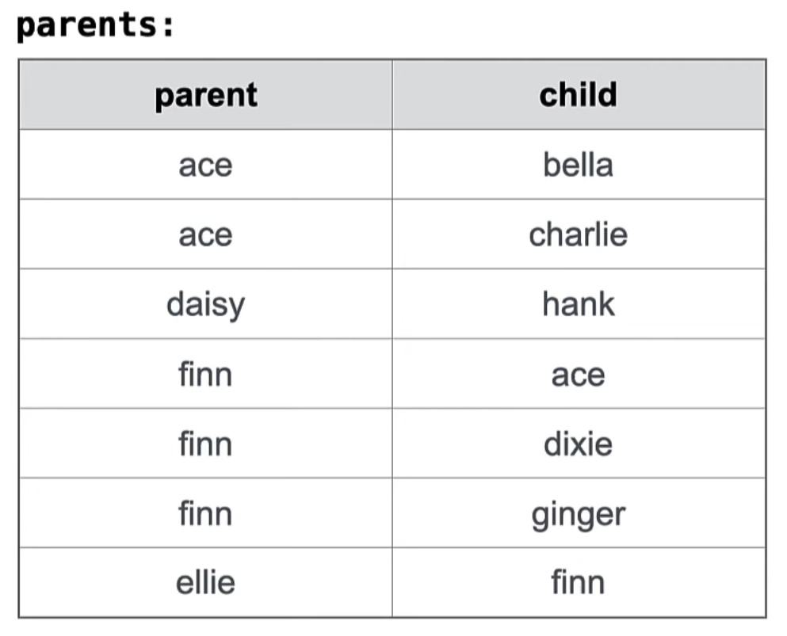{ width="320" }

### Projecting Tables

#### Select Statements Project Existing Tables

- A `SELECT` statement can specify an input table using a `FROM` clause.
- A subset of the rows of the input table can be selected using a `WHERE` clause.
- An ordering over the remaining rows can be declared using an `ORDERED BY` clause.

```sql
SELECT [columns] FROM [table] WHERE [condition] ORDERED BY [order];
```

- Column descriptions determine how each input row is projected to a result row:

```sql
[expressions] AS [name], [expression] AS [name], ...
```

### Arithmetic

#### Arithmetic in Select Expressions

In a select expression, column names evaluates to row values.

Arithmetic expressions can combine row values and constants.

```sql
CREATE TABLE lift AS
  SELECT 101 AS chair, 2 as single, 2 as couple UNION
  SELECT 102         , 0          , 3           UNION
  SELECT 103         , 4,         , 1;

SELECT chair, single + 2 * couple AS total FROM lift;
```

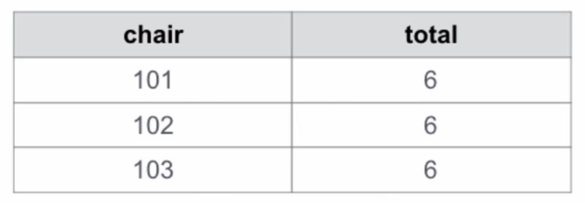{ width="270" }

## Tables

### Joining Tables

In order to consider multiple tables, we have to include something called a join.

Tables A & B are joined by a comma (or `JOIN`) to form all combos of a row from A & a row from B.

#### Joining Two Tables

Continue the dog breeder example before:

```sql
CREATE TABLE dogs AS
  SELECT "ace" AS name, "long" AS fur UNION
  SELECT "bella"      , "short"       UNION
  SELECT "charlie"    , "long"        UNION
  SELECT "daisy"      , "long"        UNION
  SELECT "ellie"      , "short"       UNION
  SELECT "finn"       , "curly"       UNION
  SELECT "ginger"     , "short"       UNION
  SELECT "hank"       , "curly";
```

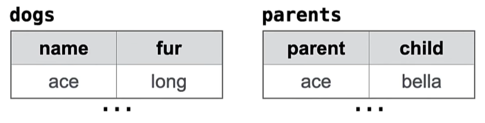{ width="360" }

Select the names of the parents of curly-furred dogs:

```sql
SELECT parent FROM parents, dogs
              WHERE child = name AND fur = "curly";
```

The statement `SELECT * FROM parents, dogs` will create a table consisting of all the pairs of rows from parents and dogs.

#### Implicit & Explicit Join Syntax

A join typically has some conditions for matching up the rows of two (or more) tables.

- Implicit syntax: Use a comma (or just `JOIN`) and put all conditions in the `WHERE` clause (like the example above).
- Explicit syntax: Use `FROM __ JOIN __ ON __` and put matching conditions after `ON`.

Rewrite the query above using explicit syntax:

```sql
SELECT parent FROM parents JOIN dogs ON child = name
              WHERE fur = "curly";
```

### Aliases and Dot Expressions

If two tables have the same column name, then we need a dot expression to distinguish which column we are talking about.

If two tables have the same name, then we need an alias to distinguish them.

These both occur when we join a table with itself.

#### Joining a Table with Itself

Two tables may share a column name; dot expressions and aliases disambiguate column values.

```sql
SELECT [column] FROM [table] WHERE [condition] ORDER BY [order];
```

`[table]` is a comma-separated list of table names with **optional aliases**.

Select all pairs of siblings:

```sql
SELECT a.child AS first, b.child AS second
  FROM parents AS a, parents AS b
  WHERE a.parent = b.parent AND a.child < b.child;
```

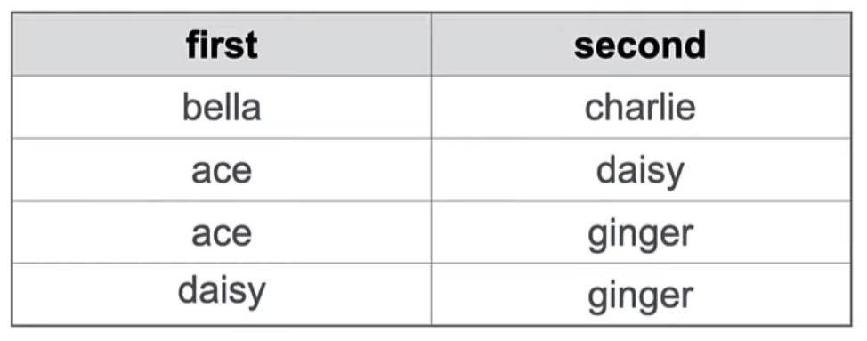{ width="320" }

#### Joining Multiple Tables

Multiple tables can be joined to yield all combinations of rows from each.

```sql
CREATE TABLE grandparents AS
  SELECT a.parent AS grandog, b.child AS granpup
    FROM parents AS a, parents AS b
    WHERE b.parent = a.child
```

Select all grandparents with the same fur as their grandchildren:

```sql
SELECT grandog FROM grandparents, dogs AS c, dogs AS d
               WHERE grandog = c.name AND
                     granpup = d.name AND
                     c.fur = d.fur;
```

### Numerical Expressions

Expressions can contain **function calls** and **arithmetic operators**, which can occur in any expression within a select statement.

- Combine values: `+`, `-`, `*`, `/`, `%`, `and`, `or`
- Transform values: `abs`, `round`, `not`, `-`
- Compare values: `<`, ,`<=`, `>`, `>=`, `<>`, `!=`, `=`

### String Expressions

String values can be combines to form longer strings through the **concatenation operator**:

```bash
sqlite> SELECT "hello," || " world";
hello, world
```

Basic string manipulation is built into SQL:

```sql
CREATE TABLE phrase AS
  SELECT "hello," || " world" AS s;
SELECT substr(s, 4, 2) || substr(s, instr(s, " ") + 1, 1) FROM phrase;
```

The statements above will get the string `low` as the result.

Strings can be used to represent structured values, but doing so is rarely a good idea:

```sql
CREATE TABLE lists AS
  SELECT "one" AS car, "two,three,four" AS cdr;
SELECT substr(cdr, 1, instr(cdr, ",") - 1) AS cadr FROM lists;
```

## Aggregation

### Aggregate Functions

We can perform aggregation over multiple rows using aggregate functions.

An aggregate function in the `[columns]` clause computes a value from a **group of rows**.

Here's a table of animals:

```sql
CREATE TABLE animals AS
  SELECT "dog" AS kind, 4 AS legs, 20 AS weight UNION
  SELECT "cat"        , 4        , 10           UNION
  SELECT "ferret"     , 4        , 10           UNION
  SELECT "parrot"     , 2        , 6            UNION
  SELECT "penguin"    , 2        , 10           UNION
  SELECT "t-rex"      , 2        , 12000;
```

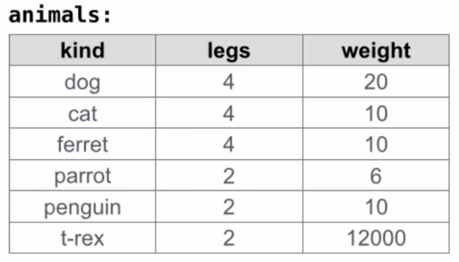{ width="310" }

```sql
SELECT max(legs) from animals;
```

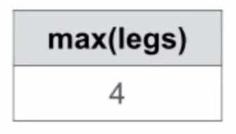{ width="103" }

More examples:

```bash
sqlite> select avg(legs) from animals;
3.0
sqlite> select count(legs) from animals;
6
sqlite> select count(kind) from animals;
6
sqlite> select count(*) from animals;
6
sqlite> select count(distinct legs) from animals;
2
sqlite> select sum(distinct weight) from animals;
12036
```

#### Mix Aggregate Functions and Single Values

An aggregate function also selects a row in the table, which may be meaningful:

```bash
>sqlite select max(weight), kind from animals;
12000|t-rex
```

Notice that if there are more than one things that have the maximum value, the answer will be ambiguous.

Some aggregations don't give us meaningful values, like `avg`:

```bash
sqlite> select avg(weight) from animals;
2009.33333333333|t-rex
```

### Groups

By default, all rows that are used to compute the final table,
meaning the ones that passed the filter in the where clause,
are all in the same group.
And so the result of an aggregate function only has one row.

#### Grouping Rows

Rows in a table can be grouped, and aggregation is **performed on each group** individually.

```sql
SELECT [columns] FROM [table] GROUP BY [expression] HAVING [expression];
```

The number of groups is the number of unique values of the expression placed after the `GROUP BY` clause.

```sql
SELECT legs, max(weight) FROM animals GROUP BY legs;
```

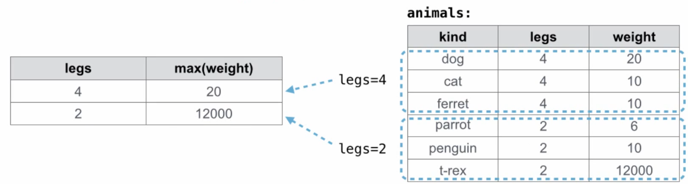{ width="700" }

A `HAVING` clause filters the set of groups that are aggregated:

```sql
SELECT weight / legs, count(*) FROM animals
  GROUP BY weight / legs
  HAVING count(*) > 1;
```

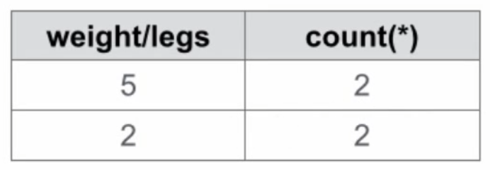{ width="230" }

## Databases

### Create Table and Drop Table

#### Create Table

`CREATE TABLE` expression syntax:

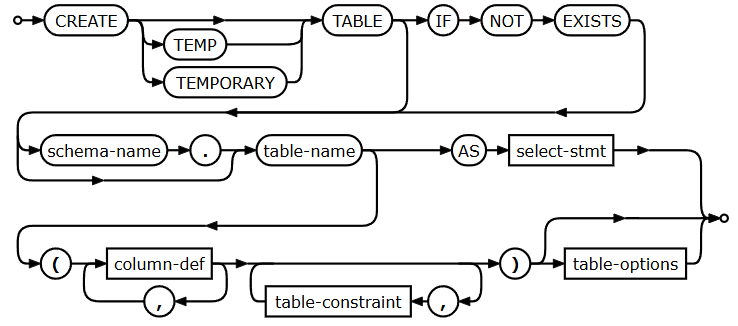{ width="600" }

`column-def`:

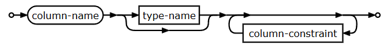{ width="550" }

`table-options`:

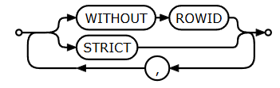{ width="260" }

Examples:

```sql
CREATE TABLE numbers (n, note);
CREATE TABLE numbers (n UNIQUE, note);
CREATE TABLE numbers (n, note DEFAULT "No comment");
```

### Drop Table

`DROP TABLE` expression syntax:

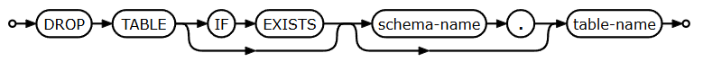{ width="680" }

If we run drop table on a name that doesn't exists without `IF EXISTS` clause,
we will reach an error.

### Modifying Tables

#### Insert

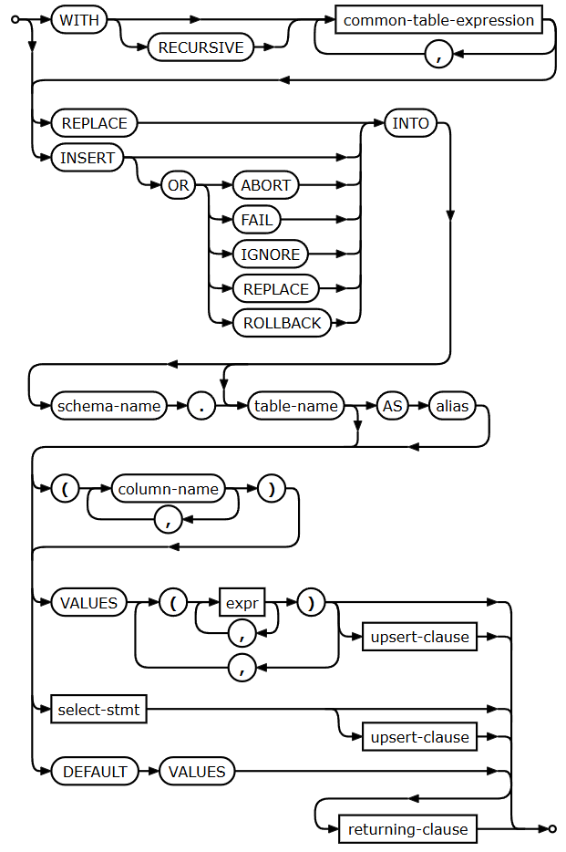{ width="500" }

For a table `t` with two columns...

- To inset into one column:  
`INSERT INTO t(column) VALUES (value);`
- To insert into both columns:  
`INSERT INTO ty VALUES (value0, value1);`

If we want to insert more rows then we can follow these parentheses by comma and more parenthetical row descriptions.

#### Update

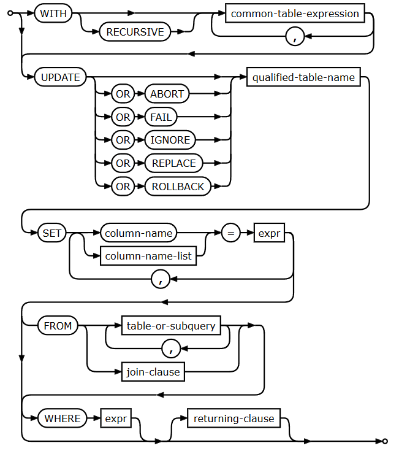{ width="500" }

Update sets all entries in certain columns to new values, just for some subset of rows.

The common usage of `UPDATE` statement:

```sql
UPDATE t SET c1 = v1, c2 = v2, ... WHERE ...;
```

#### Delete

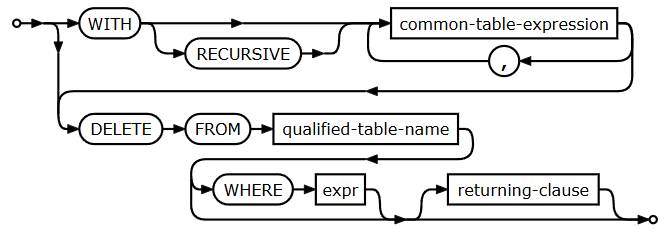{ width="500" }

`DELETE` remove some or all rows from a table.
