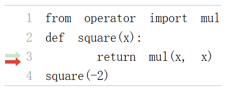
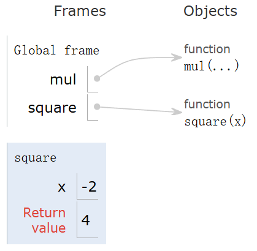
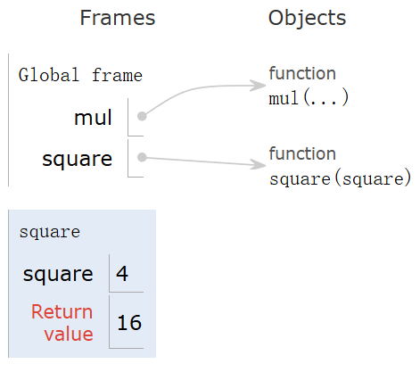
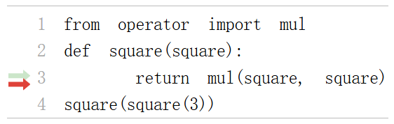
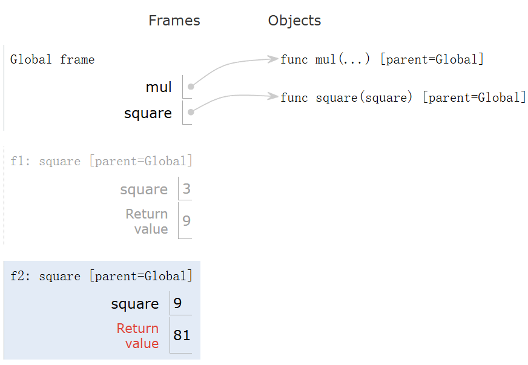
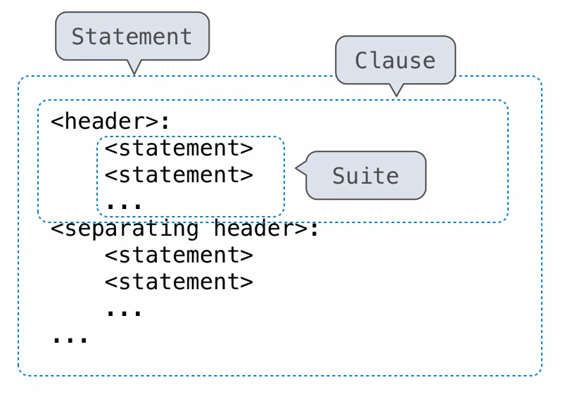

---
tags:
  - Python
---

# Functions and Control

## Functions

### Call Expressions

```python
add(1 + 1, 3)
```

- `add` - operator
- `1+1, 3` - operand

### Names, Assignment, and User-Defined Functions

Bind names to values:

- Import statement
- Assignment statement
- Def statement

Assignment statements can be used to bind name to functions:

```shell
>>> f = max
>>> f
<built-in function max>
```

Now `f` and `max` are both name to the same function.

We can also change what the name `max` means,

```shell
>>> max = 7
>>> f(1, 2, max)
7
```

There are names for common infix operators, which is in the `operator` module.
E.g.: `from operator import add, mul`.

Type of Expressions:

- Primitive expressions:
  - Number or numeral
  - Name
  - String
- Call expressions

### Environment Diagrams

Environment diagrams visualize the interpreter's process.
We can use the Online Python Tutor to do this automatically.

Execution rule for assignment statement:

1. Evaluate all expressions to the right of = from left to right
2. Bind all names to the left to = to the resulting values in the current frame.

```shell
>>> a = 1
>>> b = 2
>>> b, a = a + b, b
>>> a
2
>>> b
3
```

### Defining Functions

```python
def <name>(<formal parameters>):
    return <return expression>
```

Function signature: `<name>(<formal parameters>)`

Execution procedure for def statement:

1. Create a function with signature `<name>(<formal parameters>)`
2. Set the body of that function to be everything indented after the first line
3. Bind `<name>` to that function in the current frame

Procedure for calling/applying user-defined functions:

1. Add a local frame, forming a new environment
2. Bind the function's formal parameters to its arguments in that frame
3. Execute the body of the function in that new environment

{ width="280" }

{ width="250" }

A function signature has all the information needed to create a local frame.

An environment is a sequence of frames.
A name evaluates to the value bound to that name in the earliest frame of the current environment in which that name is found.
E.g., to look up some name in the body of a function:

1. Look up that name in the local frame
2. If not found, look for it in the global frame

A more complicated example:

```shell
>>> from operator import mul
>>> def square(square):
...    return mul(square, square)
...
>>> square
<function square at ...>
>>> square(4)
16
```

{ width="250" }

### Print and None

#### None

```shell
>>> -2
-2
>>> print(-2)
-2
>>> 'Hello World!'
'Hello World!'
>>> print('Hello World')
Hello World!
>>> None
>>> print(None)
None
>>> print(print(1), print(2))
1
2
None None
```

A special value `None` represents nothing in Python.
A function that does not explicitly return a value will return `None`.
Careful: None is not displayed by the interpreter as the value of an expression.

### Pure Functions & None-Pure Functions

- Pure functions: just return values (abs, pow)
- None-pure functions: have side effects (print)

## Control

### Multiple Environments

{ width="280" }

{ width="460" }

An environment is a sequence of frames.
In the case above, there's 3 environments.

- The global frame
- f1, followed by the global frame
- f2, followed by the global frame

Names has no meanings without these environments.

### Miscellaneous Python Features

#### Division

There are two kinds of division:

- True division, `/`
- Integer division, `//`

These have corresponding functions in the `operator` module:

- `truediv`
- `floordiv`

And `%` gives the remainder of division. The corresponding function is `mod`.

#### Return Multiple Values from a Function

```shell
>>> def divide_exact(n, d):
... return n//d, n%d
...
>>> quotient, remainder = divide_exact(2013, 10)
>>> quotient
2013
>>> remainder
3
```

#### Interactive Mode

```shell
python3 -i *.py
```

#### Doc Test

It is suggested to use cap letters to refer to the formal parameters in comments.

```python
def divide_exact(n, k):
    """Return the quotient and remainder of dividing N by D.

    >>> q, r = divide_exact(2013, 10)
    >>> q
    201
    >>> r
    3
    """
    return q // r, q % r
```

Then we can type `python3 -m doctest test.py` in the terminal to test  the code. If everything does what it is supposed to do, we will see no output.
If we want to see more information, we can use `python3 -m doctest -v test.py`, which will tell us everything that happen.

#### Default Values

```python
def <function name>(<formal parameter> = <default value>)
```

### Conditional Statements

Compound statements have a structure like this:

{ width="370" }

The first statements determines a statement's type. The header of a clause 'controls' the suite that follows. Def statements are compound statements.

```python
if <condition>:
    ...
elif <condition>:
    ...
else:
    ...
```

There can be zero or one 'else' clause in the end.

#### Boolean Context

False values in python:

- `False`
- `0`
- Empty string
- `None`

### Iteration

#### While Statement

```python
while <condition>:
    ...
```
