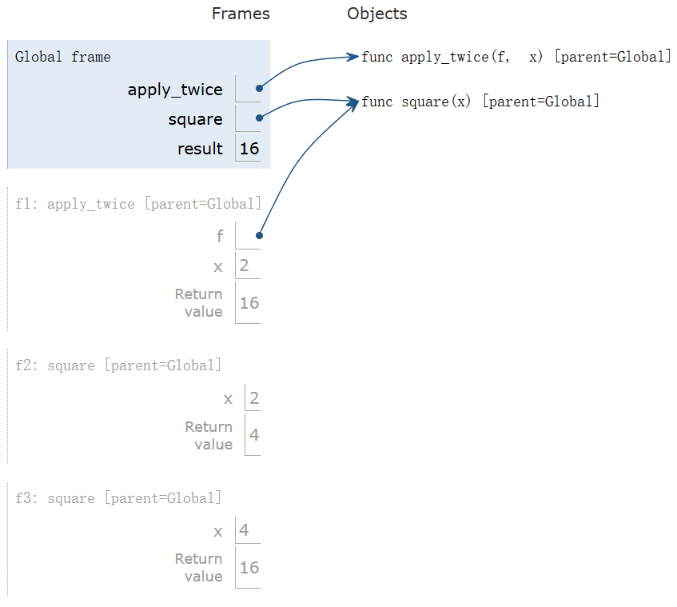
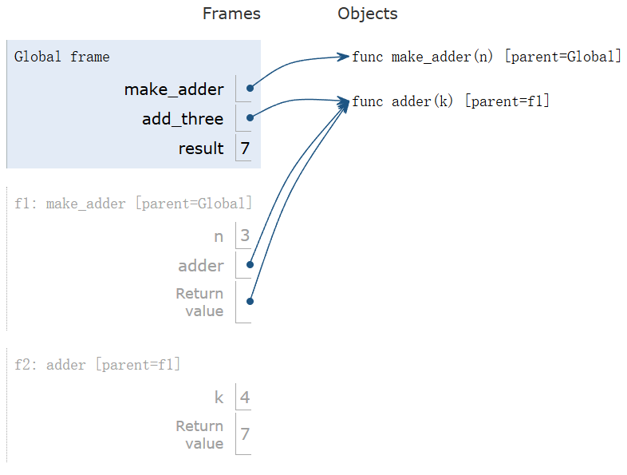

---
tags:
  - Python
---

# Higher-Order Functions and Functional Abstraction

## Higher-Order Functions

### Control Expressions

#### Logical Operators

The logical operators exhibit a behavior called 'short-circuiting'.

To evaluate the expressions `<left> and <right>`:

1. Evaluate `<left>`
2. If the result is a false value `v`, then the expression evaluates to `v`
3. Otherwise, the expression evaluates to `<right>`

To evaluates the expression `<left> or <right>`:

1. Evaluate `<left>`
2. If the result is a true value `v`, then the expression evaluates to `v`
3. Otherwise, the expression evaluates to `<right>`

Python's and and or operators short-circuit. That is, they don't necessarily evaluate every operand.

| Operator | Checks if:                 | Evaluates from left to right up to: | Example                              |
| -------- | -------------------------- | ----------------------------------- | ------------------------------------ |
| `and`    | All values are true        | The first false value               | `False and 1 / 0` evaluates to False |
| `or`     | At least one value is true | The first true value                | `True or 1 / 0` evaluates to True    |

#### Assertion

E.g.:

```python
assert 3 > 2, 'Math is broken.'
assert 2 > 3, 'That is false.'
```

### Higher-Order Functions

E.g.:

```python
from math import pi, sqrt

def area(r, shape_constant):
    assert r > 0, 'A length must ne positive.'
    return r * r *shape_constant

def area_square(r):
    return area(r, 1)

def area_circle(r):
    return area(r, pi)

def area_hexagon(r):
    return area(r, 3 * sqrt(3) / 2)
```

A formal parameter can be bound to a function, so we can pass a function to a function as its argument.

### Functions as Return Values

```python
def make_adder(n):
    """

    >>> add3 = make_adder(3)
    >>> add3(4)
    7
    """
    def adder(k):
        return n + k
    return adder
```

We can also use `make_adder(2000)(13)` to get `2013`.

## Environments

### Environments for Higher-Order Functions

Higher-Order function: A function that takes a function as an argument value or return a function as a return value.

```python
def apply_twice(f, x):
    return f(f(x))

def square(x):
    return x * x

result = apply_twice(square, 2)
```

{ width="500" }

### Environments for Nested-Definitions

E.g.:

```python
def make_adder(n):
    def adder(k):
        return k + n
    return adder

add_three = make_adder(3)
result = add_three(4)
```

{ width="500" }

Every user-defined function has a parent frame(often global).
The parent of a function is the frame in which it was defined.

Every local frame has a parent frame(often global).
The parent of a frame is the parent of the function called.

### Local Names

```python
def f(x, y):
    return g(x)

def g(a):
    return a + y

result = f(1, 2)
```

This will cause an error, because the name `y` cannot be found in the global frame.

### Function Composition

```python
def make_adder(n):
    def adder(k):
        return n + k
    return adder

def square(x):
    return x * x

def triple(x):
    return 3 * x

def compose1(f, g):
    def h(x):
        return f(g(x))
    return h

squiple = compose1(square, triple)
squiple(5)  # Evaluates to 225

tripare = compose1(triple, square)
tripare(5)  # Evaluates to 75

squadder = compose1(square, make_adder(2))
squadder(3)  # Evaluates to 25
compose1(square, make_adder(2))  # The same as above
```

### Lambda Expressions

```python
square = lambda x: x * x
square(10)  # Evaluates to 100
```

### Function Currying

Currying: Transforming a multi-argument function into a single-argument, higher-order function.

```python
def curry2(f):
    def g(x):
        def h(y):
            return f(x, y)
        return h
    return g

curry2(add)(2)(3)  # Evaluates to 5
```

We can also write it like this:

```python
curry2 = lambda f: lambda x: lambda y: f(x, y)
```

## Functional Abstraction

### Lambda Function Environments

```python
a = 1

def f(g):
    a = 2
    return lambda y: a * g(y)

print(f(lambda y: a + y)(a))  # Evaluates to 4
```

### Return

A return statement completes the evaluation of a call expression and provides its value.

```python
def end(n, d):
    """Print the final digits of N in reverse order until D is found.

    >>> end (34567, 5)
    7
    6
    5
    """
    while n > 0:
        last, n = n % 10, n // 10
        print(last)
        if d == last:
            return None
```

A more complicated example:

```python
def square(x):
    return x * x

def search(f):
    x = 0
    while not f(x):
        x += 1
    return x

def inverse(f):
    ## Return g such that g(f(x)) -> x.
    return lambda y: search(lambda x: f(x) == y)

sqrt = inverse(square)
sqrt(256)  # Evaluates to 16
```

### Abstraction

- Function abstraction
- Choosing names for functions
- Which values deserve a name
  - Repeat compound expressions
  - Meaningful parts of complex expressions

### Errors and Tracebacks

Errors:

- Syntax errors
- Runtime errors -> Tracebacks
- Logical or behavior errors

## Function Examples

### Decorators

```python
def trace(fn):
    """Returns a version of fn that first prints before it is called.

    fn - a function of 1 argument
    """
    def traced(x):
        print('Calling', fn, 'on argument', x)
        return fn(x)
    return traced

@trace
def square(x):
    return x * x
```

When we call `square(12)`, we will get the output below:

```shell
Calling <function square at 0x...> on argument 12
```

It is identical to this:

```python
def square(x):
    return x * x
square = trace(square)
```

### Project - Hog: Arbitrary Positional Arguments

Instead of listing formal parameters for a function, we can write `*args`, which represents all of the arguments that get passed into the function.

```python
def printed(f):
    def print_and_return(*args):
        result = f(*args)
        print('Result:', result)
        return result
    return print_and_return
```
