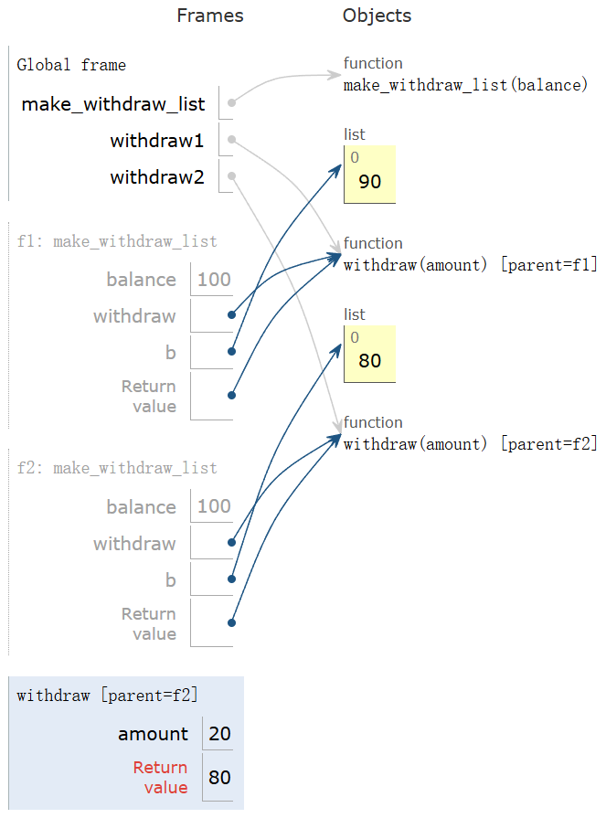

---
tags:
  - Python
---

# Mutability, Iterators, and Generators

## Mutability

### Objects

Object consist of data and behavior, bundled together to create abstractions.
A type of object is called a class; classed are first-class values in Python.
In Python, every value is an object and all objects have attributes.

### Example: Strings

```python
s = "Hello"
s.upper()  # "HELLO"
s.lower()  # "hello"
s.swapcase()  # "hELLO"
```

#### Representing Strings: the ASCII Standard

```python
a = 'A'
ord(a)  # 65
hex(ord(a))  # '0x41'
```

#### Representing Strings: the Unicode Standard

- Supports bidirectional display order
- A canonical name for every character
  - `U+0058`: LATIN CAPITAL LETTER X
  - `U+263a`: WHITE SMILING FACE
  - `U+2639`: WHITE FROWNING FACE

```python
>>> from unicodedata import name, lookup
>>> name('A')
'LATIN CAPITAL LETTER A'
>>> lookup('WHITE SMILING FACE')
'☺'
>>>lookup('WHITE SMILING FACE').encode()
b'\xe2\x98\xba'
```

### Mutation Operations

The same object can change in value throughout the course of computation. Only objects of mutable types can change.

```python
>>> L = [1, 2, 3]
>>> L.pop()
3
>>> L.remove(2)
>>> L
[1]
>>> L.extend([4, 5])
>>> L
[1, 4, 5]
>>> L[0:2] = [1, 2, 3, 4]
>>> L
[1, 2, 3, 4, 5]
```

```python
>>> numerals = {'I': 1, 'V': 5, 'X': 10}
>>> numerals['L'] = 50
>>> numerals
{'I': 1, 'V': 5, 'X': 10, 'L': 50}
>>> numerals.pop('X')
10
>>> numerals.get('X')
```

Mutation can happen within a function call.
A function can change the value of any object in its scope.

```python
L = [1, 2, 3, 4]

def func():
    L[2:] = []

func()
print(L)  # The output is [1, 2]
```

### Tuples

Tuples are **immutable sequences**.

```python
>>> (1, 2, 3, 4)
(1, 2, 3, 4)
>>> 1, 2, 3, 4
(1, 2, 3, 4)
>>> ()
()
>>> tuple()
()
>>> tuple([1, 2])
(1, 2)
>>> 2,
(2,)
>>> (3, 4) + (5, 6)
(3, 4, 5, 6)
>>> 5 in (3, 4, 5)
True
>>> (1, 2, 3)[1:]
(2, 3)
```

Tuples are immutable values, so they can be used as keys in a dictionary.

```python
>>> {(1, 2): 3}
{(1, 2): 3}
>>> {(1, [2]): 3}
Traceback (most recent call last):
  File "<stdin>", line 1, in <module>
TypeError: unhashable type: 'list'
```

Immutable values are **protected** from mutation.

```python
a = 1, 2, 3
s = "abc"

def func():
    a = 4, 5, 6
    s = "def"

func()
print(a, s)  # The output is: (1, 2, 3) abc
```

The value of an expression can change because of changes in names or objects.

- Name change:

  ```python
  x = 1
  x = 2
  ```

- Object mutation:

  ```python
  x = [1, 2]
  x.append(3)
  ```

An immutable sequence may still **change** if it contains a value as an element.

```python
s = ([1, 2], 3)
s[0] = 4  # An error occurs
s[0][0] = 4  # ([4, 2], 3)
```

### Mutation

A compound data objects hax an "identity" in addition to the pieces of which it is composed. A list is still "the same" list even if we change its contents.

```python
>>> a = [10]
>>> b = a
>>> b.append(20)
>>> a
[10, 20]
>>> b
[10, 20]
```

#### Identity Operators

`<exp0> is <exp1>` evaluates to `True` if both `<exp0>` and `<exp1>` evaluates to the same object.

The opposite of `is` is called `is not`.

#### Mutable Default Arguments

Mutable default arguments are **dangerous**.

A default argument value is part of a function value, not generated by a call.

```python
>>> def f(s=[]):
...     s.append(1)
...     return len(s)
...
>>> f()
1
>>> f()
2
```

Every time `f` is called, `s` will be bound to the same object, which is how default arguments work.

### Mutable Functions

Mutable values can be used to define mutable functions.

Below is a function with behaviors that varies over time, which model a bank account that has a balance of $100.

```python
def make_withdraw_list(balance):
    b = [balance]

    def withdraw(amount):
        if amount > b[0]:
            return "Insufficient funds"
        b[0] -= amount
        return b[0]

    return withdraw


withdraw1 = make_withdraw_list(100)
withdraw2 = make_withdraw_list(100)
print(withdraw1(10))  # 90
print(withdraw2(20))  # 80
```

If `b` is not a mutable value, we cannot access `b` in the `withdraw` function.

{ width="400" }

## Iterators

A container can provide an iterator that provides access to its elements in some order.

`iter(<iterable>)`: Return an iterator over the elements of an iterable value.

`next(<iterator>)`: Return the next element in an iterator.

When `next` is called on an iterator which has reached the end, an error will occur.

```python
>>> s = [1, 2, 3, 4, 5]
>>> t = iter(s)
>>> next(t)
1
>>> next(t)
2
>>> list(t)
[3, 4, 5]
```

### For Statements

For statement can iterate over iterators.

```python
>>> r = range(3, 6)
>>> ri = iter(r)
>>> for i in ri:
...     print(i)
...
3
4
5
```

### Built-In Iterator Functions

Many built-in Python sequence operations return iterators that compute results **lazily**.

| Name                           | Depict                                              |
| ------------------------------ | --------------------------------------------------- |
| `map(func, iterable)`          | Iterate over `func(x)` for `x` in `iterable`        |
| `filter(func, iterable)`       | Iterate over `x` in iterable if `func(x)` is `True` |
| `zip(first_iter, second_iter)` | Iterate over co-indexed `(x, y)` pairs              |
| `reversed(sequence)`           | Iterate over `x` in a sequence in reverse order     |

To view the contents of an iterator, place the resulting elements into a container. We can use `list(iterable)`, `tuple(iterable)` or `sorted(iterable)`.

### Zip

If one iterator is longer than the other, `zip` only iterated over matches and skips extras.

```python
>>> list(zip([1, 2], [3, 4, 5]))
[(1, 3), (2, 4)]
```

More than two iterables can be passed to `zip`.

```python
>>> list(zip([1, 2], [3, 4, 5], [6, 7]))
[(1, 3, 6), (2, 4, 7)]
```

## Generators

A generator is a special kind of iterator. It is returned from a generator function.

### Generator Function

A generator function is a function that **yields** values instead of returning them. That computation will be executed **lazily**.

```python
def pos_neg(x):
    yield x
    yield -x

t = pos_neg(3)  # <generator object pos_neg ...>
next(t)  # 3
next(t)  # -3
```

### Generators &  Iterators

A `yield from` statement yields all values from an iterator or iterable (*Python 3.3*).

```python
def a_then_b(a, b):
    yield from a
    yield from b

list(a_then_b([3, 4], [5, 6]))  # [3, 4, 5, 6]

def countdown(k):
    if k > 0:
        yield k
        yield from countdown(k - 1)

list(countdown(3))  # [3, 2, 1]
```

### Example: Partitions

```python
def partitions(n, m):
    if n > 0 and m > 0:
        if n == m:
            yield str(m)
        for p in partitions(n - m, m):
            yield p + " + " + str(m)
        yield from partitions(m, m - 1)
```
