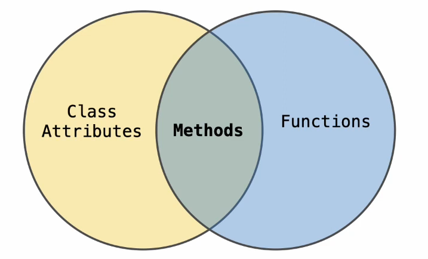
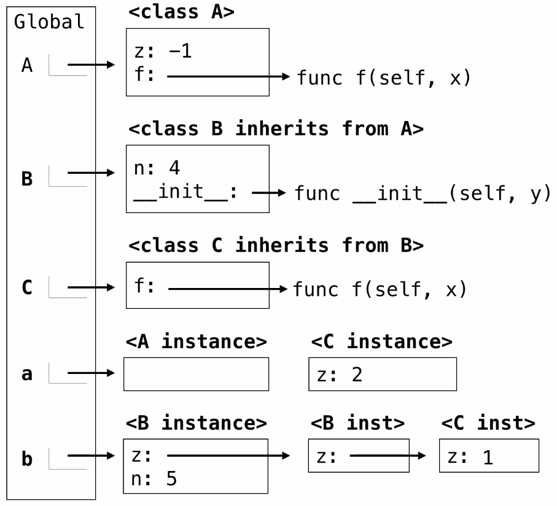

---
tags:
  - Python
---

# Object-Oriented Programming

## Objects

### Class Statements: the Account Class

```python
class Account:
    def __init__(self, account_holder):
        self.balance = 0
        self.holder = account_holder

    def deposit(self, amount):
        self.balance =  self.balance + amount
        return self.balance

    def withdraw(self, amount):
        if amount > self.balance:
            return "Insufficient funds"
        self.balance -= amount
        return self.balance
```

`__init__` is the constructor of a class.

### Creating Instances

When a class is called:

1. A new instance of that class is created.
2. The `__init__` method of the class is called with the new object as its first argument (named `self`), along with any additional arguments provided in the call expression.

Any attribute can be assigned any value. A new attribute can be added at **any time**.

Binding an object to a new name using assignment does not create a new object.

### Methods

#### Invoking Methods

All invoked methods have access to the object via the self parameter, and so they can all access and manipulate the object's attribute. Dot notation automatically supplies the first argument to a method.

## Attributes

### Attribute Lookup

Both instances and classes have attributes that can be looked up by dot expressions: `<expression>.<name>`.

To evaluate a dot expression:

1. Evaluate the `<expression>` to the left of the dot, which yields the object of the dot expression.
2. `<name>` is matched against the instance attributes of that object; if an attribute with that name exists, its value is returned.
3. If not, `<name>` is looked up in the class, which yields a class attribute value.
4. That value is returned unless it is a function, in which case a bound method is returned instead.

Using `getattr`, we can look up an attribute using a string.

```python
>>> getattr(tom_account, 'balance')
10
>>> hasattr(tom_account, 'deposit')
True
```

### Class Attributes

```python
class <name>:
    <suite>
```

A class statement creates a new class and binds that class to `<name>` in the first frame of the current environment.

Assignment & def statements in `<suite>` create attributes of the class (not names in frames).

Class attributes are shares across all instance of class because they are attributes of the class, not the instance.

```python
class Account:
    interest = 0.02  ## A class attribute
    ...

tom_account = Account("Tom")
tom_account.interest  # 0.02
```

Here the `interest` attribute is not part of the instance: it's part of the class. It's just the lookup procedure that gives us access to it.

### Bound Methods

Terminology:

{ width="300" }

Functions and bound methods are both objects. Dot expressions evaluate to bound methods for class attributes that are functions.

Python distinguishes between functions and bound methods.

```python
>>> type(Account.deposit)
<class 'function'>
>>> type(tom_account.deposit)
<class 'method'>

>>> Account.deposit(tom_account, 100)
100
>>> tom_account.deposit(100)
200
```

### Attribute Assignment

Assignment statements with a dot expression on their left-hand side affect attributes for the object of that dot expression.

- If the object is an instance, then assignment sets an instance attribute.
- If the object is a class, then assignment sets a class attribute.

```python
class Account:
    interest = 0.02
    ...

tom_account = Account('Tom')
```

Class attribute assignment: `Account.interest = 0.04`

Instance attribute assignment: `tom_account.interest = 0.08`

The name `interest` is not looked up in the object. Instead of going find it in the class, it just directly assigned to the attribute of the object.

Attribute assignment statement adds or modifies the attribute `interest` of `tom_account`.

Instance attributes and class attributes are totally independent in case of attribute assignment. They just relate to each other in attribute lookup.

## Inheritance

Syntax:

```python
class <name>(<base class>):
    <suite>
```

### Inheritance example

```python
>>> ch =CheckingAccount('Tom')
>>> ch.interest  # Lower interest rate
0.01
>>> ch.deposit(20)  # Deposits are the same
20
>>> ch.withdraw(5)  # Withdrawals incur a $1 fee
14
```

Since we are looking the name `withdraw` on a class in the implementation of `withdraw` as opposed to on an instance, we will not get a bound method back. We have to supply the `self` ourselves.

```python
class CheckingAccount(Account):
    withdraw_fee = 1
    interest = 0.01

    def withdraw(self, amount):
        return Account.withdraw(self, amount + self.withdraw_fee)
```

### Looking up Attribute Names on Classes

Base class attributes **aren't copied** into subclasses.

To look up a name in a class:

1. If it names an attribute in the class, return the attribute value.
2. Otherwise, look up the name in the base class, if there is one.

#### A Complicated Example

```python
class A:
    z = -1
    def f (self, x):
        return B(x - 1)

class B(A):
    n = 4
    def __init__(self, y):
        if y:
            self.z = self.f(y)
        else:
            self.z = C(y + 1)

class C(B):
    sef f(self, x):
    return x
```

{ width="360" }

```python
>>> a = A()
>>> b = B(1)
>>> b.n = 5
>>> C(2).n
4
>>> a.z == C.z
True
>>> a.z == b.z
False
```

### Multiple Inheritance

```python
class SavingAccount(Account):
    deposit_fee = 2

    def deposit(self, amount):
        return Account.deposit(self, amount - self.deposit_fee)
```

CleverBank marketing executive wants:

- Low interest rate of 1%
- A $1 fee for withdrawals
- A $2 fee for deposits
- A free dollar when you open your account

```python
class AsSeenOnTVAccount(CheckingAccount, SavingAccount):
    def __init__(self, account_holder):
        self.holder = account_holder
        self.balance = 1
```

## Representation

### String Representations

In Python, all objects produce two string representations:

- The `str` is legible to humans.
- The `repr` is legible to the Python interpreter.

The `repr` function returns a Python expression that evaluates to an equal object.

`repr(object) -> string`: Return the canonical string representation of the object.
For most object types, `eval(repr(object)) == object`.

The result of calling `repr` on a value is what Python prints in an interactive session.

```python
>>> 12e3
12000.0
>>>print(repr(12e3))
12000.0
```

Some objects do not have a simple Python-readable string.

```python
>>> repr(min)
'<built-in function min>'
```

The result of calling `str` on teh value of an expression is waht Python prints using `print` function:

```python
>>> from fractions import Fraction
>>> half = Fraction(1, 2)
'Fraction(1, 2)'
>>> str(half)
'1/2'
>>> print(half)
1/2
```

### String Interpolation

String interpolation involves evaluating a string literal that contains expressions. Sub-expressions in an f-string are evaluated in the current environment.

```python
>>> f'pi starts with {pi}...'
'pi starts with 3.141592653589793...'
```

The result of evaluating an f-string expression is the str string of the values of the sub-expressions.

```python
>>> repr(half * half)
'Fraction(1, 4)'
>>> f'{half * half}'
'1/4'
```

### Polymorphic Functions

Polymorphic function: A function that applies to many (*poly*) different forms (*morph*) of data.

`str` and `repr` are both polymorphic.
`repr` invokes a zero-argument method `__repr__` on its argument. `str` invokes a zero-argument method `__str__` on its argument.

```python
>>> half.__repr__()
'Fraction(1, 2)'
>>> half.__str__()
'1/2'
```

The behavior of `repr` is slightly more complicated than invoking `__repr__` on its argument:

- An instance attribute called `__repr__` is ignored.
- Only class attributes are found.

```python
def repr(x):
    return type(x).__repr__(x)
```

The behavior of `str` is also complicated:

- An instance attribute called `__str__` is ignored.
- If no `__str__` attribute is found, uses repr string.

#### Interface

Message passing: Objects interact by looking up attributes on each other.

The attribute look-up rules allow different data types to respond to the same message. A shared message (attribute name) that elicits similar behavior from different data types is called an interface, along with the its expected behavior.

```python
class Ratio:
    def __init__(self, n, d):
        self.numer = n
        self.denom = d

    def __repr__(self):
        return "Ratio({0}, {1})".format(self.numer, self.denom)

    def __str__(self):
        return "{0}/{1}".format(self.numer, self.denom)
```

```python
>>> half = Ratio(1, 2)
>>> print(half)
1/2
>>> half
Ratio(1, 2)
```

### Special Method Names

Special method names are used to implement the behavior of built-in functions and operators. These names always start and end with double underscores.

| Names      | Behaviors                                                   |
| ---------- | ----------------------------------------------------------- |
| `__init__` | Method invoked automatically when an object is constructed. |
| `__repr__` | Method invoked to display an object as a Python expression. |
| `__str__`  | Method invoked to display an object as a string.            |
| `__add__`  | Method invoked to add one object to another.                |
| `__bool__` | Method invoked to convert an object to a boolean value.     |

```python
>>> a, b = 1, 2
>>> a.__add__(b)
3
>>> a.__bool__()
True
```

Extend the `Ratio` class:

```python
class Ratio:
    def __init__(self, n, d):
        self.numer = n
        self.denom = d

    def __repr__(self):
        return "Ratio({0}, {1})".format(self.numer, self.denom)

    def __str__(self):
        return "{0}/{1}".format(self.numer, self.denom)

    def __add__(self, other):
        if isinstance(other, int):
            n = self.numer + other * self.denom
            d = self.denom
        elif isinstance(other, Ratio):
            n = self.numer * other.denom + other.numer * self.denom
            d = self.denom * other.denom
        elif isinstance(other, float):
            return float(self) + other
        g = gcd(n, d)
        return Ratio(n // g, d // g)

    __radd__ = __add__

    def __float__(self):
        return self.numer / self.denom
```

`isinstance`: Returns whether an object is an instance of a class or a subclass thereof.


## Efficiency

### Measuring Efficiency

```python
def count(f):
    def counted(*args, **kwargs):
        counted.count += 1
        return f(*args, **kwargs)

    counted.count = 0
    return counted
```

About `counted.count`:

- In Python, functions are first-class objects, meaning they can have attributes.
- `counted` is a closure and `counted.count` is not a variable captured by the closure. Instead, it is an attribute of the `counted` function itself, so it can be accessed as `counted.count` outside the function.

### Memoization

```python
def memoize(f):
    cache = {}
    def memoized(*args):
        if args not in cache:
            cache[args] = f(*args)
        return cache[args]
    return memoized
```
