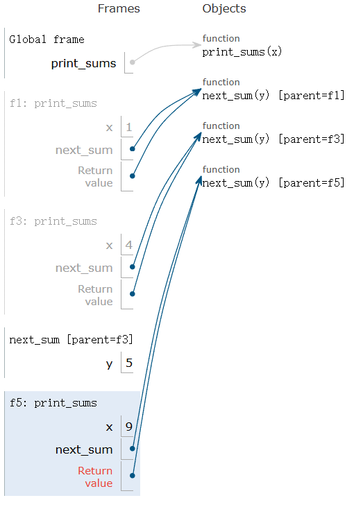

---
tags:
  - Python
---

# Recursion

## Recursion

### Self-Reference

```python
def print_all(x):
    print(x)
    return print_all

print_all(1)(3)(5)
```

The output is:

```shell
1
3
5
```

A more complicated example:

```python
def print_sums(x):
    print(x)
    def next_sum(y):
        return print_sums(x + y)
    return next_sum

print_sums(1)(3)(5)
```

The output is:

```shell
1
4
9
```

The environment diagram of the code above is:

{ width="400" }

Notice that the function `next_sums` was defined 3 times.

### Recursive Functions

Definition: A function is called recursive if the body of that function calls itself, either directly or indirectly.

### Mutual Recursion

#### The Luhn Algorithm

The Luhn sum of a valid credit card number is a multiple of 10.

How to compute:

1. From the right most digit, which is the check digit, moving left, double the value of every second digit; if product of this doubling operation is greater than 9, then sum the digits of the products.
2. Take the sum of all the digits.

```python
def split(n):
    return n // 10, n % 10

def sum_digits(n):
    if n < 10:
        return n
    else:
        return all_but_last, last = split(n)
        return sum_digits(all_but_last) + last

def luhn_sum(n):
    if n < 10:
        return n
    else:
        all_but_last, last = split()
        return luhn_sum_double(all_but_last) + last

def luhn_sum_double(n):
    all_but_last, last = split()
    luhn_digit = sum_digits(2 * last)
    if n < 10:
        return luhn_digit
    else:
        return luhn_sum(all_but_last) + luhn_digit
```

## Tree Recursion

### Example: Inverse Cascade

This is an inverse cascade:

```shell
1
12
123
12
1
```

The implementation code is:

```python
def inverse_cascade(n):
    grow(n)
    print(n)
    shrink(n)

def f_then_g(f, g, n):
    if n:
        f(n)
        g(n)

grow = lambda n: f_then_g(grow, print, n // 10)
shrink = lambda n: f_then_g(print, shrink, n // 10)
```

### Tree Recursion

Tree-shaped process arise whenever executing the body of a recursive function makes more than one call to that function.

### Example: Counting Partitions

The number of partitions of a positive integer n, using parts up to size m, is the number of ways in which n can be expressed as the sum of positive integer parts up to m in increasing order.

```python
def count_partitions(n, m):
    if n == 0:
        return 1
    elif n < 0:
        return 0
    elif m == 0:
        return 0
    else:
        with_m = count_partitions(n - m, m)
        without_m = count_partitions(n, m - 1)
        return with_m + without_m
```

### HW03: Anonymous Factorial

#### Conditional Expressions

The expression `x if C else y` first evaluates the condition, `C` rather than `x`. If `C` is true, `x` is evaluated and its value is returned; otherwise, `y` is evaluated and its value is returned.

#### Anonymous Factorial

Task: Write an expression that computes n factorial using only call expressions, conditional expressions, and lambda expressions (no assignment or def statements).

```python
from operator import sub, mul

def make_anonymous_factorial():
    return (lambda f: lambda k: f(f, k))(lambda f, k: (k if k == 1 else mul(k, f(f, sub(k, 1)))))
    ## Alternate solution:
    return (lambda f: f(f))(lambda f: lambda x: (1 if x == 0 else x * f(f)(x - 1)))
```
