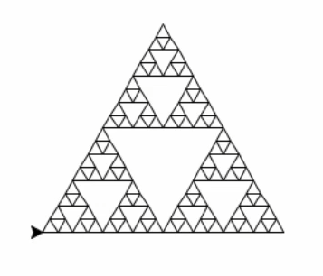
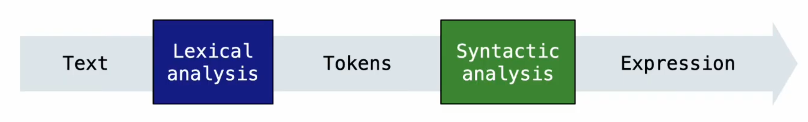

---
tags:
  - Scheme
---

# Scheme and Interpreters

## Scheme

Scheme is a minimalist dialect of the Lisp programming language.

### Scheme Fundamentals

Scheme programs consist of expressions, which can be:

- Primitive expressions: 2, 3.3, true, +, quotient, etc.
- Combinations: (quotient 10 2), (not true), etc.

Numbers are self-evaluating; symbols are bound to values.

Call expressions include an operator and 0 or more operands in the parentheses.

Combinations can span multiple lines, and indentation doesn't matter.

```scheme
> (quotient 10 2)
5
> (+ (* 3
        (+ (* 2 4)
           (+ 3 5)))
     (+ (- 10 7)
        6))
26
> (+ 1 2 3 4)
10
> (+)
0
> +
##[+]
> (number? 3)
##t
> (zero? 0)
##t
```

### Special Forms

A combination that is not a call expression is a special form:

- **If** expressions: `(if <predicate> <consequent> <alternative>)`
- **And** and **or**: `(and <e1> <e2> ...)`, `(or <e1> <e2> ...)`
- Binding symbols: `(define <symbol> <expression>)`
- New procedures: `(define (<symbol> <formal-parameters>) <body>)`

```scheme
> (define (square x) (* x x))
> (square 5)
25
> (define (sqrt x)
    (define (update guess)
      (if (= (square guess) x)
          guess
          (update (/ (+ guess (/ x guess)) 2))))
    (update 1))
> (sqrt 9)
3
```

The `cond` special form that behaves like `if-elif-else` statements in Python:

```scheme
(cond ((> x 0) 'positive)
      ((< x 0) 'negative)
      (else 'zero))
```

The `begin` special form allows multiple expressions to be evaluated in sequence:

```scheme
(begin
  (define x 10)
  (define y 20)
  (+ x y))
```

The `let` special form binds symbols to values temporatily; just for one expression:

```scheme
(let ((x 10)
      (y 20))
  (+ x y))
```

### Lambda Expressions

Lambda expressions evaluate to anonymous procedures.

```scheme
(lambda (<formal-parameters>) <body>)
```

Two equivalent expressions:

```scheme
(define (plus4 x) (+ x 4))
(define plus4 (lambda (x) (+ x 4)))
```

### Example: Sierpinski's Triangle

```scheme
(define (line) (fd 50))
(define (twice fn) (fn) (fn))
(define (repeat k fn)
  (fn)
  (if (> k 1) (repeat (- k 1) fn)))
(define (tri fn)
  (repeat 3 (lambda () (fn) (lt 120))))
(define (sierpinski d k)
  (tri (lambda () (if (= d 1) (fd k) (leg d k)))))
(define (leg d k)
  (sierpinski (- d 1) (/ k 2))
  (penup) (fd k) (pendown))
(sierpinski 5 200)
```

{ width="200" }

## Scheme Lists

### Lists

Basic symbols in Scheme related to lists:

- `cons`: Two-argument procedure that creates a linked list
- `car`: Procedure that returns the first element of a list
- `cdr`: Procedure that returns the rest of a list
- `nil`: The empty list

Scheme lists are written in **parentheses with elements separated by spaces**.

```scheme
> (cons 1 (cons 2 nil))
(1 2)
> (define x (cons 1 (cons 2 nil)))
> x
(1 2)
> (car x)
1
> (cdr x)
(2)
> (cons (cons 3 (cons 4 nil)) (cons 1 (cons 2 nil)))
((3 4) 1 2)
```

Some built in procedures related to lists:

- `(list? s)`: test if s is a list
- `(null? s)`: test if s is an empty list
- `(list e1 e2 ...)`: build a list with the provided elements

### Symbolic Programming

Symbols normally refer to values, while quotation is used to refer to symbols directly in Lisp.

```scheme
> (define a 1)
> (define b 2)
> (list 'a 'b)
(a b)
```

The quote is actually shorthand for a special form called quote: `'a` is short for `(quote a)` and `'b` is short for `(quote b)`.

Quotation can also be applied to combinations to form lists.

```scheme
> '(a b c)
(a b c)
> (car '(a b c))
a
```

We can refer to a symbol even before it have been defined.

### Built-in List Processing Procedures

- `(append s t)`: list the elements of `s` and `t`; `append` can be called on more than 2 lists
- `(map f s)`: call a procedure `f` on each element of a list `s` and list the results
- `(filter f s)`: call a procedure `f` on each element of a list `s` and list the elements for which a true value is the result
- `(apply f s)`: call a procedure `f` with the elements of a list as its arguments

```scheme
> (map (lambda (s) (cons 5 s)) (filter list? `(5 (6 7))))
((5 6 7))
> (apply + `(1 2 3 4))
10
```

### Example: Even Subsets

Definition: a non-empty subset of a list s is a list containing some of the elements of s.

```scheme
;;; none-empty subsets of integer list s that have an even sum
;;; scm> (even-subsets `(3 4 5 7))
;;; ((5 7) (4 5 7) (4) (3 7) (3 5) (3 4 7) (3 4 5))
(define (even-subsets s)
  (if (null? s) nil
    (append (even-subsets (cdr s))
            (subset-helper even? s))))

;;; none-empty subsets of integer list s that have an odd sum
(define (odd-subsets s)
  (if (null? s) nil
    (append (odd-subsets (cdr s))
            (subset-helper odd? s))))

(define (subset-helper f s)
  (append (map (lambda (t) (cons (car s) t))
               (if (f (car s))
                   (even-subsets (cdr s))
                   (odd-subsets (cdr s))))
          (if (f car s)
              (list (list (cdr s)))
              nil)))
```

### Discussion Question: Even Subsets Using Filter

```scheme
;;; non-empty subsets of s
(define (nonempty-subsets s)
  (if (null? s)
      nil
      (let ((rest (nonempty-subsets (cdr s))))
           (append rest
                   (map (lambda (t) (cons (car s) t))
                        rest)
                   (list (list (car s)))))))

;;; non-empty subsets of integer list that have an even sum
(define (even-subsets s)
  (filter (lambda (s) (even? (apply + s)))
          (nonempty-subsets s)))
```
## Calculator

### Exceptions

#### Raise Statements

Python exceptions are raised with a **raise statement**: `raise <exception>`.

`<exception>` must evaluate to a **subclass** of `BaseException` or an **instance** of one.

Exception are constructed like any other object.
E.g., `TypeError('Bad argument!')`.

Some built-in error types:
- `TypeError`: A function was passed the wrong number/type of argument.
- `NameError`: A name wasn't found.
- `KeyError`: A key wasn't found in a dictionary.
- `RecursionError`: Too many recursive calls.

These exceptions get raised automatically in certain cases and we can also raise them ourselves.

#### Try Statements

Try statement handle exceptions, which can prevent a program from terminating.

```python
try:
    <try suite>
except <exception class> as <name>:
    <except suite>
...
```

**Execution rule:**

- The `<try suite>` is executed first.
- If, during the course of executing the `<try suite>`,
an exception is raised that is not handled otherwise,
and if the class of the exception inherits from `<exception class>`,
then the `<except suite>` is executed,
with `<name>` bound to the exception.

### Example: Reduce

Reduce is an important higher-order function which is there to reduce a whole sequence of values to a single value.

There is a built-in version of reduce, but we can also write our own version.

```python
def reduce(f, s, initial):
    for x in s:
        initial = f(initial, x)
    return initial
```

`f` is a two-argument function,
`s` is a sequence of values that can be the second argument,
`initial` is a value that can be the first argument.

With the `reduce` function, we can complement a `divide_all` function:

```python
def divide_all(n, ds):
    try:
        return reduce(truediv, ds, n)
    except ZeroDivisionError:
        return float('inf')
```

### Parsing

To interpret text as a programming language, we first need to parse that text into some structure that makes it easy to perform interpretation.

A parser takes text and returns an expression.

{ width="500" }

Syntactic analysis identifies the hierarchical structure of an expression, which may be nested.
