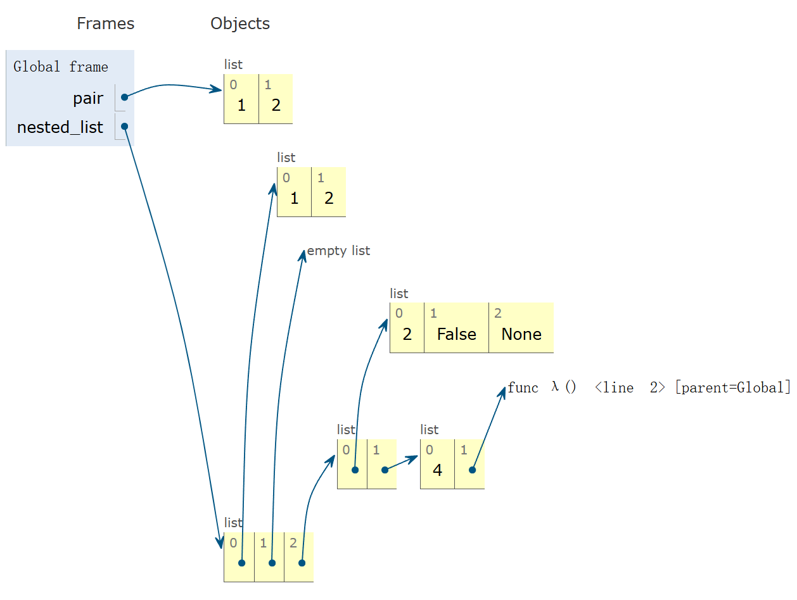

---
tags:
  - Python
---

# Sequences and Data Abstraction

## Sequences

### Lists

Bind a list literal to a name:

```python
a = [1, 2, 3]
```

To get the number of elements, we can use the built-in function `len`:

```python
a =  [1, 2, 3]
len(a)  # Evaluates to 3
```

If we want to get an element selected by its index, we can use the element selection syntax or the `getitem` function in the `operator` module:

```python
from operator import *
a = [1, 2, 3]
a[0]  # Evaluates to 1
getitem(a, 0)  # The same as above
```

Concatenation and repetition:

```python
a = [1, 2, 3]
[4, 5] * 2 + a  # Evaluates to [4, 5, 4, 5, 1, 2, 3]
```

### Containers

The built-in operator `in` can test whether an element appears in a compound value.

```python
a = [1, 2, 3]
1 in a       # True
5 not in a   # True
not(5 in a)  # Equivalent to the above
[1, 2] in a  # False
[1, 2] in [[1, 2], 3]  # True
```

### For Statements

#### Sequence Iteration

```python
def count(s, value):
    total = 0
    for element in s:
        if element == value:
            total += 1
    return total
```

The name `element` is bound in the first frame of the current environment. No new frames were introduced to the for statement.

#### For Statement Execution Procedure

```python
for <name> in <expression>:
    <suite>
```

1. Evaluate the header `<expression>`, which must yield an iterable value.
2. For each element in that sequence, in order:
   1. Bind `<name>` to that element in the current frame.
   2. Execute the `<suite>`.

```python
for i in [1, 2, 3]:
    print(i)
print(i)
```

The output of the code above is:

```shell
1
2
3
3
```

#### Sequence Unpacking in For Statement

Sequence unpacking works for a sequence of **fixed-length** sequence.

```python
pairs = [[1, 2], [2, 2], [3, 2], [4, 4]]
same_count = 0

for x, y in pairs:
    if x == y:
        same_count += 1

print(same_count)  # Output: 2
```

### Ranges

Ranges are another sequence type to represent consecutive integers.

To convert ranges to lists, we can call the list constructor `list`, a built-in function. When we call it on any other sequence, it gives us back a list full of the elements of that sequence.

There are cases when we actually don't care about the integers themselves. A typical way to write that is a for statement like this:

```python
for _ in range(n):
    <suite>
```

### List Comprehensions

A list comprehension takes an existing list and computes a new list from it according to some expressions.

```python
letters = ['a', 'b', 'c', 'd', 'e']
[letters[i] for i in [0, 2, 4]]  # Evaluates to ['a', 'c', 'e']

odds = [1, 3, 5, 7, 9]
[x + 1 for x in odds]  # Evaluates to [2, 4, 6, 8, 10]
[x for x in odds if 25 % x == 0]  # Evaluates to [1, 5]

def divisors(n):
    return [1] + [x for x in range(2, n) if n % x == 0]
divisors(12)  # Evaluates to [1, 2, 3, 4, 6]
```

### Lists, Slices, & Recursion

For any list `s`, the expression `s[1:]` is called a slice from index 1 to the end (or 1 onward).

## Containers

### Box-and-Pointer Notation

Box-and-pointer notation is a way to represent a list without environment diagrams.

#### The Closure Property of Data Types

- A method for combining data values satisfies the **closure property** if: The result of combination can itself be combined using the same method
- Closure is powerful because it permits us to create hierarchical structures
- Hierarchical structures are made up of parts, which themselves are made up of parts, and so on

#### Box-and-Pointer Notation in Environment Diagrams

Lists are presented as a row of index-labeled adjacent boxes, one per element.
Each box either contains a primitive value or points to a compound value.

A complicated example of nested lists represented by box-and-pointer notation:

```python
pair = [1, 2]
nested_list = [[1, 2], [], [[2, False, None], [4, lambda: 5]]]
```

{ width="550px" }

### Slicing

Slicing is an operation that we can perform on sequences, such as lists and ranges.

`[:]` is the slicing operator.

```python
a = [1, 2, 3, 4, 5]
a[1:3]  # [2, 3]
a[:3]   # [1, 2, 3]
a[1:]   # [2, 3, 4, 5]
a[:]    # [1, 2, 3, 4, 5]
```

### Processing Container Values

#### Sequence Aggregation

Several built-in functions take iterable arguments and aggregate then into a new value.

##### Sum

`sum(iterable[, start]) -> value`

Return the sum of an iterable of numbers (NOT strings) plus the value of parameter `start` (which defaults to `0`). When the iterable is empty, return start.

E.g.:

```python
sum([2, 3, 4])  # 9
sum([[2, 3], [4]], [])  # [2, 3, 4]
```

##### Max

`max(iterable[, key=func]) -> value`

`max(a, b, c, ...[, key=func]) -> value`

With a single iterable argument, return its largest item.
With two or more arguments, return the largest argument.
The `key` parameter: It applies a function to every element that are being considered, and actually computes the maximum based on the values of calling those functions.

E.g.:

```python
max(range(5))  # 4
max(0, 1, 2, 3, 4)  # 4
max(range(10), key=lambda x: 7 - (x - 4) * (x - 2))  # 3
```

##### All

`all(iterable) -> bool`

Return `True` if `bool(x)` is `True` for all values `x` in the iterable. If the iterable is empty, return `True`.

E.g.

```python
all([x < 5 for x in range(5)])  # True
```

There's also `min` and `any`, which are complements to `max` and `all`.

### Strings

The function `exec` can execute the code stored in a string.

#### String literals

```python
'I am string!'
"I'm string!"
"""The Zen of Python
claims, Readability counts.
Read more, import this."""
```

Single-quoted and double-quoted strings are equivalent except for that we can put an apostrophe in the double-quoted string, but it will not work on single-quoted strings, which will end string.

A triple-quoted string can span multiple lines. We often use it for docstrings.

#### String are Sequences

Length and element selection are similar to all sequences.
However, the `in` and `not in` operators **match substrings**.

### Dictionaries

Looking up values by their keys uses the element selection operator.

```python
numerals = {"I": 1, "V": 5, "X": 10}
numerals["I"]  # 1
numerals["V"]  # 5
numerals["X"]  # 10
```

Dictionaries are also **sequences**. In particular, they are sequences of keys. This means we can use dictionaries inside of a for statement to go through all of the keys.

```python
list(numerals)  # ["I", "V", "X"]
```

Dictionaries support various methods of iterating over the contents. The methods `keys`, `values`, and `items` all return iterable values. Although their return values are not a list, we can sum them up or iterate through them using a for statement. If for some reason we really need a list, we can call the method `list` on them to get a list.

```shell
>>> numerals.keys()
dict_keys(['I', 'V', 'X'])
>>> numerals.values()
dict_values([1, 5, 10])
>>> numerals.items()
dict_items([('I', 1), ('V', 5), ('X', 10)])
>>> list(numerals.keys())
['I', 'V', 'X']
```

Dictionaries can be constructed with no elements.

```python
d = {}
```

Two important **restrictions** about the keys of a dictionary:

- There can be at most one value for a given key.
- The key itself cannot be a list or a dictionary (or any mutable type).

```python
>>> {1: "first", 1: "second"}
{1: 'second'}
>>> {[1]: "first"}
Traceback (most recent call last):
  File "<stdin>", line 1, in <module>
TypeError: unhashable type: 'list'
```

#### Dictionary Comprehensions

Dictionaries also have a comprehension syntax analogous to those of lists.

```python
{<key exp>: <value exp> for <name> in <iter exp>[ if <filter exp>]}
```

An expression that evaluates to a dictionary using this evaluation procedure:

1. Add a new frame with the current frame as its parent
2. Create an empty result dictionary that is the value of the expression
3. For each element in the iterable value of `<iter exp>`:
   1. Bind `<name>` to that element in the new frame from step 1
   2. If `<filter exp>` evaluates to a true value, then add to the result dictionary an entry that pairs the value of `<key exp>` to the value of `<value exp>`

##### Example: Indexing

```python
def index(keys, values, match):
    """Return a dictionary from keys k to a list of values v for which match (k, v) is a true value.

    >>> index([7, 9, 11], range(30, 50), lambda k, v: v % k == 0)
    {7: [35, 42, 49], 9: [36, 45], 11: [33, 44]}
    """

    return {k: [v for v in values if match(k, v)] for k in keys}
```

## Data Abstraction

An abstract data type let us manipulate compound objects as units.
Data abstraction is a methodology by which function enforce an abstraction barrier between representation and use.

### Example: Rational Numbers

Assume we can compose and decompose rational numbers:

- Constructor:
  - `rational(n, d)`: returns a rational number `x`
- Selectors:
  - `numer(x)`: returns the numerator of `x`
  - `denom(x)`: returns the denominator of `x`

These functions implement an abstract data type for rational numbers. Then we can implement rational number arithmetic:

- `add_rational(x, y)`
- `mul_rational(x, y)`
- `equal_rational(x, y)`

### Representing Rational Numbers

```python
from fractions import gcd

def rational(n, d):
    g = gcd(n, d)
    return [n // g, d // g]

def numer(x):
    return x[0]

def denom(x):
    return x[1]
```

### Abstraction Barrier

The higher we stay up without crossing these boundaries, the easier it will be to change the program in the future.

| Parts of the program that...                      | Treat rationals as...       | Using...                                                           |
| :------------------------------------------------ | :-------------------------- | :----------------------------------------------------------------- |
| Use rational numbers to perform computation       | whole data values           | `add_rational`, `mul_rational`, `equal_rational`, `print_rational` |
| Create rationals or implement rational operations | numerators and denominators | `rational`, `numer`, `denom`                                       |
| Implement constructor and selectors for rationals | two-elements lists          | list literals and element selection                                |

#### Violating Abstraction Barriers

```python
add_rational([1, 2], [1, 4])  # Does not use constructors

def divide_rational(x, y):
    return [x[0] * y[1], x[1] * y[0]]  # Does not use selectors
```

### Data Representations

Data abstraction is recognized by its behavior, not necessarily by how it is constructed or how the constructor and selectors is implemented.

In the case below, we changed the implementation of the constructor and selectors of rationals, which still works well with the old code.

```python
def rational(n, d):
    def select(name):
        if name == 'n':
            return n
        elif name == 'd':
            return d
    return select

def numer(x):
    return x('n')

def denom(x):
    return x('d')
```

## Trees

### Implementing the Tree Abstraction

```python
def tree(label, branches=[]):
    for branch in branches:
        assert is_tree(branch), 'branches must be trees'
    return [label] + list(branches)

def label(tree):
    return tree[0]

def branches(tree):
    return tree[1:]

def is_tree(tree):
    if type(tree) != list or len(tree) < 1:
        return False
    for branch in branches(tree):
        if not is_tree(branch):
            return False
    return True

def is_leaf(tree):
    return not branches(tree)
```

### Tree Processing

Processing a leaf is often the base case of a tree processing function.
The recursive case typically makes a recursive call on each branch, then aggregates.

#### Count Leaves

```python
def count_leaves(t):
    if is_leaf(t):
        return 1
    else:
        return sum([count_leaves(b) for b in branches(t)])
```

#### Printing Trees

```python
def print_tree(t, indent=0):
    print("  " * indent + str(label(t)))
    for b in branches(t):
        print_tree(b, indent + 1)
```

#### Summing Paths

```python
def print_sums(t, so_far):
    so_far += label(t)
    if is_leaf(t):
        print(so_far)
    else:
        for b in branches(t):
            print_sums(b, so_far)
```

#### Counting Path

The function returns the number of paths from the root to any node in tree `t` for which the labels along the path sum to total.

```python
def count_path(t, total):
    if label(t) == total:
        found = 1
    else:
        found = 0
    return found + sum([count_paths(b, total - label(t)) for b in branches(t)])
```
