---
tags:
  - SQL
---

# SQL and Databases

## SQL

### Databases

Database management systems (DBMS):

A table is a collection of records, which are rows that have a value for each column.

The Structured Query Language (SQL) is perhaps the most widely used programming language.

SQL is a **declarative programming language**.

#### Declarative Programming

In **declarative languages** such as SQL & Prolog:

- A "program" is a description of the desired result.
- The interpreter figures out how to generate the result.

In **imperative language** such as Python & Scheme:
- A "program" is a description of computational processes.
- The interpreter carries out execution/evaluation rules.

An example of an SQL query:

```sql
SELECT "West Coast" AS region, name FROM cities
  WHERE longitude >= 115
  ORDER BY latitude;
```

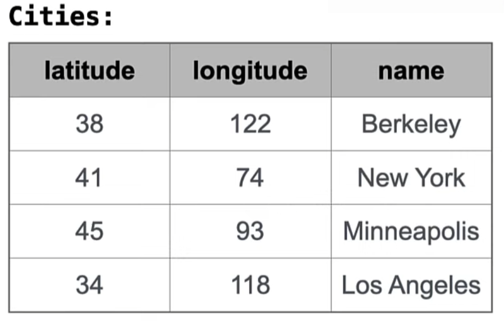{ width="280" }

The role of a query is to take an existing table, like the cities table above, and **build another table**.

In this case,
we'll create one that has "West Coast" as one of the values in each row,
along with the name of the city.

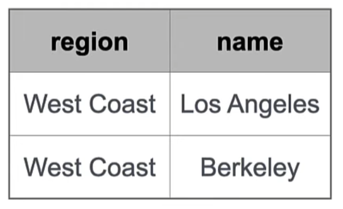{ width="190" }

### Structured Query Language

#### Selecting Value Literals

A `SELECT` statement always includes a comma-separated list of column descriptions.

A **column description** is an expression, optionally followed by `AS` and a column name:

```sql
SELECT [expressions] AS [name], [expression] AS [name], ...;
```

Selecting literals creates a one-row table.

The union of two select statements is a table containing the rows of both of their results.

```sql
SELECT "daisy" AS parent, "hank" AS child UNION
SELECT "ace"            , "bella"         UNION
SELECT "ace"            , "charlie"       UNION
SELECT "finn"           , "ace"           UNION
SELECT "finn"           , "dixie"         UNION
SELECT "finn"           , "ginger"        UNION
SELECT "ellie"          , "finn";
```

Notice that when we union together a bunch of select statements, we get no guarantees about the order of the result. That's up to the declarative programming engine, which tries to compute the results efficiently.

#### Naming Tables

The result of a `SELECT` statement is displayed to the user, but not stored.

A `CREATE TABLE` statement gives the result of a `SELECT` statement a name:

```sql
CREATE TABLE [name] AS [select statement];
```

So we can give the table we created before a name like this:

```sql
CREATE TABLE parents AS
  SELECT "daisy" AS parent, "hank" AS child UNION
  SELECT "ace"            , "bella"         UNION
  SELECT "ace"            , "charlie"       UNION
  SELECT "finn"           , "ace"           UNION
  SELECT "finn"           , "dixie"         UNION
  SELECT "finn"           , "ginger"        UNION
  SELECT "ellie"          , "finn";
```

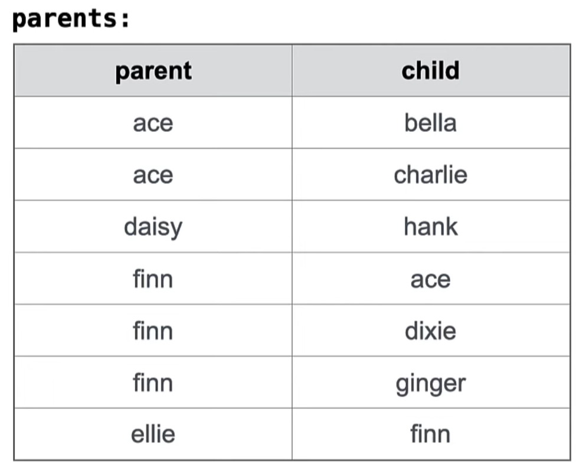{ width="320" }

### Projecting Tables

#### Select Statements Project Existing Tables

- A `SELECT` statement can specify an input table using a `FROM` clause.
- A subset of the rows of the input table can be selected using a `WHERE` clause.
- An ordering over the remaining rows can be declared using an `ORDERED BY` clause.

```sql
SELECT [columns] FROM [table] WHERE [condition] ORDERED BY [order];
```

- Column descriptions determine how each input row is projected to a result row:

```sql
[expressions] AS [name], [expression] AS [name], ...
```

### Arithmetic

#### Arithmetic in Select Expressions

In a select expression, column names evaluates to row values.

Arithmetic expressions can combine row values and constants.

```sql
CREATE TABLE lift AS
  SELECT 101 AS chair, 2 as single, 2 as couple UNION
  SELECT 102         , 0          , 3           UNION
  SELECT 103         , 4,         , 1;

SELECT chair, single + 2 * couple AS total FROM lift;
```

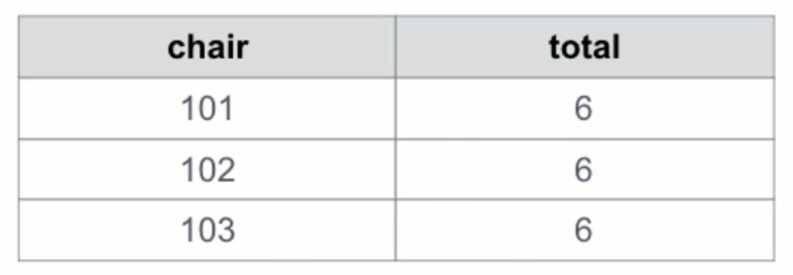{ width="270" }

## Tables

### Joining Tables

In order to consider multiple tables, we have to include something called a join.

Tables A & B are joined by a comma (or `JOIN`) to form all combos of a row from A & a row from B.

#### Joining Two Tables

Continue the dog breeder example before:

```sql
CREATE TABLE dogs AS
  SELECT "ace" AS name, "long" AS fur UNION
  SELECT "bella"      , "short"       UNION
  SELECT "charlie"    , "long"        UNION
  SELECT "daisy"      , "long"        UNION
  SELECT "ellie"      , "short"       UNION
  SELECT "finn"       , "curly"       UNION
  SELECT "ginger"     , "short"       UNION
  SELECT "hank"       , "curly";
```

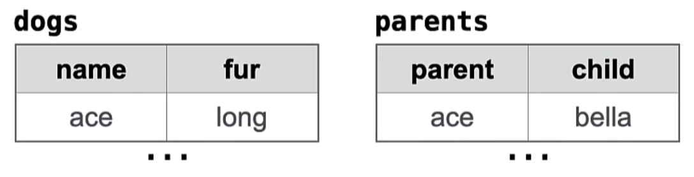{ width="360" }

Select the names of the parents of curly-furred dogs:

```sql
SELECT parent FROM parents, dogs
              WHERE child = name AND fur = "curly";
```

The statement `SELECT * FROM parents, dogs` will create a table consisting of all the pairs of rows from parents and dogs.

#### Implicit & Explicit Join Syntax

A join typically has some conditions for matching up the rows of two (or more) tables.

- Implicit syntax: Use a comma (or just `JOIN`) and put all conditions in the `WHERE` clause (like the example above).
- Explicit syntax: Use `FROM __ JOIN __ ON __` and put matching conditions after `ON`.

Rewrite the query above using explicit syntax:

```sql
SELECT parent FROM parents JOIN dogs ON child = name
              WHERE fur = "curly";
```

### Aliases and Dot Expressions

If two tables have the same column name, then we need a dot expression to distinguish which column we are talking about.

If two tables have the same name, then we need an alias to distinguish them.

These both occur when we join a table with itself.

#### Joining a Table with Itself

Two tables may share a column name; dot expressions and aliases disambiguate column values.

```sql
SELECT [column] FROM [table] WHERE [condition] ORDER BY [order];
```

`[table]` is a comma-separated list of table names with **optional aliases**.

Select all pairs of siblings:

```sql
SELECT a.child AS first, b.child AS second
  FROM parents AS a, parents AS b
  WHERE a.parent = b.parent AND a.child < b.child;
```

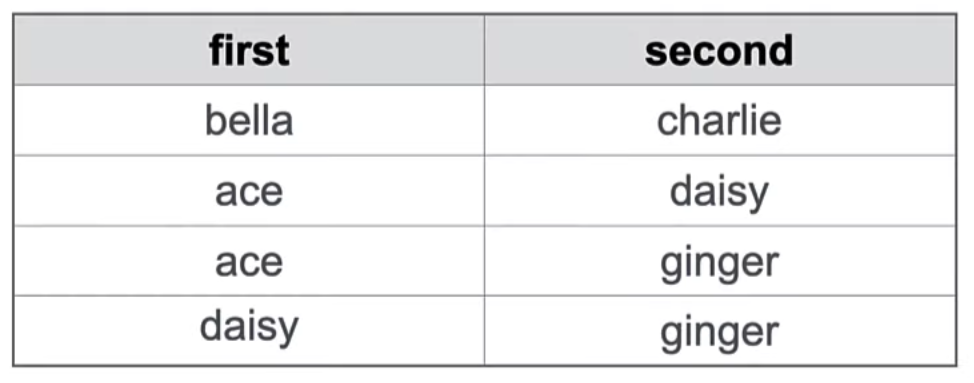{ width="320" }

#### Joining Multiple Tables

Multiple tables can be joined to yield all combinations of rows from each.

```sql
CREATE TABLE grandparents AS
  SELECT a.parent AS grandog, b.child AS granpup
    FROM parents AS a, parents AS b
    WHERE b.parent = a.child
```

Select all grandparents with the same fur as their grandchildren:

```sql
SELECT grandog FROM grandparents, dogs AS c, dogs AS d
               WHERE grandog = c.name AND
                     granpup = d.name AND
                     c.fur = d.fur;
```

### Numerical Expressions

Expressions can contain **function calls** and **arithmetic operators**, which can occur in any expression within a select statement.

- Combine values: `+`, `-`, `*`, `/`, `%`, `and`, `or`
- Transform values: `abs`, `round`, `not`, `-`
- Compare values: `<`, ,`<=`, `>`, `>=`, `<>`, `!=`, `=`

### String Expressions

String values can be combines to form longer strings through the **concatenation operator**:

```bash
sqlite> SELECT "hello," || " world";
hello, world
```

Basic string manipulation is built into SQL:

```sql
CREATE TABLE phrase AS
  SELECT "hello," || " world" AS s;
SELECT substr(s, 4, 2) || substr(s, instr(s, " ") + 1, 1) FROM phrase;
```

The statements above will get the string `low` as the result.

Strings can be used to represent structured values, but doing so is rarely a good idea:

```sql
CREATE TABLE lists AS
  SELECT "one" AS car, "two,three,four" AS cdr;
SELECT substr(cdr, 1, instr(cdr, ",") - 1) AS cadr FROM lists;
```

## Aggregation

### Aggregate Functions

We can perform aggregation over multiple rows using aggregate functions.

An aggregate function in the `[columns]` clause computes a value from a **group of rows**.

Here's a table of animals:

```sql
CREATE TABLE animals AS
  SELECT "dog" AS kind, 4 AS legs, 20 AS weight UNION
  SELECT "cat"        , 4        , 10           UNION
  SELECT "ferret"     , 4        , 10           UNION
  SELECT "parrot"     , 2        , 6            UNION
  SELECT "penguin"    , 2        , 10           UNION
  SELECT "t-rex"      , 2        , 12000;
```

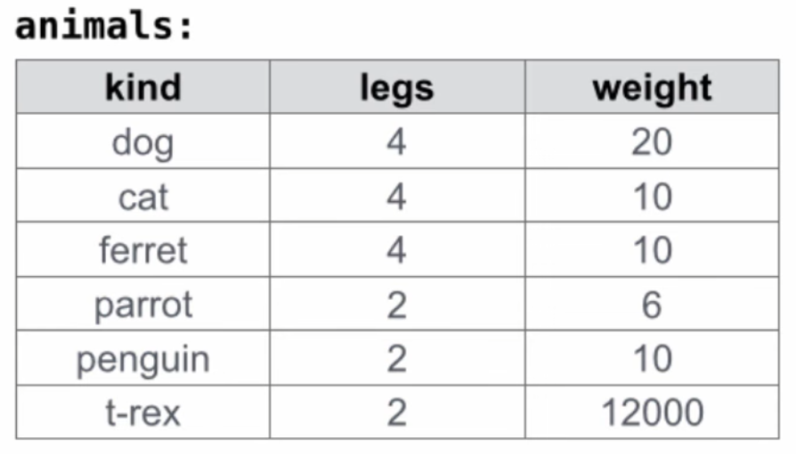{ width="310" }

```sql
SELECT max(legs) from animals;
```

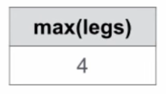{ width="103" }

More examples:

```bash
sqlite> select avg(legs) from animals;
3.0
sqlite> select count(legs) from animals;
6
sqlite> select count(kind) from animals;
6
sqlite> select count(*) from animals;
6
sqlite> select count(distinct legs) from animals;
2
sqlite> select sum(distinct weight) from animals;
12036
```

#### Mix Aggregate Functions and Single Values

An aggregate function also selects a row in the table, which may be meaningful:

```bash
>sqlite select max(weight), kind from animals;
12000|t-rex
```

Notice that if there are more than one things that have the maximum value, the answer will be ambiguous.

Some aggregations don't give us meaningful values, like `avg`:

```bash
sqlite> select avg(weight) from animals;
2009.33333333333|t-rex
```

### Groups

By default, all rows that are used to compute the final table,
meaning the ones that passed the filter in the where clause,
are all in the same group.
And so the result of an aggregate function only has one row.

#### Grouping Rows

Rows in a table can be grouped, and aggregation is **performed on each group** individually.

```sql
SELECT [columns] FROM [table] GROUP BY [expression] HAVING [expression];
```

The number of groups is the number of unique values of the expression placed after the `GROUP BY` clause.

```sql
SELECT legs, max(weight) FROM animals GROUP BY legs;
```

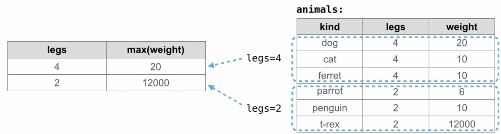{ width="700" }

A `HAVING` clause filters the set of groups that are aggregated:

```sql
SELECT weight / legs, count(*) FROM animals
  GROUP BY weight / legs
  HAVING count(*) > 1;
```

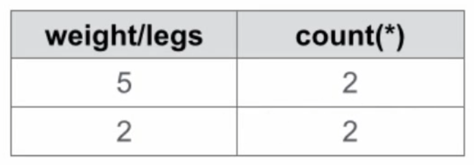{ width="230" }

## Databases

### Create Table and Drop Table

#### Create Table

`CREATE TABLE` expression syntax:

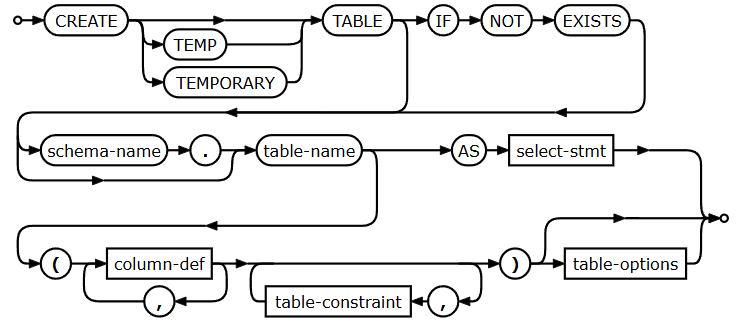{ width="600" }

`column-def`:

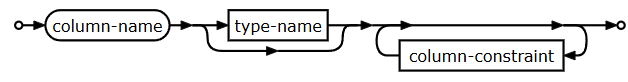{ width="550" }

`table-options`:

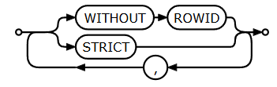{ width="260" }

Examples:

```sql
CREATE TABLE numbers (n, note);
CREATE TABLE numbers (n UNIQUE, note);
CREATE TABLE numbers (n, note DEFAULT "No comment");
```

### Drop Table

`DROP TABLE` expression syntax:

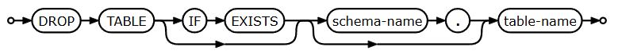{ width="680" }

If we run drop table on a name that doesn't exists without `IF EXISTS` clause,
we will reach an error.

### Modifying Tables

#### Insert

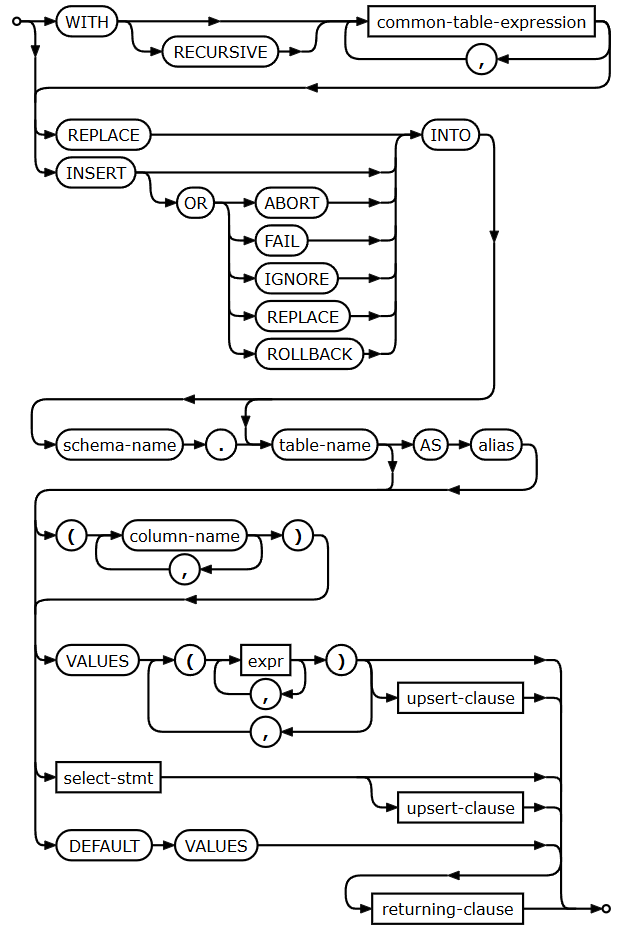{ width="500" }

For a table `t` with two columns...

- To inset into one column:
`INSERT INTO t(column) VALUES (value);`
- To insert into both columns:
`INSERT INTO ty VALUES (value0, value1);`

If we want to insert more rows then we can follow these parentheses by comma and more parenthetical row descriptions.

#### Update

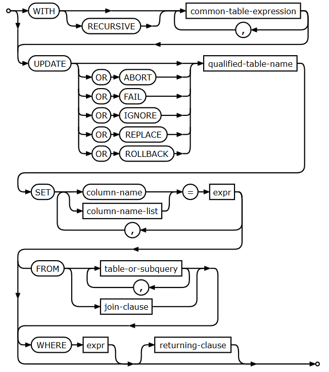{ width="500" }

Update sets all entries in certain columns to new values, just for some subset of rows.

The common usage of `UPDATE` statement:

```sql
UPDATE t SET c1 = v1, c2 = v2, ... WHERE ...;
```

#### Delete

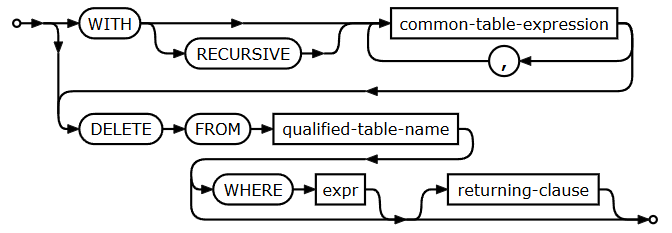{ width="500" }

`DELETE` remove some or all rows from a table.
