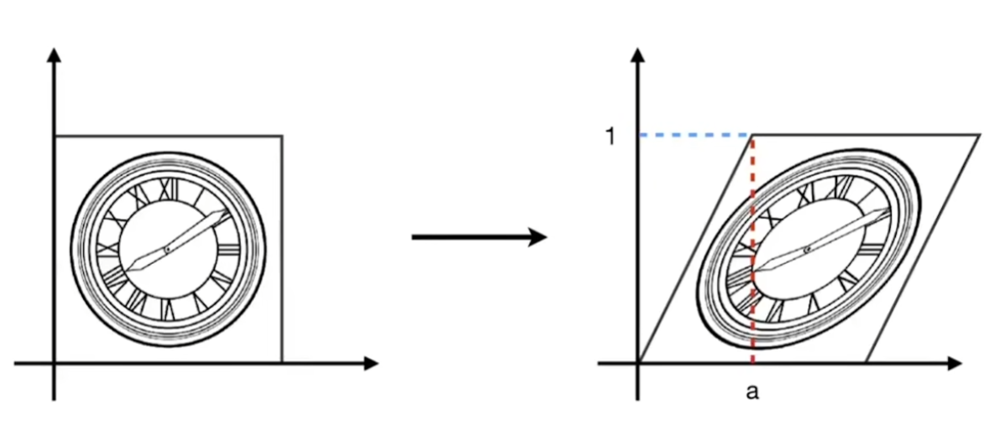

---
tags:
  - 图形学
---

# GAMES101

## 变换（Transformation）

### 二维变换

#### 缩放（Scale）

坐标关系：

$$
\begin{aligned}
x'&=sx\\
y'&=sy
\end{aligned}
$$

写成矩阵形式：

$$
\begin{bmatrix}
x'\\
y'
\end{bmatrix} =
\begin{bmatrix}
s & 0 \\
0 & s
\end{bmatrix}
\begin{bmatrix}
x\\
y
\end{bmatrix}
$$

非均匀（non-uniform）缩放：

$$
\begin{bmatrix}
x'\\
y'
\end{bmatrix} =
\begin{bmatrix}
s_x & 0 \\
0 & s_y
\end{bmatrix}
\begin{bmatrix}
x\\
y
\end{bmatrix}
$$

#### 镜像（Reflection）

水平镜像：

$$
\begin{bmatrix}
x'\\
y'
\end{bmatrix} =
\begin{bmatrix}
-1 & 0 \\
0 & 1
\end{bmatrix}
\begin{bmatrix}
x\\
y
\end{bmatrix}
$$

#### 切变（Shear）

{ width="500" }
/// caption
切变
///

