# 几何

计算机图形学中的几何不只是三角形网格，光滑曲面、点云、液体边界、分形和字体轮廓等，都需要合适的方式来描述。

## 几何的表示

几何表示可分为隐式表示和显式表示：

- 隐式表示：用方程或标量场判断空间中的点与物体的关系
- 显式表示：直接给出点，或通过参数映射生成点

### 隐式表示

隐式表示通过一个函数对空间中的点分类。三维曲面通常表示为：

$$
f(x,y,z)=0
$$

特点：

- 把一个点代入函数，根据结果的符号即可判断它位于物体内还是物体外
- 方程没有直接列出曲面上的点，要绘制曲面，往往还需额外的求交或采样算法
- 结构复杂的曲面方程会难以构造和控制

#### 构造实体几何

构造实体几何通过并、交、差等布尔运算组合简单几何体。

一个复杂物体可以表示成一棵树：叶节点是基本几何体，内部节点是布尔运算。这种表示适合由规则零件组成的模型，也能容易处理内外判断问题。

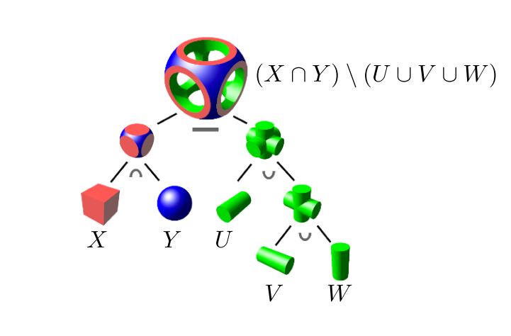{ width="350" }
{.center-img}

#### 距离函数

距离函数记录每个空间点到物体的最短距离，带符号距离函数用正负号区分内外，曲面是距离为零的位置。

可以通过混合两个距离函数，让边界在不同形状之间平滑过渡。

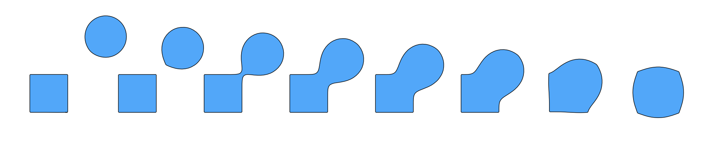{ width="600" }
{.center-img}

#### {{abbr: 水平集}}

复杂曲面通常很难用闭式方程描述。水平集方法改为在规则网格上存储标量场的离散采样值，并在网格之间插值，满足 $f(\bm{x})=0$ 的等值面就是目标边界。

这种方式可以看作三维空间中的纹理，其精度受网格分辨率限制，但能表示任意复杂形状，也很容易处理液体分裂、合并等拓扑变化。典型应用包括医学影像中的等密度组织边界和流体模拟中的气液界面表示。

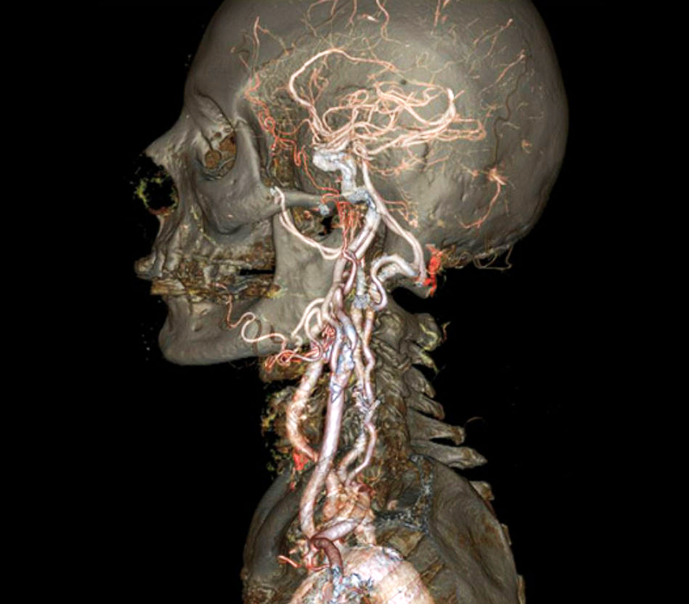
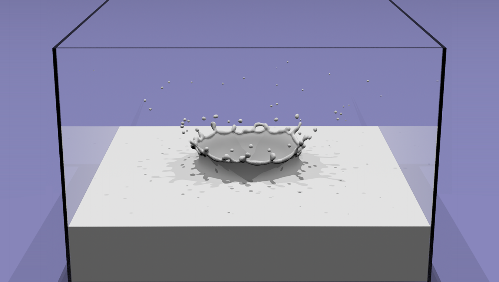
{.flex-img-group style="--img-group-width: 550px;"}

#### 分形

分形用递归规则描述不同尺度上反复出现的结构，适合生成海岸、山脉和植物等自然形态。它能以紧凑规则产生丰富细节，但局部形状通常不容易精确控制。

### 显式表示

显式表示直接存储几何点，或者给出从参数域到空间的映射：

$$
f:\mathbb{R}^2\to\mathbb{R}^3,
\quad
(u,v)\mapsto(x,y,z)
$$

只要代入参数 $(u,v)$ 就能得到曲面上的点，因此采样和绘制很直接，但仅凭这些点通常难以判断任意空间点是否位于物体内部。

常见的显式表示包括：

- **{{abbr: 点云}}**：只保存大量空间点，实现简单，适合扫描数据。采样不足时会留下空洞，并且缺少表面连接关系。
- **{{abbr: 多边形网格}}**：同时保存顶点和多边形的连接关系，便于绘制、编辑、物理模拟和自适应采样，是图形学中最常见的表示之一。
- **参数曲线与曲面**：通过少量控制点和基函数生成连续几何，例如 Bézier 曲线、Bézier 曲面、B 样条和 NURBS。

???+ note "Wavefront OBJ 格式"

    Wavefront OBJ 是一种易于读写的纯文本格式，它将属性数据与网格连接关系分开记录。下面的文件描述了一个带纹理坐标和法线的三角形：

    ```obj
    # 顶点位置
    v 0.0 0.0 0.0
    v 1.0 0.0 0.0
    v 0.0 1.0 0.0

    # 纹理坐标
    vt 0.0 0.0
    vt 1.0 0.0
    vt 0.0 1.0

    # 顶点法线
    vn 0.0 0.0 1.0

    # 位置索引/纹理坐标索引/法线索引
    f 1/1/1 2/2/1 3/3/1
    ```

    常用记录以行首关键字区分：

    - `v x y z`：顶点位置
    - `vt u v`：纹理坐标
    - `vn x y z`：顶点法线
    - `f ...`：由若干顶点引用组成的面

    面中的一个引用通常写成 `v/vt/vn`，三个数字分别索引位置、纹理坐标和法线。缺少纹理坐标时可写成 `v//vn`，若只记录位置则直接写 `v`。这三类索引彼此独立，同一个空间位置可以搭配不同的纹理坐标或法线，从而表示纹理接缝与硬边。面中顶点的排列顺序会影响朝向。

    OBJ 的正索引从 `1` 开始，负索引表示倒序计数。OBJ 不只支持三角形，一个 `f` 记录可以包含三个以上的顶点，因此渲染前通常还需要把多边形三角化。

## Bézier 曲线

曲线可用于相机运动路径、动画参数和矢量字体。Bézier 曲线由控制点组成的控制多边形控制曲线走向。

### de Casteljau 算法

de Casteljau 算法使用重复的线性插值来计算曲线。设控制点为 $\bm{b}_0,\ldots,\bm{b}_n$，首先令

$$
\bm{b}_i^0(t)=\bm{b}_i
$$

然后递归计算

$$
\bm{b}_i^r(t)
=(1-t)\bm{b}_i^{r-1}(t)+t\bm{b}_{i+1}^{r-1}(t),
\quad r=1,\ldots,n
$$

经过 $n$ 层插值，唯一剩下的点 $\bm{b}_0^n(t)$ 就是参数 $t$ 对应的曲线位置。改变 $t\in[0,1]$，即可描出整条曲线。

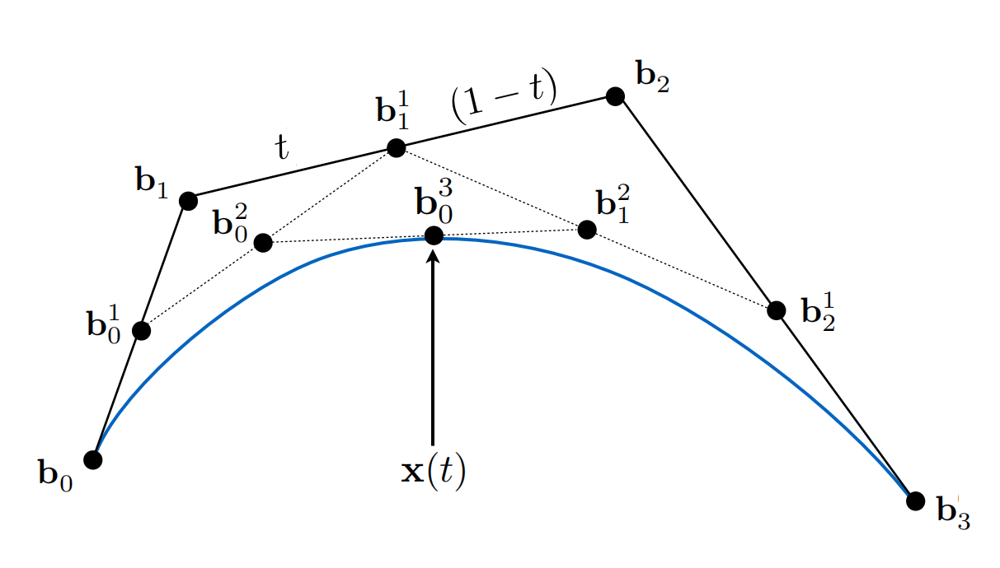{ width="400" }
{.center-img}

### Bernstein 形式

递归插值也可以展开为 Bernstein 多项式。$n$ 次 Bézier 曲线为

$$
\bm{b}(t)=\sum_{i=0}^{n}\bm{b}_i B_i^n(t),
\quad
B_i^n(t)=\binom{n}{i}t^i(1-t)^{n-i}
$$

最常用的三次 Bézier 曲线由四个控制点定义：

$$
\bm{b}(t)
=(1-t)^3\bm{b}_0
+3t(1-t)^2\bm{b}_1
+3t^2(1-t)\bm{b}_2
+t^3\bm{b}_3
$$

它具有以下重要性质：

- **端点插值**：$\bm{b}(0)=\bm{b}_0$，$\bm{b}(1)=\bm{b}_n$
- **端点切向**：三次曲线满足 $\bm{b}'(0)=3(\bm{b}_1-\bm{b}_0)$、$\bm{b}'(1)=3(\bm{b}_3-\bm{b}_2)$
- **凸包性质**：曲线始终位于所有控制点的凸包内
- **仿射不变性**：先变换控制点再生成曲线，等价于直接对曲线做同一仿射变换

Bernstein 基函数在任意 $t$ 处都非负且总和为 $1$，因此曲线位置是控制点的加权平均，这也解释了凸包性质。

### 分段曲线与连续性

高次 Bézier 曲线需要很多控制点，整体形状难以局部调整。实际应用通常把多段低次曲线连接起来，其中分段三次 Bézier 曲线最常见。

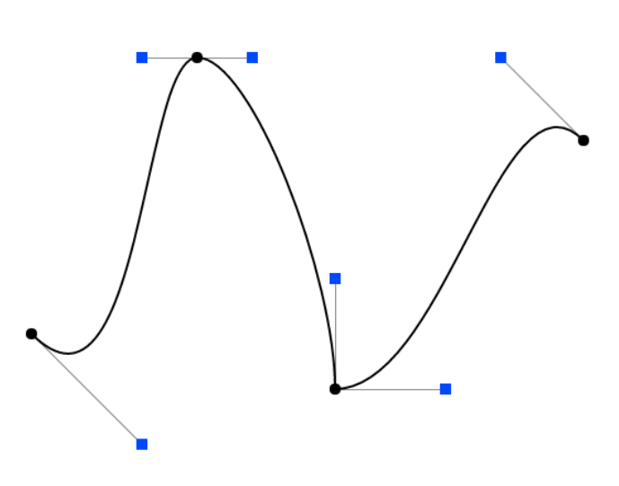{ width="300" }
{.center-img}

设前一段曲线的控制点为 $\bm{a}_0,\ldots,\bm{a}_n$，后一段为 $\bm{b}_0,\ldots,\bm{b}_m$：

- $C^0$ 连续要求两段共享端点，即 $\bm{a}_n=\bm{b}_0$，曲线不会断开。
- $C^1$ 连续还要求连接处的一阶导数相同。对参数尺度相同的三次曲线，这等价于 $\bm{a}_{n-1}$、$\bm{a}_n=\bm{b}_0$、$\bm{b}_1$ 共线，且连接点位于另外两点的中点。

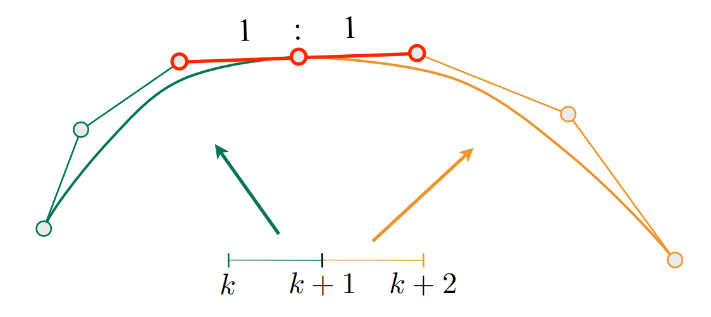{ width="450" }
{.center-img}

其他类型曲线：

- B 样条：可以看作 Bézier 曲线的推广，它保留了许多重要性质，同时提供更强的局部控制能力
- NURBS：在 B 样条上加入有理权重，可以精确表示圆锥曲线

## Bézier 曲面

把一维 Bézier 曲线推广到两个参数方向，就得到 Bézier 曲面。一个双三次 Bézier 曲面片由 $4\times4$ 个控制点 $\bm{p}_{ij}$ 定义：

$$
\bm{S}(u,v)
=\sum_{i=0}^{3}\sum_{j=0}^{3}
B_i^3(u)B_j^3(v)\bm{p}_{ij},
\quad (u,v)\in[0,1]^2
$$

这个表达式在 $u$、$v$ 两个方向上可分离。计算 $\bm{S}(u,v)$ 时，可以先在控制网格的四行上分别用 de Casteljau 算法求参数 $u$ 处的点，得到四个新的控制点，再对这四个点沿 $v$ 方向执行一次 de Casteljau 算法。

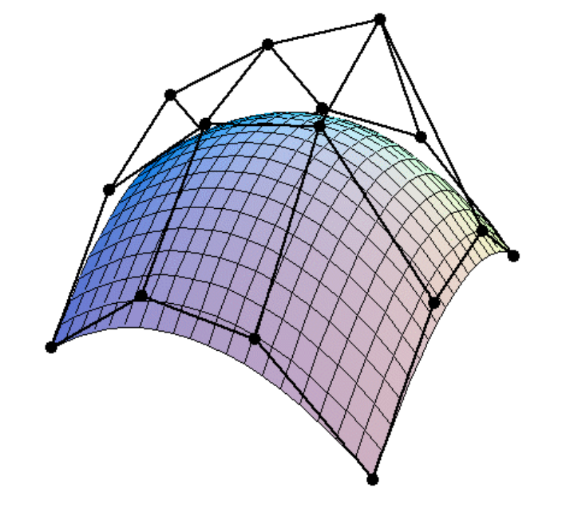
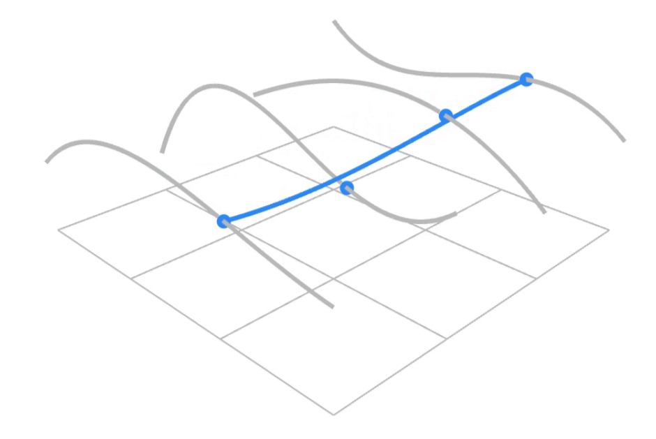
{.flex-img-group style="--img-group-width: 550px;"}

## 网格处理

网格处理主要包含以下内容：

- **{{abbr: 网格细分}}**：增加顶点和面，使低分辨率网格逐步逼近光滑曲面。
- **{{abbr: 网格简化}}**：减少几何元素，同时尽量保留原来的形状和外观。
- **{{abbr: 网格正则化}}**：保持三角形数量大致不变，只调整采样分布来改善网格质量。

### Loop 细分

Loop 细分适用于三角形网格。每轮操作分成两步，先在每条边上加入新顶点，把一个三角形分为四个，再分别更新新、旧顶点的位置。

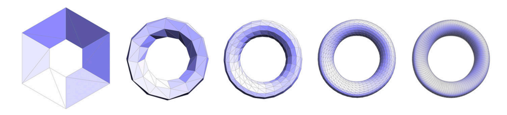{ width="600" }
{.center-img}

对内部边，设端点为 $A,B$，相邻两个三角形的对顶点为 $C,D$，新顶点为

$$
\bm{p}_{\text{new}}
=\frac{3}{8}(A+B)+\frac{1}{8}(C+D)
$$

旧顶点的位置由自身和一环邻居共同决定。设顶点度数为 $n$，令

$$
u=
\begin{cases}
3/16, & n=3,\\
3/(8n), & n>3,
\end{cases}
$$

旧顶点更新为

$$
\bm{p}'=(1-nu)\bm{p}+u\sum_{i=1}^{n}\bm{p}_i
$$

其中权重之和为 $1$，因此新位置是原顶点及其邻居的仿射组合。边界和锐边需要使用单独规则，上式描述的是内部顶点。

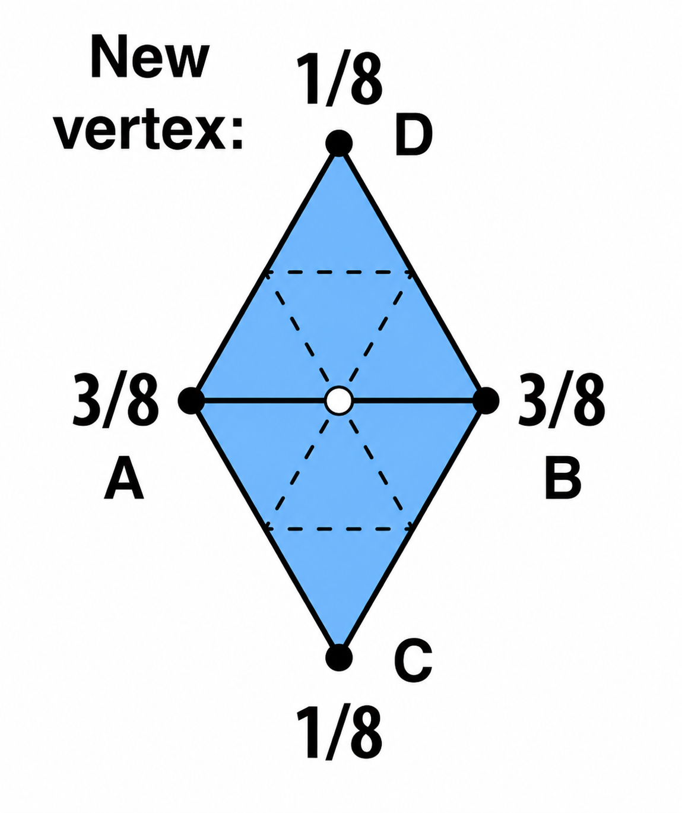
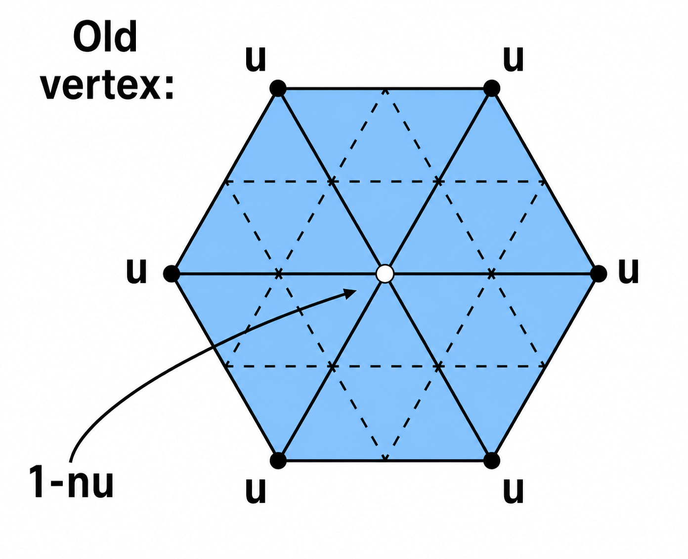
{.flex-img-group style="--img-group-width: 500px;"}

### Catmull-Clark 细分

Catmull-Clark 细分可以处理一般多边形网格。

每轮在每个面内加入面点、在每条边上加入边点，再连接这些新点。细分一次后，新生成的面全部是四边形，原来的非四边形面不再存在，但它对应的面点可能成为度数不为 $4$ 的奇异点。

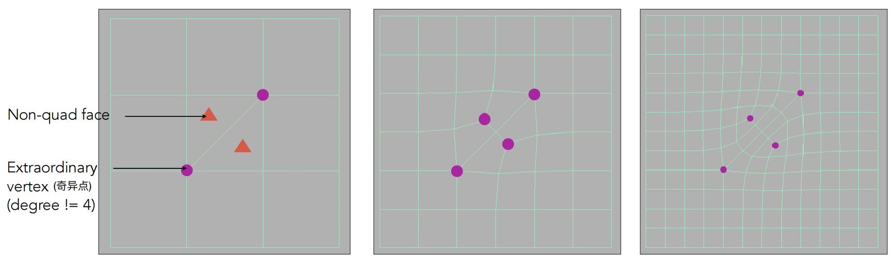{ width="600" }
{.center-img}

对规则四边形网格内部，更新规则为：

$$
\begin{aligned}
\bm{f} &= \frac{\bm{v}_1+\bm{v}_2+\bm{v}_3+\bm{v}_4}{4},\\
\bm{e} &= \frac{\bm{v}_1+\bm{v}_2+\bm{f}_1+\bm{f}_2}{4},\\
\bm{v}' &=
\frac{\sum_{i=1}^{4}\bm{f}_i
+2\sum_{i=1}^{4}\bm{m}_i
+4\bm{v}}{16},
\end{aligned}
$$

其中 $\bm{f}$ 是面点，$\bm{e}$ 是边点，$\bm{m}_i$ 是原边中点。

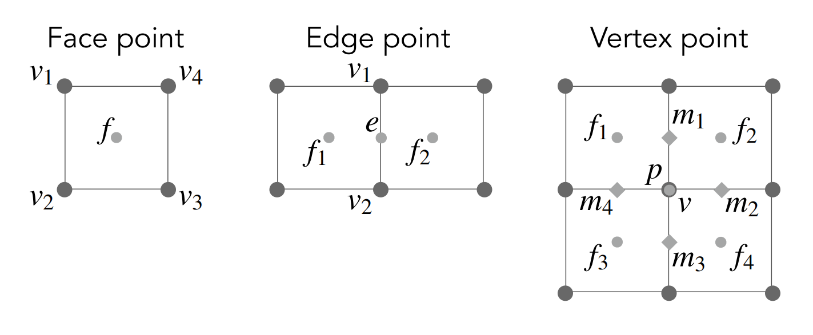{ width="500" }
{.center-img}

重复细分后，网格会收敛为平滑曲面。若希望保留折痕，则需要对锐边使用专门规则。

### 网格简化

网格简化的目标是在减少三角形的同时控制几何误差。

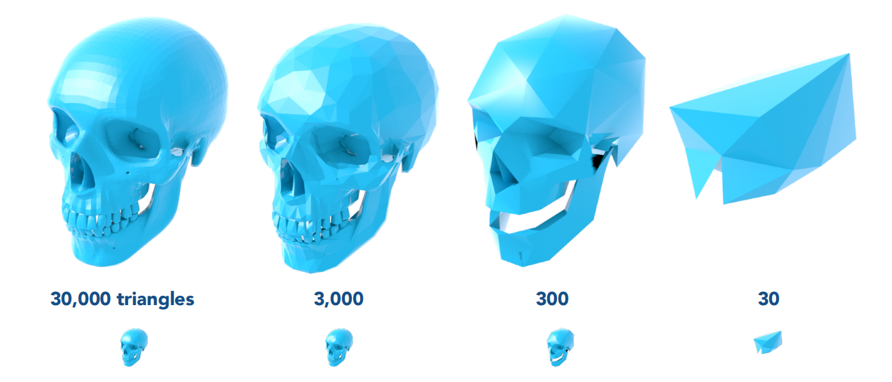{ width="500" }
{.center-img}

**边折叠**

边折叠是删除一条边，并把它的两个端点合并到一个新位置。假设我们使用边折叠简化网格，关键问题是如何选择被折叠的边以及合并后的顶点位置。

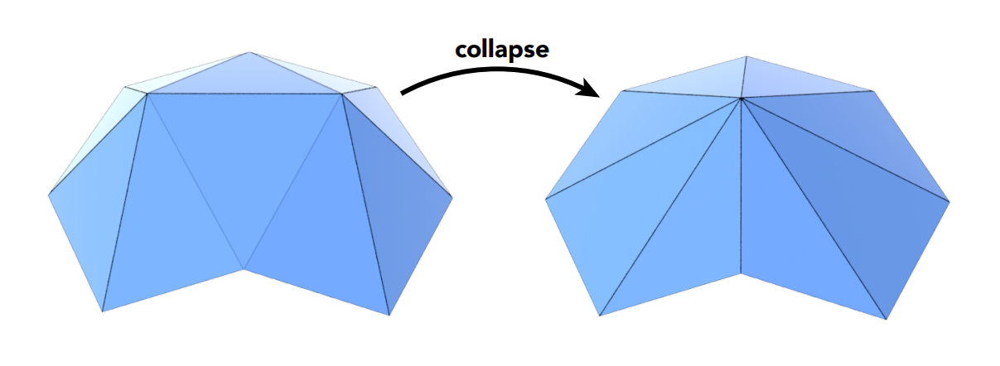{ width="400" }
{.center-img}

**二次误差度量**

二次误差度量把新顶点到相关三角形所在平面的距离平方相加，以衡量简化后的相似程度。

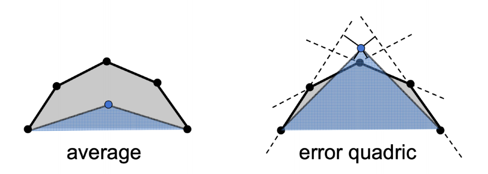{ width="350" }
{.center-img}

若平面 $k$ 的单位法线为 $\bm{n}_k$，方程常数为 $d_k$，候选点 $\bm{v}$ 的误差可写成

$$
E(\bm{v})=
\sum_k(\bm{n}_k\cdot\bm{v}+d_k)^2
$$

使用二次误差度量简化网格的过程为：

1. 为每条候选边计算最优合并位置和二次误差
2. 折叠当前误差最小的边
3. 更新受影响区域的连接关系与误差
4. 重复以上步骤，直到达到目标网格规模

这是一个贪心过程，不能保证全局最优，但通常能保留良好的整体轮廓。

*[构造实体几何]: Constructive solid geometry (CSG)
*[带符号距离函数]: Signed distance function (SDF)
*[水平集]: Level set
*[点云]: Point cloud
*[多边形网格]: Polygon mesh
*[网格细分]: Mesh subdivision
*[网格简化]: Mesh simplification
*[网格正则化]: Mesh regularization
*[奇异点]: Extraordinary vertex
*[边折叠]: Edge collapse
*[二次误差度量]: Quadric error metric (QEM)
