---
tags:
  - 计算机图形学
---

# 光栅化

## 从正则立方体到屏幕

屏幕空间：

- 像素下标用 $(x,y)$ 的形式表示，范围从 $(0,0)$ 到 $(width-1,height-1)$
- 像素 $(x,y)$ 的中心为 $(x+0.5,y+0.5)$
- 整个屏幕覆盖从 $(0,0)$ 到 $(width,height)$ 的范围

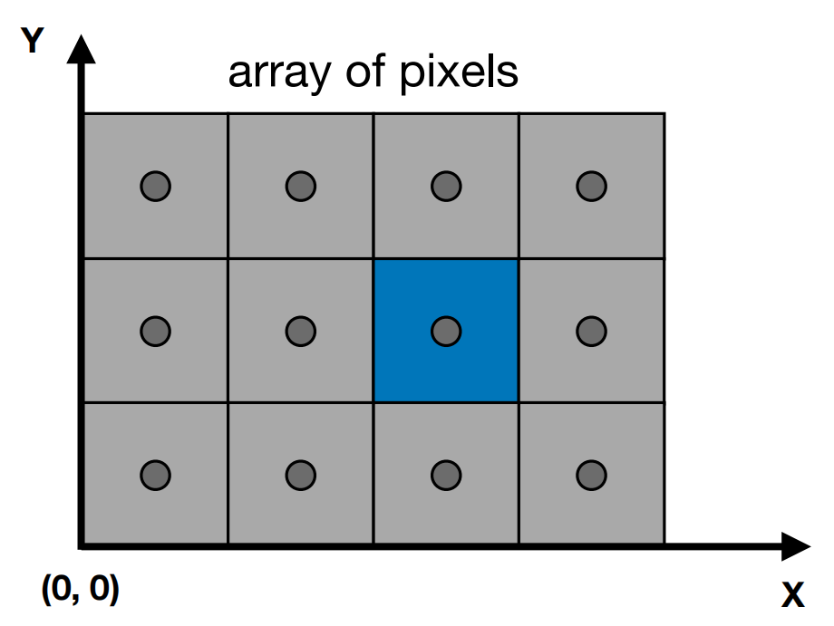{ width="300" }
{.center-img}

### 视口变换

我们需要在 $xOy$ 平面做变换，把 $[-1,1]^2$ 变换到 $[0,width]\times[0,height]$，这个过程与 $z$ 无关。

视口变换矩阵：

$$
\bm{M}_{viewport} =
\matfour
{\frac{width}{2} & 0 & 0 & \frac{width}{2}}
{0 & \frac{height}{2} & 0 & \frac{height}{2}}
{0 & 0 & 1 & 0}{0 & 0 & 0 & 1}
$$

## 将三角形光栅化为像素

### 三角形

二维和三维中的三角形网格：

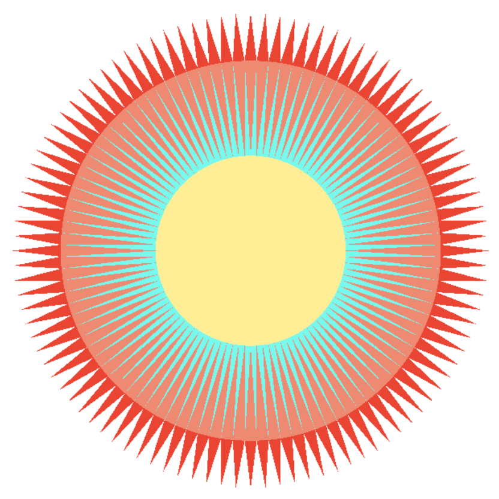{ width="200" }
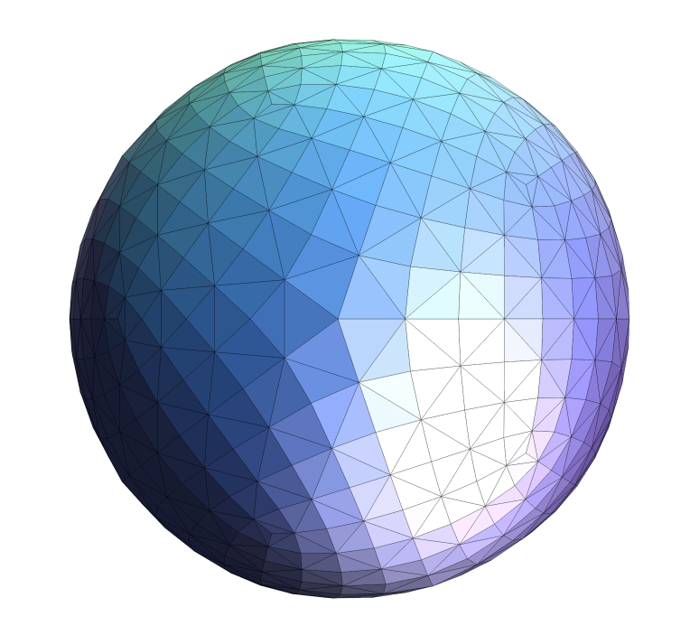{ width="200" }
{.md-img-group}

三角形是最基础的多边形，其他多边形都可以分解为三角形。三角形具有以下性质：

- 能保证是平面的
- 有良定义的内部
- 有基于顶点值进行插值的明确定义的方法（重心插值）

### 采样

采样是对一个函数在离散的点上求值的过程。

我们定义一个二值函数 $inside$，用于判断每个像素中心是否在三角形内部：

$$
inside(t,x,y)=
\begin{cases}
1&\text{Point}\ (x,y)\ \text{in triangle}\ t\\
0&\text{otherwise}
\end{cases}
$$

判断一个点是否在三角形内部使用叉积来实现。例如，有 $\triangle P_1P_2P_3$，现在要判断点 $Q$ 是否在其内部。我们计算三个叉积：$\bm{P_1P_2}\times\bm{P_1Q}$、$\bm{P_2P_3}\times\bm{P_2Q}$ 和 $\bm{P_3P_1}\times\bm{P_3Q}$，如果这三个结果是同号的，则说明点 $Q$ 在三角形内部。

对这个函数进行采样，即可对三角形光栅化：

```cpp
for (int x = 0; x < xmax; ++x)
    for (int y = 0; y < ymax; ++y)
        image[x][y] = inside(tri, x + 0.5, y + 0.5);
```

{ width="200" }
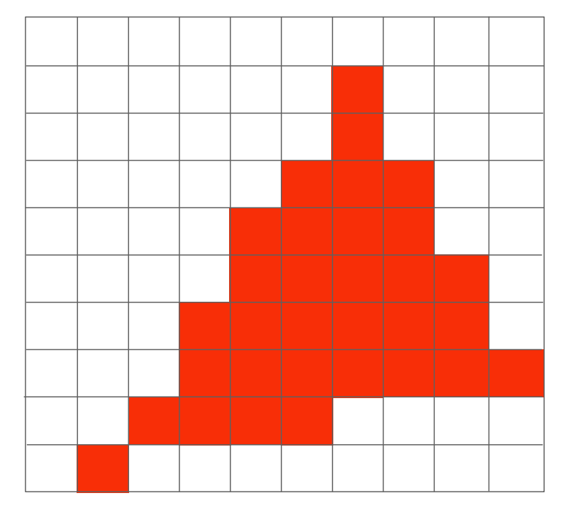{ width="210" }
{.md-img-group}

可以使用只遍历包围盒的方法对三角形采样的过程进行加速：

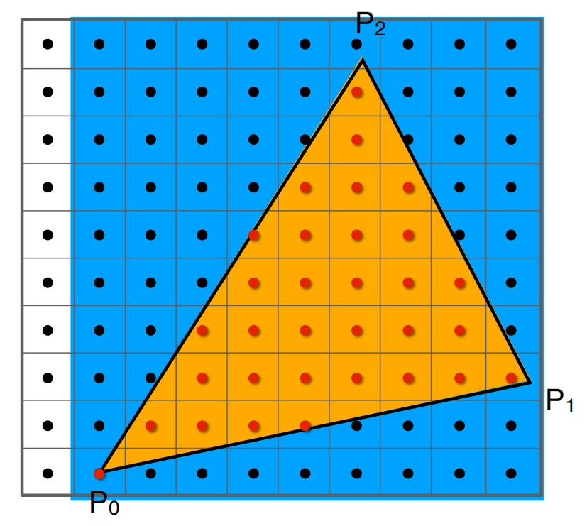{ width="200" }
{.center-img}

也可以使用增量三角形遍历方法，即对每一行确定一个包围盒，这个方法适用于细长且斜向的三角形：

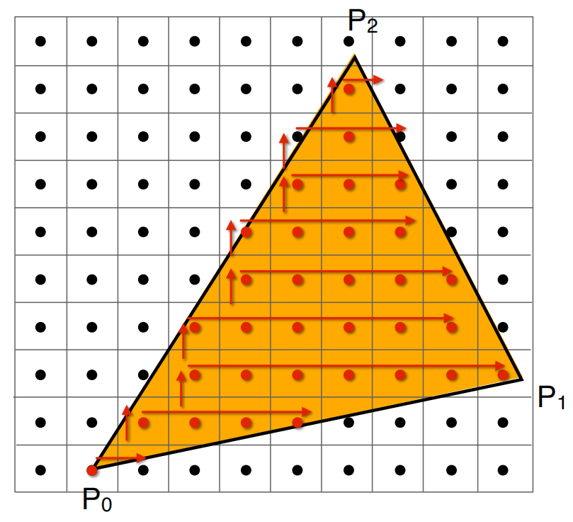{ width="200" }
{.center-img}

## 走样与抗锯齿

### 走样的来源

光栅化实际上是在规则的像素网格上采样连续的三角形覆盖函数，三角形边界两侧的函数值会从 $0$ 跳变到 $1$，因此边界会呈现出锯齿。

锯齿、摩尔纹和高速旋转物体看似倒转等现象都属于走样。它们的共同原因是：信号变化得太快，而采样频率不足。

!!! note "采样定理与走样"

    设一维连续信号 $f(x)$ 的最高频率为 $f_{max}$，采样频率为 $f_s$。对于带限信号，若

    $$
    f_s > 2f_{max},
    $$

    则可以由采样值完整重建原信号，$f_s/2$ 称为奈奎斯特频率。

    周期采样会使原信号的频谱以 $f_s$ 为间隔重复：

    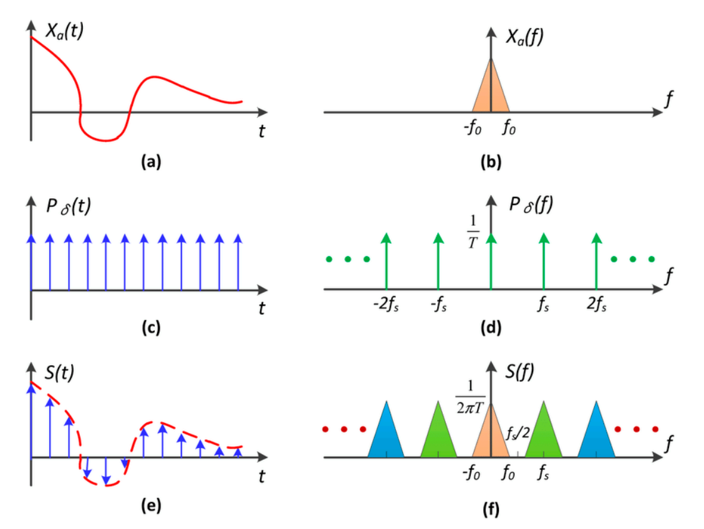{ width="300" }
    {.center-img}

    当采样频率过低时，相邻的频谱副本发生重叠，高频成分便可能表现为错误的低频成分。此时，不同的连续信号会产生相同的离散样本，因而无法仅根据采样结果区分，这就是走样：

    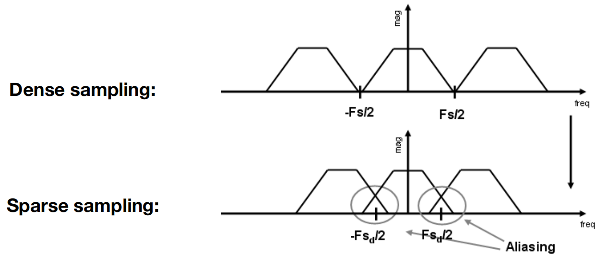{ width="350" }
    {.center-img}

    如果通过滤波先抑制无法表达的高频成分，再进行采样，就可以防止走样：

    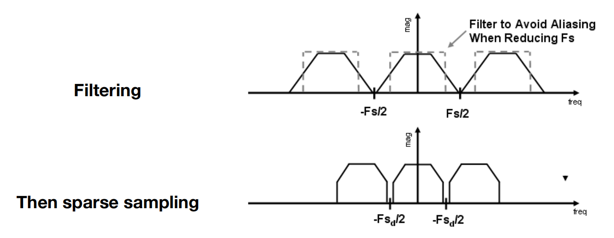{ width="350" }
    {.center-img}

### 傅里叶变换与滤波

傅里叶变换把信号从空间域转换到频率域。低频成分描述缓慢变化的区域，高频成分通常对应快速变化的细节与边缘。滤波就是选择性地保留或削弱某些频率成分，高通滤波会突出边缘，低通滤波则会抑制高频并产生模糊。

!!! note "傅里叶变换与卷积定理"

    采用以每单位长度周期数 $\nu$ 表示频率的约定，一维连续傅里叶变换及其逆变换为

    $$
    F(\nu)=\int_{-\infty}^{\infty}f(x)e^{-2\pi i\nu x}\,\mathrm{d}x,
    \qquad
    f(x)=\int_{-\infty}^{\infty}F(\nu)e^{2\pi i\nu x}\,\mathrm{d}\nu.
    $$

    用滤波核 $h$ 对信号 $f$ 进行卷积定义为

    $$
    (f*h)(x)=\int_{-\infty}^{\infty}f(\tau)h(x-\tau)\,\mathrm{d}\tau.
    $$

    卷积定理给出

    $$
    \mathcal{F}\{f*h\}=\mathcal{F}\{f\}\,\mathcal{F}\{h\}.
    $$

    因此，空间域中的局部加权平均等价于频率域中的逐点相乘。盒式滤波器在空间域内取邻域平均，对应一个低通滤波器。盒子的范围越宽，其频域主瓣越窄，保留的高频成分越少，图像也就越模糊。

    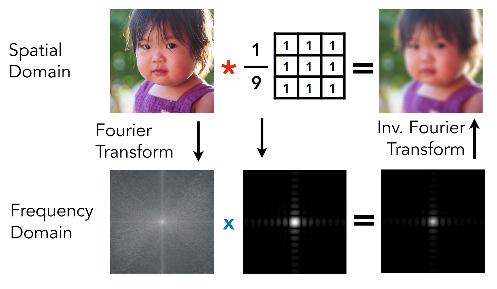{ width="450" }
    {.center-img}

### 先滤波再采样

采样一旦造成频谱混叠，原有的高频信息已经无法分离，之后再模糊图像只能让错误的结果变糊，不能消除走样。抗锯齿的关键是先对连续信号做低通滤波，再在像素中心采样。

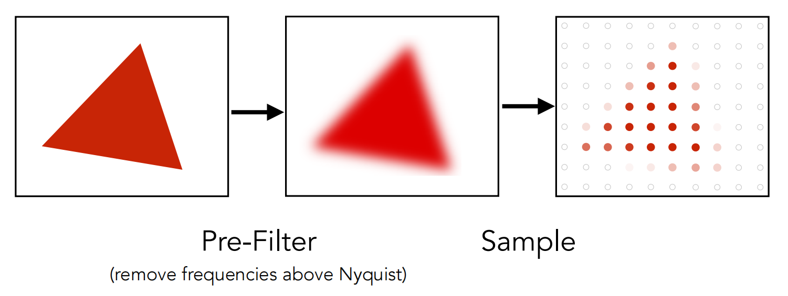{ width="400" }
{.center-img}

光栅化三角形时，可以使用宽度为一个像素的盒式滤波器。此时，每个像素的值不再只是 $0$ 或 $1$，而是三角形在该像素内的覆盖比例，这样边界像素会得到介于背景色和三角形颜色之间的值。

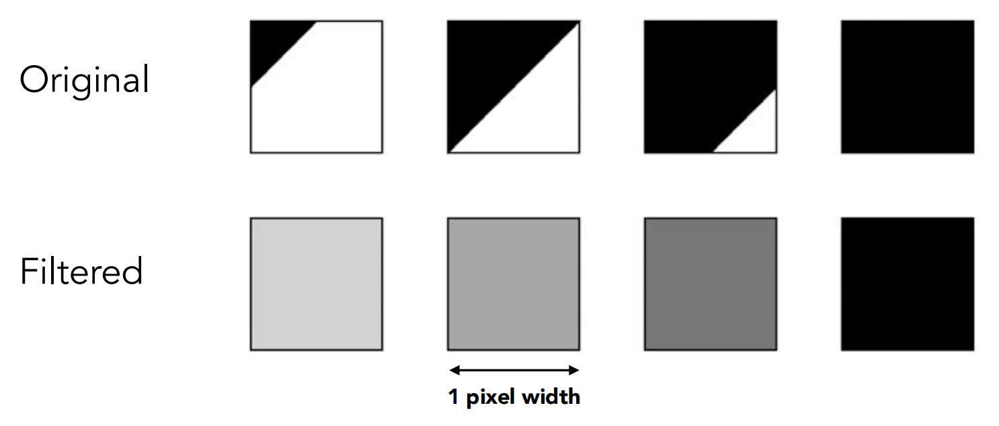{ width="450" }
{.center-img}


### MSAA（多重采样抗锯齿）

精确求三角形与每个像素的相交面积代价较高。多重采样抗锯齿在一个像素内放置多个采样点，分别判断它们是否被三角形覆盖，再对结果取平均，以近似像素覆盖率。

例如 $2\times2$ 采样中有三个采样点位于三角形内，就以 $3/4=75\%$ 作为该像素的覆盖率。采样点越多，通常越接近真实的面积积分，但计算与存储开销也会随之增加。

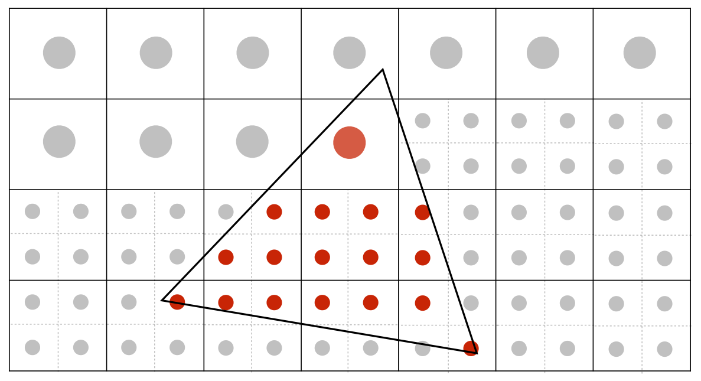{ width="300" }
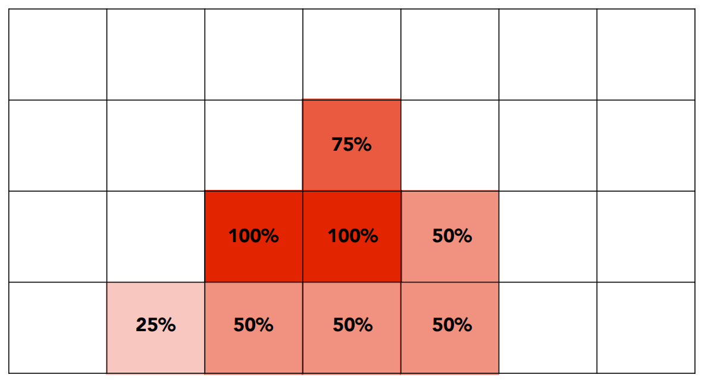{ width="300" }
{.md-img-group}

!!! tip "其他抗锯齿方法"

    - FXAA（快速近似抗锯齿）是一种屏幕空间后处理方法，通过检测最终图像中的高对比度边缘并进行平滑来减弱锯齿。它速度快、额外开销小，但可能模糊纹理和细小几何特征。
    - TAA（时间抗锯齿）让采样位置在连续帧之间轻微偏移，再结合运动向量对齐并累积历史帧，从时间维度获得更多样本。它通常能提供更稳定的边缘，但历史信息处理不当时会产生重影或拖尾。

## 可见性与深度缓冲

同一个像素可能被多个三角形覆盖。光栅化不仅需要确定哪些像素被三角形覆盖，还需要判断哪个三角形离相机最近，只显示它的颜色。

### 画家算法

画家算法模仿绘画过程，先绘制远处的物体，再绘制近处的物体，让后绘制的颜色覆盖帧缓冲中的原有颜色。

这种方法需要先对三角形按深度排序，时间复杂度为 $O(n\log n)$。更重要的是，三角形之间可能形成循环遮挡关系，无法得到一个满足所有像素的全局绘制顺序。

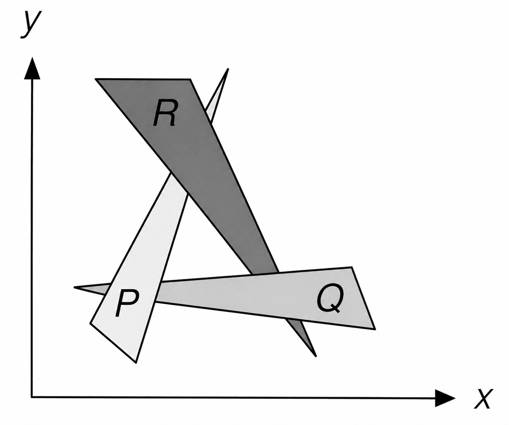{ width="250" }
{.center-img}

### Z-buffer 算法

Z-buffer 不再对三角形进行全局排序，而是为每个采样点记录当前可见表面的深度：

- 帧缓冲记录最终显示的颜色
- 深度缓冲记录当前最近的深度值

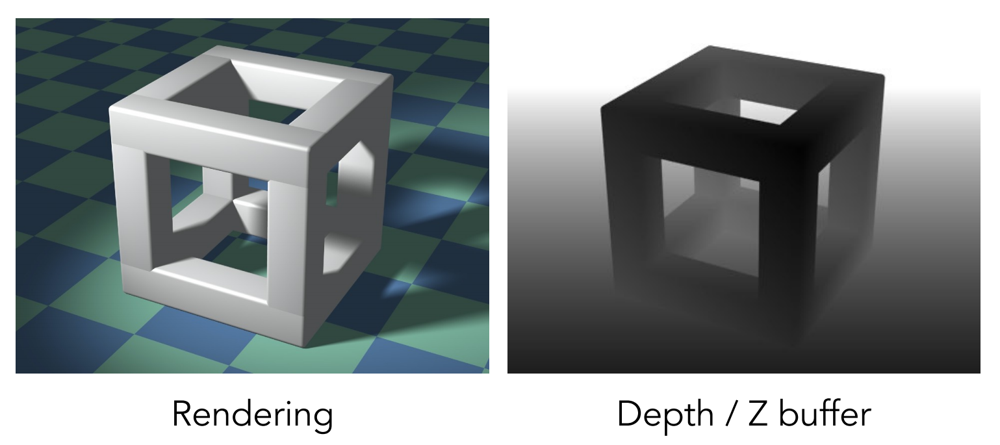{ width="500" }
{.center-img}

光栅化每个三角形时，只有比已有记录更近的采样点才能同时更新颜色和深度。这里比较的是三角形在当前采样点处的深度，而不是整个三角形或物体的中心深度，因此相交或循环遮挡的三角形也可以在不同像素处得到正确的可见性结果。

我们约定深度 $z$ 始终为正数，并且 $z$ 越小表示距离相机越近。因此，深度缓冲初始化为正无穷。

```cpp linenums="1"
for (auto& depth : zbuffer)
    depth = infinity;

for (const auto& triangle : triangles) {
    for (const auto& sample : covered_samples(triangle)) {
        auto [x, y, z] = sample;
        if (z < zbuffer[x][y]) {
            zbuffer[x][y] = z;
            framebuffer[x][y] = triangle.color;
        }
    }
}
```

对于深度互不相同的不透明表面，改变三角形的绘制顺序不会改变最终结果。这个局部、顺序无关的深度测试过程很适合并行执行，因此由 GPU 硬件直接支持。

!!! note "MSAA 中的 Z-buffer"

    启用 MSAA 后，深度缓冲需要为每个像素内的每个子采样点分别保存深度，即由 `zbuffer[x][y]` 扩展为 `zbuffer[x][y][s]`，其中 `s` 是子采样点编号。

    光栅化三角形时，首先生成表示哪些子采样点被覆盖的掩码。每个被覆盖的子采样点会独立计算深度并执行深度测试，只有测试通过的样本才更新对应的深度和颜色。所有三角形处理完毕后，再对像素内保留下来的颜色样本取平均，得到最终像素颜色。

    常规 MSAA 通常逐样本计算覆盖率和深度，但着色器仍可只执行一次，并将结果用于同一图元覆盖且通过测试的多个样本。因此，它能正确处理几何边缘处不同表面的遮挡，同时比对每个子采样点都完整着色的超采样开销更低。

*[光栅化]: Rasterization
*[视口变换]: Viewport transformation
*[重心插值]: Barycentric interpolation
*[包围盒]: Bounding box
*[增量三角形遍历]: Incremental triangle traversal
*[走样]: Aliasing
*[抗锯齿]: Antialiasing
*[奈奎斯特频率]: Nyquist frequency
*[傅里叶变换]: Fourier transform
*[空间域]: Spatial domain
*[频率域]: Frequency domain
*[卷积]: Convolution
*[盒式滤波器]: Box filter
*[MSAA]: Multisample antialiasing
*[FXAA]: Fast approximate antialiasing
*[TAA]: Temporal antialiasing
*[画家算法]: Painter's algorithm
*[帧缓冲]: Frame buffer
*[深度缓冲]: Depth buffer / Z-buffer
*[循环遮挡]: Cyclic occlusion
