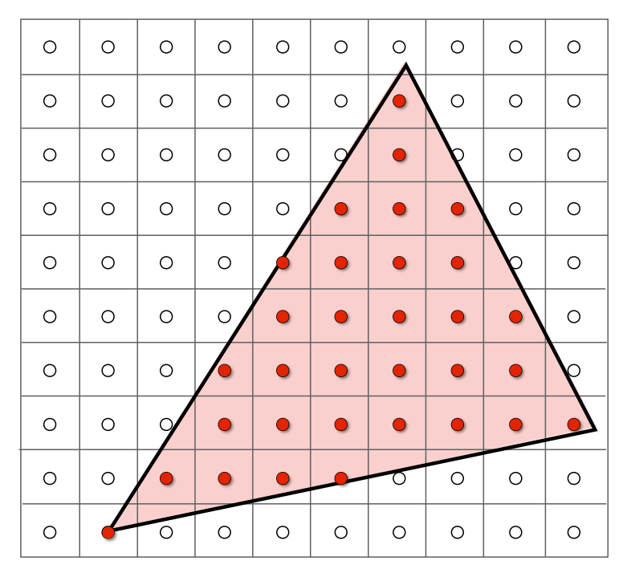

---
tags:
  - 计算机图形学
---

# 光栅化

## 从正则立方体到屏幕

屏幕空间：

- 像素下标用 $(x,y)$ 的形式表示，范围从 $(0,0)$ 到 $(width-1,height-1)$
- 像素 $(x,y)$ 的中心为 $(x+0.5,y+0.5)$
- 整个屏幕覆盖从 $(0,0)$ 到 $(width,height)$ 的范围

{ width="300" }
{.center-img}

### 视口变换

我们需要在 $xOy$ 平面做变换，把 $[-1,1]^2$ 变换到 $[0,width]\times[0,height]$，这个过程与 $z$ 无关。

视口变换矩阵：

$$
\bm{M}_{viewport} =
\matfour
{\frac{width}{2} & 0 & 0 & \frac{width}{2}}
{0 & \frac{height}{2} & 0 & \frac{height}{2}}
{0 & 0 & 1 & 0}{0 & 0 & 0 & 1}
$$

## 将三角形光栅化为像素

### 三角形

二维和三维中的三角形网格：

{ width="200" }
{ width="200" }
{.md-img-group}

三角形是最基础的多边形，其他多边形都可以分解为三角形。三角形具有以下性质：

- 能保证是平面的
- 有良定义的内部
- 有基于顶点值进行插值的明确定义的方法（重心插值）

### 采样

采样是对一个函数在离散的点上求值的过程。

我们定义一个二值函数 $inside$，用于判断每个像素中心是否在三角形内部：

$$
inside(t,x,y)=
\begin{cases}
1&\text{Point}\ (x,y)\ \text{in triangle}\ t\\
0&\text{otherwise}
\end{cases}
$$

判断一个点是否在三角形内部使用叉积来实现。例如，有 $\triangle P_1P_2P_3$，现在要判断点 $Q$ 是否在其内部。我们计算三个叉积：$\bm{P_1P_2}\times\bm{P_1Q}$、$\bm{P_2P_3}\times\bm{P_2Q}$ 和 $\bm{P_3P_1}\times\bm{P_3Q}$，如果这三个结果是同号的，则说明点 $Q$ 在三角形内部。

对这个函数进行采样，即可对三角形光栅化：

```cpp
for (int x = 0; x < xmax; ++x)
    for (int y = 0; y < ymax; ++y)
        image[x][y] = inside(tri, x + 0.5, y + 0.5);
```

{ width="200" }
{ width="210" }
{.md-img-group}

可以使用只遍历包围盒的方法对三角形采样的过程进行加速：

{ width="200" }
{.center-img}

也可以使用增量三角形遍历方法，即对每一行确定一个包围盒，这个方法适用于细长且斜向的三角形：

{ width="200" }
{.center-img}

*[光栅化]: Rasterization
*[视口变换]: Viewport transformation
*[重心插值]: Barycentric interpolation
*[包围盒]: Bounding box
*[增量三角形遍历]: Incremental triangle traversal
*[抗锯齿]: Antialiasing
