# 着色

## 局部着色

着色是在物体表面的某个点上，根据材质、光照和观察方向计算其颜色的过程。最基本的局部着色模型只关心这个点的以下属性：

- 观察方向 $\hat{\bm{v}}$
- 表面法线 $\hat{\bm{n}}$
- 光照方向 $\hat{\bm{l}}$
- 材质参数：颜色、光泽度等

对于强度为 $I$、距离着色点为 $r$ 的点光源，到达着色点的能量与 $I/r^2$ 成正比。

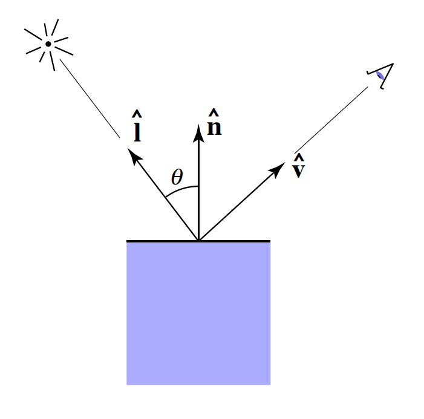{ width="250" }
{.center-img}

!!! info "着色与阴影"

    局部着色只计算表面点如何反射光，不判断光源与着色点之间是否存在遮挡，因此不会自动产生阴影。着色和阴影是两个不同的问题。

## Blinn-Phong 反射模型

Blinn-Phong 反射模型将物体表面的反射分为漫反射、高光反射和环境光三个分量：

$$
L = L_a + L_d + L_s
$$

### 漫反射

理想漫反射表面会把入射光均匀地散射到各个方向，因此观察到的亮度与观察方向 $\bm{v}$ 无关。

根据 Lambert 余弦定律，表面接收到的能量与光照方向和法线夹角的余弦成正比。漫反射项为

$$
L_d = k_d\frac{I}{r^2}\max(0,\bm{n}\cdot\bm{l})
$$

其中 $k_d$ 是材质的漫反射系数，也可以表示 RGB 颜色。$\max(0,\bm{n}\cdot\bm{l})$ 会排除从表面背面射来的光。

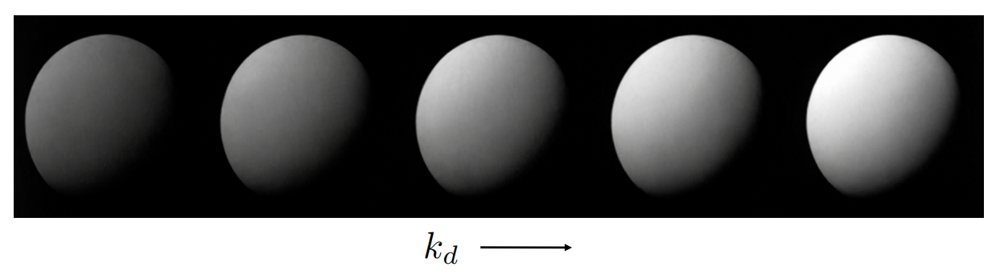{ width="450" }
{.center-img}

### 高光反射

当观察方向接近镜面反射方向时，表面会出现高光。Blinn-Phong 模型使用光照方向与观察方向的半程向量来衡量观察方向是否接近镜面反射方向：

$$
\bm{h}=\frac{\bm{v}+\bm{l}}{\lVert\bm{v}+\bm{l}\rVert}
$$

当 $\bm{h}$ 接近法线 $\bm{n}$ 时，高光最强：

$$
L_s = k_s\frac{I}{r^2}\max(0,\bm{n}\cdot\bm{h})^p
$$

$k_s$ 是高光反射系数，指数 $p$ 控制高光范围。$p$ 越大，反射波瓣越窄，高光越集中，物体看起来越光滑。

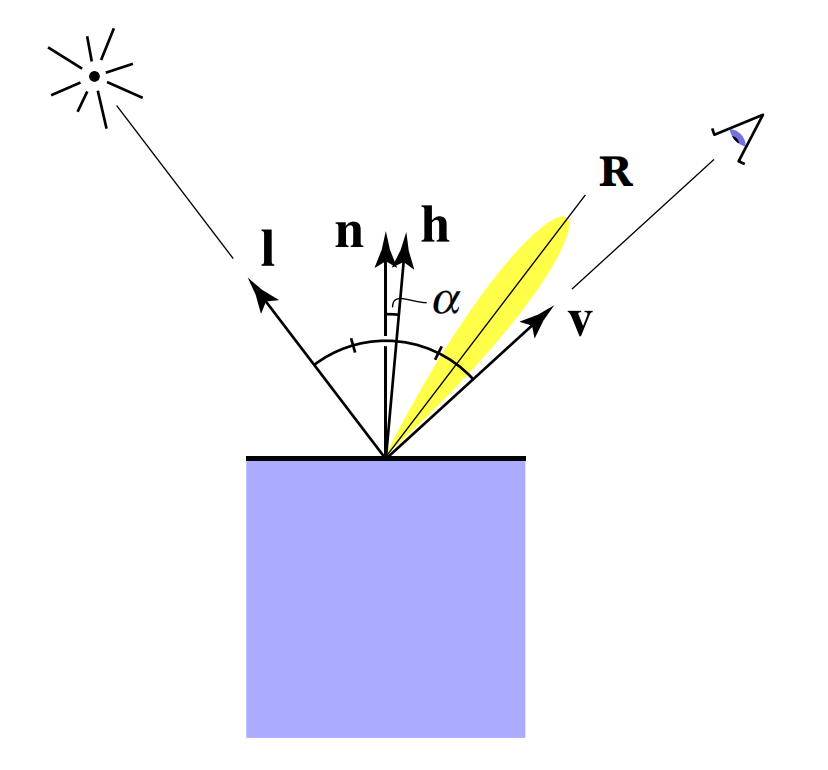{ width="250" }
{.center-img}

### 环境光

Blinn-Phong 模型用一个常数项近似来自环境的间接光照：

$$
L_a = k_a I_a
$$

其中 $I_a$ 是环境光强度，$k_a$ 是材质的环境光系数。这个分量不依赖位置、法线和观察方向，只用于避免未被直接照亮的区域完全变黑，并不是真实的全局光照计算。

将三个分量相加，可得

$$
L = k_a I_a
+ k_d\frac{I}{r^2}\max(0,\bm{n}\cdot\bm{l})
+ k_s\frac{I}{r^2}\max(0,\bm{n}\cdot\bm{h})^p
$$

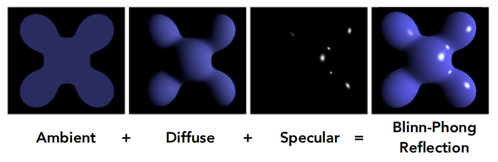{ width="550" }
{.center-img}

## 着色频率

反射模型规定如何计算一个着色点的颜色，着色频率则规定在三角形的哪些位置执行这次计算。

### {{abbr: 逐面着色}}

每个三角形只使用一个面法线并计算一次颜色，整个三角形具有相同的着色结果。计算量较小，但曲面会呈现明显的多边形棱角。

### {{abbr: 逐顶点着色}}

在每个顶点处计算颜色，再在三角形内部插值顶点颜色。它比逐面着色平滑，但三角形内部的光照变化只能由顶点结果近似。

### {{abbr: 逐像素着色}}

在三角形内部插值顶点法线，并在每个像素处执行完整的着色计算。它的计算量更大，但能得到更平滑的结果。

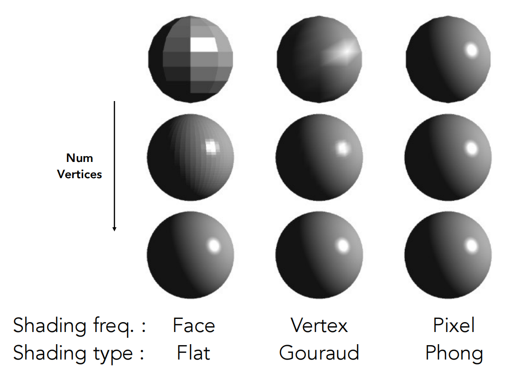{ width="500" }
{.center-img}

!!! 顶点法线

    如果没有来自原始光滑曲面的顶点法线，可以将一个顶点周围的面法线相加后归一化来推断：

    $$
    \bm{n}_v =
    \frac{\sum_i \bm{n}_i}
    {\left\lVert\sum_i \bm{n}_i\right\rVert}
    $$

!!! info "Phong Shading 与 Blinn-Phong 反射模型"

    Phong Shading 描述的是逐像素插值法线并着色的方法，Blinn-Phong 描述的是反射模型，二者不是同一个概念。

## 实时渲染管线

实时渲染管线将三维场景逐步转换为屏幕上的像素：

1. **顶点处理**：对顶点应用模型、视图和投影变换，得到屏幕空间中的顶点。
2. **三角形处理**：将顶点组织为三角形图元。
3. **光栅化**：采样三角形的覆盖范围，生成片元。
4. **片元处理**：计算材质、纹理和光照，得到片元颜色。
5. **帧缓冲操作**：执行深度测试等操作，决定最终写入帧缓冲的颜色。

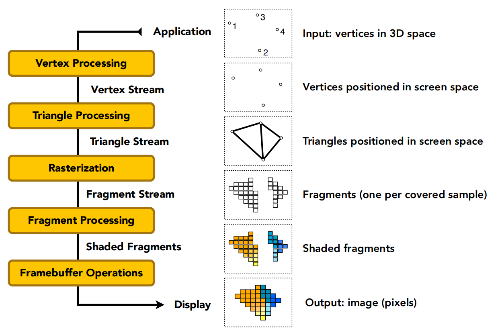{ width="550" }
{.center-img}

现代渲染管线允许通过着色器程序定义顶点处理和片元处理的操作。一个顶点着色器描述单个顶点的处理方式，一个片元着色器描述单个片元的处理方式，GPU 会对大量顶点或片元并行执行这些程序。

## 纹理映射

物体表面是二维的，因此可以在三维表面与一张二维图像之间建立映射。纹理使用 $(u,v)$ 表示坐标，每个三角形顶点都带有对应的纹理坐标。光栅化产生片元后，对顶点纹理坐标进行插值，即可查询纹理在该表面点的值。

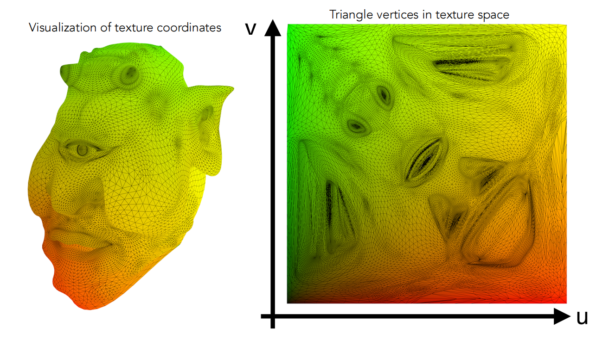{ width="400" }
{.center-img}

最常见的用法是让纹理决定漫反射系数：

$$
k_d(P)=T(u(P),v(P))
$$

再将 $k_d(P)$ 代入反射模型。

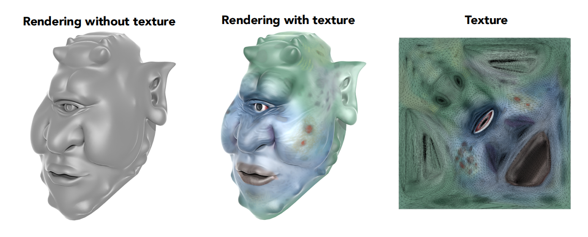{ width="650" }
{.center-img}

纹理坐标可以超出 $[0,1]^2$，配合重复寻址在表面上平铺同一张纹理。

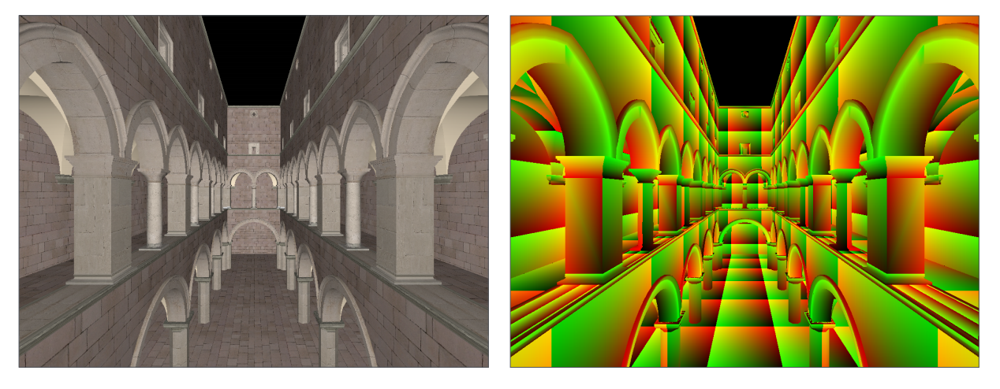{ width="600" }
{.center-img}

### 重心坐标

重心坐标用于在三角形内部插值纹理坐标、颜色、法线、深度等顶点属性。

对于三角形 $ABC$ 内的点 $P$，存在

$$
P=\alpha A+\beta B+\gamma C,
\quad
\alpha+\beta+\gamma=1
$$

当 $\alpha,\beta,\gamma$ 均非负时，$P$ 位于三角形内部。三个坐标可以由子三角形的面积比得到：

$$
\alpha=\frac{S_{PBC}}{S_{ABC}},\quad
\beta=\frac{S_{PCA}}{S_{ABC}},\quad
\gamma=\frac{S_{PAB}}{S_{ABC}}
$$

得到重心坐标后，任意顶点属性 $V$ 都可以线性插值：

$$
V(P)=\alpha V_A+\beta V_B+\gamma V_C.
$$

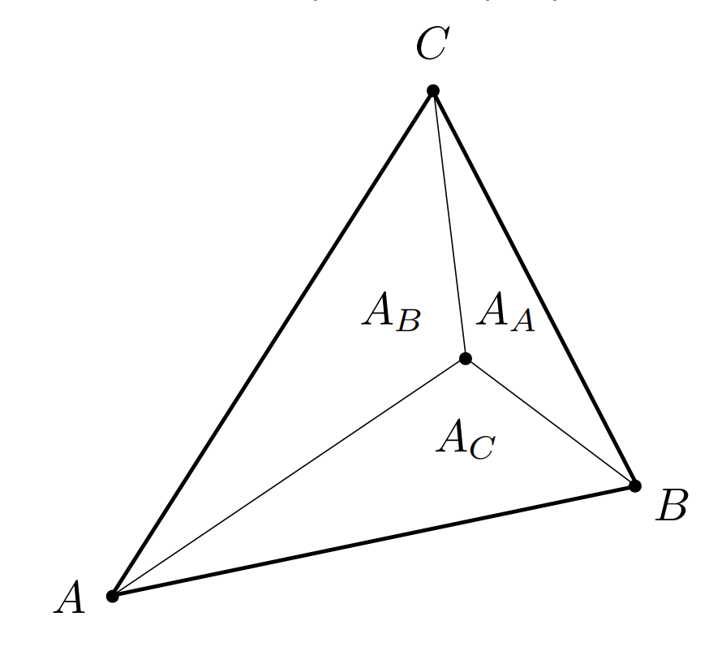{ width="250" }
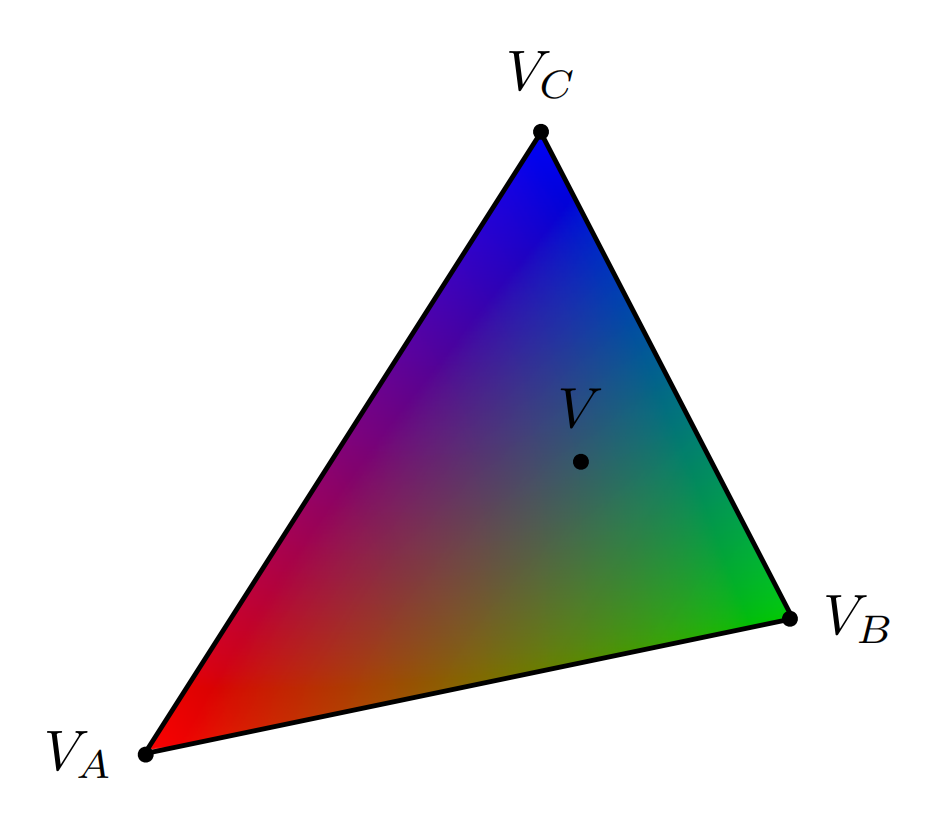{ width="250" }
{.md-img-group}

### 透视校正插值

重心坐标在透视投影前后并不保持不变。透视投影需要执行齐次除法，将裁剪空间坐标 $(x,y,z,w)$ 转换为 $(x/w,y/w,z/w)$，这个除法是非线性变换，因此直接使用屏幕空间重心坐标线性插值顶点属性会产生错误。例如，纹理坐标会随深度以错误的速度变化，使纹理看起来发生扭曲。

设点 $P$ 在投影后的三角形中的屏幕空间重心坐标为 $\alpha,\beta,\gamma$，三个顶点的属性分别为 $V_A,V_B,V_C$，裁剪空间齐次分量分别为 $w_A,w_B,w_C$。透视校正后的属性为

$$
V(P)=
\frac{
\alpha V_A/w_A+
\beta V_B/w_B+
\gamma V_C/w_C
}{
\alpha/w_A+
\beta/w_B+
\gamma/w_C
}
$$

其中，$w_A,w_B,w_C$ 是执行透视除法前的裁剪空间齐次分量，不是 NDC 深度或写入深度缓冲的值。

计算时，可以先对 $1/w$ 和 $V/w$ 分别进行屏幕空间线性插值：

$$
\begin{aligned}
q(P) &= \frac{\alpha}{w_A}+\frac{\beta}{w_B}+\frac{\gamma}{w_C}\\
R(P) &= \frac{\alpha V_A}{w_A}+\frac{\beta V_B}{w_B}+\frac{\gamma V_C}{w_C}
\end{aligned}
$$

再通过 $V(P)=R(P)/q(P)$ 恢复属性。纹理坐标、颜色、空间位置和法线等顶点属性都可以使用这种方法，法线在插值后还需要重新归一化。

这个公式具有两个直观性质：

- 当 $P$ 位于某个顶点时，结果就是该顶点的原始属性；
- 当三个顶点的 $w$ 相等时，分子和分母中的 $w$ 会相互抵消，公式退化为普通的重心坐标线性插值。

## 纹理查询与过滤

纹理中的一个像素称为纹素。屏幕采样点通常不会恰好落在纹素中心，而且一个屏幕像素在纹理空间中的覆盖范围会随投影发生变化，因此纹理查询不能总是简单地取最近纹素。

### 纹理放大

当纹理分辨率不足，一个纹素覆盖多个屏幕像素时会发生纹理放大。常见的纹理查询方式有：

- 最近邻采样直接返回距离查询点最近的纹素，速度最快，但会产生明显的块状边界。
- 双线性插值使用查询点周围 $2\times2$ 个纹素，分别沿两个坐标轴做线性插值。
- 双三次插值使用查询点周围 $4\times4$ 个纹素，以更高的计算开销换取更平滑的结果和更好的细节保留。

双线性插值的计算过程如下。定义一维线性插值为

$$
\operatorname{lerp}(x,v_0,v_1)=v_0+x(v_1-v_0)
$$

若查询点在四个纹素 $u_{00},u_{10},u_{01},u_{11}$ 之间的局部坐标为 $(s,t)$，则

$$
\begin{aligned}
u_0 &= \operatorname{lerp}(s,u_{00},u_{10})\\
u_1 &= \operatorname{lerp}(s,u_{01},u_{11})\\
u &= \operatorname{lerp}(t,u_0,u_1)
\end{aligned}
$$

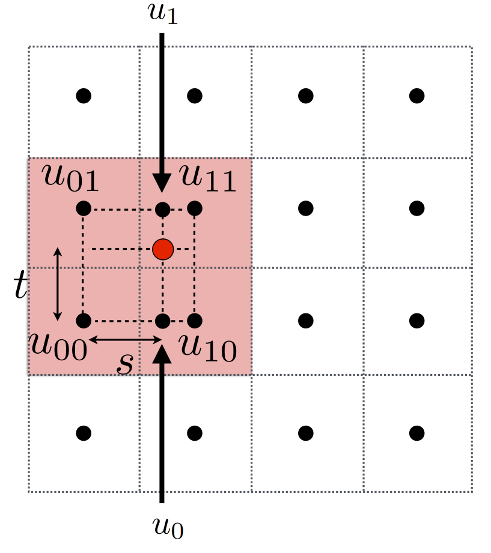{ width="200" }
{.center-img}

双三次插值使用一个可分离的三次插值核。若查询点在中心纹素内的局部坐标为 $(s,t)$，周围纹素值为 $u_{ij}$，则可以写为

$$
f(s,t)=\sum_{i=-1}^{2}\sum_{j=-1}^{2}
u_{ij}w(s-i)w(t-j)
$$

其中 $w$ 是三次插值核。计算时可以先对四行纹素分别沿 $u$ 方向插值，再对四个中间结果沿 $v$ 方向插值。与双线性插值相比，它需要读取 $16$ 个纹素，但曲线过渡更平滑。具体锐度以及是否产生轻微振铃取决于所用的三次插值核。

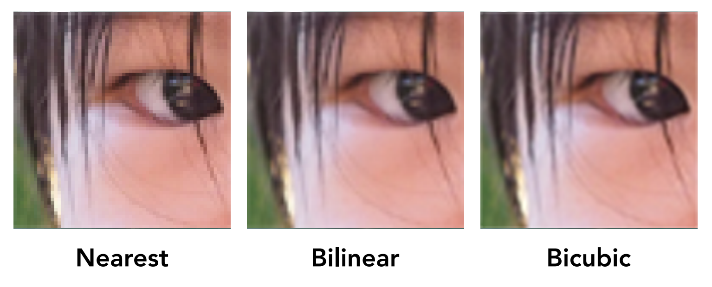{ width="600" }
{.center-img}

### 纹理缩小

当一个屏幕像素覆盖纹理中的大量纹素时会发生纹理缩小。此时只查询一个纹素相当于对高频纹理进行低频采样，会产生锯齿和摩尔纹。

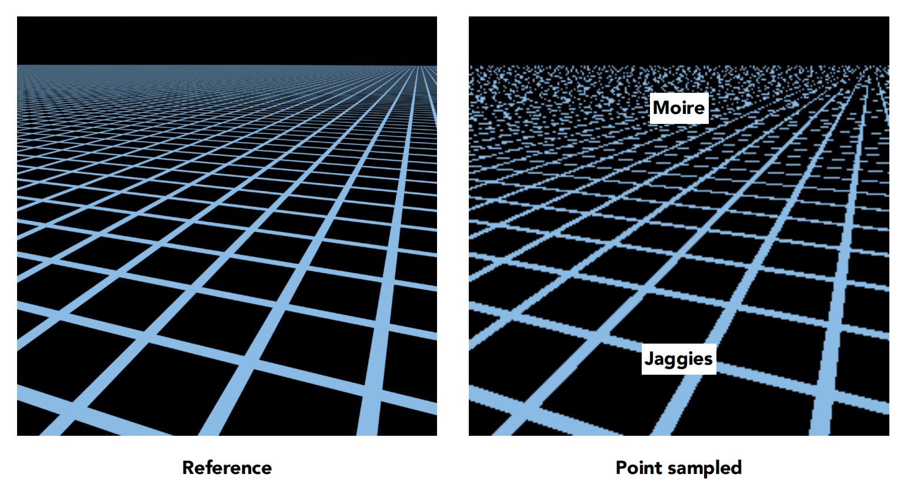{ width="500" }
{.center-img}

如果增加屏幕内的采样点，可能需要很高的采样率。更直接的方法是求出像素足迹覆盖范围内的平均纹理值。

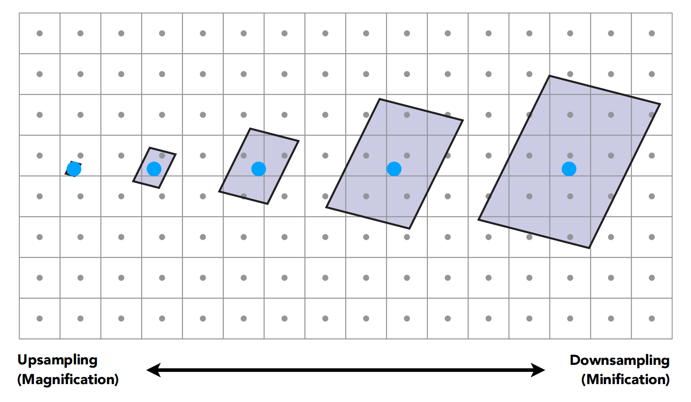{ width="450" }
{.center-img}

### Mipmap

Mipmap 预先保存一组逐级缩小的纹理。第 $D$ 级的宽和高都是原纹理的 $1/2^D$，因此每一级可以近似回答不同大小的正方形区域平均值查询。

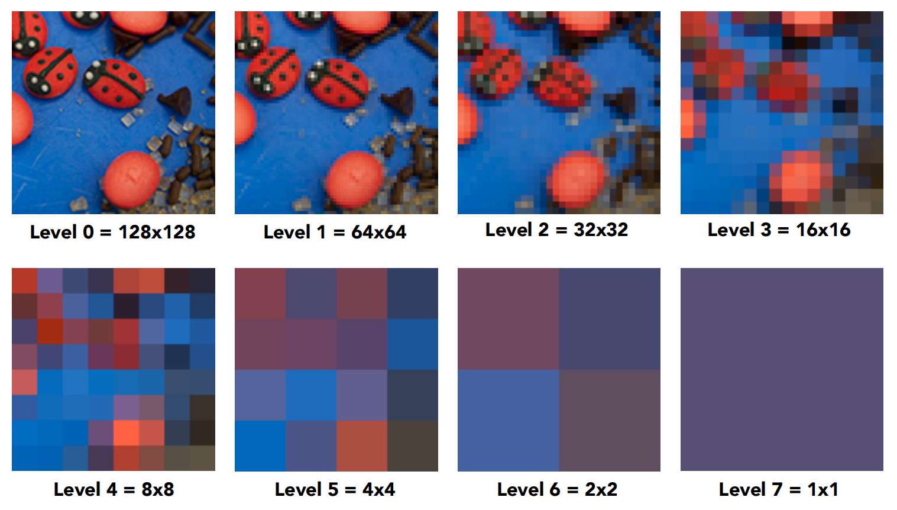{ width="500" }
{.center-img}

Mipmap 层级结构如下：

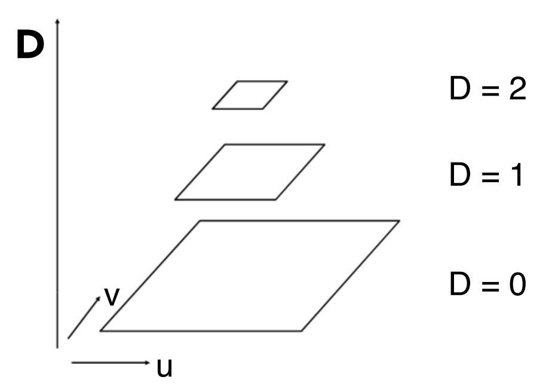{ width="250" }
{.center-img}

所有层级的总存储量为

$$
1+\frac{1}{4}+\frac{1}{16}+\cdots=\frac{4}{3}
$$

相对于原纹理增加约 $1/3$ 的存储空间。

可以通过相邻屏幕采样点的纹理坐标变化估计像素足迹。将 $u,v$ 换算为纹素坐标后，令

$$
\begin{aligned}
L_x &= \sqrt{\left(\frac{\partial u}{\partial x}\right)^2+\left(\frac{\partial v}{\partial x}\right)^2}\\
L_y &= \sqrt{\left(\frac{\partial u}{\partial y}\right)^2+\left(\frac{\partial v}{\partial y}\right)^2}\\
L &= \max(L_x,L_y)\\
D &= \log_2 L
\end{aligned}
$$

$D$ 表示合适的 Mipmap 层级。

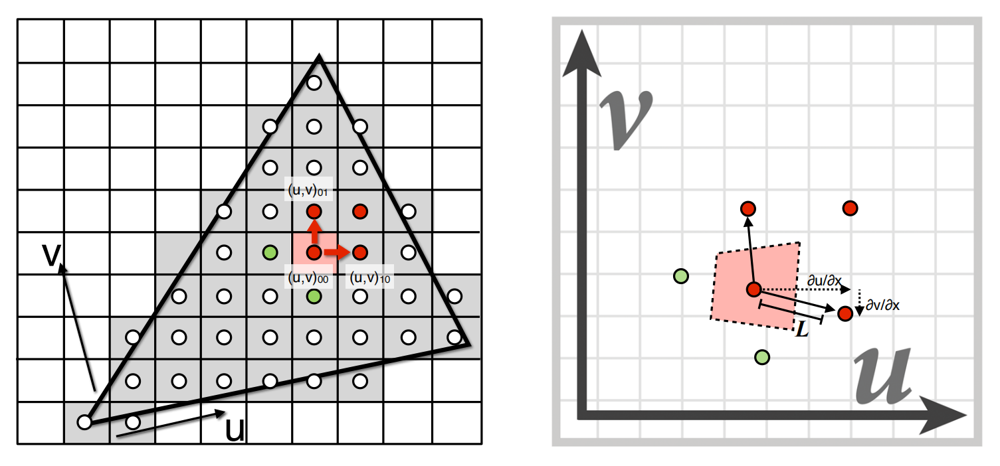{ width="500" }
{.center-img}

若直接取最接近的整数层级，过滤结果会在层级切换处发生突变，形成可见的层级边界。可以使用三线性插值平滑层级过渡。

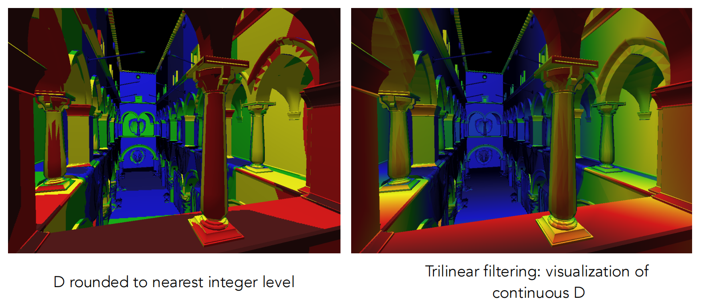{ width="600" }
{.center-img}

令 $D_0=\lfloor D\rfloor$、$D_1=D_0+1$，并记 $\lambda=D-D_0$。先在两个层级上分别进行双线性插值，得到 $C_0$ 和 $C_1$，最终结果为

$$
C=\operatorname{lerp}(\lambda,C_0,C_1)
=(1-\lambda)C_0+\lambda C_1
$$

这里“三线性”指的是两次双线性插值加一次层级间的线性插值，通常需要读取相邻两层共 $8$ 个纹素。

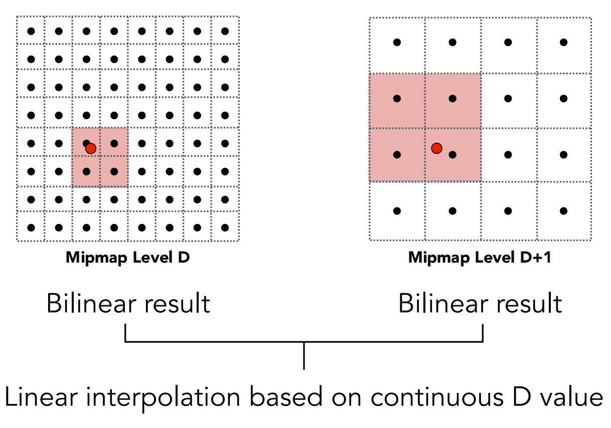{ width="400" }
{.center-img}

### 各向异性过滤

Mipmap 将像素足迹近似为正方形，但透视投影下的足迹往往是细长或倾斜的区域。

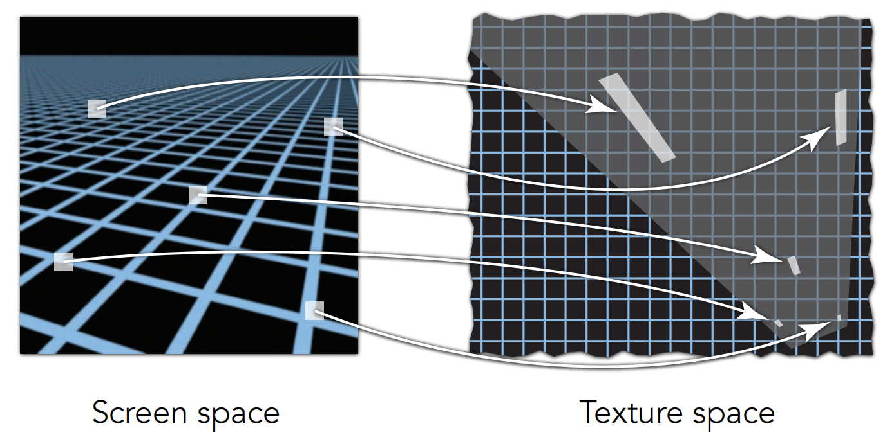{ width="600" }
{.center-img}

如果仍按最长边选择一个正方形区域，就会混入过多纹素并造成过度模糊。可以使用各向异性过滤解决此问题：

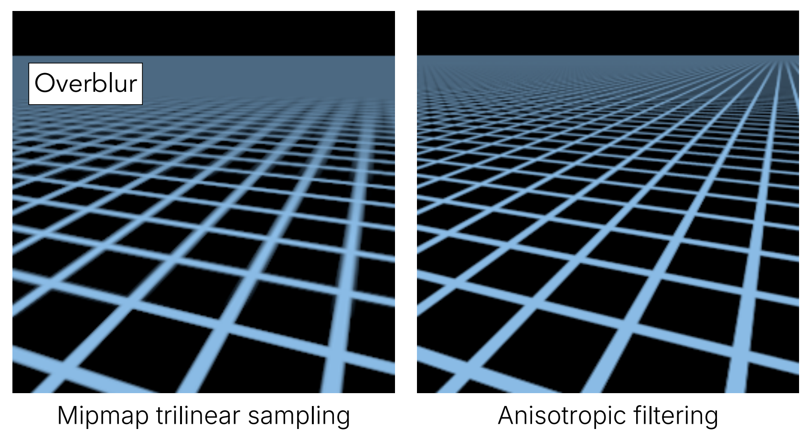{ width="550" }
{.center-img}

各向异性过滤不再用同一个尺度描述纹理坐标的两个方向，而是根据足迹长轴、短轴及方向选择查询范围：

- Ripmap 分别沿 $u$、$v$ 方向生成不同缩放比例的纹理，可以根据两个方向的覆盖范围选择层级，适合轴对齐的长方形足迹，但需要比 Mipmap 更多的存储空间。
- 积分图预先保存二维前缀和，只需查询矩形四角就能快速得到轴对齐区域的平均值，但同样难以处理旋转后的足迹。
- EWA 过滤用椭圆近似倾斜或不规则的像素足迹，对椭圆内的多个纹素按距离加权平均。它可以借助 Mipmap 减少实际查询数量，过滤质量更高，但计算开销也更大。

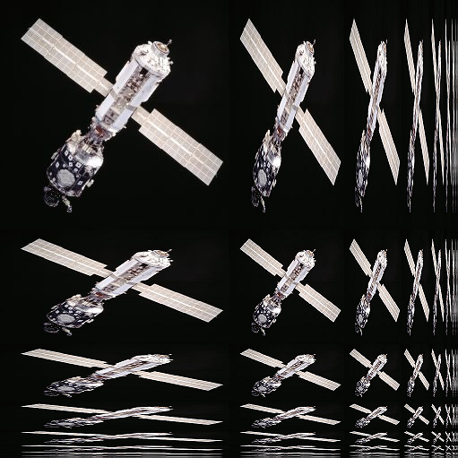{ width="250" }
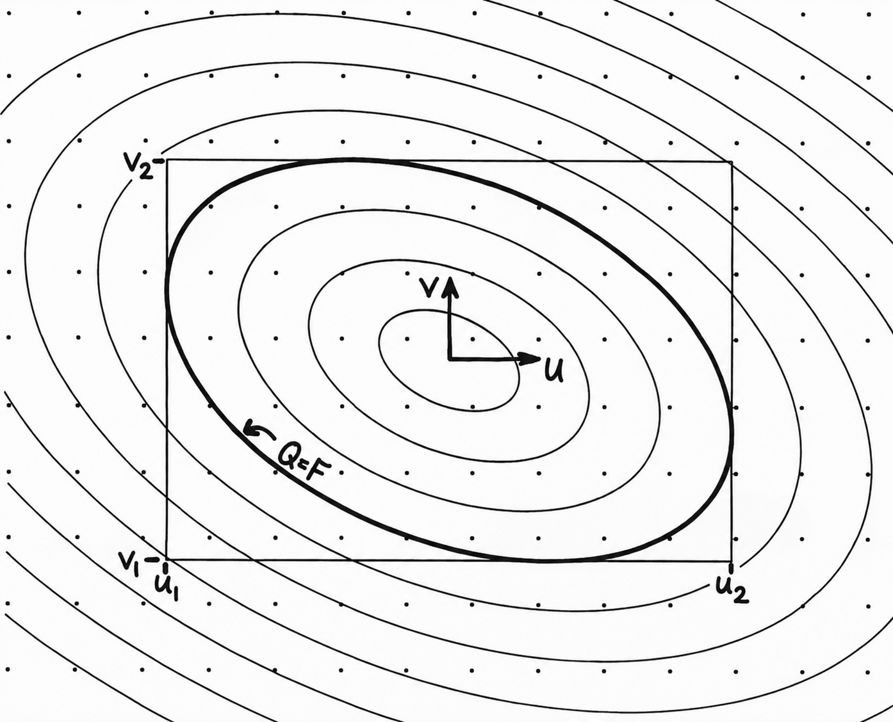{ width="300" }
{.md-img-group}

## 纹理的扩展用途

在现代 GPU 中，可以把纹理理解为一块支持点查询和范围查询的内存。纹理不只保存表面颜色，还可以向片元着色器提供各种空间数据。

### 环境映射

环境映射记录来自各个方向的环境光。着色时根据反射方向查询环境贴图，可以近似得到物体对周围环境的反射。

- 球面环境贴图把方向映射到一张二维图像，实现简单，但在顶部和底部容易产生严重畸变。
- 立方体贴图用六张正方形纹理包围场景，根据方向选择对应的面进行查询，畸变更小，但需要完成方向到立方体面的转换。

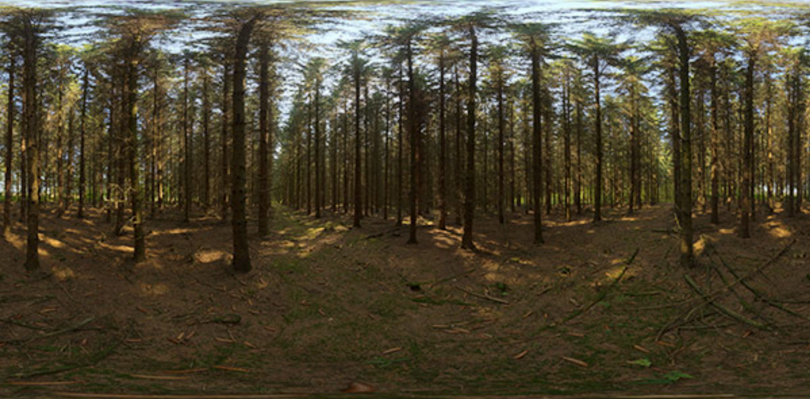{ width="400" }
{.center-img}

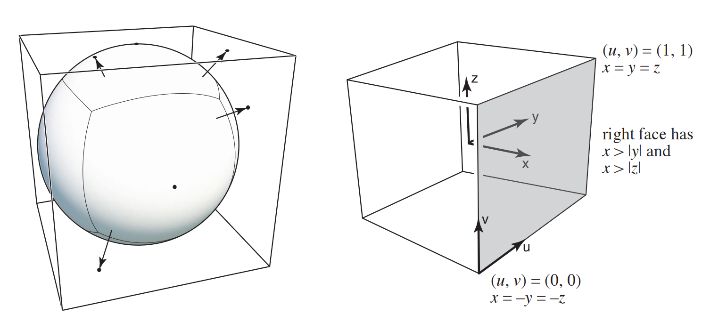{ width="400" }
{.center-img}

### 凹凸映射与位移映射

凹凸映射用高度纹理改变着色时使用的法线，在不增加三角形的情况下产生表面细节。对于局部坐标系中原法线为 $(0,0,1)$ 的平面，可以用高度函数 $h(u,v)$ 的有限差分估计坡度：

$$
\begin{aligned}
d_u &= c_1\bigl(h(u+1,v)-h(u,v)\bigr)\\
d_v &= c_2\bigl(h(u,v+1)-h(u,v)\bigr)\\
\bm{n}' &= \operatorname{normalize}(-d_u,-d_v,1)
\end{aligned}
$$

这里得到的是局部坐标中的法线，还需要转换到实际表面的坐标系。法线贴图则直接保存扰动后的法线。

位移映射可以使用与凹凸映射相同的高度纹理，但它会真正移动几何顶点，而不是只修改着色时的法线。

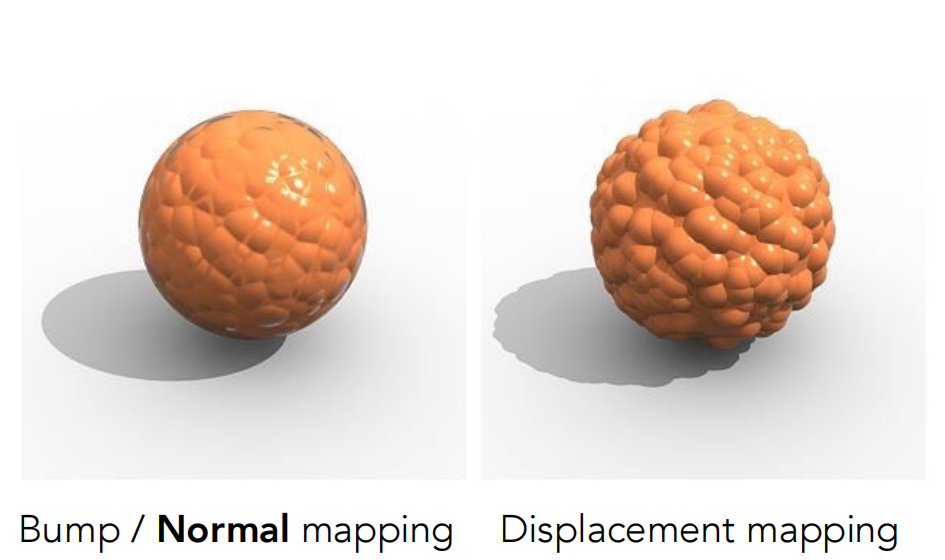{ width="400" }
{.center-img}

### 其他用途

- 使用三维程序噪声定义实体内部连续的材质
- 预先计算环境光遮蔽等着色信息，在渲染时直接查询
- 使用三维纹理保存体数据，进行体积渲染

*[着色]: Shading
*[局部着色]: Local shading
*[漫反射]: Diffuse reflection
*[Lambert 余弦定律]: Lambert's cosine law
*[高光反射]: Specular reflection
*[环境光]: Ambient lighting
*[Blinn-Phong 反射模型]: Blinn-Phong reflectance model
*[半程向量]: Half vector
*[着色频率]: Shading frequency
*[实时渲染管线]: Real-time rendering pipeline
*[片元]: Fragment
*[着色器]: Shader
*[纹理映射]: Texture mapping
*[纹理坐标]: Texture coordinates
*[重心坐标]: Barycentric coordinates
*[透视校正插值]: Perspective-correct interpolation
*[纹素]: Texel
*[双线性插值]: Bilinear interpolation
*[双三次插值]: Bicubic interpolation
*[纹理放大]: Texture magnification
*[纹理缩小]: Texture minification
*[像素足迹]: Pixel footprint
*[三线性插值]: Trilinear interpolation
*[各向异性过滤]: Anisotropic filtering
*[积分图]: Summed-area table (SAT)
*[EWA]: Elliptical weighted average
*[凹凸映射]: Bump mapping
*[法线贴图]: Normal map
*[位移映射]: Displacement mapping
*[程序噪声]: Procedural noise
*[环境光遮蔽]: Ambient occlusion
*[体积渲染]: Volume rendering
*[逐面着色]: Flat shading
*[逐顶点着色]: Gouraud shading
*[逐像素着色]: Phong shading
