---
tags:
  - 计算机图形学
---

# 变换

## 二维变换

线性变换：

$$\bm{x}' = \bm{M} \bm{x}$$

### 缩放

坐标关系：

$$
\begin{aligned} x'&=sx\\ y'&=sy \end{aligned}
$$

写成矩阵形式：

$$
\vctwo{x'}{y'} =
\mattwo{s}{0}{0}{s}
\vctwo{x}{y}
$$

非均匀缩放：

$$
\vctwo{x'}{y'} =
\mattwo{s_x}{0}{0}{s_y}
\vctwo{x}{y}
$$

### 镜像

水平镜像：

$$
\vctwo{x'}{y'} =
\mattwo{-1}{0}{0}{1}
\vctwo{x}{y}
$$

### 切变

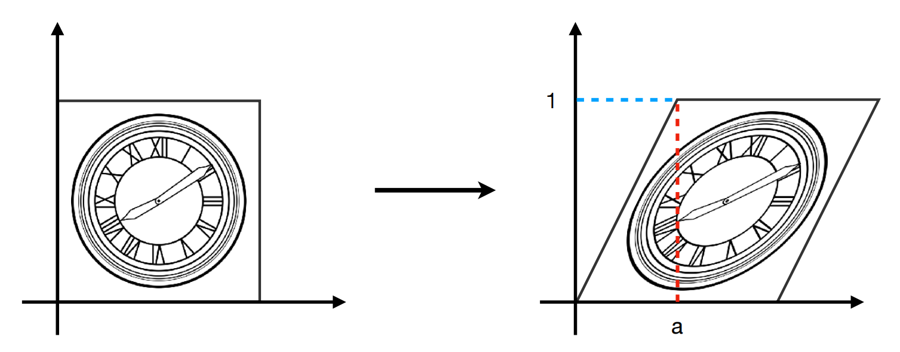{ width="500" }
{.center-img}

矩阵形式：

$$
\vctwo{x'}{y'} =
\mattwo{1}{a}{0}{1}
\vctwo{x}{y}
$$

可以理解为基变换为 $[1, 0]^\top$、$[a, 1]^\top$。

### 旋转

默认关于原点旋转，方向为逆时针。

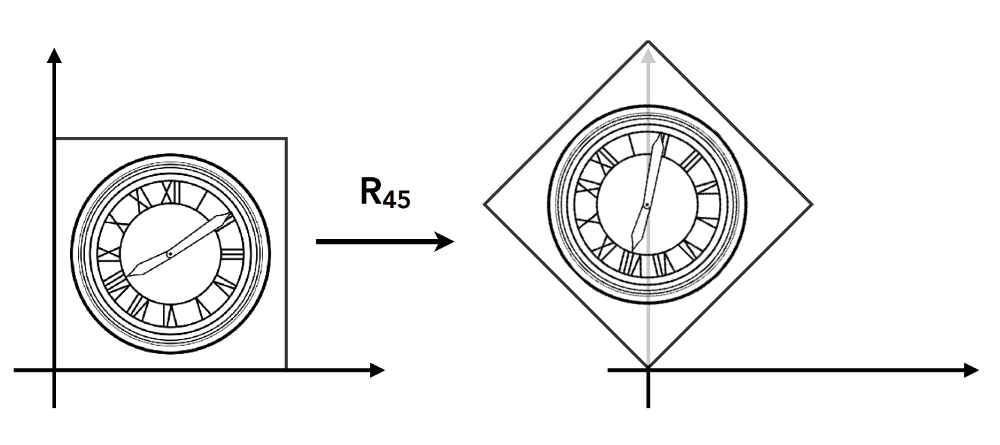{ width="500" }
{.center-img}

矩阵形式：

$$
\vctwo{x'}{y'} =
\mattwo{\ct}{-\st}{\st}{\ct}
\vctwo{x}{y}
$$

从基变换的角度理解：

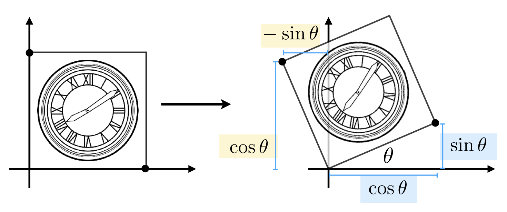{ width="500" }
{.center-img}

基变换为 $[\cos \theta, \sin \theta]^\top$、$[-\sin \theta, \cos \theta]^\top$。

一个重要性质（正交性）：

$$\bm{R}_{-\theta} = \bm{R} _\theta ^{-1} = \bm{R} _\theta ^\top$$

## 齐次坐标

平移变换：

$$
\begin{aligned} x' &= x + t_x\\ y' &= y + t_y \end{aligned}
$$

不是线性变换，无法被表示为矩阵形式。为了避免其特殊性，我们引入齐次坐标的概念。

添加第 3 个坐标（W 坐标）：

- 二维点表示为 $[x, y, 1] ^ \top$
- 二维向量表示为 $[x, y, 0] ^ \top$

这样平移变换的矩阵表示为：

$$
\vcthree{x'}{y'}{w'} =
\matthree{1 & 0 & t_x}{0 & 1 & t_y}{0 & 0 & 1}
\vcthree{x}{y}{1} =
\vcthree{x + t_x}{y + t_y}{1}
$$

从基变换的角度可以理解为空间切变操作将整个 $z=1$ 平面进行了平移。

点和向量互相运算的结果：

- 向量 + 向量 = 向量
- 点 - 点 = 向量
- 点 + 向量 = 点

对于点于点之间的运算，我们规定：

$[x, y, w] ^ \top$ 表示二维点 $[x / w, y / w, 1] ^ \top$，$w \neq 0$，这样两个点相加的效果为取两个点的中点。

在此规定下，齐次坐标还有一个重要性质：将所有坐标等比例缩放后表示的点不变。

### 仿射变换

仿射变换可以写成线性变换 + 平移变换的形式：

$$
\vctwo{x'}{y'} =
\mattwo{a}{b}{c}{d}
\vctwo{x}{y} +
\vctwo{t_x}{t_y}
$$

写成齐次坐标的形式：

$$
\vcthree{x'}{y'}{1} =
\matthree{a & b & t_x}{c & d & t_y}{0 & 0 & 1}
\vcthree{x}{y}{1}
$$

## 逆变换和复合变换

$\bm{M} ^ {-1}$ 是 $\bm{M}$ 的逆矩阵，其对应变换互为逆变换。

矩阵乘法对应变换的复合：

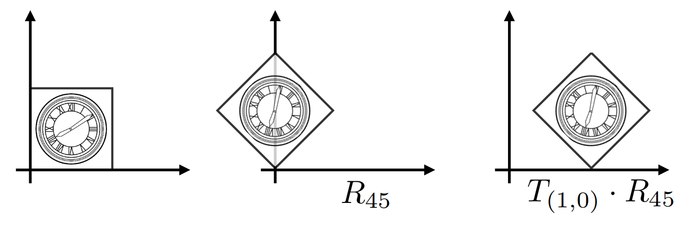{ width="600" }
{.center-img}

矩阵乘法不具有交换律，对应复合也没有交换律。

变换的应用顺序应按右结合顺序理解。矩阵乘法有结合律，矩阵先相乘得到的是复合变换对应的矩阵。

对 $\bm{x}$ 应用一个仿射变换序列 $A_1, A_2, A_3, \ldots$，可写为：

$$
A_n(\ldots A_2(A_1(\bm{x}))) = \bm{A_n} \cdots \bm{A_2} \cdot \bm{A_1} \cdot \vcthree{x}{y}{1}
$$

## 复杂变换的分解

绕着给定点 $\bm{c}$ 旋转可分解为：

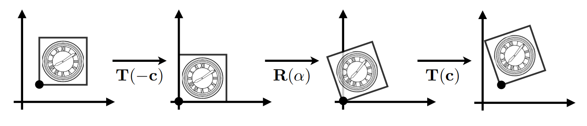
{.center-img}

用矩阵表示为 $\bm{T}(\bm{c}) \cdot \bm{R}(\alpha) \cdot \bm{T}(-\bm{c})$。

## 三维变换

三维下的齐次坐标：

- 点表示为 $[x, y, z, 1] ^ \top$
- 向量表示为 $[x, y, z, 0] ^ \top$

$[x, y, z, w] ^ \top$ 表示三维点 $[x / w, y / w, z / w, 1] ^ \top$，$w \neq 0$。

三维下用 $4 \times 4$ 矩阵表示仿射变换：

$$
\vcfour{x'}{y'}{z'}{1} =
\matfour
  {a & b & c & t_x}
  {d & e & f & t_y}
  {g & h & i & t_z}
  {0 & 0 & 0 & 1}
\vcfour{x}{y}{z}{1}
$$

缩放矩阵：

$$
\bm{S}(s_x, s_y, s_z) =
\matfour
  {s_x & 0 & 0 & 0}
  {0 & s_y & 0 & 0}
  {0 & 0 & s_z & 0}
  {0 & 0 & 0 & 1}
$$

平移矩阵：

$$
\bm{T}(t_x, t_y, t_z) =
\matfour
  {1 & 0 & 0 & t_x}
  {0 & 1 & 0 & t_y}
  {0 & 0 & 1 & t_z}
  {0 & 0 & 0 & 1}
$$

绕 $x$、$y$、$z$ 轴旋转矩阵：

$$
\bm{R}_x(\alpha) =
\matfour
  {1 & 0 & 0 & 0}
  {0 & \ca & -\sa & 0}
  {0 & \sa & \ca & 0}
  {0 & 0 & 0 & 1}
$$

$$
\bm{R}_y(\alpha) =
\matfour
  {\ca & 0 & \sa & 0}
  {0 & 1 & 0 & 0}
  {-\sa & 0 & \ca & 0}
  {0 & 0 & 0 & 1}
$$

$$
\bm{R}_z(\alpha) =
\matfour
  {\ca & -\sa & 0 & 0}
  {\sa & \ca & 0 & 0}
  {0 & 0 & 1 & 0}
  {0 & 0 & 0 & 1}
$$

一般三维旋转用基本旋转的复合来处理：

$$\bm{R}_{xyz}(\alpha, \beta, \gamma) = \bm{R}_x(\alpha) \bm{R}_y(\beta) \bm{R}_z(\gamma)$$

其中 $\alpha, \beta, \gamma$ 被成为欧拉角。

对于绕轴 $\bm{n}$ 旋转角为 $\alpha$ 的旋转，使用罗德里格斯旋转公式处理：

$$
\bm{R}(\bm{n},\alpha) = 
\ca\bm{I} +
(1-\ca)\bm{n}\bm{n}^{\top} +
\sa\bm{N}
$$

其中

$$
\bm{N} =
\matthree{0 & -n_z & n_y}{n_z & 0 & -n_x}{-n_y & n_x & 0}
$$

对于轴不过原点的旋转，通过平移和旋转的复合处理。

##  观测变换

观测变换是指通过观测获得一张照片的过程：

- 模型变换
- 视图变换
- 投影变换

简称 MVP 变换。

### 视图变换

首先定义相机参数：

- 位置：$\bm{e}$
- 观测方向：$\hat{\bm{g}}$
- 向上方向：$\hat{\bm{t}}$

当相机和物体同时运动时，得到的照片保持不变，因此我们将相机固定在原点，观测方向为 $-z$，向上方向为 $y$：

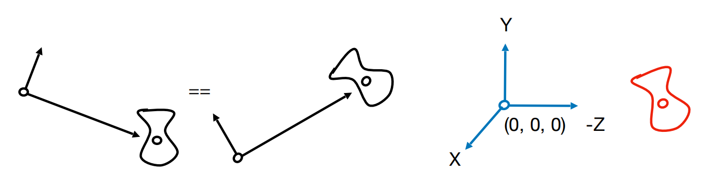{ width="650" }
{.center-img}

我们需要一个 $\bm{M}_{view}$ 矩阵，将相机变换到标准位置。

$\bm{M}_{view}$ 包含以下变换：

- 将 $\bm{e}$ 移动至原点
- 将 $\hat{\bm{g}}$ 旋转至 $-z$ 方向
- 将 $\hat{\bm{t}}$ 旋转至 $y$ 方向
- 将 $\hat{\bm{g}} \times \hat{\bm{t}}$ 旋转至 $x$ 方向

通过平移和旋转的复合得到 $\bm{M}_{view}$ 矩阵：

$$\bm{M}_{view} = \bm{R}_{view} \bm{T}_{view}$$

其中

$$
\bm{T}_{view} =
\matfour
  {1 & 0 & 0 & -x_{\bm{e}}}
  {0 & 1 & 0 & -y_{\bm{e}}}
  {0 & 0 & 1 & -z_{\bm{e}}}
  {0 & 0 & 0 & 1}
$$

对于旋转操作，先考虑其逆变换：

$$
\bm{R}_{view}^{-1} =
\matfour
  {x_{\hat{\bm{g}}\times \hat{\bm{t}}} & x_{\hat{\bm{t}}} & x_{-\hat{\bm{g}}} & 0}
  {y_{\hat{\bm{g}}\times \hat{\bm{t}}} & y_{\hat{\bm{t}}} & y_{-\hat{\bm{g}}} & 0}
  {z_{\hat{\bm{g}}\times \hat{\bm{t}}} & z_{\hat{\bm{t}}} & z_{-\hat{\bm{g}}} & 0}
  {0 & 0 & 0 & 1}
$$

利用正交矩阵的性质，可以得到

$$
\bm{R}_{view} =
\matfour
  {x_{\hat{\bm{g}}\times \hat{\bm{t}}} & y_{\hat{\bm{g}}\times \hat{\bm{t}}} & z_{\hat{\bm{g}}\times \hat{\bm{t}}} & 0}
  {x_{\hat{\bm{t}}} & y_{\hat{\bm{t}}} & z_{\hat{\bm{t}}} & 0}
  {x_{-\hat{\bm{g}}} & y_{-\hat{\bm{g}}} & z_{-\hat{\bm{g}}} & 0}
  {0 & 0 & 0 & 1}
$$

这整个过程也被称为模型视图变换。

### 投影变换

投影变换分为：

- 正交投影
- 透视投影

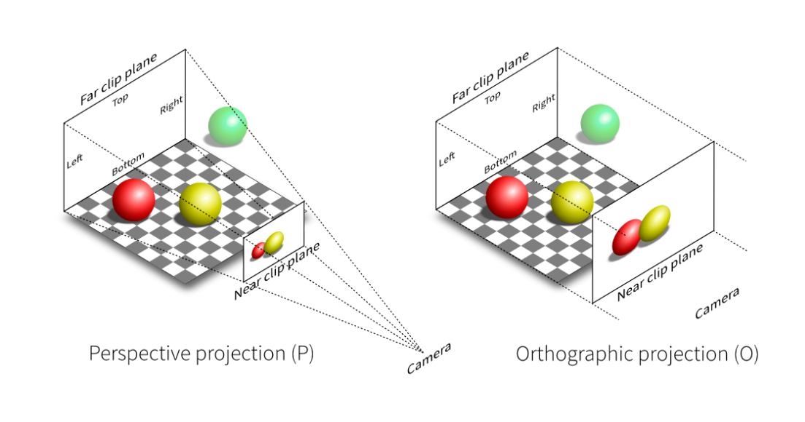{ width="550" }
{.center-img}

#### 正交投影

相机在空间中能看到的范围被称为视景体，通常用 $[l, r] \times [b, t] \times [f, n]$ 描述，我们需要将这个长方体映射到一个正则立方体 $[-1, 1]^3$ 中。

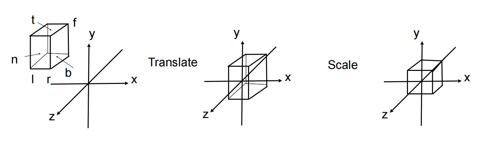{ width="600" }
{.center-img}

注意 $f$ 和 $n$ 的大小关系，这也是 OpenGL 使用左手系的原因。

变换矩阵：

$$
\bm{M}_{ortho} =
\matfour
  {\frac{2}{r - l} & 0 & 0 & 0}
  {0 & \frac{2}{t - b} & 0 & 0}
  {0 & 0 & \frac{2}{n - f} & 0}
  {0 & 0 & 0 & 1}
\matfour
  {1 & 0 & 0 & -\frac{r + l}{2}}
  {0 & 1 & 0 & -\frac{t + b}{2}}
  {0 & 0 & 1 & -\frac{n + f}{2}}
  {0 & 0 & 0 & 1}
$$

#### 透视投影

透视投影分为两个步骤：

1. 将视椎体变换为一个长方体（$\bm{M}_{persp \rightarrow ortho}$）
2. 对长方体做正交投影（$\bm{M}_{ortho}$）

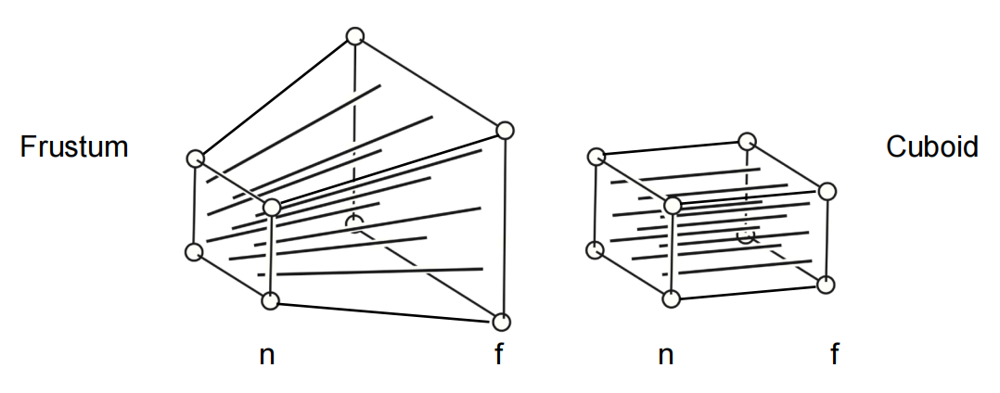{ width="500" }
{.center-img}

我们首先寻找挤压前后 $x$、$y$ 坐标的变化，根据相似三角形有：

$$
x'=\frac{n}{z}x,\quad y'=\frac{n}{z}y
$$

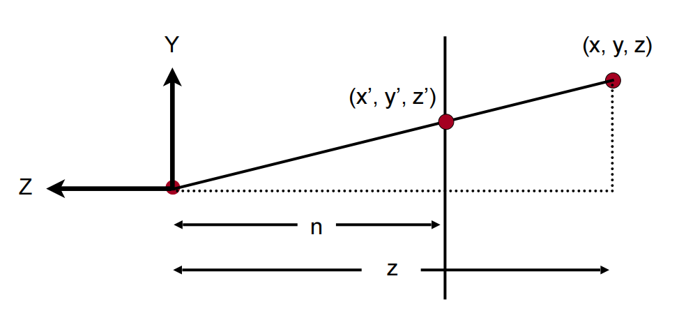{ width="500" }
{.center-img}

在齐次坐标下，我们有：

$$
\bm{M}_{persp \rightarrow ortho}^{4 \times 4}
\vcfour{x}{y}{z}{1} =
\vcfour{nx}{ny}{zz'}{z} \approx
\vcfour{nx/z}{ny/z}{z'}{1}
$$

这里利用了齐次坐标的性质，将线性变换无法实现的除法“延后”。

根据此式，我们已经可以填出矩阵的一部分：

$$
\bm{M}_{persp \rightarrow ortho} =
\matfour{n & 0 & 0 & 0}{0 & n & 0 & 0}{? & ? & ? & ?}{0 & 0 & 1 & 0}
$$

我们还有两个附加条件：

- 近平面上的点坐标不会改变
- 远平面上的点 $z$ 坐标不会改变

我们取近平面和远平面上的两个不动点：

$$
\vcfour{x}{y}{n}{1} \approx \vcfour{nx}{ny}{n^2}{n},\quad
\vcfour{0}{0}{f}{1} \approx \vcfour{0}{0}{f^2}{f}
$$

设矩阵第三行为 $[a,b,c,d]$，则有

$$
\begin{cases}
ax+by+cn+d=n^2\\
cf+d=f^2
\end{cases}
$$

这两个等式要恒成立，我们可以得到：

$$
a=b=0,\quad c=n+f,\quad d=-nf
$$

最终挤压矩阵为：

$$
\bm{M}_{persp \rightarrow ortho} =
\matfour{n & 0 & 0 & 0}{0 & n & 0 & 0}{0 & 0 & n+f & -nf}{0 & 0 & 1 & 0}
$$

最后，我们只需要做正交投影即可：

$$
\bm{M}_{persp} = \bm{M}_{ortho} \bm{M}_{persp \rightarrow ortho}
$$

!!! note "视锥体的另一种参数化定义"

    有时我们用垂直视场角和宽高比定义视锥体：

    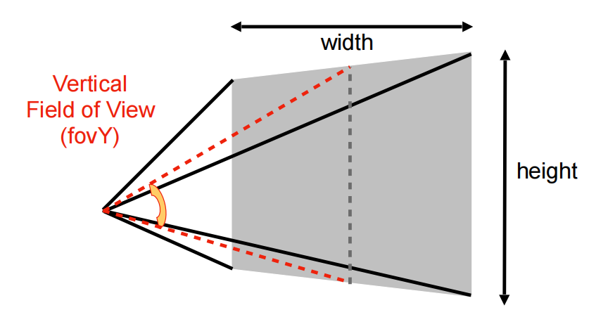{ width="350" }
    {.center-img}

    两种参数之间可以相互转化：

    $$
    \begin{aligned}
    \tan \frac{fovY}{2} &= \frac{t}{|n|}\\
    aspect &= \frac{r}{t}
    \end{aligned}
    $$

    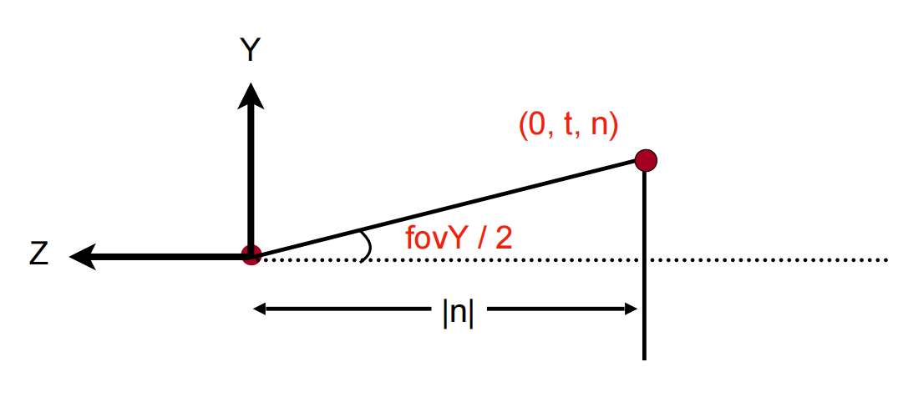{ width="400" }
    {.center-img}

*[缩放]: Scaling
*[非均匀缩放]: Non-uniform scaling
*[镜像]: Reflection
*[切变]: Shear
*[旋转]: Rotation
*[逆时针]: Counterclockwise (CCW)
*[平移变换]: Translation
*[齐次坐标]: Homogeneous coordinates
*[仿射变换]: Affine transformation
*[罗德里格斯旋转公式]: Rodrigues' rotation formula
*[观测变换]: Viewing transformation
*[模型变换]: Model transformation
*[视图变换]: View transformation / Camera transformation
*[投影变换]: Projection transformation
*[正交投影]: Orthographic projection
*[透视投影]: Perspective projection
*[视景体]: View volume
*[正则立方体]: Canonical cube
*[垂直视场角]: Vertical field-of-view (fovY)
*[宽高比]: Aspect ratio
