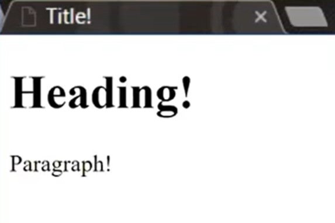
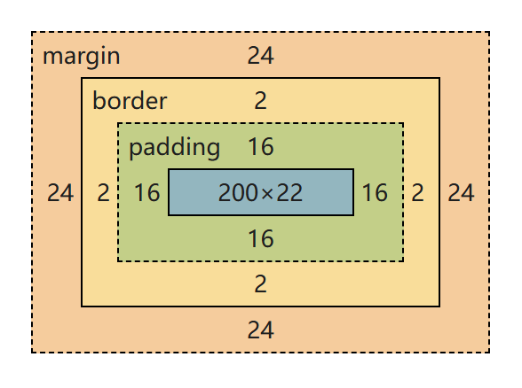

# MIT IAP web.lab

## HTML

HTML 是 Hypertext Markup Language 的缩写，即超文本标记语言，用于描述网页的内容和结构。

我们将它的结构简单理解为嵌套的盒子。

???+ code "简单示例"

    ```html title="hello.html" linenums="1"
    <!DOCTYPE html>
    <html>
        <head>
            <title>Title!</title>
        </head>
        <body>
            <h1>Heading!</h1>
            <p>Paragraph!</p>
        </body>
    </html>
    ```

这段代码展示了一个最小的 HTML 页面结构。

- `<!DOCTYPE html>` 告诉浏览器按照现代 HTML 标准解析页面。
- `<html>` 是整个文档的根元素，里面分为 `<head>` 和 `<body>` 两部分。
- `<head>` 中的 `<title>` 会显示在浏览器标签页上。

在浏览器中，这段代码的效果是这样的：

{ width="190" }

!!! note "开闭标签"

    大多数 HTML 元素由一对标签组成：开始标签写作 `<tag>`，结束标签写作 `</tag>`，中间包裹这个元素的内容。
    
    注意，标签不能交叉嵌套。

### 常见 HTML 标签

| 标签                        | 作用                                                             |
| --------------------------- | ---------------------------------------------------------------- |
| `<html>`                    | HTML 文档的根元素，包裹整个页面。                                |
| `<head>`                    | 存放文档的元信息，例如标题、样式、脚本引用等。                   |
| `<body>`                    | 存放实际显示在网页中的内容。                                     |
| `<h1>`、`<h2>`、`<h3>`、... | 标题标签，通常 `<h1>` 是页面主标题。                             |
| `<p>`                       | 段落标签，用来表示一段正文。                                     |
| `<div>`                     | 通用的块级容器，常用来把一组内容组织在一起，方便布局或添加样式。 |

!!! tip "&lt;div&gt; 的使用"

    `<div>` 本身没有特殊语义，通常只在没有更合适的语义化标签时使用。
    
    例如，如果内容是一篇独立文章，可以优先使用 `<article>`；如果内容是一组导航链接，可以优先使用 `<nav>`。
    
    优先使用语义化标签的原因：
    
    - 对屏幕阅读器更友好，方便视觉障碍用户理解页面结构。
    - 对键盘导航更友好，让用户不依赖鼠标也能浏览页面。
    - 对机器更友好，搜索引擎爬虫等程序更容易理解页面内容。
    - 对人类也更友好，阅读代码时能更快看出每块内容的作用。

### 标签属性

我们可以在开标签中添加一个属性，例如：

```html
<tagname abc="xyz">
    ...
</tagname>
```

这个属性将应用于标签内部的所有内容。

### 插入链接和图像

`<a>` 标签用于创建超链接，`a` 是 anchor 的缩写。它通过 `href` 属性指定链接目标，标签中间的内容则是展示的文本。

```html
<a href="https://example.com">Visit example.com</a>
```

浏览器默认会在当前页面打开链接，如果希望在新标签页中打开，可以添加 `target="_blank"`。

`` 标签用于**插入图像**：

```html

```

其中，`src` 属性指定图片文件的位置，`alt` 属性提供图片无法显示时的替代文本，也能帮助屏幕阅读器理解图片内容。

!!! tip "自闭合标签"

    `` 不需要包裹文本或其他元素，因此它没有对应的结束标签 `</img>`，这种标签称为自闭合标签。
    
    类似的标签还有 `<br>` 和 `<input>`。
    
    在 HTML5 中，自闭合标签末尾的 `/` 可以省略，但在 React JSX 里，必须加 `/`。

## CSS

CSS 是 Cascading Style Sheets 的缩写，即层叠样式表，用于描述网页的外观。HTML 负责组织页面内容和结构，而 CSS 负责控制这些内容如何显示，例如颜色、字体、间距、边框和布局。

一个 CSS 规则通常由选择器和声明块组成：

```css
p {
    color: blue;
    font-size: 16px;
}
```

其中，`p` 是选择器，表示这条规则会应用到所有 `<p>` 元素。花括号中的每一行都是一条样式声明，由属性名和值组成。上面的例子会把段落文字设置为蓝色，并把字号设置为 `16px`。

### ID 和 class

HTML 元素可以通过 `id` 和 `class` 属性添加标识，方便 CSS 选择并设置样式。

```html
<p id="intro">This is the introduction.</p>
<p class="highlight">This is important.</p>
```

在 CSS 中，`id` 选择器前面加 `#`，`class` 选择器前面加 `.`：

```css
#intro {
    font-weight: bold;
}

.highlight {
    color: red;
}
```

使用场景对比：

- id：标识页面中唯一的元素，例如某个特定区域、锚点或需要被 JavaScript 精确找到的元素。
- class：标识一类具有相同样式或行为的元素，可以重复使用在多个元素上。

一般来说，样式复用优先使用 class。只有当某个元素确实需要唯一标识时，才使用 id。

!!! note "Utility class"

    Utility class 是一种只负责单一样式功能的 class，例如 `.text-center` 只负责文字居中，`.mt-2` 只负责设置上边距。
    
    它的特点是粒度小、可复用，适合快速组合样式：
    
    ```html
    <p class="text-center highlight">This is important.</p>
    ```

### CSS 变量

CSS 变量用于保存可以重复使用的样式值，变量名以 `--` 开头，使用时通过 `var()` 读取。常见做法是把全局变量定义在 `:root` 中，这样整个页面都可以使用。

```css
:root {
    --main-color: #3366ff;
    --spacing: 16px;
}

.button {
    color: white;
    background-color: var(--main-color);
    padding: var(--spacing);
}
```

CSS 变量适合存放主题色、间距、字体大小等会反复出现的值。这样如果以后想修改主色，只需要改 `--main-color` 的定义，所有使用它的地方都会一起更新。

!!! note ":root 选择器"

    `:root` 选择器表示文档的根元素，在 HTML 页面中通常就是 `<html>`。把 CSS 变量写在 `:root` 中，相当于定义全局变量，页面中的其他元素都可以通过 `var()` 使用它们。

### 盒子模型

在 CSS 中，每个 HTML 元素都可以看成一个矩形盒子。这个盒子从内到外由四部分组成：

- `content`：内容区域，例如文字、图片本身。
- `padding`：内边距，位于内容和边框之间。
- `border`：边框，包围内容和内边距。
- `margin`：外边距，控制元素和其他元素之间的距离。

{ width="300" }

```css
.box {
    width: 200px;
    padding: 16px;
    border: 2px solid black;
    margin: 24px;
}
```

上面的 `width` 默认只设置 `content` 的宽度。元素实际占用的横向空间还要加上左右 `padding`、左右 `border` 和左右 `margin`。

!!! tip "box-sizing"

    如果设置 `box-sizing: border-box;`，那么 `width` 会包含 `content`、`padding` 和 `border`，布局时通常更直观。

`padding`、`margin` 和 `border-width` 等是复合属性，可以一次写多个值：

```css
.box {
    margin: 10px 20px 30px 40px;
}
```

值与盒子边框的对应关系如下：

- 4 个值：上、右、下、左
- 3 个值：上、左右、下
- 2 个值：上下、左右
- 1 个值：四边相同

!!! warning "复合属性的覆盖"

    复合属性会同时设置多个相关属性，因此可能覆盖之前写过的单属性。
    
    ```css
    .box {
        margin-left: 40px;
        margin: 10px;
    }
    ```
    
    上面的 `margin` 会重新设置四个方向的外边距，所以 `margin-left: 40px;` 会被覆盖，最终左外边距也是 `10px`。如果想保留某一边的特殊值，需要把单属性写在复合属性后面。
    
    `background` 也有类似问题：
    
    ```css
    .box {
        background-color: red;
        background: url("logo.png") no-repeat;
    }
    ```
    
    第二行 `background` 会重置所有背景相关属性，其中也包括 `background-color`，因此红色背景会消失，背景色变回默认的 `transparent`。

### 8 点网格系统

8 点网格系统（8pt grid system）是一种常见的间距设计方法：页面中的间距、尺寸尽量使用 `8px` 的倍数，这样可以让不同元素之间的距离更统一，页面看起来也更整齐。

在 CSS 中，可以用变量保存基础间距：

```css
:root {
    --space-1: 8px;
    --space-2: 16px;
    --space-3: 24px;
}

.card {
    padding: var(--space-2);
    margin-bottom: var(--space-3);
}
```

实际使用时不需要所有数值都严格是 `8px` 的倍数，但对于 `margin`、`padding`、组件高度等布局相关属性，使用统一的间距阶梯能减少随手写数值带来的混乱。

### 标签的默认样式

即使没有写 CSS，浏览器也会给一些 HTML 标签添加默认样式。例如，`<h1>` 通常会显示为更大的粗体文字，`<p>` 段落之间会有默认间距，`<a>` 链接通常是蓝色并带有下划线。

这些默认样式让纯 HTML 页面也具有基本的可读性。不过在实际开发中，我们通常会用 CSS 覆盖或调整这些默认样式，让页面符合自己的设计。

### 结合 HTML 和 CSS

常见做法是把 HTML 和 CSS 分别写在两个文件中：HTML 负责内容结构，CSS 负责页面样式。然后在 HTML 的 `<head>` 中使用 `<link>` 标签引入 CSS 文件。

```html title="index.html"
<!DOCTYPE html>
<html>
    <head>
        <link rel="stylesheet" href="style.css">
    </head>
    <body>
        <h1 class="title">Hello CSS!</h1>
        <p id="intro">This paragraph is styled by CSS.</p>
    </body>
</html>
```

```css title="style.css"
.title {
    color: purple;
}

#intro {
    font-size: 18px;
}
```

这样，浏览器读取 HTML 时会根据 `<link>` 找到 `style.css`，再把 CSS 规则应用到对应的 HTML 元素上。
