# 机器学习基础

## 机器学习框架

设有训练数据 $\{(\bm{x}^1,\hat{y}^1),(\bm{x}^2,\hat{y}^2),\ldots,(\bm{x}^N,\hat{y}^N),\}$，训练过程如下：

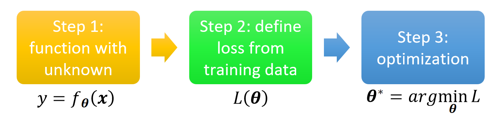{ width="400" }
{.center-img}

设有测试集 $\{\bm{x}^{N+1},\bm{x}^{N+2},\ldots,\bm{x}^{N+M}\}$，使用训练好的函数标注测试集 $y=f_{\bm{\theta}^*}(\bm{x})$，得到结果 $\{y^{N+1},y^{N+2},\ldots,y^{N+M}\}$。

## 通用指引

下面是机器学习模型训练与调试过程中的诊断逻辑树，它引导我们根据训练集和测试集的损失情况来诊断问题并采取正确的解决方案：

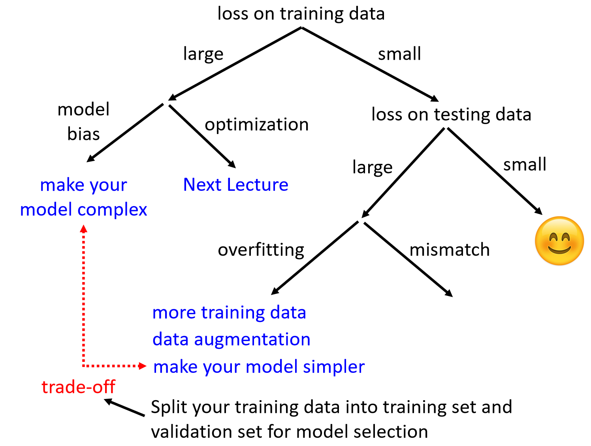{ width="400" }
{.center-img}

## 检查训练集损失

若训练集损失较大，说明模型连训练数据都没学好，问题出在模型表达能力或优化上。

### {{abbr:模型偏差|Model Bias}}

模型偏差指的是模型过于简单的情况。

模型能够表达的函数集合过小，导致没有函数能使损失将至足够低，因此会出现训练数据上损失就难以降低的情况：

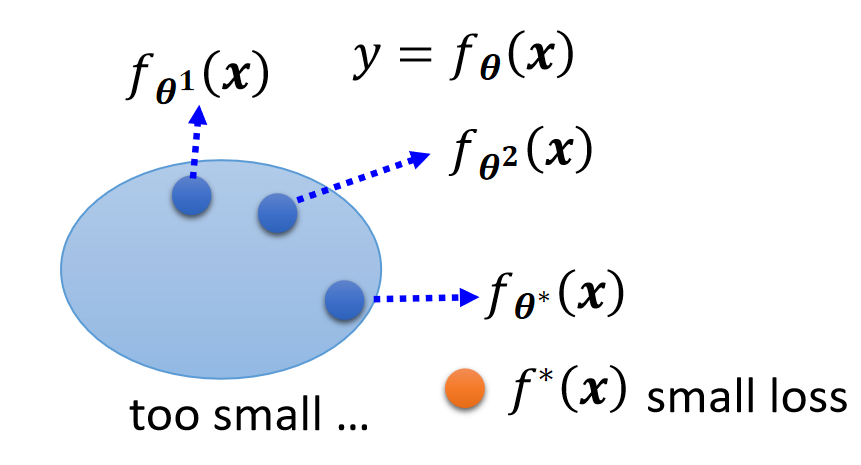{ width="300" }
{.center-img}

解决方案是重新设计模型，增加模型复杂度，如加深网络、增加特征等。

### 优化问题

训练集损失大还有一种可能的原因——优化问题，即模型能力够，但梯度下降等优化算法没能找到较优参数，如陷入局部最优或梯度消失。

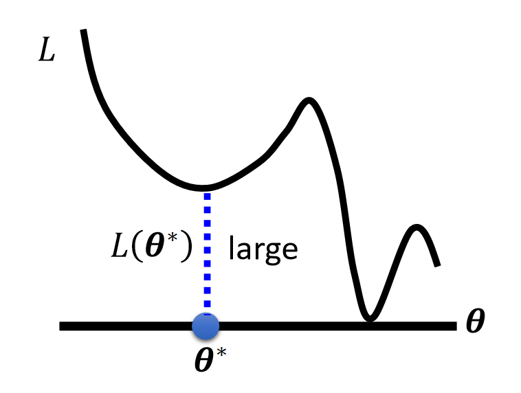
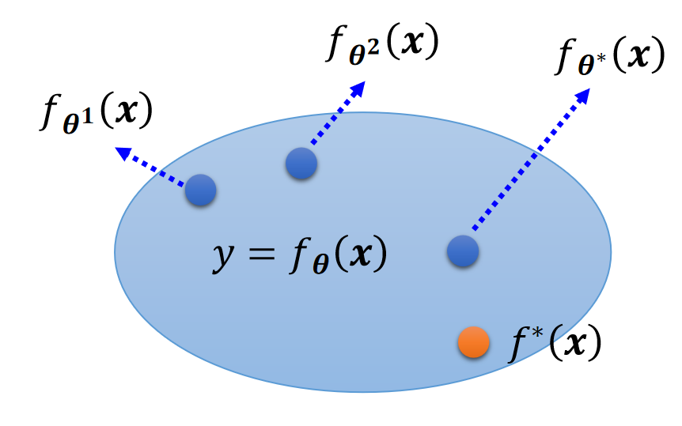
{.flex-img-group style="--img-group-width: 400px;"}

注意，以下情况并非过拟合，而是优化问题导致的：

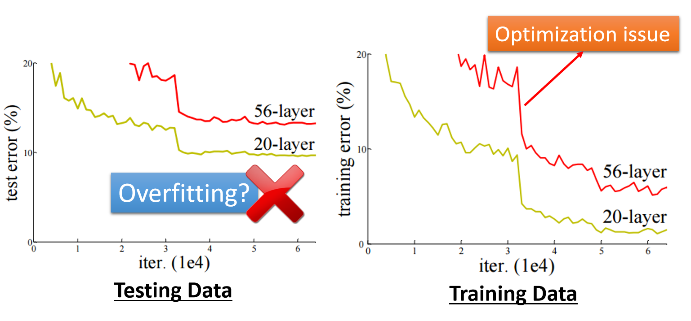{ width="500" }
{.center-img}

虽然更深的模型在测试集上表现较差，但在训练集上表现同样不如浅模型，所以是优化不到位导致的。

可以用以下方法判断优化问题：

- 跑一些较浅的模型，或者使用传统机器学习方法，降低优化难度
- 与深度学习的结果进行比较
- 若深度网络在训练集上没有取得更小的损失，则说明有优化问题

## 检查测试集损失

若训练集损失较小，说明模型已经成功拟合了训练数据，接着检查测试集表现。

若测试集损失较小，说明模型表现理想，训练与泛化能力符合预期。若测试集损失较大，说明模型泛化能力差，需要进一步区分原因。

### {{abbr:过拟合|Overfitting}}

下图描述了过拟合的情况：

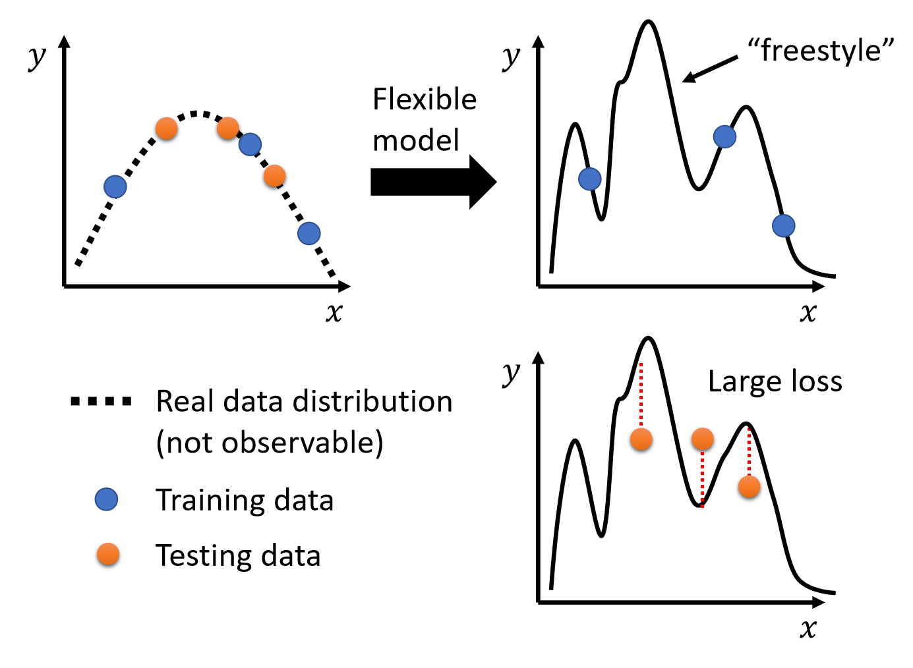{ width="400" }
{.center-img}

解决方案：

- 收集更多训练数据 
  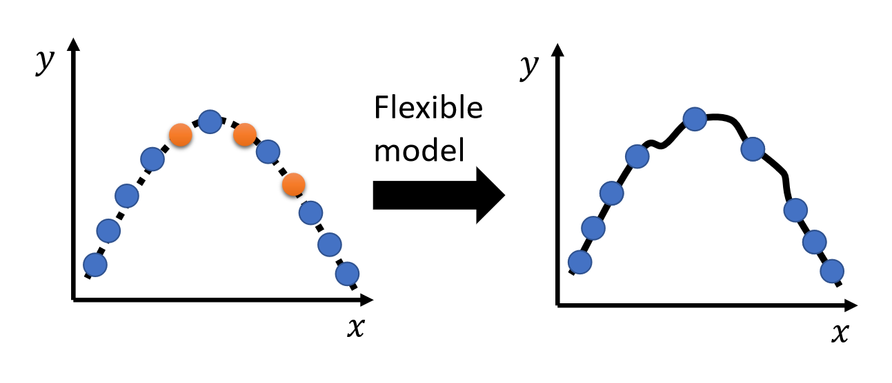{ width="400" }
- {{abbr:数据增强|Data augmentation}}：使用已有数据，通过合理的方式产生更多数据 
  { width="500" }
- 降低模型复杂度，如：
    - 减少参数量、共享参数
    - 减少特征，剔除冗余、高噪的无效特征
    - 使用 Early stopping、正则化、Dropout 等技术

模型复杂度需要仔细权衡，太小会出现模型偏差，太大则容易出现过拟合的问题：

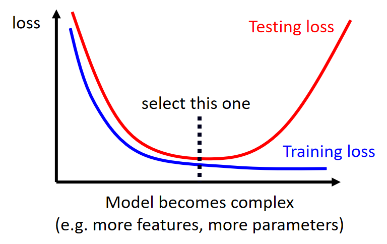{ width="300" }
{.center-img}

### 数据分布不匹配

当训练集与测试集分布不一致（例如用真实照片训练，去预测手绘图片），简单增加训练数据量不会有效果。

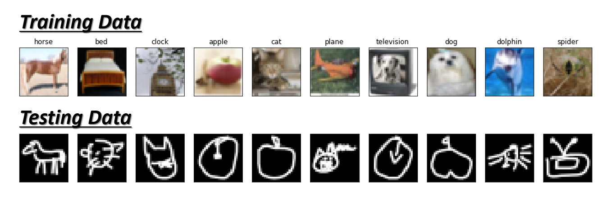{ width="600" }
{.center-img}

## 交叉验证

### 验证集划分与常见误区

训练数据一般会划分为：

- 训练集：用于模型参数的学习
- {{abbr:验证集|validation set}}：用于模型超参数的选择与性能评估

测试集可以分为：

- 公开测试集：用于开发 / 比赛阶段可见评估分数的测试集
- 私有测试集：最终决定模型实际上线 / 比赛最终胜负的未知测试数据

实际训练中，要避免根据公开测试集的反馈结果频繁调整和修改模型（形成反馈回路），防止过拟合公开测试集，否则模型最终可能在私有测试集上表现严重下降。

### {{abbr:N 折交叉验证|N-fold Cross Validation}}

N 折交叉验证的目的是避免因一次划分验证集带来的数据分布随机偏差，让模型评估更稳健。

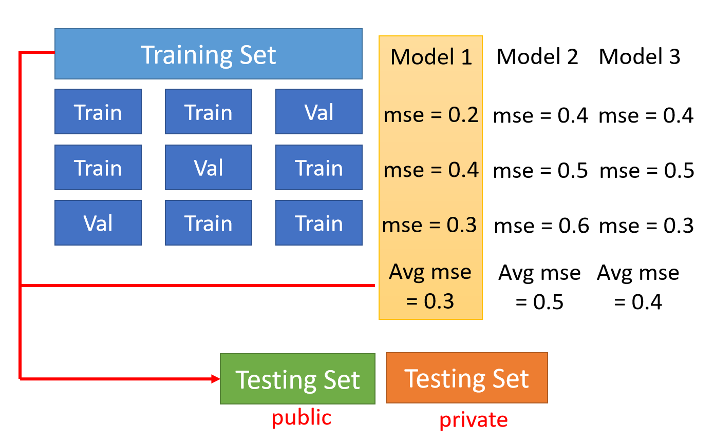{ width="400" }
{.center-img}

执行流程为：

1. 将原始训练数据均匀划分为 $N$ 份。
2. 交叉训练：轮流将其中 $1$ 份作为验证集，其余 $N-1$ 份作为训练集，重复 $N$ 次。
3. 性能评估：计算模型在 $N$ 次验证中的平均损失，选择平均损失最小的模型。
