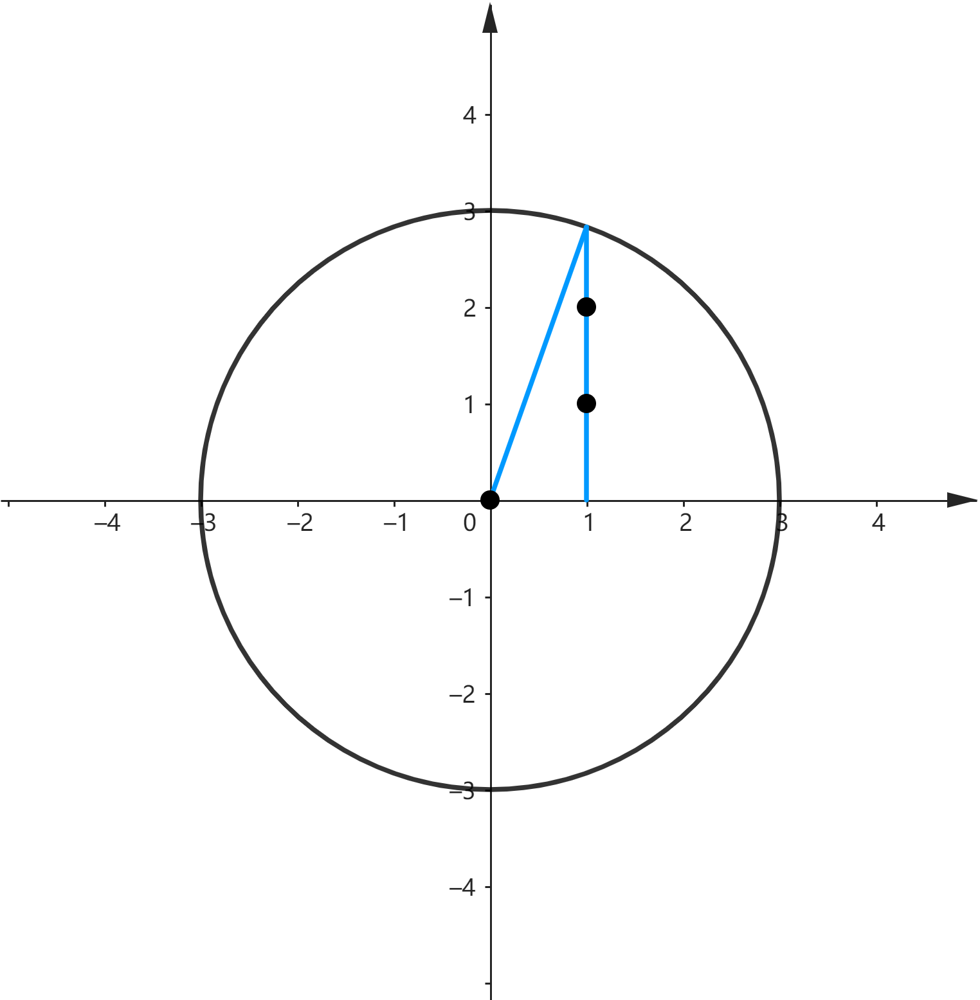

---
tags:
  - 算法
  - C++
  - Codeforces
  - C++20
  - 计算几何
---

# Codeforces 2074D Counting Points

## 题目

???+ note "[2074D Counting Points](https://codeforces.com/problemset/problem/2074/D)"

    在 $xOy$ 平面上，有 $n$ 个圆心位于 $x$ 轴的圆，圆心坐标分别为 $x_1,x_2,\cdots,x_n$，半径分别为 $r_1,r_2,\cdots,r_n$，圆心坐标和半径均为整数。另外，所有半径的和为 $m$，即 $\sum_{i=1}^n r_i=m$。求在圆内或圆上的整点个数。

**输入：**

第一行为一个整数 $t\ (1 \le t \le 10^4)$，表示数据的组数。

对于每组数据，第一行为两个整数 $n$ 和 $m\ (1 \le n \le m \le 2 \cdot 10^5)$。<br>
第二行为 $n$ 个整数，$x_1,x_2,\cdots,x_n \ (-10^9 \le x_i \le 10^9)$ ——圆心的坐标。<br>
第三行为 $n$ 个整数，$r_1,r_2,\cdots,r_n \ (r_i \ge 1,\ \sum_{i=1}^n r_i=m)$ ——圆的半径。

保证所有 $m$ 之和不超过 $2 \cdot 10^5$。

**输出：**

对于每组数据，输出满足条件的整数点的数量。

???+ abstract "样例"

    === "输入"

        ```text linenums="1"
        4
        2 3
        0 0
        1 2
        2 3
        0 2
        1 2
        3 3
        0 2 5
        1 1 1
        4 8
        0 5 10 15
        2 2 2 2
        ```

    === "输出"

        ```text linenums="1"
        13
        16
        14
        52
        ```

## 分析

首先可以想到将所有点分为在 $x$ 轴上的点和在 $x$ 轴两侧的点来计算，其中在轴两侧的点只需计算一侧再乘 $2$ 即可。

对于只有一个圆的情况，要计算某个 $x$ 坐标处被圆覆盖的整点个数，可以直接用 $\lfloor \sqrt{r^2-(x-o)^2} \rfloor$ 来计算，其中 $r$ 和 $o$ 分别为圆的半径和圆心坐标，如图：

{ width="360" }

由于圆之间会产生相互覆盖，因此计算一个 $x$ 坐标处的整点个数需要对所有圆都计算一遍，然后取最大值，时间复杂度 $O(m \cdot n)$，显然会 TLE。

如果能将不会覆盖到此位置的圆排除，那么时间复杂度会下降到 $O(m)$，可以接受。

考虑将所有圆按照左端点排序，并用一个指针从左到右扫描（表示正在求整点个数的 $x$ 坐标），用一个队列记录对当前坐标有影响的圆。每次指针右移时都让已经无影响的圆出队，这样可以保证每个圆占据的 $x$ 坐标只被扫描一次。由于需要排序，时间复杂度 $O(n \log n + m)$。

另外，如果被扫描到的圆的右端点坐标小于等于当前队尾圆的右端点坐标，则不需要入队，因为这个圆一定被队尾的圆包含，对答案没有贡献。

??? code "完整代码"

    ```cpp linenums="1"
    --8<-- "oi/cf-2074d-counting-points-assets/code/solution.cpp"
    ```

## 语法踩坑记录

最开始写的结构体为：

```cpp linenums="1"
struct info {
    int l, r, o;
    int d;
    bool operator<(const info &rhs) const { return l < rhs.l; }
};

vector<info> v(n);
```

结果发现使用 `std::ranges::sort(v)` 报错。查了 cppreference 发现 `std::ranges::sort` 要求比 `std::sort` 更加严格。

`std::ranges::sort` 要求迭代器满足 `std::sortable` 概念，尝试添加了代码：

???+ failure "std::sortable"

    ```cpp linenums="1"
    static_assert(std::sortable<std::vector<info>::iterator>);
    ```

发现确实发生了静态断言失败。

继续查找发现 `std::sortable` 概念由 `std::permutable` 和 `std::indirect_strict_weak_order` 组成，填入相关参数使用静态断言尝试了一下，发现前者成功，后者失败。这就很奇怪了，这个关系明显是满足严格弱序的。

???+ failure "std::indirect_strict_weak_order"

    ```cpp linenums="1"
    static_assert(indirect_strict_weak_order<ranges::less, vector<info>::iterator>);
    ```

又研究了很久，发现只要把 `ranges::less` 改为 `std::less` 就成功了……？最后在 `ranges::less` 的 Notes 部分找到了这样的描述：

> Unlike std::less, std::ranges::less requires all six comparison operators <, <=, >, >=, == and != to be valid (via the totally_ordered_with constraint).

原来 `ranges::less` 不会像 `std::less` 一样直接调用 `<` 来比较，还会检查是否以上六个符号都被定义。

那么应该把结构体改为：

```cpp linenums="1"
struct info {
    int l, r, o;
    int d;
    auto operator<=>(const info &rhs) const { return l <=> rhs.l; }
    auto operator==(const info &rhs) const { return l == rhs.l; }
};
```

这样就可以使用 `ranges::sort` 了。
